# 16S 扩增子测序数据分析报告

[toc]

## 16S 扩增子测序数据分析方案流程

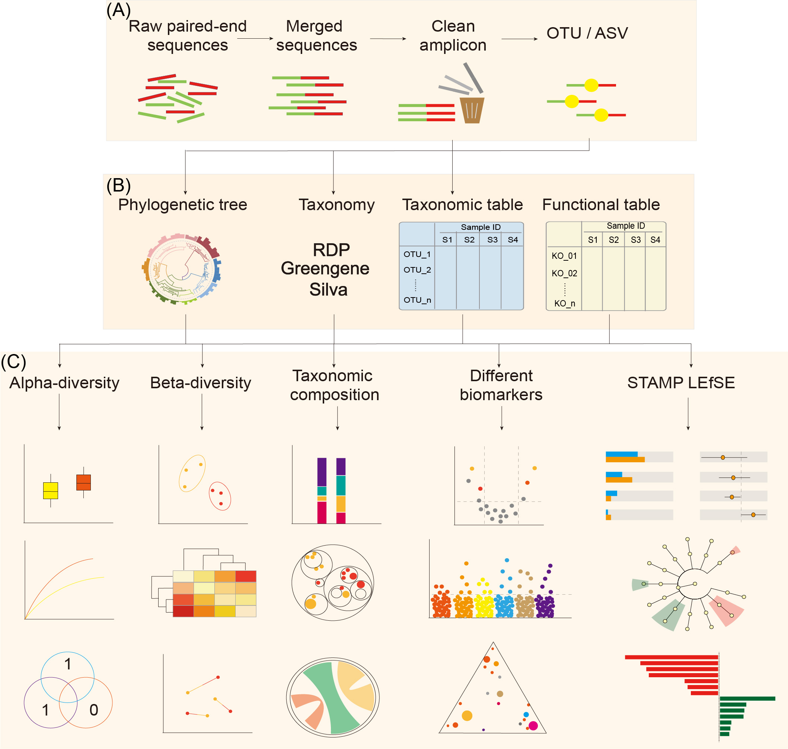

## 样本与测序信息

### 方法描述

在 16s 扩增子测序数据分析中，我们采用了一系列的生物信息学工具和方法进行数据处理和解析。使用 FastQC 软件对原始测序数据进行质量控制。数据预处理包括使用 fastp 进行质控过滤，vsearch 进行双端序列合并、去嵌合体以及 ASV 鉴定。物种注释通过 vsearch 与 silva_16s_v123 数据库进行比对。多样性分析计算了 $\alpha$ 多样性和 $\beta$ 多样性，使用了 usearch 和 R 包进行多样性指数计算和可视化。采用了 PICRUSt2 进行功能预测。此外，整个分析流程在 conda 管理的虚拟环境中进行，确保了分析的可复现性。

## 多样性分析

### $\alpha$ 多样性

#### chao1 boxplot

Chao1 指数计算公式如下，其中 $S_{\text{chao1}}$ 为估计的 OTU 数，$S_{\text{obs}}$ 为观测到的 OTU 数，$n_1$ 为只有 1 条序列的 OTU 数目，$n_2$ 为只有 2 条序列的 OTU 数目。
$$
\large
S_{\text{chao1}}=S_{\text{obs}}+\frac{n_1(n_1-1)}{2(n_2+1)}
$$
是物种数目的衡量标准之一，它考虑 3 个因素：物种数目、只有 1 条序列的物种数目和有 2 条序列的物种数目，$S_{\text{chao1}}$ 指数越大，表明某群落物种数目较多。从公式可以看出，$S_{\text{chao1}}$ 指数受 1 条和 2 条序列的物种影响较大。

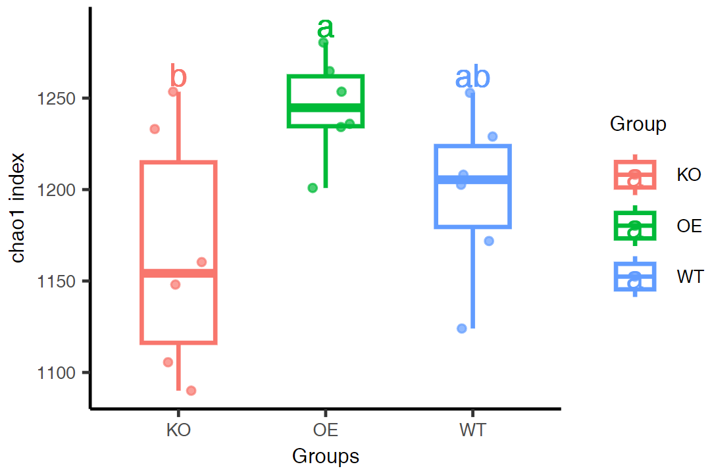

#### richness boxplot

物种丰富度指数 (Species richness)：群落中丰度大于 0 的物种数之和，一般用 Observed OTU (observed species) 表示，数值范围一般从几百至几千不等，波动范围与研究对象有关。

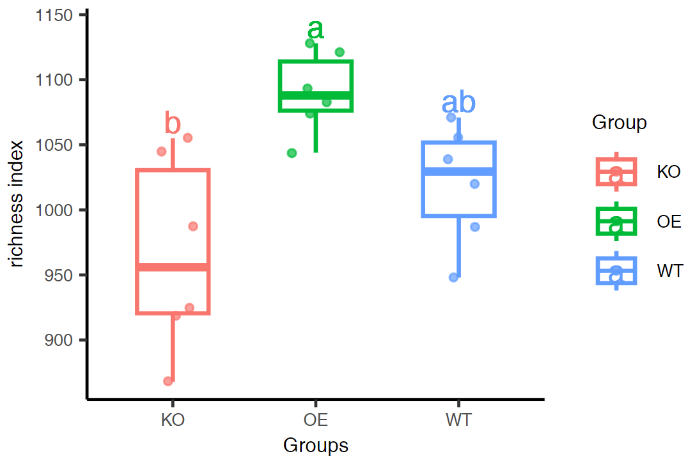

#### Shannon boxplot

Shannon 指数计算公式如下，其中 $S$ 为群落中物种总数，$P_i$ 为第 $i$ 个物种占所有物种的比例。
$$
\large
H_{\text{shannon}}=-\sum^{S_{\text{obs}}}_{i=1} (P_i\ln P_i)
$$
Shannon 指数综合考虑了群落的物种数目和均匀度这两个因素。Shannon 指数值越高，表明群落的 $\alpha$ 多样性越高。该指标对于丰度低的物种有较大的权重，即计算时受丰度低的物种影响较大。

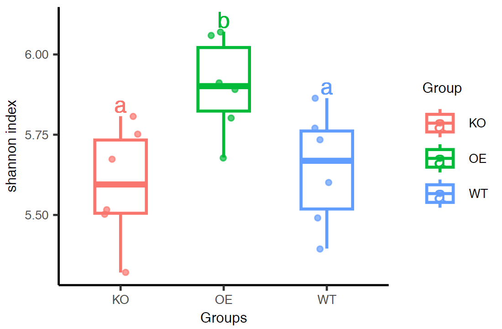

#### Simpson boxplot

Simpson 指数计算公式如下，其中 $S$ 是群落中物种的总数，$n_i$ 是第 $i$ 个物种的个体数目，$N$ 是群落中所有物种个体的总数。
$$
\large D_{\text{simpson}}=1-\frac{\sum^{S_{\text{obs}}}_{i=1} n_i(n_i-1)}{N(N-1)}
$$

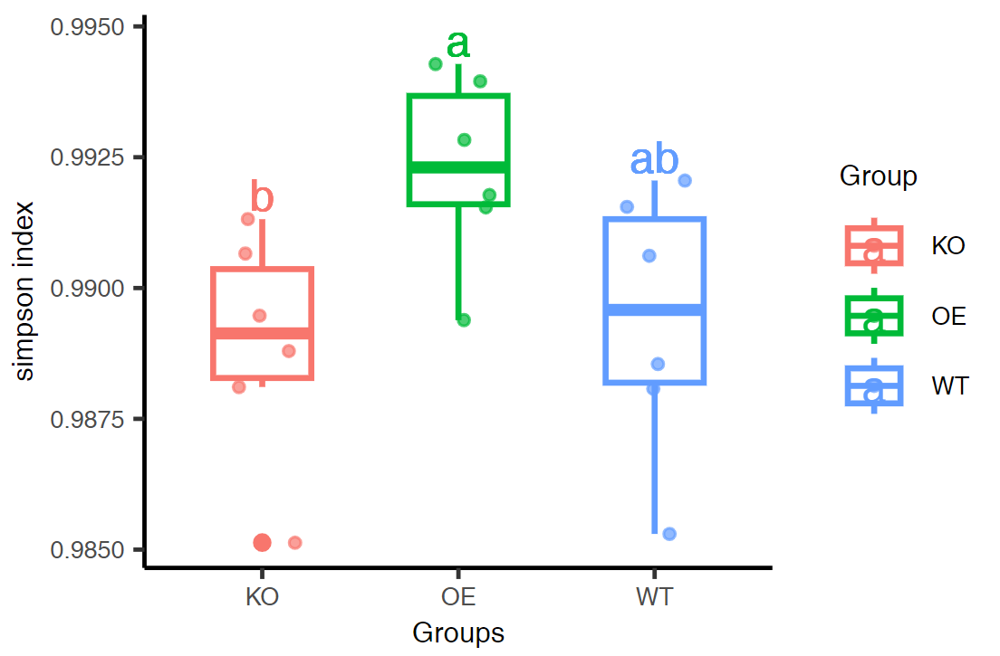

Simpson 指数是用来估算样品中微生物的多样性指数之一，由 Edward Hugh Simpson (1949) 提出。Simpson 指数值指数的值范围从 0 到 1。当 $D$ 接近 0 时，表示群落中物种分布非常均匀，多样性很高；而 $D$​ 接近 1 时，表示群落中有一个或几个物种占主导地位，多样性较低。Simpson 指数不仅考虑了物种的丰富度（即物种的数量），还考虑了每个物种的丰度（即每个物种的个体数目）。由于经典辛普森指数与物种丰富度趋势相反，目前常用 Gini-Simpson 指数代替经典 Simpson 指数，即用 1 减去经典 Simpson 指数。需要注意的是，Simpson 指数在计算时将丰度高的物种设置了较大权重，所以高丰度物种较多时该指数值较大，更适合用于比较物种丰富度较高的生态系统。

#### InvSimpson boxplot

InvSimpson 指数，即逆 Simpson 指数，是 Simpson 指数的倒数。
$$
\large InvSimpson = \frac{1}{D}
$$
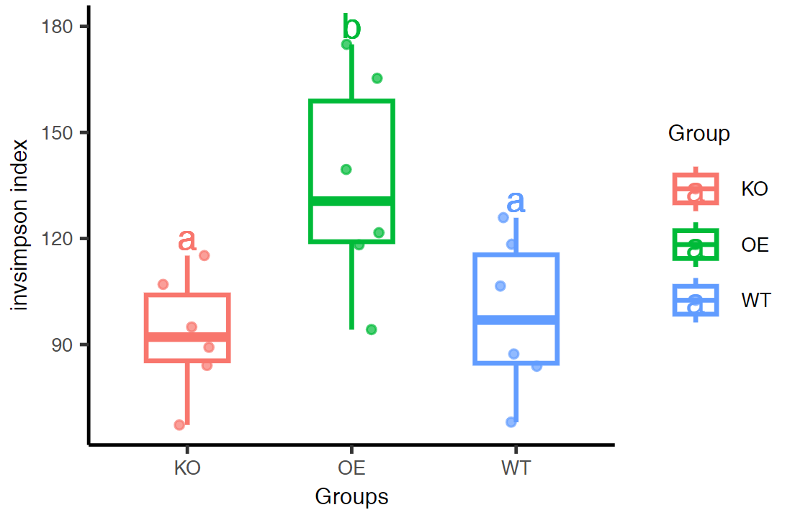

逆 Simpson 指数放大了稀有物种对多样性的贡献。在辛普森指数中，稀有物种对多样性指数的贡献较小，而在逆指数中，即使是数量较少的物种也会对多样性指数产生较大影响。

#### ACE 指数

ACE 指数的计算公式如下，其中 $n_1$ 表示只观测到 1 次的物种（singleton）数目 $S_{\text{abund}}$ 表示高丰度物种数目，一般是丰度超过 10 个；$S_{\text{rare}}$ 表示低丰度物种数目，丰度小于等于 10 个；$C_{\text{ACE}}$ 表示低丰度物种中非 singleton 所占比例；$\hat{\gamma}^2_{\text{ACE}}$​ 表示变异系数。
$$
\large
S_{\text{ACE}}=S_{\text{abund}}+\frac{S_{\text{rare}}}{C_{\text{ACE}}}+\frac{n_1}{C_{\text{ACE}}} \hat{\gamma}^2_{ACE}
$$
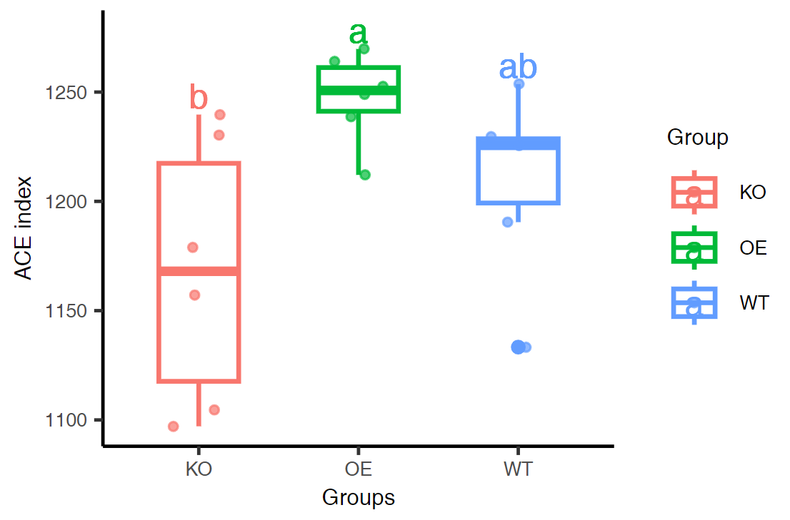

ACE 指数全称为 Abundance-based Coverage Estimator metric ；是利用修正因子对物种丰富度的估计值。通过低丰度物种估算未发现的物种的数量，其值越高代表群落物种种类越丰富。

#### 稀释曲线

稀释曲线（丰富度曲线）用于评价测序量是否足以覆盖所有类群，并间接反映样品中物种的丰富程度。根据已测得 16S rDNA 序列中已知的各种 OTU 的相对比例，来计算抽取 n 个（n < reads 总数）reads 时出现 OTU 数量的期望值，然后根据一组 n 值（一般为一组小于总序列数的等差数列）与其相对应的 OTU 数量的期望值作稀释曲线。

如果曲线趋于平缓，可以认为测序深度已经基本覆盖到样品中所有的物种，增加测序数据无法再找到更多的 OTU。

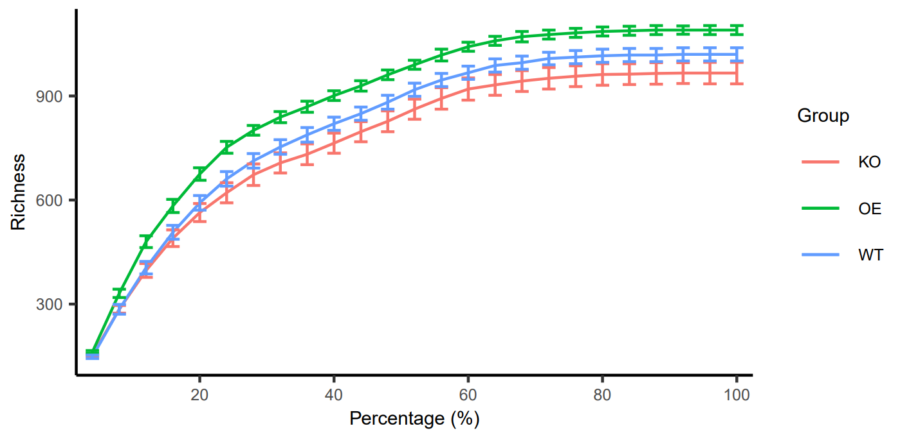

横坐标代表随机抽取的序列数量；纵坐标代表观测到的 OTU 数量。样本曲线的延伸终点的横坐标位置为该样本的测序数量。

#### 多样性 venn 图

多样性 venn 图用于展示在多个样本中共有和特有的 OTU 数量，反映环境样本中 OTU 组成的相似性和特异性。

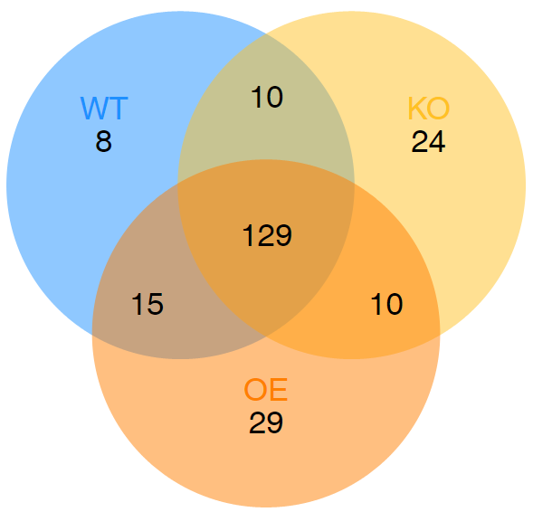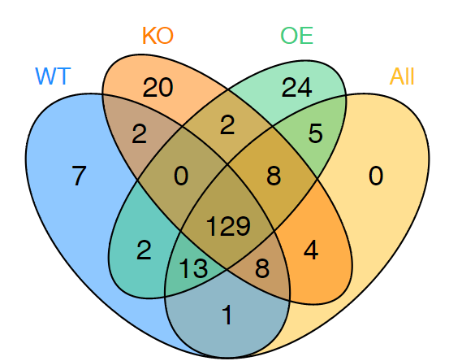

每个圈代表一个（组）样，圈和圈重叠部分的数字代表样本（组）之间共有的 OTUs 个数，没有重叠部分的数字代表样本（组）的特有 OTUs 个数。通过 venn 图分析结果，我们得到所共有 OTU 和特有的 OTU，帮助发现不同条件下一些重要的差异 OTU。

### $\beta$​ 多样性

样品间的物种丰度分布差异程度可通过统计学中的距离进行量化分析，使用统计算法 Euclidean，Bray-Curtis，Unweighted_unifrac，Weighted_unifrac 等，计算两两样品间距离，获得距离矩阵，可用于后续进一步的 beta 多样性分析和可视化统计分析。

#### 样品间距离矩阵热图

Bray-Curtis 算法公式如下，其中 $S_{\text{A, }i}$ 表示 A 样本中第 $i$ 个 OUT 所含的序列数；$S_{\text{B, }i}$ 表示 B 样本中第 $i$ 个 OUT 所含的序列数。
$$
D_{\text{Bray-Curtis}}=1-2\frac{\sum \min(S_{\text{A, }i},~S_{\text{B, }i})}{\sum S_{\text{A, }i}+\sum S_{\text{B, }i}}
$$
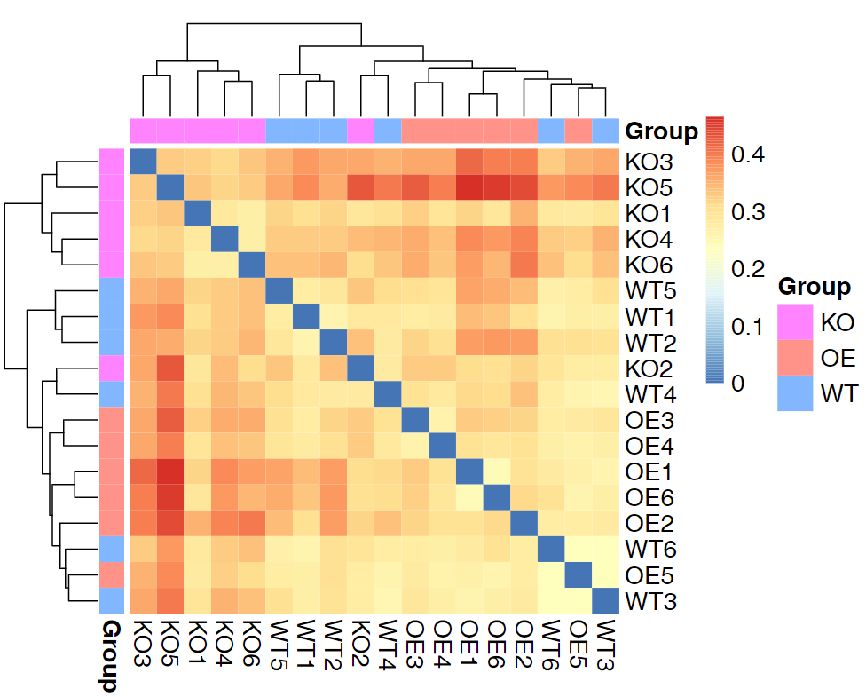

#### 主坐标分析 PCoA

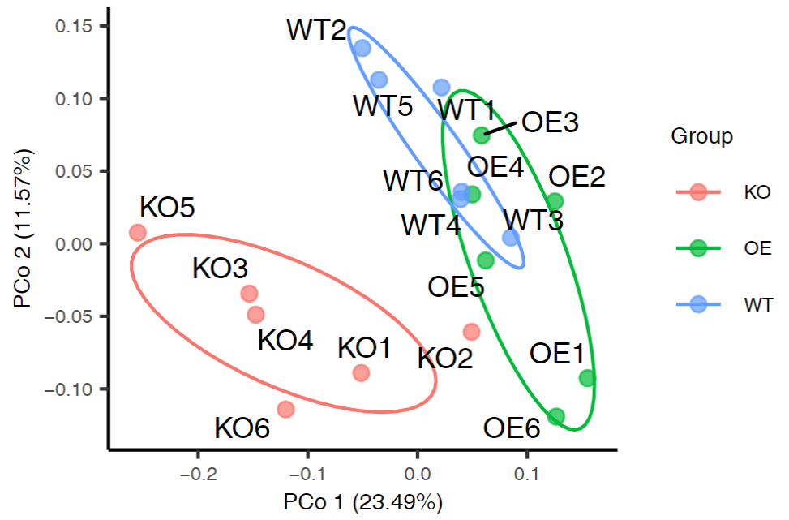

主坐标分析（PCoA，PrincipalCo-ordinates Analysis），PCoA（principal co-ordinates analysis）是一种研究数据相似性或差异性的可视化方法，通过一系列的特征值和特征向量进行排序后，选择主要排在前几位的特征值，PCoA 可以找到距离矩阵中最主要的坐标，结果是数据矩阵的一个旋转，它没有改变样品点之间的相互位置关系，只是改变了坐标系统。如果样品距离越接近，表示物种组成结构越相似，因此群落结构相似度高的样品倾向于聚集在一起，群落差异很大的样品则会远远分开。

#### 限制性主坐标分析 CPCoA

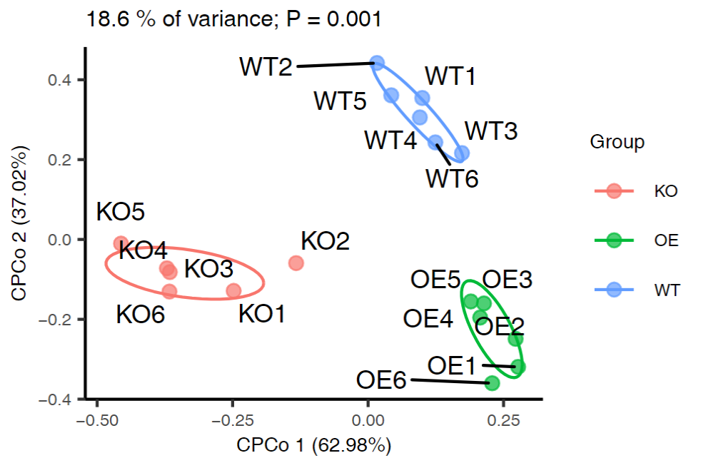

限制性主坐标分析（CPCoA，Constrained Principal Coordinate Analysis）是一种多变量统计方法，用于分析和展示样本之间的差异性。它与 PCoA（主坐标分析）类似，但 PCoA 是非限制性的，而 CPCoA 是限制性，意味着在分析时考虑了样本的分类信息（如实验组别）。CPCoA 通过将距离或相似性矩阵转换为低维空间中的坐标，以可视化样本之间的相对位置关系，同时考虑到样本的已知分组信息，从而揭示不同组别间的差异。

## 物种组成

### 物种堆叠柱状图

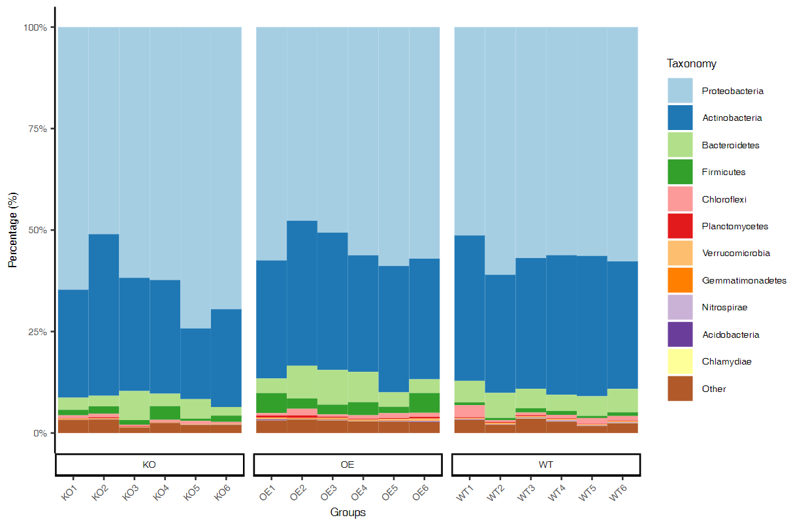

种水平物种堆叠柱状图，每个颜色代表一个物种，在柱状图内部，从上到下的堆叠顺序物种相对丰度依次减少。

### 物种分类 Maptree

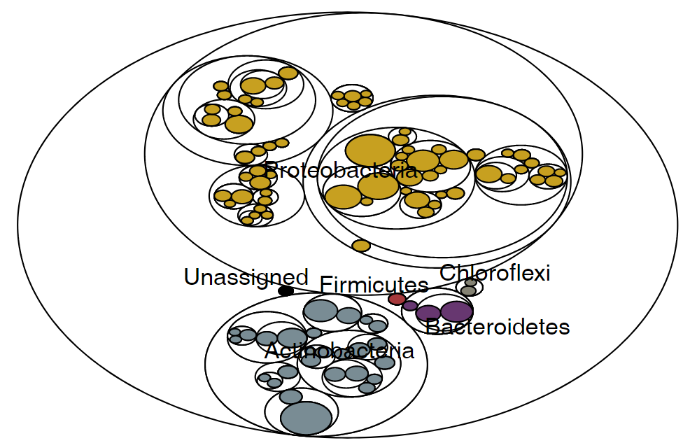

物种分类 Maptree，圈之间的层级表示分类水平，圈的大小反映物种丰度。

## 差异分析

### 差异分析 with R

#### 差异分析火山图

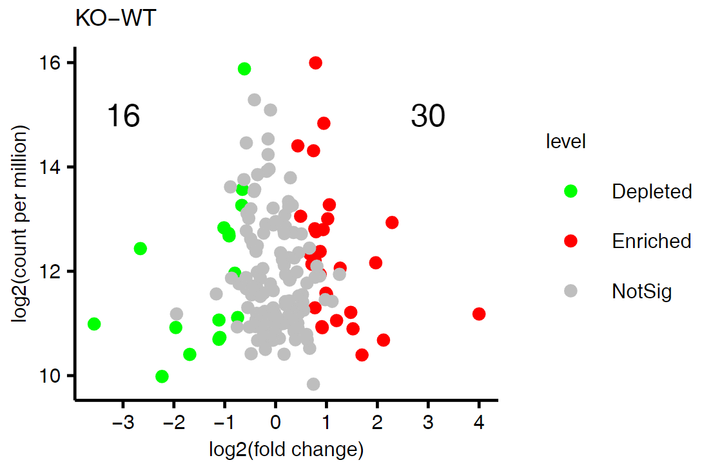

X 轴：通常为两组基因表达或 OTU 相对丰度比较的变化倍数取 2 的对数 $\log2$ (Fold change)。 取 $\log2$ 的原因：由于两数相比，倍数取值范围为 0 - 正无穷，上调的倍数为 1 - 正无穷，比较容易理解；而下调倍数为 0-1 很难理解。如果取对数可将倍数以 1 为中心左右对称，取 2 的对数是因为经验上 2 倍差异比较常用，故取 $\log2$ 变换既可以使上调或下调数据对称 (上、下调的类型同等重要，无偏好)，而且坐标轴 1 个单位刻度的变化即为 2 倍差异 (方便快速筛选差异足够大的点)；

Y 轴：两组基因表达或 OTU 相对丰度相比统计上显著性的 P-value 值，通常取负对数 10 变换 $-\log10$ (P-value)。取负对数与转换下调表达数值原理类似，将 $0-1$ 范围 P-value 数据变为 0 - 正无穷，且将越小越显著的 P-value 转换为与显著性正相关，方便观察显著差异目标。P-value 取负对数 10 转换后，坐标轴数值 2，3 对应 0.01 和 0.001 的显著阈值，便于理解。有时也用 $-\ln$ 或 $- \log2$ 对 P-value 值进行转换。

图中点：代表每个基因或 OTU 在两组相比时差异倍数和显著性的值；通常将显著变化并且差异倍数大于指定阈值的点规定为显著差异的结果，用颜色高亮显示。

#### 差异分析热图

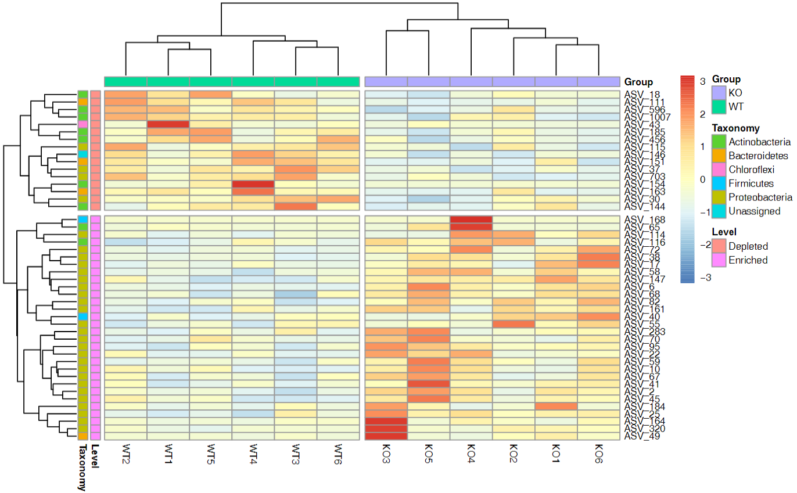

ASV 差异热图。

#### 曼哈顿图

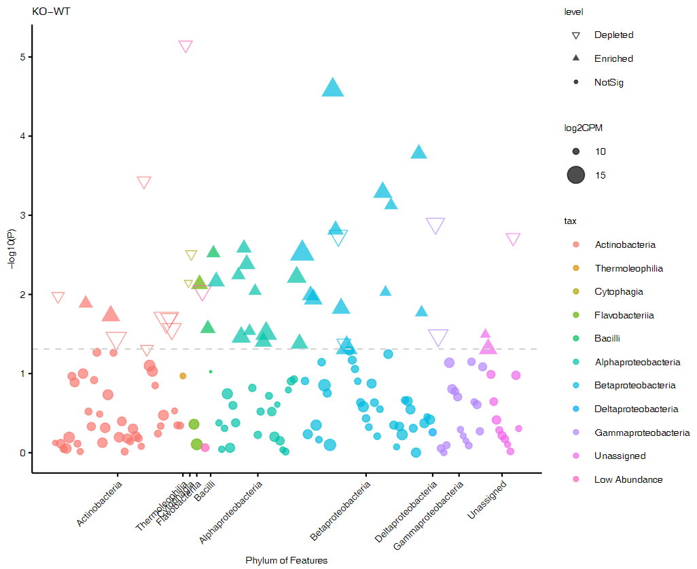

#### 三元图

### LEfSe

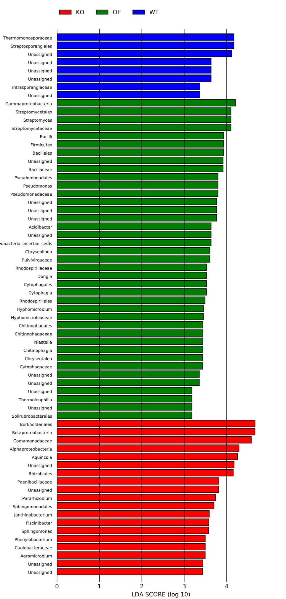

## 功能预测

### Error bar

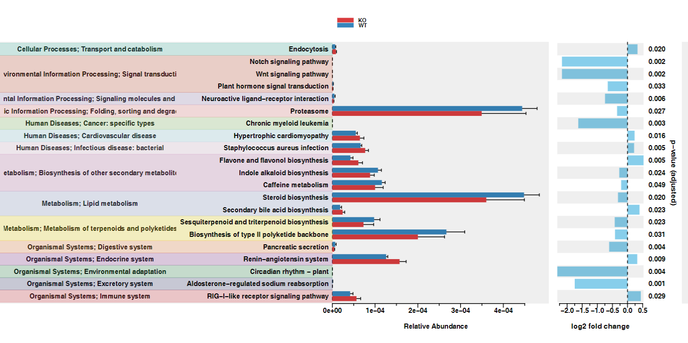

### Heatmap

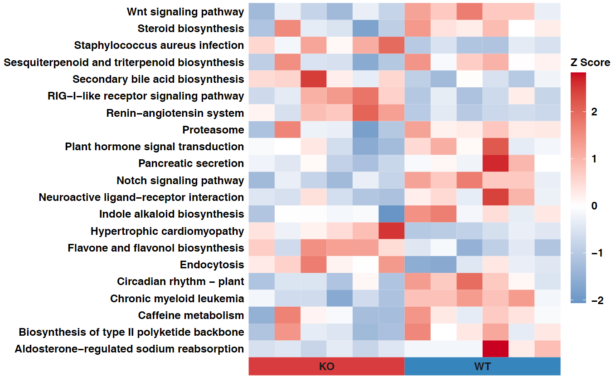

### PCA

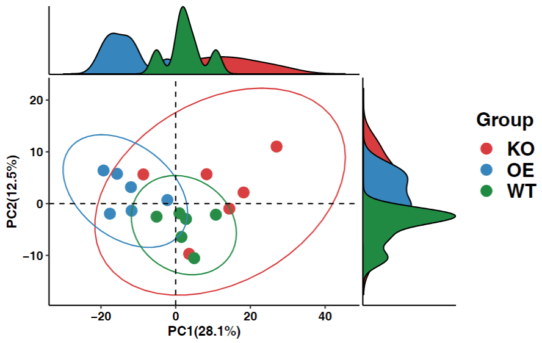