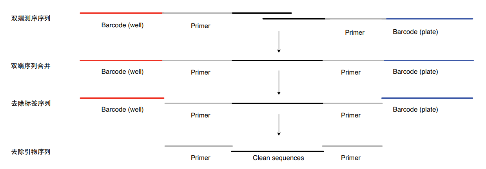
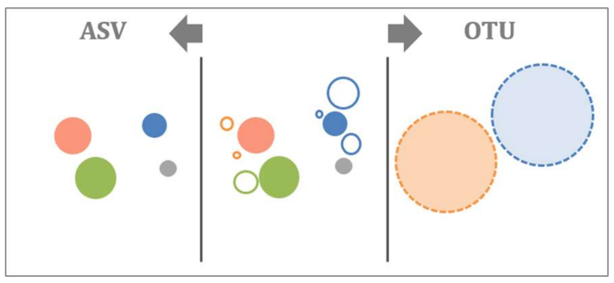
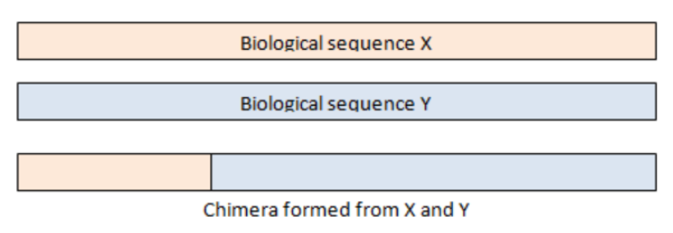
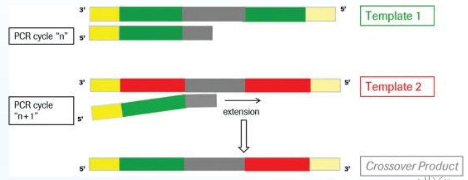

# 16s 扩增子分析流程

[toc]

## 环境安装

### 目录结构

```
amplicon/
├── reads	# 存放序列文件
├── result	# 存放结果文件
└── tmp		# 存放中间文件
```

### conda environment

虚拟环境打包在：`/users/zhangzd/qiime2-amplicon-2024.2.tar.gz` 该环境包括分析所需的所有软件。

```shell
# 解压该环境到 <condaInstallPath>/envs/<envName>
source <condaInstallPath>/envs/<envName>/activate
conda-unpack # 需要安装 conda-pack (channel: conda-forge)
```

### 其他软件

存放路径：

```
/users/zhangzd/soft/
├── conda
├── csvtk
├── fastp
├── rush
├── seqkit
├── taxonkit
├── usearch
└── vsearch
```

### qiime2-amplicon conda 环境

解压 至 conda/envs/ 目录下

### STAMP

http://kiwi.cs.dal.ca/Software/STAMP

```shell
pip install STAMP
```

## 数据预处理 & 鉴定 ASV



### 双端序列合并

```shell
vsearch 
	-fastq_mergepairs reads/WT1_1.fastq.gz \
    -reverse reads/WT1_2.fastq.gz \
	-fastqout tmp/WT1.merged.fastq 
	-relabel WT1. # 更改序列名为样本名 节省空间
```

批量处理脚本：

```shell
cd reads
for file in *1.fastq.gz; do
    sample_name=$(basename -s _1.fastq.gz "$file")
    forward_reads="${file}"
	reverse_reads="${sample_name}_2.fastq.gz"
	output_file="../tmp/${sample_name}.merged.fastq"
    vsearch 
    	-fastq_mergepairs "$forward_reads" \
        -reverse "$reverse_reads" \
        -fastqout "$output_file" \
        -relabel "${sample_name}."
done
cd ..
```

或根据 metadata 文件合并：

```shell
# 可选
## 同时使用 rush 并行，-j 参数建议 2-4
tail -n+2 result/metadata.tsv | cut -f 1 | \
rush -j 2 "vsearch --fastq_mergepairs seq/{}_1.fastq.gz \
--reverse seq/{}_2.fastq.gz \
--fastqout tmp/{}.merged.fastq --relabel {}."
```

### 合并序列

```shell
cat tmp/*.merged.fastq > tmp/all.fastq
```

检查序列名，格式必须为 `@样本名.序列编号` 否则下游分析无效：

```shell
head tmp/`tail -n+2 result/metadata.tsv | cut -f 1 | tail -n1`.merged.fastq | grep ^@
```

### 切除引物 & barcode 序列

需要知道：

1. barcode 位置和大小
2. 引物序列和长度

```shell
vsearch --fastx_filter tmp/all.fastq \
    --fastq_stripleft 29 --fastq_stripright 18 \
    --fastq_maxee_rate 0.01 \
    --fastaout tmp/filtered.fa
```

> 在以上代码中，左端为 10 bp barcode + 19 bp 5' primer，共切除 29 bp；右端 3' primer 18 bp，错误率控制 0.01 即小于 1%。

### 序列去冗余

去除冗余数据量至少降低 1 个数量级，减小下游分析工作量，也更适合基于风度鉴定真实 OUT。一般建议控制 feature 在 3 000 - 10 000.

如果最后的 feature 过多，可以适当提高 minuniquesize.

```shell
vsearch --derep_fulllength tmp/filtered.fa \
--output tmp/uniques.fa --relabel Uni \
--minuniquesize 10 --sizeout
```

### 鉴定 OUT / ASV



1. 97% UPARSE 聚类 OUT
   1. 原理
      1. 人为定义一个分类单元，通常认为序列相似度达到 97% 则来自同一个物种。
      2. 选取每个分类单元中最高丰度序列作为代表序列。
      3. 可能造成序列的 missing
   2. 缺点
      1. 方法旧
      2. 序列不为真实序列，不可比较
2. ASV 非聚类去噪
   1. 原理
      1. 相当于 100% 聚类，即只要碱基有差别，且序列丰度高，则选作研究对象。
      2. 精度高，增加样本时，结果具有一致性。
   2. 优点
      1. 方法新、精度高。2015 年提出，2016 年 Susan Holmes 发表，鉴定阴道乳酸菌相关文章，文章中使用 OUT 聚类仅一个单元，使用 ASV 有六种，并通过六种成分分类人群。

```shell
# OTU 聚类
## 不推荐
# usearch -cluster_otus tmp/uniques.fa \
# -otus tmp/otus.fa -relabel OTU_

# ASV 降噪
usearch -unoise3 tmp/uniques.fa \
-zotus tmp/zotus.fa
# 修改序列名便于下游分析
sed 's/Zotu/ASV_/g' tmp/zotus.fa > tmp/otus.fa
```

如果数据量过大（ASV 过万），使用 vsearch：

> usearch 免费版受限时，可通过提高 minuniquesize 参数减少非冗余数据量。OTU/ASV 过万下游分析等待时间过长，确保 OTU/ASV 数据小于 5000，一般不会受限，而且也有利于下游开展快速分析。

```shell
# 重命名relabel、按相似id=97%聚类，不屏蔽qmask
# 记录输入sizein和输出频率sizeout
vsearch --cluster_size tmp/uniques.fa  \
--relabel OTU_ --id 0.97 \
--qmask none --sizein --sizeout \
--centroids tmp/otus_raw.fa 

# 再 de novo 去嵌合。55 个嵌合，606 个非嵌合。把OTU_1都去除了，没有Usearch内置去嵌合的方法合理。

# 自身比对去嵌合
vsearch --uchime_denovo tmp/otus_raw.fa \
--nonchimeras tmp/otus.fa
# 删除序列频率
sed -i 's/;.*//' tmp/otus.fa
```


### 去除嵌合体





#### 基于数据库去嵌合体

1. 使用 RDP 去嵌合体

   1. 速度快，但容易假阴性

   ```shell
   # 不推荐
   # vsearch --uchime_ref tmp/otus.fa \
   # --db db/usearch/rdp_16s_v18.fa \
   # --nonchimeras result/raw/otus.fa
   ```

2. 使用 SILVA 去嵌合体

   1. 速度慢，理论更好

   ```shell
   mkdir result/raw
   vsearch --uchime_ref tmp/otus.fa \
   --db db/usearch/silva_16s_v123.fa \
   --nonchimeras result/raw/otus.fa
   ```

#### 不去嵌合体

```shell
cp -f tmp/outs.fa result/raw/otus.fa
```

### 生成特征表

#### usearch

小样本（< 30）快

```shell
usearch -otutab tmp/filtered.fa -otus result/raw/otus.fa \
	-otutabout result/raw/otutab.txt -threads 32
```

#### vsearch

```shell
vsearch --usearch_global tmp/filtered.fa --db result/raw/otus.fa \
--otutabout result/raw/otutab.txt --id 0.97 --threads 32
```

### 物种注释

去除质体和非细菌/古菌并统计比例。

```shell
# 数据库可选 rdp_16s_v18_sp.fa
vsearch --sintax result/raw/otus.fa \
	--db db/usearch/silva_16s_v123.fa \
	--tabbedout result/raw/otus.sintax \
	--sintax_cutoff 0.6
```

```shell
Rscript script/otutab_filter_nonBac.R \
    --input result/raw/otutab.txt \
    --taxonomy result/raw/otus.sintax \
    --output result/otutab.txt\
    --stat result/raw/otutab_nonBac.stat \
    --discard result/raw/otus.sintax.discard
```

### 特征标筛选

特征表筛选代表序列和对应的物种注释

```shell
# 按筛选后特征表筛选对应序列
cut -f 1 result/otutab.txt | tail -n+2 > tmp/otutab.id
usearch -fastx_getseqs result/raw/otus.fa \
    -labels tmp/otutab.id \
	-fastaout result/otus.fa

# 过滤特征表对应序列注释
awk 'NR==FNR{a[$1]=$0}NR>FNR{print a[$1]}' \
result/raw/otus.sintax tmp/otutab.id > result/otus.sintax

# 补齐末尾列
sed -i 's/\t$/\td:Unassigned/' result/otus.sintax
```

筛选不合理可以跳过筛选：

```shell
# cp result/raw/otu* result/
```

### 特征表统计

```shell
usearch -otutab_stats result/otutab.txt -output result/otutab.stat
```

### 等量抽样标准化

用于多样性计算。使用 vegan 包进行等量重抽样，输入 reads count 格式 Feature 表 `result/otutab.txt`

```shell
mkdir -p result/alpha
Rscript script/otutab_rare.R --input result/otutab.txt \
--depth 10000 --seed 1 \
--normalize result/otutab_rare.txt \
--output result/alpha/vegan.txt
```

## 多样性分析

### $\large \alpha$ 多样性

#### 计算样品内的丰富度（richness）和均匀度(evenness)

```shell
# 基于标准化 OTU 表计算 14 种指数
usearch -alpha_div result/otutab_rare.txt \
-output result/alpha/alpha.txt
```

#### 稀释抽样

1% - 100% 抽样 100 次。

```shell
usearch -alpha_div_rare result/otutab_rare.txt \
-output result/alpha/alpha_rare.txt -method without_replacement
```

#### 筛选各组高丰度菌用于比较

按组求均值，需根据实验设计 metadata.tsv 修改组列名。输出为特征表按组的均值，一个实验可能有多种分组方式。

```shell
Rscript script/otu_mean.R \
    --input result/otutab.txt \
    --metadata result/metadata.tsv \
    --group Group --thre 0 \
    --scale TRUE --zoom 100 --all TRUE --type mean \
    --output result/otutab_mean.txt

# 如以平均丰度频率高于 0.1% 为筛选标准，得到每个组的 OTU 组合
awk 'BEGIN{OFS=FS="\t"}{if(FNR==1) {for(i=2;i<=NF;i++) a[i]=$i;} \
else {for(i=2;i<=NF;i++) if($i>0.1) print $1, a[i];}}' \
result/otutab_mean.txt > result/alpha/otu_group_exist.txt
```

结果可视化：https://www.bic.ac.cn/ImageGP/

### $\large \beta$ 多样性

+ 物种距离：Bray-Curtis(Z-scores), Eucliean

  + 标准化 OTU 表

    |      | A    | B    |
    | ---- | ---- | ---- |
    | Bac1 | 6    | 4    |
    | Bac2 | 0    | 2    |

    $$
    \sqrt{(6-4)^2+(0-2)^2}
    $$

+ 进化距离：Unifrac，考虑进化关系

  |      | A    | B    | Taxonomy    |
  | ---- | ---- | ---- | ----------- |
  | Bac1 | 6    | 4    | *E. coli* 1 |
  | Bac2 | 0    | 2    | *E. coli* 2 |

+ 无权重：Unweighted(Binary)，只考虑有无

  |      | A    | B    |
  | ---- | ---- | ---- |
  | Bac1 | 1    | 1    |
  | Bac2 | 0    | 1    |

  

#### 样品间距离矩阵计算

```shell
mkdir result/beta
# 基于 OTU 构建进化树
usearch -cluster_agg result/otus.fa -treeout result/otus.tree
# 生成 5 种距离矩阵：bray_curtis, euclidean, jaccard, manhatten, unifrac
usearch -beta_div result/otutab_rare.txt \
	-tree result/otus.tree \
    -filename_prefix result/beta/
```

### 物种注释分类汇总

```shell
# OTU对应物种注释2列格式：去除sintax中置信值，只保留物种注释，替换:为_，删除引号
cut -f 1,4 result/otus.sintax \
    | sed 's/\td/\tk/;s/:/__/g;s/,/;/g;s/"//g' \
    > result/taxonomy2.txt
    
# OTU 对应物种 8 列格式：注意注释是非整齐
#生成物种表格OTU/ASV中空白补齐为Unassigned
awk 'BEGIN{OFS=FS="\t"}{delete a; a["k"]="Unassigned";a["p"]="Unassigned";a["c"]="Unassigned";a["o"]="Unassigned";a["f"]="Unassigned";a["g"]="Unassigned";a["s"]="Unassigned"; split($2,x,";");for(i in x){split(x[i],b,"__");a[b[1]]=b[2];} print $1,a["k"],a["p"],a["c"],a["o"],a["f"],a["g"],a["s"];}' \
result/taxonomy2.txt > tmp/otus.tax
	
sed 's/;/\t/g;s/.__//g;' tmp/otus.tax|cut -f 1-8 | \
sed '1 s/^/OTUID\tKingdom\tPhylum\tClass\tOrder\tFamily\tGenus\tSpecies\n/' \
> result/taxonomy.txt

#统计门纲目科属，使用 rank参数 p c o f g，为phylum, class, order, family, genus缩写
mkdir result/tax
for i in p c o f g;do
    usearch -sintax_summary result/otus.sintax \
    -otutabin result/otutab_rare.txt -rank ${i} \
    -output result/tax/sum_${i}.txt
done
sed -i 's/(//g;s/)//g;s/\"//g;s/\#//g;s/\/Chloroplast//g' result/tax/sum_*.txt
```

### 有参定量特征表

比对 Greengenes 97% OTUs 比对，用于 PICRUSt 功能预测

```shell
usearch -otutab tmp/filtered.fa \
	-otus db/greengene/97_otus.fasta \
	-otutabout result/gg/otutab.txt \
	-threads 16
```

usearch 更快，如果文件超限报错：

```shell
```

统计

```shell
usearch -otutab tmp/filtered.fa \
	-otus gg/97_otus.fa \
	-otutabout result/gg/otutab.txt  \
	-threads 16
```

### 空间清理及数据提交

```shell
# 删除中间大文件
rm -rf tmp/*.fq

# 分端统计 md5
cd reads
md5sum *_1.fastq.gz > md5sum1.txt
md5sum *_2.fastq.gz > md5sum2.txt
paste md5sum1.txt md5sum2.txt | awk '{print $2"\t"$1"\t"$4"\t"$3}' | sed 's/*//g' > ../result/md5sum.txt
rm md5sum*
cd ..
```

## 多样性和物种组成分析可视化

### $\large \alpha$ 多样性

#### $\large \alpha$​ 多样性箱线图

<font face=楷体 color=red>安装 R 包：`install_github("microbiota/amplicon")`</font>

```shell
# 完整参数，多样性指数可选richness chao1 ACE shannon simpson invsimpson
Rscript script/alpha_boxplot.R \
	--alpha_index richness \
	--input result/alpha/vegan.txt \
	--design result/metadata.tsv \
	--group Group \
	--output result/alpha/ \
	--width 89 \
	--height 59
	
# 使用循环绘制6种常用指数
for i in `head -n1 result/alpha/vegan.txt|cut -f 2-`;do
    Rscript script/alpha_boxplot.R \
    --alpha_index ${i} \
    --input result/alpha/vegan.txt \
    --design result/metadata.tsv \
    --group Group \
    --output result/alpha/ \
    --width 89 \
    --height 59
done
mv alpha_boxplot_TukeyHSD.txt result/alpha/

# 每个指数下两两比较的 P 值
# result/alpha/alpha_boxplot_TukeyHSD.txt

# Alpha多样性柱状图+标准差
Rscript script/alpha_barplot.R \
	--alpha_index richness \
    --input result/alpha/vegan.txt \
    --design result/metadata.tsv \
    --group Group \
    --output result/alpha/ \
    --width 89 \
    --height 59
```

#### 稀释曲线

```shell
Rscript script/alpha_rare_curve.R \
    --input result/alpha/alpha_rare.txt \
    --design result/metadata.tsv \
    --group Group \
    --output result/alpha/ \
    --width 120 \
    --height 59
```

#### 多样性 venn 图

```shell
# 三组比较:-f输入文件,-a/b/c/d/g分组名,-w/u为宽高英寸,-p输出文件名后缀
bash script/sp_vennDiagram.sh \
    -f result/alpha/otu_group_exist.txt \
    -a WT -b KO -c OE \
    -w 3 -u 3 \
    -p WT_KO_OE
# 四组比较，图和代码见输入文件目录
bash script/sp_vennDiagram.sh \
    -f result/alpha/otu_group_exist.txt \
    -a WT -b KO -c OE -d All \
    -w 3 -u 3 \
    -p WT_KO_OE_All
```

### $\large \beta$ 多样性

#### 距离矩阵热图 

```shell
# 添加分组注释，如2，4列的基因型和地点
cut -f 1-2 result/metadata.tsv > tmp/group.txt
# 以bray_curtis为例，-f输入文件,-h是否聚类TRUE/FALSE,-u/v为宽高英寸
# -P添加行注释文件，-Q添加列注释
bash script/sp_pheatmap.sh \
    -f result/beta/bray_curtis.txt \
    -H 'TRUE' -u 6.9 -v 5.6 \
    -P tmp/group.txt -Q tmp/group.txt
```

#### 主坐标分析 PCoA

```shell
# 输入文件，选择分组，输出文件，图片尺寸mm，统计见beta_pcoa_stat.txt
Rscript script/beta_pcoa.R \
    --input result/beta/bray_curtis.txt \
    --design result/metadata.tsv \
    --group Group \
    --label FALSE \
    --width 89 --height 59 \
    --output result/beta/bray_curtis.pcoa.pdf
# 添加样本标签 --label TRUE
Rscript script/beta_pcoa.R \
	--input result/beta/bray_curtis.txt \
	--design result/metadata.tsv \
	--group Group \
	--label TRUE \
	--width 89 --height 59 \
	--output result/beta/bray_curtis.pcoa.label.pdf
mv beta_pcoa_stat.txt result/beta/
```

#### 限制性主坐标分析 CPCoA

```shell
Rscript script/beta_cpcoa.R \
    --input result/beta/bray_curtis.txt \
    --design result/metadata.tsv \
    --group Group \
    --output result/beta/bray_curtis.cpcoa.pdf \
    --width 89 --height 59
# 添加样本标签 --label TRUE
Rscript script/beta_cpcoa.R \
    --input result/beta/bray_curtis.txt \
    --design result/metadata.tsv \
    --group Group --label TRUE \
    --width 89 --height 59 \
    --output result/beta/bray_curtis.cpcoa.label.pdf
```

### 物种组成

#### 堆叠柱状图

```shell
# 以门(p)水平为例，结果包括output.sample/group.pdf两个文件
## 如果图例的 taxonomy 显示不全可以适当提高 height
Rscript script/tax_stackplot.R \
    --input result/tax/sum_p.txt \
    --design result/metadata.tsv \
    --group Group --color ggplot \
    --legend 7 --width 89 --height 69 \
    --output result/tax/sum_p.stackplot
# 修改颜色--color ggplot, manual1(22), Paired(12) or Set3(12)
Rscript script/tax_stackplot.R \
    --input result/tax/sum_p.txt \
    --design result/metadata.tsv \
    --group Group --color Paired \
    --legend 12 --width 181 --height 119 \
    --output result/tax/sum_p.stackplotPaired

# 批量绘制输入包括p/c/o/f/g共5级
for i in p c o f g; do
    Rscript script/tax_stackplot.R \
    --input result/tax/sum_${i}.txt \
    --design result/metadata.tsv \
    --group Group \
    --output result/tax/sum_${i}.stackplot \
    --legend 8 --width 89 --height 59; 
done

```

#### 弦图

```shell
# 以纲(class,c)为例，绘制前5组
i=c
Rscript script/tax_circlize.R \
  --input result/tax/sum_${i}.txt \
  --design result/metadata.tsv \
  --group Group --legend 5
# 结果位于当前目录circlize.pdf(随机颜色)，circlize_legend.pdf(指定颜色+图例)
# 移动并改名与分类级一致
mv circlize.pdf result/tax/sum_${i}.circlize.pdf
mv circlize_legend.pdf result/tax/sum_${i}.circlize_legend.pdf
```

#### 树图

```shell
# 多层级包含物种关系，输入特征表和物种注释，输出树图
# 指定包含特征数量和图片宽高
Rscript script/tax_maptree.R \
    --input result/otutab.txt \
    --taxonomy result/taxonomy.txt \
    --output result/tax/tax_maptree.pdf \
    --topN 100 --width 183 --height 118
```

## 差异比较

### R 语言差异比较

#### 差异比较

```shell
mkdir -p result/compare/

# 输入特征表、元数据；指定分组列名、比较组和丰度
# 选择方法 wilcox/t.test/edgeR、pvalue和fdr和输出目录
compare="KO-WT"
Rscript script/compare.R \
    --input result/otutab.txt \
    --design result/metadata.tsv \
    --group Group \
    --compare ${compare} \
    --threshold 0.1 \
    --method edgeR --pvalue 0.05 --fdr 0.2 \
    --output result/compare/
```

#### 火山图

```shell
# 输入compare.R的结果，输出火山图带数据标签，可指定图片大小
Rscript script/compare_volcano.R \
    --input result/compare/${compare}.txt \
    --output result/compare/${compare}.volcano.pdf \
    --width 89 --height 59
```

#### 热图

```shell
# 输入compare.R的结果，筛选列数，指定元数据和分组、物种注释，图大小英寸和字号
bash script/compare_heatmap.sh \
    -i result/compare/${compare}.txt \
    -l 7 \
    -d result/metadata.tsv \
    -A Group \
    -t result/taxonomy.txt \
    -w 8 -h 5 -s 7 \
    -o result/compare/${compare}
```

#### 曼哈顿图

```shell
# i差异比较结果,t物种注释,p图例,w宽,v高,s字号,l图例最大值
# 图例显示不全，可增加高度v为119+即可，后期用AI拼图为KO-WT.heatmap.emf
bash script/compare_manhattan.sh \
	-i result/compare/${compare}.txt \
    -t result/taxonomy.txt \
    -p result/tax/sum_p.txt \
    -w 183 -v 59 -s 7 -l 10 \
    -o result/compare/${compare}.manhattan.p.pdf
    
# 上图只有6个门，切换为纲c和-L Class展示细节
bash script/compare_manhattan.sh \
	-i result/compare/${compare}.txt \
    -t result/taxonomy.txt \
    -p result/tax/sum_c.txt \
    -w 183 -v 59 -s 7 -l 10 -L Class \
    -o result/compare/${compare}.manhattan.c.pdf
    
# 显示完整图例，再用AI拼图
bash script/compare_manhattan.sh \
	-i result/compare/${compare}.txt \
    -t result/taxonomy.txt \
    -p result/tax/sum_c.txt \
    -w 183 -v 149 -s 7 -l 10 -L Class \
    -o result/compare/${compare}.manhattan.c.legend.pdf
```

```shell
### 1.5 单个特征的绘制

# 筛选显示差异ASV，按KO组丰度降序列，取ID展示前10
# awk '$4<0.05' result/compare/KO-WT.txt | sort -k7,7nr | cut -f1 | head

# 差异OTU细节展示
Rscript script/alpha_boxplot.R \
	--alpha_index ASV_2 \
    --input result/otutab.txt \
    --design result/metadata.tsv \
    --transpose TRUE --scale TRUE \
    --width 89 --height 59 \
    --group Group --output result/compare/feature_ 
# ID不存在会报错： Error in data.frame(..., check.names = FALSE) : 参数值意味着不同的行数: 0, 18  Calls: alpha_boxplot -> cbind -> cbind -> data.frame

# 指定某列排序：按属丰度均值All降序
csvtk -t sort -k All:nr result/tax/sum_g.txt | head
# 差属细节展示
Rscript script/alpha_boxplot.R \
	--alpha_index Lysobacter \
    --input result/tax/sum_g.txt \
    --design result/metadata.tsv \
    --transpose TRUE \
    --width 89 --height 59 \
	--group Group \
	--output result/compare/feature_
```

#### 三元图

```shell
# Set working enviroment
rm(list=ls()) # clean enviroment object
source("ternary_func.R")

if (!require("BiocManager", quietly = TRUE))
    install.packages("BiocManager")
if (!require("Biobase", quietly = TRUE))
    BiocManager::install("Biobase")

# Rewrite header of OTU count
write.table(paste("GroupA-Left","GroupB-Right","GroupC-Top/Common-Middle",sep = "\t"), file=paste("ter_", "sum.txt", sep=""), sep="\t", quote=F, append = FALSE, row.names=F, col.names=F)

# default color:left green, right orange, top red, background grey; alternative to yellow, blue, dark_green, very_dark_green, sea_green, black, dark_brown, drak_red
color=c(c_green,c_orange,c_red,c_grey) 

# Read the design & OTU table with taxonomy information
design = read.table("metadata.tsv", header=T, row.names= 1, sep="\t") 
otu_table = read.delim("otutab.txt", row.names= 1,  header=T, sep="\t")
tern_group=read.table("tern.txt", header=F, sep="\t") 

# loop for each ternery plot
for(i in 1:dim(tern_group)[1]){
  # i=1
  # Format a line to a column, then can format to character
  tern=as.character(t(tern_group[i,]))
  
  # Select design and otu_table
  if (TRUE){sub_design = subset(design,group %in% tern )}else{sub_design=design}

  # 比较实验设计与OTU表一致；因为样品会有缺失
  idx = rownames(sub_design) %in% colnames(otu_table) 
  sub_design = sub_design[idx,]
  count = otu_table[, rownames(sub_design)] 

  # normalize to 1000
  norm= as.data.frame(t(t(count)/colSums(count))*100)
  colSums(norm)
  
  # merge group to mean
  ## 按样品名合并实验组与转置的OTU
  mat_t2 = merge(sub_design[c("group")], t(norm), by="row.names")[,-1]
  ## 按实验设计求组平均值
  mat_mean = aggregate(mat_t2[,-1], by=mat_t2[1], FUN=mean) # mean 
#  per3= do.call(rbind, mat_mean)[-1,] # Error in rowSums(per3) : 'x' must be numeric
  per3=t(mat_mean[,-1])
  colnames(per3) = mat_mean$group
  per3=as.data.frame(per3[rowSums(per3)>0,]) # remove all 0 OTU
  per3=per3[,tern] # reorder per3 as input

  # 三元图中A/B/C三个组分别位于三角形的左、右和顶
  # 1. 三角相对于另两者显著富集的OTU
  per3$color=color[4] # set all default # 设置点默认颜色为灰
  ## select A specific
  AvB = read.table(paste("otu_",tern[1],"vs",tern[2],"_enriched.txt",sep=""), header=T, row.names= 1, sep="\t")
  AvC = read.table(paste("otu_",tern[1],"vs",tern[3],"_enriched.txt",sep=""), header=T, row.names= 1, sep="\t")
  A = intersect(row.names(AvB), row.names(AvC))
  if (length(A)>0){per3[A,]$color=color[1]} # set all default
  ## select B specific
  BvA = read.table(paste("otu_",tern[2],"vs",tern[1],"_enriched.txt",sep=""), header=T, row.names= 1, sep="\t")
  BvC = read.table(paste("otu_",tern[2],"vs",tern[3],"_enriched.txt",sep=""), header=T, row.names= 1, sep="\t")
  B = intersect(row.names(BvA), row.names(BvC))
  if (length(B)>0){per3[B,]$color=color[2]} # set all default
  ## select C specific
  CvA = read.table(paste("otu_",tern[3],"vs",tern[1],"_enriched.txt",sep=""), header=T, row.names= 1, sep="\t")
  CvB = read.table(paste("otu_",tern[3],"vs",tern[2],"_enriched.txt",sep=""), header=T, row.names= 1, sep="\t")
  C = intersect(row.names(CvA), row.names(CvB))
  if (length(C)>0){per3[C,]$color=color[3]} # set all default
  ## output pdf and png in 8x8 inches
  per3lg=log2(per3[,1:3]*1+1) # 对数变换，差OTU千分比的差距，点大小更均匀
  pdf(file=paste("ter_",tern[1],tern[2],tern[3],".pdf", sep=""), height = 8, width = 8)
  tern_e(per3lg[,1:3], prop=T, col=per3$color, grid_color="black", labels_color="transparent", pch=19, main="Tenary Plot")
  dev.off()
  # png(file=paste("ter_",tern[1],tern[2],tern[3],".png", sep=""), height = 8, width = 8, units = "in", res = 300)
  # tern_e(per3lg[,1:3], prop=T, col=per3$color, grid_color="black", labels_color="transparent", pch=19, main="Tenary Plot")
  # dev.off()
  ## Write hightlight OUT
  if (length(A)>0){write.table(AvB[A,], file=paste("ter_", tern[1],tern[2],tern[3],tern[1],".txt", sep=""), sep="\t", quote=F, row.names=T, col.names=T)}
  if (length(B)>0){write.table(BvA[B,], file=paste("ter_", tern[1],tern[2],tern[3],tern[2],".txt", sep=""), sep="\t", quote=F, row.names=T, col.names=T)}
  if (length(C)>0){write.table(CvA[C,], file=paste("ter_", tern[1],tern[2],tern[3],tern[3],".txt", sep=""), sep="\t", quote=F, row.names=T, col.names=T)}
  ## Write hightlight OUT summary
  write.table(paste(tern[1],tern[2],tern[3],sep = "\t"), file=paste("ter", "_sum.txt", sep=""), sep="\t", quote=F, append = TRUE, row.names=F, col.names=F)
  write.table(paste(length(A),length(B),length(C),sep = "\t"), file=paste("ter", "_sum.txt", sep=""), sep="\t", quote=F, append = TRUE, row.names=F, col.names=F)
  
  # 2. 两底角相对于顶点显著富集的OTU，分共有和特有，类似维恩图
  per3$color=color[4] # set all default # 设置点默认颜色为灰
  AvC = read.table(paste("otu_",tern[1],"vs",tern[3],"_enriched.txt",sep=""), header=T, row.names= 1, sep="\t")
  BvC = read.table(paste("otu_",tern[2],"vs",tern[3],"_enriched.txt",sep=""), header=T, row.names= 1, sep="\t")
  C = intersect(row.names(AvC), row.names(BvC))
  A = setdiff(row.names(AvC), C) 
  B = setdiff(row.names(BvC), C) 
  if (length(A)>0){per3[A,]$color=color[1]} 
  if (length(B)>0){per3[B,]$color=color[2]} 
  if (length(C)>0){per3[C,]$color=color[3]}
  ## output pdf and png in 8x8 inches
  per3lg=log2(per3[,1:3]*1+1) # 对数变换，差OTU千分比的差距，点大小更均匀
  pdf(file=paste("ter_",tern[1],tern[2],tern[3],"venn.pdf", sep=""), height = 8, width = 8)
  tern_e(per3lg[,1:3], prop=T, col=per3$color, grid_color="black", labels_color="transparent", pch=19, main="Tenary Plot")
  dev.off()
  # png(file=paste("ter_",tern[1],tern[2],tern[3],"venn.png", sep=""), height = 8, width = 8, units = "in", res = 300)
  # tern_e(per3lg[,1:3], prop=T, col=per3$color, grid_color="black", labels_color="transparent", pch=19, main="Tenary Plot")
  # dev.off()
  ## Write hightlight OUT
  if (length(A)>0){write.table(AvC[A,], file=paste("ter_", tern[1],tern[2],tern[3],tern[1],"venn.txt", sep=""), sep="\t", quote=F, row.names=T, col.names=T)}
  if (length(B)>0){write.table(BvC[B,], file=paste("ter_", tern[1],tern[2],tern[3],tern[2],"venn.txt", sep=""), sep="\t", quote=F, row.names=T, col.names=T)}
  if (length(C)>0){write.table(AvC[C,], file=paste("ter_", tern[1],tern[2],tern[3],tern[3],"venn.txt", sep=""), sep="\t", quote=F, row.names=T, col.names=T)}
  ## Write hightlight OUT summary
  write.table(paste(tern[1],tern[2],"Common",sep = "\t"), file=paste("ter", "_sum.txt", sep=""), sep="\t", quote=F, append = TRUE, row.names=F, col.names=F)
  write.table(paste(length(A),length(B),length(C),sep = "\t"), file=paste("ter", "_sum.txt", sep=""), sep="\t", quote=F, append = TRUE, row.names=F, col.names=F)
  
}
```

### LEfSe 分析

```shell
mkdir -p result/lefse
# threshold控制丰度筛选以控制作图中的枝数量
Rscript script/format2lefse.R \
    --input result/otutab.txt \
    --taxonomy result/taxonomy.txt \
    --design result/metadata.tsv \
    --group Group --threshold 0.4 \
    --output result/lefse/LEfSe
    
conda install lefse

lefse_format_input.py result/lefse/LEfSe.txt result/lefse/input.in -c 1 -o 1000000
run_lefse.py result/lefse/input.in result/lefse/input.res
lefse-plot_cladogram.py result/lefse/input.res result/lefse/cladogram.pdf --format pdf
#绘制所有差异features柱状图
lefse-plot_res.py result/lefse/input.res result/lefse/res.pdf --format pdf
#绘制单个features柱状图(同STAMP中barplot)
head result/lefse/input.res #查看差异features列表
lefse-plot_features.py -f one --feature_name "Bacteria.Firmicutes.Bacilli.Bacillales.Planococcaceae.Paenisporosarcina" --format pdf result/lefse/input.in result/lefse/input.res result/lefse/Bacilli.pdf

#批量绘制所有差异features柱状图，慎用(几百张差异结果柱状图阅读也很困难)
# mkdir -p features
# lefse-plot_features.py -f diff --archive none --format pdf input.in input.res features/
```

### 功能预测

#### PICRUSt2 安装

```shell
conda create -n picrust2 -c bioconda -c conda-forge picrust2=2.5.2
```

#### 运行 PICRUSt2 pipeline

```shell
picrust2_pipeline.py -s basic/qiime/finalResult/dna-sequences.fasta -i basic/qiime/finalResult/feature-table-norm.tsv -o basic/picrust2/ -p 16
```

#### 核心输出结果

+ `EC_metagenome_out` 目录
  + 非分层的预测宏基因组 EC 数量 `pred_metagenome_unstrat.tsv`
  + 基于预测 16S 拷贝数校正的特征表 `seqtab_norm.tsv`
  + 每个样本的 NSTI 权重 `weighted_nsti.tsv`
+ `KO_metagenome_out`
  + 和 `EC_metagenome_out` 类似, 但为宏基因组 KO 表
+ `pathways_out`
+ 包括预测的通路丰度和覆盖度，基于 EC 数量丰度，一般仅有 400 多行。

#### 添加注释

```shell
add_descriptions.py -i basic/picrust2/EC_metagenome_out/pred_metagenome_unstrat.tsv.gz -m EC -o basic/picrust2/EC_metagenome_out/pred_metagenome_unstrat.description.tsv.gz

add_descriptions.py -i basic/picrust2/KO_metagenome_out/pred_metagenome_unstrat.tsv.gz -m KO -o basic/picrust2/KO_metagenome_out/pred_metagenome_unstrat.description.tsv.gz 

add_descriptions.py -i basic/picrust2/pathways_out/path_abun_unstrat.tsv.gz -m METACYC -o basic/picrust2/pathways_out/path_abun_unstrat.description.tsv.gz 
```

#### 结果可视化

```R
install.packages("devtools")
install.packages("BiocManager")

if(!requireNamespace("ggpicrust2", quietly = TRUE))
	devtools::install_github('cafferychen777/ggpicrust2')
library(readr)
library(ggpicrust2)
library(tibble)
library(tidyverse)
library(ggprism)
library(patchwork)
library(conflicted)
library(tidyverse)
library(ggh4x)
conflict_prefer("filter", "dplyr")
conflict_prefer("lag", "dplyr")
```

