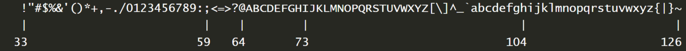
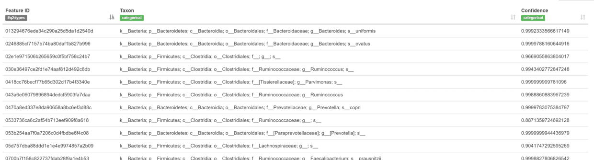
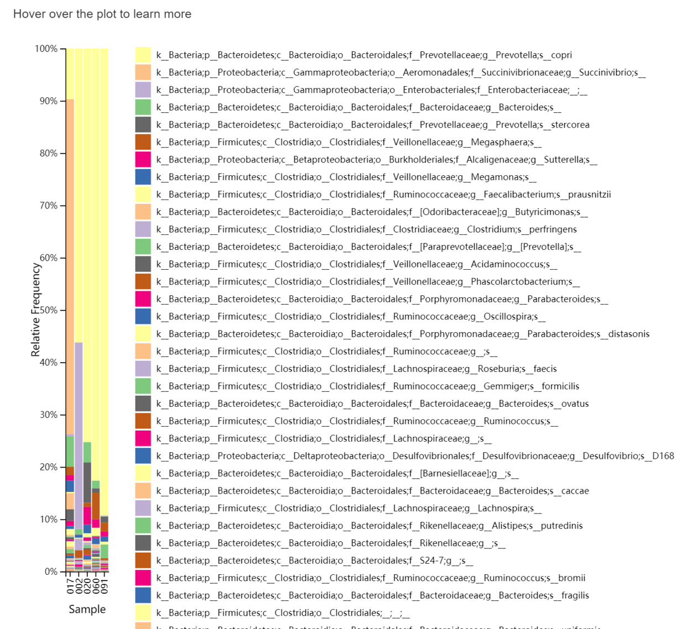

# 16S 测序数据分析

- 16S rRNA 基因是编码原核生物核糖体小亚基的基因，长度约 1500bp 左右，包括 9 个可变区和 10 个保守区，保守区序列反映了物种间的亲缘关系，而可变区序列则能反映物种间的差异。经常用于细菌系统发育和分类鉴定，核心是物种分析，包括微生物的种类，不同种类间的相对丰度，不同分组间的物种差异以及系统进化等。一般根据实验目标，设计和样本类型等不同，扩增的区域也会有所不同。
- 本实例采用的是 Illumina MiSeq V3-V4 区的测序数据，长度在 460bp 左右，为减少运算量等，本例只包含了 5 个样本，仅供参考。
- 分析流程是在 linux 上完成，需要有一点 linux 基础。

## qiime2 安装

### Minicoda 软件包管理器安装

```shell
wget https://repo.continuum.io/miniconda/Miniconda3-latest-MacOSX-x86_64.sh

./Miniconda3-latest-Linux-x86_64.sh

conda update conda

conda install wget
```

### 安装 qiime2 最新版

```shell
wget https://data.qiime2.org/distro/core/qiime2-2018.8-py35-linux-conda.yml

conda env create -n qiime2-2018.8 --file qiime2-2018.8-py35-linux-conda.yml

# OPTIONAL CLEANUP

rm qiime2-2018.8-py35-linux-conda.yml

source activate qiime2-2018.8

# 检查安装是否成功，运行此命令没有报错即安装成功
qiime --help

source deactivate
```


### 导入数据分析前的工作

- 送公司测序返还的数据一般都是拆分过并去除了引物的，可以自己再做一下质检，后续使用 dada2 分析时也会有碱基质量分布图，所以这步可以不做，自己质检（fastqc）的信息会比较全面。
- 切除引物也只是一个示例，在本例中可以跳过。

## 质检

```shell
公司的给的测序数据一般都是拆分过的，可将单端数据全部合并做质检，也可单独质检

gunzip *.gz # 解压

第一种方法：合并后质检。

cat *R1* > R1.fastq #合并上游序列，并指定输出文件名为 R1.fastq
cat *R2* > R2.fastq #合并下游序列，并指定输出文件名为 R2.fastq

质检

mkdir qc #创建一个文件夹用于存放质检文件

fastqc -t 2 R1.fastq R2.fastq -o qc # -t --threads，一般有多少个样本用多少线程。-o 指定输出文件存放目录。

第二种方法：单独质检后将质检报告合并

mkdir qct #创建一个文件夹用于存放质检文件
fastqc *fastq -t 10 -o qct
pip install multiqc #安装 multiqc
multiqc qct/* # 合并报告
```

- fastqc 的结果包括 reads 各位置的碱基质量值分布、碱基的总体质量值分布、reads 各个位置上碱基分布比例、GC 含量分布、reads 各个位置的 N 碱基数目、是否含有测序接头序列等。
- 图中横轴是测序序列的碱基，纵轴是质量得分，质量值 Q = -10*log10（error P），即 20 表示 1% 的错误率，30 表示 0.1% 的错误率。图中每 1 个箱线图（又称盒须图），都是该位置的所有序列的测序质量的一个统计，分别表示最小值、下四分位数（第 25 百分位数）、中位数（第 50 百分位数）、上四分位数（第 75 百分位数）以及最大值，图中蓝色的细线是各个位置的平均值的连线。
- 第一种方法：fasqc 碱基质量分布图（R1）
- 第二种方法：碱基质量分布图

也可在 dada2 步骤时设置合适的参数去除引物 (论坛里建议在使用 dada2 处理数据之前先去掉引物。

## 准备工作

### manifest file

将数据放在当前的文件夹下，然后自己写一个绝对路径文件，按以下格式写，# 开头的行是注释行会被自动忽略，例如以下命名为为 se-33-manifest 的文件，也可保存为 txt 等文件

```
#absolute filepaths “Fastq manifest” formats *file name: se-33-manifest
sample-id,absolute-filepath,direction
002,/data/shixq/qiime2/002_R1.fastq,forward
002,/data/shixq/qiime2/002_R2.fastq,reverse
017,/data/shixq/qiime2/017_R1.fastq,forward
017,/data/shixq/qiime2/017_R2.fastq,reverse
020,/data/shixq/qiime2/020_R1.fastq,forward
020,/data/shixq/qiime2/020_R2.fastq,reverse
060,/data/shixq/qiime2/060_R1.fastq,forward
060,/data/shixq/qiime2/060_R2.fastq,reverse
091,/data/shixq/qiime2/091_R1.fastq,forward
091,/data/shixq/qiime2/091_R2.fastq,reverse
```

另外如果在当前测序数据文件下操作，绝对路径可写为（和上面的写法相等）：

```
sample-id,absolute-filepath,direction
002,$PWD/002_R1.fastq,forward
002,$PWD/002_R2.fastq,reverse
```

### sample metadata 文件

可用 EXCEL 编辑后保存为制表符分割的 txt 文件，根据自己的数据做修改。

其中 q2:types 那行可以不写，如果分类是以数字来表示的，如 1,2,3, 代表不同的分组则需要标注这列对应的 q2：types 为 categorical（分类的），否则会默认为 numeric（数字）而报错。

```
\#SampleID subject edu height weight env1 env4
\#q2:types categorical categorical categorical categorical categorical
091 subject-1 5 160 50 2 1
020 subject-1 5 160 70 1 3
017 subject-1 2 174 70 1 3
060 subject-2 2 160 70 1 1
002 subject-2 5 174 50 2 1
```

### 激活工作环境

```she
source activate qiime2-2018.8
```

### 导入带质量的双端测序数据

- 质量值体系分为 Phred33 和 Phred 64 两种，如下图所示，一般看 fastq 文件的质量值那行包含！和？（对应 ASCII 值 33 和 63）等，即为 Phred33 体系（一般都为 Phred33）。
- 测序质量值



```shell
qiime tools import \
    --type 'SampleData[PairedEndSequencesWithQuality]' \
    --input-path se-33-manifest \
    --output-path paired-end-demux.qza \
    --input-format PairedEndFastqManifestPhred33
\#可视化文件 paired-end-demux.qza
qiime demux summarize \
    --i-data paired-end-demux.qza \
    --o-visualization paired-end-demux.qzv
```

- 各样品测序数据柱状分布图，展示不同测序深度下样品数量分布
-  pair-end-demux.qzv
-  上下游碱基质量分布图

`paired-end-demux.qzv`

-  使用 qiime tools view paired-end-demux.qzv 查看

### dada2 降噪 合并双端序列

这步花的时间最长，可使用 --p-n-threads 0 参数调用所有 CPU，减少运算时间。

注意：需要 20 bp 以上的 overlap 才能使用 dada2 拼接，否则会报错。

```shell
qiime dada2 denoise-paired \
    --i-demultiplexed-seqs paired-end-demux.qza \
    --p-trim-left-f 0 \
    --p-trim-left-r 0 \
    --p-trunc-len-f 270 \
    --p-trunc-len-r 250 \
    --o-table table.qza \
    --o-representative-sequences rep-seqs.qza \
    --o-denoising-stats denoising-stats.qza \
    --p-n-threads 0 #调用所有 CPU

# 可视化 denoising stats（qzv 文件可在线查看）
qiime metadata tabulate \
    --m-input-file denoising-stats.qza \
    --o-visualization denoising-stats.qzv
```

- 展示去除低质量序列、嵌合体、合并等后的序列数

### FeatureTable and FeatureData summaries

```shell
Feature 表
qiime feature-table summarize \
--i-table table.qza \
--o-visualization table.qzv \
--m-sample-metadata-file sample-metadata.txt
代表序列统计
qiime feature-table tabulate-seqs \
--i-data rep-seqs.qza \
--o-visualization rep-seqs.qzv
```

### 建树用于多样性分析

```shell
qiime phylogeny align-to-tree-mafft-fasttree \
--i-sequences rep-seqs.qza \
--o-alignment aligned-rep-seqs.qza \
--o-masked-alignment masked-aligned-rep-seqs.qza \
--o-tree unrooted-tree.qza \
--o-rooted-tree rooted-tree.qza
```

### Alpha 多样性分析

计算多样性 (包括所有常用的 Alpha 和 Beta 多样性方法)，输入有根树、Feature 表、样本重采样深度

取样深度看 table.qzv 文件确定（一般为样本最小的 sequence count，或覆盖绝大多数样品的 sequence count）

```shell
qiime diversity core-metrics-phylogenetic \
--i-phylogeny rooted-tree.qza \
--i-table table.qza \
--p-sampling-depth 55464 \
--m-metadata-file sample-metadata.txt \
--output-dir core-metrics-results
```

输出结果包括多种多样性结果，文件列表和解释如下：

+ beta 多样性 bray_curtis 距离矩阵 bray_curtis_distance_matrix.qza
+ alpha 多样性 evenness (均匀度，考虑物种和丰度) 指数 evenness_vector.qza
+ alpha 多样性 faith_pd (考虑物种间进化关系) 指数 faith_pd_vector.qza
+ beta 多样性 jaccard 距离矩阵 jaccard_distance_matrix.qza
+ alpha 多样性 observed_otus (OTU 数量) 指数 observed_otus_vector.qza
+ alpha 多样性香农熵 (考虑物种和丰度) 指数 shannon_vector.qza
+ beta 多样性 unweighted_unifrac 距离矩阵，不考虑丰度 unweighted_unifrac_distance_matrix.qza
+ beta 多样性 unweighted_unifrac 距离矩阵，考虑丰度 weighted_unifrac_distance_matrix.qza

测试分类元数据 (sample-metadata) 列和 alpha 多样性数据之间的关联，输入多样性值、sample-medata，输出统计结果

---

统计 faith_pd 算法 Alpha 多样性组间差异是否显著

```shell
qiime diversity alpha-group-significance \
--i-alpha-diversity core-metrics-results/faith_pd_vector.qza \
--m-metadata-file sample-metadata.txt \
--o-visualization core-metrics-results/faith-pd-group-significance.qzv
```

---

统计 evenness 组间差异是否显著

```shell
qiime diversity alpha-group-significance \
--i-alpha-diversity core-metrics-results/evenness_vector.qza \
--m-metadata-file sample-metadata.txt \
--o-visualization core-metrics-results/evenness-group-significance.qzv
```

- 以 evenness-group-significance.qzv 为例，图中可点 Category 选择分类方法，查看不同分组下箱线图间的分布与差别。图形下面的表格，详细详述组间比较的显著性和假阳性率统计。
- evenness-group-significance.qzv

### Beta 多样性分析

按 subject 分组，统计 unweighted_unifrace 距离的组间是否有显著差异，其他的分组分析类似。

``` shell
qiime diversity beta-group-significance \
--i-distance-matrix core-metrics-results/unweighted_unifrac_distance_matrix.qza \
--m-metadata-file sample-metadata.txt \
--m-metadata-column subject \
--o-visualization core-metrics-results/unweighted-unifrac-subject-significance.qzv \
--p-pairwise
```

可视化三维展示

unweighted-unifrac 的主坐标轴分析

```shell
qiime emperor plot \
--i-pcoa core-metrics-results/unweighted_unifrac_pcoa_results.qza \
--m-metadata-file sample-metadata.txt \
--p-custom-axes weight \
--o-visualization core-metrics-results/unweighted-unifrac-emperor-weight.qzv
```

可视化三维展示 bray-curtis 的主坐标轴分析

```shell
qiime emperor plot \
--i-pcoa core-metrics-results/unweighted_unifrac_pcoa_results.qza \
--m-metadata-file sample-metadata.txt \
--p-custom-axes height \
--o-visualization core-metrics-results/unweighted-unifrac-emperor-height.qzv
```

### Alpha rarefaction plotting

--p-max-depth should be determined by reviewing the “Frequency per sample” information presented in the table.qzv file

that was created above. In general, choosing a value that is somewhere around the median frequency seems to work well.

but you may want to increase that value if the lines in the resulting rarefaction plot don’t appear to be leveling out,

or decrease that value if you seem to be losing many of your samples due to low total frequencies closer to the minimum

sampling depth than the maximum sampling depth.

--p-max-depth 一般取 table.qzv 文件 Frequency per sample 的中位数左右

```shell
qiime diversity alpha-rarefaction \
--i-table table.qza \
--i-phylogeny rooted-tree.qza \
--p-max-depth 55000 \
--m-metadata-file sample-metadata.txt \
--o-visualization alpha-rarefaction.qzv
```

- 可视化将有两个图。顶部图是 $\alpha$ 稀疏图，主要用于确定样品的丰富度是否已被完全观察或测序。如果图中的线在沿 X 轴的某个采样深度处看起来 “平坦化”（即接近零斜率），则表明收集超出该采样深度的其他序列将不可能会有其他的 OTU（feature）产生。如果图中的线条没有达到平衡，这可能是因为尚未完全观察到样品的丰富程度（因为收集的序列太少），或者它可能表明在数据中存在大量的测序错误（被误认为是新的多样性）。底部图表示当特征表稀疏到每个采样深度时每个组中保留的样本数。
- 5 个样本被分成两组 weight, 图中显示即两条线，每组的样本数分别为 2 和 3。
- Alpha rarefaction

### 训练分类器

- 不同实验使用不同的引物有不同的扩增区域，鉴定物种分类的精度就不同，提前的训练可以让分类结果更准确。
- 提供自己的测序引物序列即可

下载数据库文件 (greengenes)

```shell
wget ftp://greengenes.microbio.me/greengenes_release/gg_13_5/gg_13_8_otus.tar.gz
```

解压

```shell
tar -zxvf gg_13_8_otus.tar.gz
```

使用 rep_set 文件中的 99_otus.fasta 数据和 taxonomy 中的 99_OTU_taxonomy.txt 数据，也可根据需要选择其他相似度。

```shell
# 导入参考序列
qiime tools import \
--type 'FeatureData[Sequence]' \
--input-path 99_otus.fasta \
--output-path 99_otus.qza

# 导入物种分类信息
qiime tools import \
--type 'FeatureData[Taxonomy]' \
--input-format HeaderlessTSVTaxonomyFormat \
--input-path 99_otu_taxonomy.txt \
--output-path ref-taxonomy.qza

# Extract reference reads
# 这里不建议指定截取的长度（参考：https://forum.qiime2.org/t/how-can-i-train-classifier-for-paired-end-reads/1512/3）
# Greengenes 13_8 99% OTUs from 341F/805R region of sequences（分类器描述），提供测序的引物序列，截取对应的区域进行比对，达到分类的目的。
qiime feature-classifier extract-reads \
--i-sequences 99_otus.qza \
--p-f-primer CCTACGGGNGGCWGCAG \ #341F 引物
--p-r-primer GACTACHVGGGTATCTAATCC \ #805R 引物
--o-reads ref-seqs.qza

# Train the classifier（训练分类器）
# 基于筛选的指定区段，生成实验特异的分类器
qiime feature-classifier fit-classifier-naive-bayes \
--i-reference-reads ref-seqs.qza \
--i-reference-taxonomy ref-taxonomy.qza \
--o-classifier Greengenes_13_8_99%_OTUs_341F-805R_classifier.qza
```


### 物种分类

物种分类

```shell
qiime feature-classifier classify-sklearn \
--i-classifier Greengenes_13_8_99%_OTUs_341F-805R_classifier.qza \
--i-reads rep-seqs.qza \
--o-classification taxonomy.qza
```

结果可视化

```shell
qiime metadata tabulate \
--m-input-file taxonomy.qza \
--o-visualization taxonomy.qzv
```

物种分类条形图

qiime taxa barplot \

--i-table table.qza \

--i-taxonomy taxonomy.qza \

--m-metadata-file sample-metadata.txt \

--o-visualization taxa-bar-plots.qzv

taxonomy.qzv

- 图中开头字母分别表示：界 (Kingdom）、门 (Phylum)、纲 (Class)、目 (Order)、科 ( Family)、属 ( Genus)、种 (Species)
- taxa-bar-plots.qzv



3.12.1 ANCOM 差异度分析

- 差异丰度分析采用 ANCOM (analysis of composition of microbiomes)，是 2015 年发布在 Microb Ecol Health Dis 上的方法，文章称在微生物组方面更专业，但不接受零值 (零在二代测序结果表中很常见), 用于比较两个或更多群体中微生物组的组成。
- 示例样本较少，没有显著差异，在此不做展示，可参考方法。

按 subject 分组进行差异分析

```shell
qiime feature-table filter-samples \
    --i-table table.qza \
    --m-metadata-file sample-metadata.txt \
    --p-where "subject='subject-1'" \
    --o-filtered-table subject-1-table.qza
```

OTU 表添加假 count，因为 ANCOM 不允许有零

### 按种水平进行差异分析，genus level (i.e. level 6 of the Greengenes taxonomy)

按种水平进行合并，统计各种的总 reads

```shell
qiime taxa collapse \
    --i-table subject-1-table.qza \
    --i-taxonomy taxonomy.qza \
    --p-level 6 \
    --o-collapsed-table subject-1-table-l6.qza

add-pseudocount

qiime composition add-pseudocount \
    --i-table subject-1-table-l6.qza \
    --o-composition-table comp-subject-1-table-l6.qza

subject-1 -->weight

qiime composition ancom \
    --i-table comp-subject-1-table-l6.qza \
    --m-metadata-file sample-metadata.txt \
    --m-metadata-column weight \
    --o-visualization l6-ancom-subject-1-weight.qzv
```

