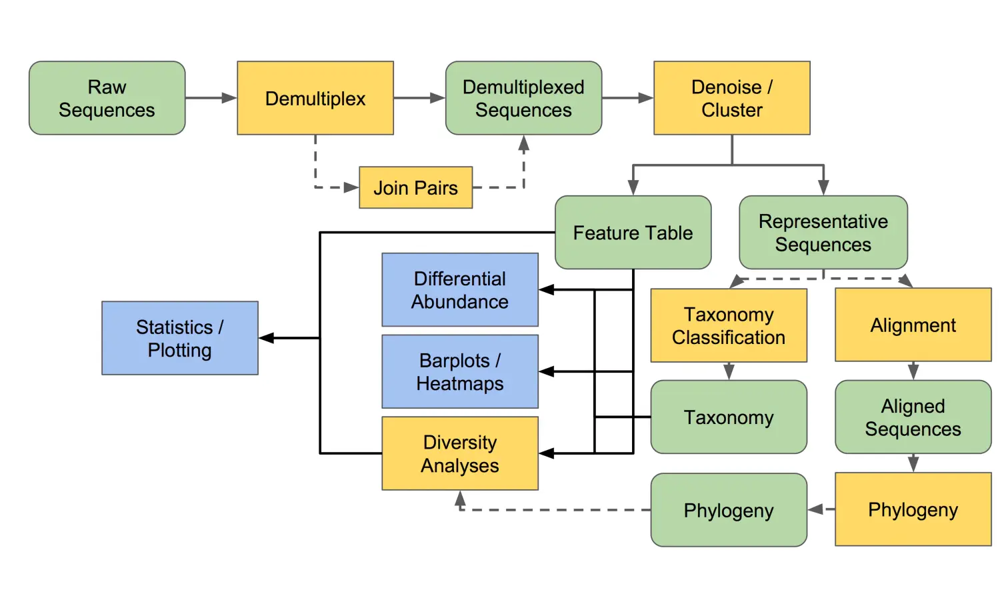
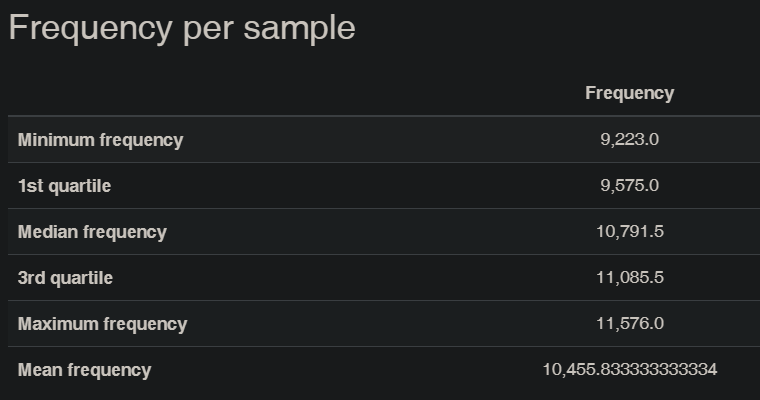

# 16S 基础流程

[toc]

`wd`：`/data1/project/<NBioS-yyyy-xxxxx-name>/`

## 分析流程



使用 FastQC 进行质量检测

```shell
fastqc reads/*.fastq -o basic/fastqc/ -t 0
multiqc basic/fastqc/* -o basic/fastqc/ # 合并报告
```

### 文件准备

#### manifest

对于多条数据的导入，需要编写 manifest 文件，指明 reads 的路径。

以 `*_1/2.fq` 结尾的序列可以使用以下脚本生成 manifest 文件。

```shell
./basic/script/manifestGen.sh
```

生成文件路径：`basic/qiime/manifest.txt`

#### metadata

从 SRA 数据库下载的序列，在下载 SraRunTable 后，可以使用以下脚本生成 metadata 文件。

```shell
Rscript ./basic/script/metadataGen.r
```

生成文件路径：`basic/qiime/metadata.tsv` 

### 数据导入

激活 qiime conda 环境。

可以用 `qiime tools import --show-importable-types` 命令查看可导入的类型。以下是双端测序数据（Phred33）的导入：

```shell
qiime tools import \
    --type 'SampleData[PairedEndSequencesWithQuality]' \
    --input-path basic/qiime/manifest.txt \
    --output-path basic/qiime/paired-end-demux.qza \
    --input-format PairedEndFastqManifestPhred33
```

查看数据基本情况

```shell
qiime demux summarize \
    --i-data basic/qiime/paired-end-sequences.qza \
    --o-visualization basic/qiime/paired-end-demux.qzv
```

可视化：[QIIME 2 View](https://view.qiime2.org/)

### 降噪 & 合并双端序列

#### 降噪

```shell
qiime dada2 denoise-paired \
    --i-demultiplexed-seqs basic/qiime/paired-end-demux.qza \
    --p-trim-left-f 13 \
    --p-trim-left-r 13 \
    --p-trunc-len-f 150 \
    --p-trunc-len-r 150 \
    --o-table basic/qiime/table.qza \
    --o-representative-sequences basic/qiime/rep-seqs.qza \
    --o-denoising-stats basic/qiime/denoising-stats.qza \
    --p-n-threads 0
```

参数说明：

```shell
--p-trunc-len-f # INTEGER 由于质量下降，前向读取序列应被截断的位置。这会截断输入序列的 3' 端，即最后几个循环测序的碱基。短于此值的读取将被丢弃。应用此参数后，前向和反向读取之间仍必须至少有 12 个核苷酸的重叠。如果提供 0，则不执行截断或长度过滤。[必需]
--p-trunc-len-r # INTEGER 由于质量下降，反向读取序列应被截断的位置。这会截断输入序列的 3' 端，即最后几个循环测序的碱基。短于此值的读取将被丢弃。应用此参数后，前向和反向读取之间仍必须至少有 12 个核苷酸的重叠。如果提供 0，则不执行截断或长度过滤。[必需]
--p-trim-left-f # INTEGER 由于质量较低，前向读取序列应被修剪的位置。这会修剪输入序列的 5' 端，即最初几个循环测序的碱基。[默认：0]
--p-trim-left-r # INTEGER 由于质量较低，反向读取序列应被修剪的位置。这会修剪输入序列的 5' 端，即最初几个循环测序的碱基。[默认：0]

```

#### 查看降噪信息

可视化 denoising stats：[QIIME 2 View](https://view.qiime2.org/)，展示去除低质量序列、嵌合体、合并等后的序列数。**下载该页面的 metadata.tsv 文件，作为下一步的输入文件。**

```shell
qiime metadata tabulate \
    --m-input-file basic/qiime/denoising-stats.qza \
    --o-visualization basic/qiime/denoising-stats.qzv
```

#### Feature table

由于自动生成的 metadata.tsv 文件与前面脚本产生的同名，这里将从网页下载的文件扩展名修改为 `.txt`。文件存放路径：`basic/qiime/metadata.txt`<font color=red face=楷体>修改前面创建的 metadata</font>

```shell
qiime feature-table summarize \
    --i-table basic/qiime/table.qza \
    --o-visualization basic/qiime/table.qzv \
    --m-sample-metadata-file basic/qiime/metadata.txt
```

#### 代表序列统计

```shell
qiime feature-table tabulate-seqs \
    --i-data basic/qiime/rep-seqs.qza \
    --o-visualization basic/qiime/rep-seqs.qzv
```

### 比对数据库

通过比对已知分类学组成的参考数据库的序列，可以获知 feature table 的代表序列的物种注释情况。在 qiime2 通常可以使用已经搭建好的分类学分类器：silva132 和 Greengene 13_8 等。这里使用 silva 数据库进行物种注释。

```shell
# downlaod silva classifier data 
wget https://data.qiime2.org/2020.8/common/silva-138-99-nb-classifier.qza 

mv silva-138-99-nb-classifier.qza basic/qiime/

# annotation
qiime feature-classifier classify-sklearn \
	--i-classifier basic/qiime/silva-138-99-nb-classifier.qza  \
	--i-reads basic/qiime/rep-seqs.qza \
	--o-classification basic/qiime/taxonomy-dada2-sliva.qza \
	--p-n-jobs 20 \
	--verbose \
	--output-dir 
```

### 过滤 ASV

#### 去除低出现率 ASV

根据 table 的结果设置过滤 threshold，阈值有 frequency 和 samples，即 ASV 在所有样本的总 reads 和出现在样本数目。计算平均采样深度（对所有 ASV 的 count 加和并求平均值），设置采样阈值后再乘以平均采样深度即获得 frequency 阈值，另外也可以设置 ASV 出现在多少样本内。

```shell
qiime feature-table filter-features \
   --i-table basic/qiime/table.qza \
   --p-min-frequency 10 \
   --p-min-samples 1 \
   --o-filtered-table basic/qiime/table_filter_low_freq.qza
```

#### 去除污染序列

16S 扩增子常见污染序列来自线粒体和叶绿体等 16S 序列，另外也存在一些未注释的序列，均需要去除。

```shell
qiime taxa filter-table \
   --i-table basic/qiime/table_filter_low_freq.qza \
   --i-taxonomy basic/qiime/taxonomy-dada2-sliva.qza \
   --p-exclude mitochondria,chloroplast \
   --o-filtered-table  basic/qiime/table_filter_low_freq_contam.qza 
```

#### 去除含 ASV 少的样本

经过上述处理后，某些样本含有较少的 ASV 总量，因此可以将其剔除。通常使用的 threshold 的范围是 1 000 - 4 000 reads。

```shell
# 统计每个样本的 ASV 数量
qiime feature-table summarize \
   --i-table  basic/qiime/table_filter_low_freq_contam.qza \
   --o-visualization  basic/qiime/table_filter_low_freq_contam_summary.qzv
# 移除样本
##    --p-min-frequency 通常 1 000-4 000
qiime feature-table filter-samples \
   --i-table   basic/qiime/table_filter_low_freq_contam.qza \
   --p-min-frequency 1000 \
   --o-filtered-table   basic/qiime/final_table.qza 
# 代表序列
qiime feature-table filter-seqs \
   --i-data  basic/qiime/rep-seqs.qza \
   --i-table  basic/qiime/final_table.qza \
   --o-filtered-data basic/qiime/final_rep_seqs.qza
# 重新注释
qiime feature-classifier classify-sklearn \
   --i-classifier basic/qiime/silva-138-99-nb-classifier.qza  \
   --i-reads basic/qiime/final_rep_seqs.qza \
   --o-classification basic/qiime/final_taxonomy_sliva.qza \
   --p-n-jobs 20 \
   --verbose \
   --output-dir basic/qiime/reanno
# core features
qiime feature-table core-features \
   --i-table basic/qiime/final_table.qza \
   --p-min-fraction 0.6 \
   --p-max-fraction 1 \
   --p-steps 11 \
   --o-visualization basic/qiime/final_table_cores.qzv \
   --output-dir basic/qiime/coreFeat
```

---

下游分析

---

### 建树

```shell
qiime phylogeny align-to-tree-mafft-fasttree \
      --i-sequences basic/qiime/final_rep_seqs.qza \
      --o-alignment basic/qiime/final_rep_seqs_aligned.qza \
      --o-masked-alignment basic/qiime/final_rep_seqs_masked.qza \
      --p-n-threads 20 \
      --o-tree basic/qiime/unrooted-tree.qza \
      --o-rooted-tree basic/qiime/rooted-tree.qza
```

### 稀疏曲线

稀疏曲线可以了解测序深度与 ASV 的关系。



```shell
# 根据数据情况选择 --p-max-depth
qiime diversity alpha-rarefaction \
     --i-table basic/qiime/final_table.qza \
     --i-phylogeny basic/qiime/rooted-tree.qza \
     --p-max-depth 9300 \ 
     --m-metadata-file basic/qiime/metadata.tsv \
     --o-visualization basic/qiime/p-max-depth-9300-alpha-rarefaction.qzv
```

metadata 文件除了 ID 还需要包含一列或多列非数字列用来分类。

### 多样性分析

```shell
# all diversity index and distance 
qiime diversity core-metrics-phylogenetic \
     --i-phylogeny basic/qiime/rooted-tree.qza \
     --i-table basic/qiime/final_table.qza \
     --p-sampling-depth 9300 \
     --m-metadata-file basic/qiime/metadata.tsv \
     --output-dir basic/qiime/sample-depth-9300-core-metrics-results    
```

### faith_pd 多样性参数

```shell
# example for faith_pd_vector of group analysis
qiime diversity alpha-group-significance \
     --i-alpha-diversity basic/qiime/sample-depth-9300-core-metrics-results/faith_pd_vector.qza \
     --m-metadata-file basic/qiime/metadata.tsv \
     --o-visualization basic/qiime/sample-depth-9300-core-metrics-results/faith-pd-group-significance.qzv
# example for alpha diversity of group analysis
qiime diversity alpha-group-significance \
     --i-alpha-diversity basic/qiime/sample-depth-9300-core-metrics-results/shannon_vector.qza \
     --m-metadata-file basic/qiime/metadata.tsv \
     --o-visualization basic/qiime/shannon_compare_groups.qzv 
# beta diversity 
qiime diversity beta-group-significance \
    --i-distance-matrix basic/qiime/sample-depth-9300-core-metrics-results/unweighted_unifrac_distance_matrix.qza \
    --m-metadata-file basic/qiime/metadata.tsv \
    --m-metadata-column Group \ # 修改为实际文件中的字段
    --p-pairwise false \
    --p-permutations 999 \
    --o-visualization basic/qiime/unweighted-unifrac-subject-significance.qzv 
# three dimensions to show beta diversity
qiime emperor plot \
    --i-pcoa basic/qiime/sample-depth-9300-core-metrics-results/unweighted_unifrac_pcoa_results.qza \
    --m-metadata-file basic/qiime/metadata.tsv \
#    --p-custom-axes Group \ # 修改为实际文件中的字段 需要是 numeric
    --o-visualization basic/qiime/unweighted-unifrac-emperor-height.qzv
```

### 物种分类可视化

```shell
qiime taxa barplot \
     --i-table basic/qiime/final_table.qza \
     --i-taxonomy basic/qiime/final_taxonomy_sliva.qza \
     --m-metadata-file basic/qiime/metadata.tsv \
     --o-visualization basic/qiime/final_taxa_barplots_sliva.qzv
```

### 微生物群组成分析 (ANCOM)

[ANCOM](https://www.ncbi.nlm.nih.gov/pmc/articles/PMC4450248/pdf/MEHD-26-27663.pdf) 可用于比较微生物在组间差异的分析方法， 结果与 LEfse 类似。该方法基于成分对数比的方法，即先对 count 数据进行对数转换，再通过简单的秩和检验（stats 包内的 aov, friedman.test, lme 等函数）进行比较，最后计算统计量 w。ANCOM 的结果用 W 值来衡量组间差异显著性。W 值越高代表该物种在组间的差异显著性越高。

```shell
# add pseudocount for log transform
qiime composition add-pseudocount \
   --i-table basic/qiime/final_table.qza \
   --p-pseudocount 1 \
   --o-composition-table basic/qiime/final_table_pseudocount.qza
# ANCOM 
qiime composition ancom \
   --i-table basic/qiime/final_table_pseudocount.qza \
   --m-metadata-file basic/qiime/metadata.tsv \
   --m-metadata-column Group \
   --output-dir basic/qiime/ancom_output
```

```
wget \
  -O "barcodes.fastq.gz" \
  "https://data.qiime2.org/2024.2/tutorials/atacama-soils/10p/barcodes.fastq.gz"
```

