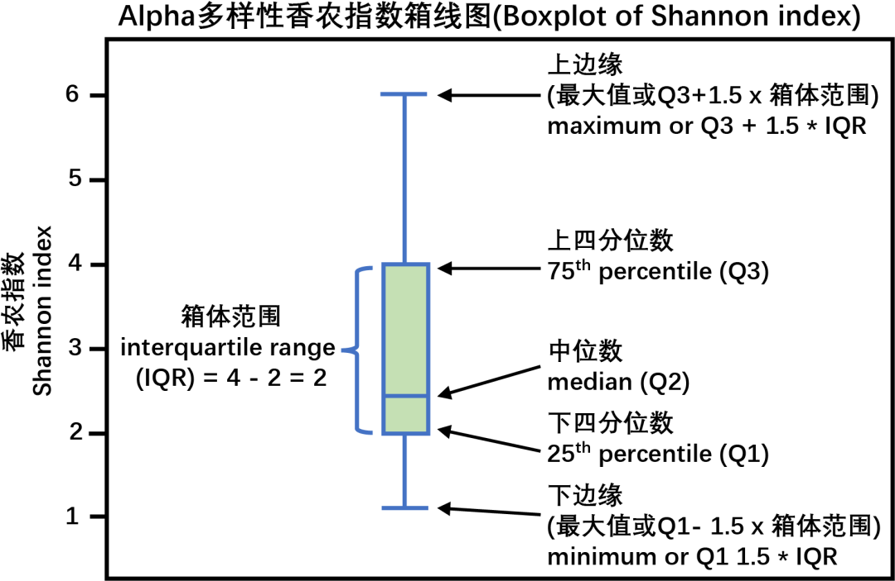
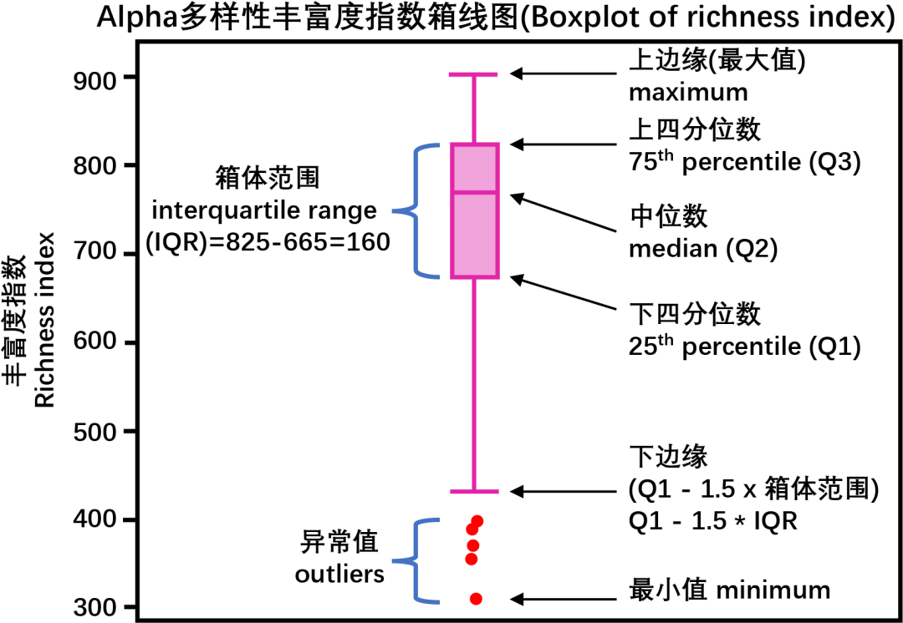
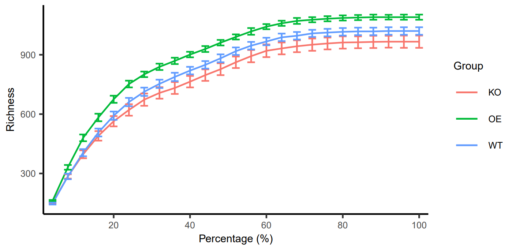

# 16S 扩增子测序数据分析报告

[toc]

## 16S 扩增子测序数据分析方案流程

## 样本与测序信息

### 方法描述

## 多样性分析

### $\alpha$ 多样性

#### $\alpha$​​ 多样性箱线图

$\alpha$​ 多样性的计算主要与 3 个因素有关：一是物种数目（richness），二是丰度（abundance），三是均匀度（evenness）。物种数目是指一个样本中物种存在的个数，与每个物种量的多寡无关。丰度是指每个物种的多寡，比如一个粪便样本中物种 A 出现 10 次，物种 B 出现 1000 次；如果将每个样本所有物种求百分比，这样每个样本的物种丰度合计数为 1，这种丰度叫相对丰度。均匀度主要考量物种之间的相对比例。α 多样性常用的衡量指标有：

1. 观测的特征数（Observed OTU/ASV）：是指每个样本中能够观察到的 OTUs 或 ASVs 的数量，与每个 OTU 或 ASV 的多寡无关。如果把动物园比喻成一个样本，则 “Observed OTUs” 是指这个动物园中动物的种类数，与每种动物具体有几只无关。
2. Chao1 指数：是物种数目的衡量标准之一，它考虑 3 个因素，一是物种数目，二是只有 1 条序列的物种数目，三是 2 条序列的物种数目，计算公式是：Chao1 = Sobs + n1 (n1-1)/2 (n2+1)，其中 Chao1 为估计的 OTU 数，Sobs 为观测到的 OTU 数，n1 为只有 1 条序列的 OTU 数目，n2 为只有 2 条序列的 OTU 数目。Chao1 指数越大，表明某群落物种数目较多。注意，从公式可以看出，Chao1 指数受 1 条和 2 条序列的物种影响较大。
3. 基于丰度的覆盖估计值（Abundance-based Coverage Estimator, ACE）：是用来估计群落中含有 OTU 数目的指数，同样由 Chao 提出 (Chao and Yang, 1993)，是生态学中估计物种总数的常用指数之一。默认将序列量 10 以下的 OTU 定义为稀有并单独计算，从而估计群落中实际存在的物种数。ACE 指数越大，表明群落中物种数目越大。计算公式和参考方献详见 http://scikit-bio.org/docs/latest/ 或 参考文献；
4. 香农指数（Shannon-Wiener index）：香农指数综合考虑了群落的物种数目和均匀度这两个因素。Shannon 指数值越高，表明群落的 α 多样性越高。注意，该指标对于丰度低的物种有较大的权重，即计算时受丰度低的物种影响较大，在解释香农指数时需要注意这点。
5. 辛普森指数（Simpson index）：用来估算样品中微生物的多样性指数之一，由 Edward Hugh Simpson (1949) 提出。Simpson 指数值越大，说明群落多样性越低。辛普森指数在计算时将丰度高的物种设置了较大权重，所以高丰度物种较多时该指数值较大，这与香农指数有明显区别。
6. Pielou 的均匀度指数（Pielou’s Evenness Index）：这是最常用的均匀度指数，它其实就香农指数与 Observed OTU/ASV 对数的比值。很显然，这个指标受 Observed OTU/ASV 影响很大，这是这个指标的主要缺点之一。由于香农指数和辛普森指数本身就包含了均匀度信息，实际研究工作中这 2 个指标很常用。
   

原文链接：https://blog.csdn.net/woodcorpse/article/details/106632357

#### 稀释曲线

稀释曲线（丰富度曲线）用于评价测序量是否足以覆盖所有类群，并间接反映样品中物种的丰富程度。根据已测得 16S rDNA 序列中已知的各种 OTU 的相对比例，来计算抽取 n 个（n < reads 总数）reads 时出现 OTU 数量的期望值，然后根据一组 n 值（一般为一组小于总序列数的等差数列）与其相对应的 OTU 数量的期望值作稀释曲线。

如果曲线趋于平缓，可以认为测序深度已经基本覆盖到样品中所有的物种，增加测序数据无法再找到更多的 OTU。

横坐标代表随机抽取的序列数量；纵坐标代表观测到的 OTU 数量。样本曲线的延伸终点的横坐标位置为该样本的测序数量。

#### 多样性 venn图

### $\beta$ 多样性

#### 距离矩阵热图

#### 主坐标分析 PCoA

#### 限制性主坐标分析 CPCoA

## 物种组成

## 差异分析