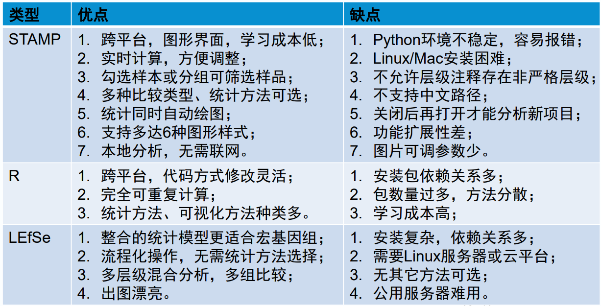

1. LEfSe 报错：`Number of significantly discriminative features: 0 (0) before internal wilcoxon No features with significant differences between the two classes Number of discriminative features with abs LDA score > 2.0 : 0`
   1. 可能原因：差异分析没有筛选到差异的 taxa
   2. 可能解决方法：调整参数或更换数据集（已经尝试 3 个数据集，正在尝试第 4 个）
2. 运行第 4 个数据集同时：
   1. 整理使用 vsearch / usearch 的新流程
3. 考虑跳过 LEfSe
   
   1. 先整理 PICRUSt 功能预测流程
   2. 在第二套流程中使用 R 进行统计表特征分析，同时尝试 LEfSe。