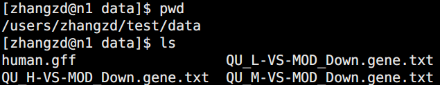
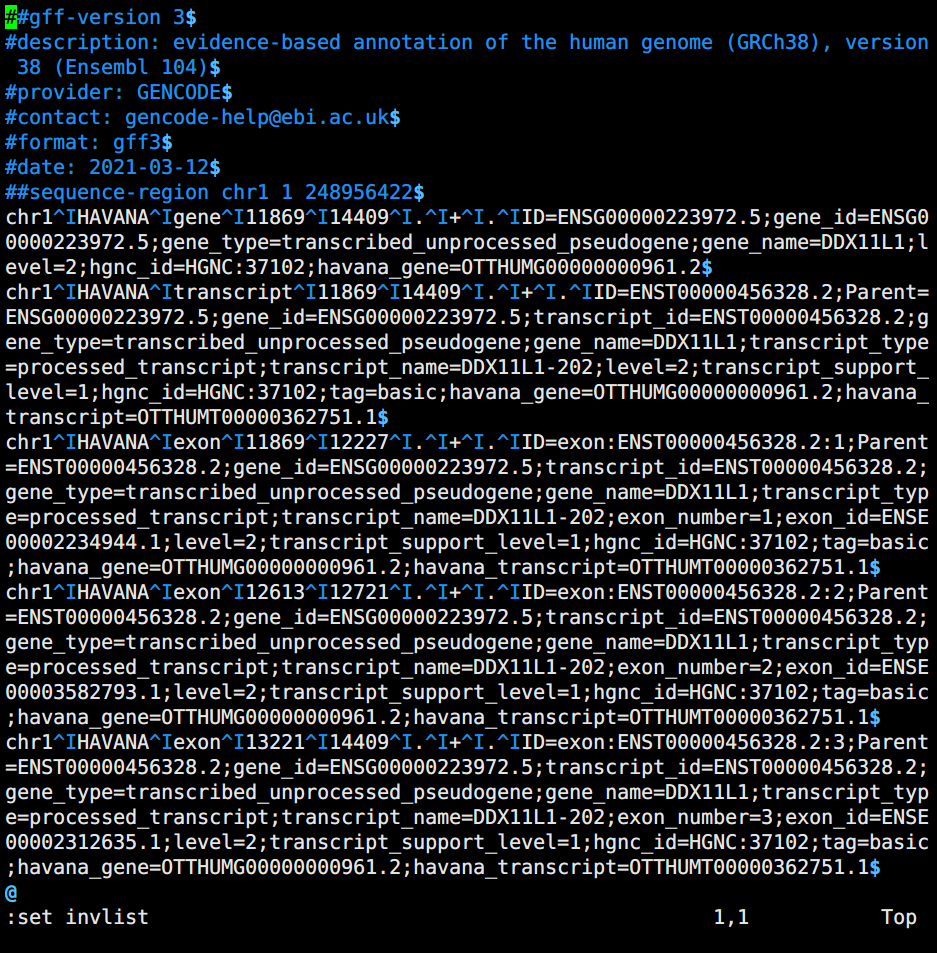
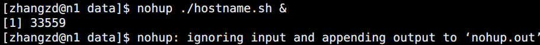
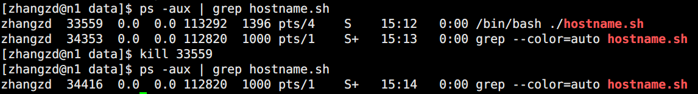

# 考核题目

1. 在个人根目录下新建文件夹 test，在test文件夹下创建data子文件夹； data文件夹下创建或添加以下数据文件；查看data文件夹的绝对路径。（10分）
   

   1. test_1.fq: 随机生成一个 fastq 文件，符合fastq格式即可；然后将test_1.fq复制一份为test_2.fq；使用linux命令查看test_1.fq文件；输出test_1.fq的头4行及末尾4行；将test_1.fq创建一个软链接为test_3.fq

      ```bash
      cp test_1.fq test_2.fq
      less test_1.fq
      
      ln test_1.fq test_3.fq
      ```

      ```bash
      #!/bin/bash
      base=("A" "T" "C" "G")
      for ((i=1; i<=20; i++))
      do
      	echo "@seq"$i >> test_1.fq
      	seq=""
      	for((j=1; j<=20; j++))
      	do
      		$seq=$seq${base[$RANDOM%4]}
      	done
      	echo $seq >> test_1.fq
      	echo "+" >> test_1.fq
      	echo "????????????????????" >> test_1.fq
      done
      ```

   2. QU_L-VS-MOD_Down.gene.txt, QU_M-VS-MOD_Down.gene.txt, QU_H-VS-MOD_Down.gene.txt: 将我提供的这三个文件上传到data文件夹中。

   3. human.gff：将该文件上传到 data 文件夹中。

2. 把test_1.fq和test_2.fq压缩为gz格式文件；查看gz文件的内容；然后将两个gz文件解压缩;将整个data文件夹打包为data.tar.gz文件；将data.tar.gz文件重命名为mydata.tar.gz；删除mydata.tar.gz文件。（5分）

   ```shell
   gzip test_1.fq
   gzip text_2.fq
   zcat *.gz
   gzip -d *.gz
   # -----
   cd
   tar -zcvf data.tar.gz data
   mv data.tar.gz mydata.tar.gz
   rm mydata.tar.gz
   ```

   

3. 背景知识：FASTQ是一种存储了生物序列（通常是核酸序列）以及相应的质量评价的文本格式。它们都是以ASCII编码的。几乎是高通量测序的标准格式。FASTQ格式的序列包含四行，第一行由'@'开始，后面跟着序列的描述信息，这点跟FASTA格式是一样的。第二行是序列。第三行由'+'开始，后面也可以跟着序列的描述信息。第四行是第二行序列的质量评价（quality values，是测序的质量评价），字符数跟第二行的序列是相等的。
   例如：

   ```
   @SEQ_ID
   GATTTGGGGTTCAAAGCAGTATCGATCAAATAGTAAATCCATTTGTTCAACTCACAGTTT
   +
   !''*((((***+))%%%++)(%%%%).1***-+*''))**55CCF>>>>>>CCCCCCC65
   ```

   1. 计算两个 FASTQ 文件的 md5sum 值，存入 md5sum.txt。（5分）
      test_1.fq
      test_2.fq

      ```shell
      md5sum test_1.fq | tee >> md5sum_1.txt
      md5sum test_2.fq | tee >> md5sum_2.txt
      ```

   2.  统计 test_1.fq 文件各有多少条序列。（5分）
      

      ```shell
      # 统计单个文件
      # awk运算
      # %取余数
      # 为什么除以4，又除以1000000？cat sample.fq | awk 'BEGIN{OFS="\t"}{if(FNR%4==0) base+=length}END{print FNR/4/1000000 " million", base/10^9 "G";}'
      # 3e-06 million 1.41e-07 G
      
      # 统计多个文件
      for i in *.fq; do 
        cat sample.fq | awk -v name=${i} 'BEGIN{OFS="\t"}{if(FNR%4==0) base+=length}END{print name, FNR/4/1000000 " million", base/10^9 " G";}'
      done
      
      # sample.fq       3e-06 million   1.41e-07 G
      
      # 统计多个压缩文件
      for i in *.fq.gz; do 
        zcat sample.fq.gz | awk -v name=${i} 'BEGIN{OFS="\t"}{if(FNR%4==0) base+=length}END{print name, FNR/4/1000000 " million", base/10^9 " G";}'
      done
      ```
   
      
   
   3.  增加 test_1.fq 所有用户可读写可执行权限；查看 test_1.fq 大小（5分）
      ```shell
      chmod 777 test_1.fq
      ll test_1.fq
      ```
   
4. 分别统计QU_L-VS-MOD_Down.gene.txt, QU_M-VS-MOD_Down.gene.txt, QU_H-VS-MOD_Down.gene.txt 三个文件中基因的 overlap 情况。（15分）

5. 在 `human.gff` 文件中统计第三列的关键词（CDS, exon, gene, start_codon, stop_codon, transcript, UTR）各出现多少次。（10分）

6. 输出 `human.gff` 第九列中的`gene_name=`（提取这里的关键词）；去重复，输出到 `gene_name.txt` 文件。（5分）
   ```bash
   sed 's/^.*gene_name=//g' | sed 's/\;.*$//g' | sort | uniq > gene_name.txt
   ```

   

7. 将QU_L-VS-MOD_Down.gene.txt, QU_M-VS-MOD_Down.gene.txt, QU_H-VS-MOD_Down.gene.txt三个文件合并，然后统计每个基因出现的次数，并按照出现次数从多到少进行排序。（10分）

   ```bash
   cat QU_L-VS-MOD_Down.gene.txt QU_M-VS-MOD_Down.gene.txt QU_H-VS-MOD_Down.gene.txt > merge.txt
   sort merge.txt | uniq | sort -r
   ```

   

8. 使用 vim 打开 human.gff，将 tab 键和换行符显示出来，截图粘贴在下面。（5分）
   

9. 使用命令给 QU_L-VS-MOD_Down.gene.txt 文件添加一个表头：Gene（5分）
   ```bash
   sed -i '1i Gene' QU_L-VS-MOD_Down.gene.txt
   ```

10. 这个命令中nohup的作用是什么？（5分）
    ```bash
    nohup p3 /public/pipeline/besaltpipe/latest/Pipeline.py -c RNA-seq.config &
    ```

    后台运行命令并将 `stdout` 追加到 `nohup.out` 文件

11. 写一个简单的 shell 脚本，每隔 1 秒重复打印系统 hostname；后台运行该脚本；使用 ps 命令查找筛选该运行脚本进程；最后终止这个程序。（15分）
    ```shell
    #!/bin/bash
    while true
    do
    	hostname
    	sleep 1
    done
    ```





