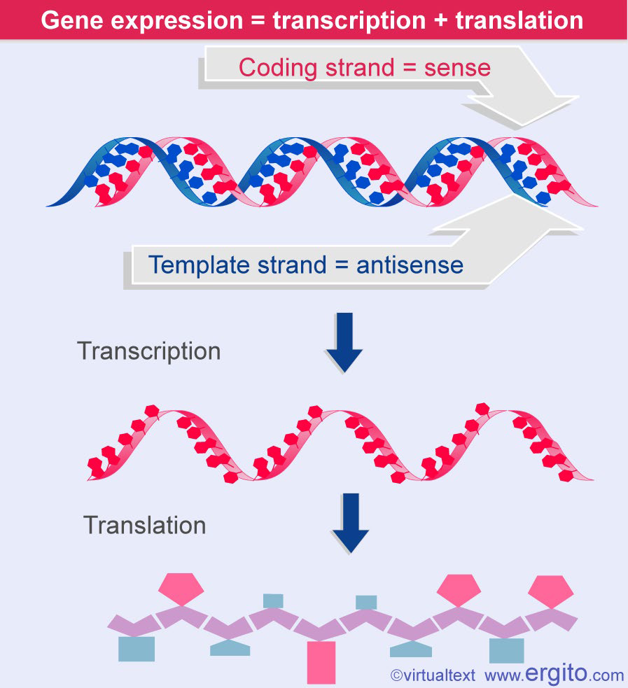
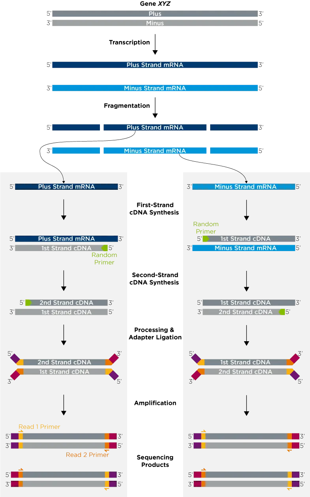
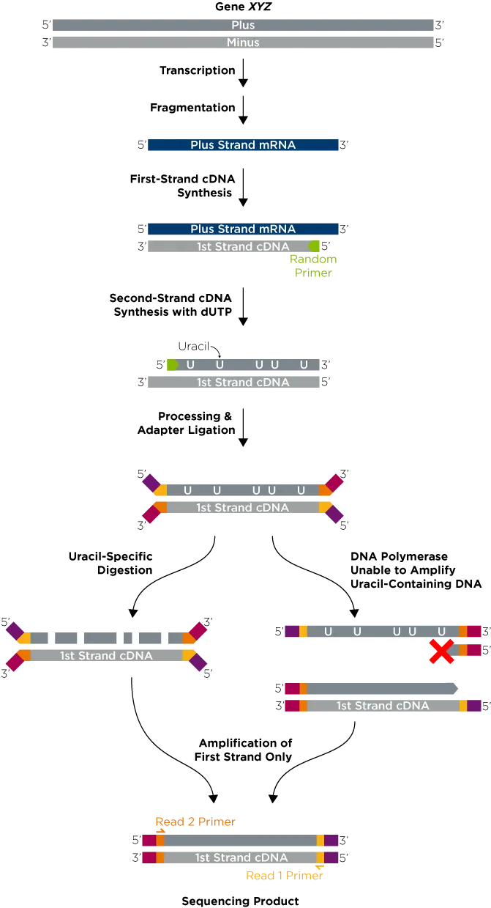
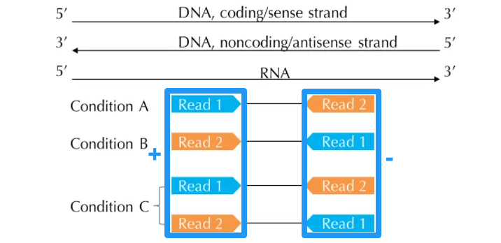

# RNA-seq

## Sense & Antisense

- 编码链（Coding Strand）或称有意义链（Sense Strand）：与 **mRNA 序列相同**的那条 DNA 链。（正链 plus）
- 模板链（Template Strand）或称反义链（Antisense Strand）：根据碱基互补配对原则**指导 mRNA 合成**的 DNA 链。（负链 minus）

## Stranded & Unstranded

### Unstranded

建库流程：

1. Oligo-dT 富集 mRNA：对于真核生物，当样本量足够时，RNA 中 90% 以上为 rRNA，通常选择 Oligo-dT 富集 mRNA（1-2% 尾部存在 Poly A 结构互补）。
   + 真核生物中，mRNA 由 RNA 聚合酶 II 转录，rRNA 大部分由 RNA 聚合酶 I 转录，加尾需要一系列加尾因子的作用，而这些加尾因子只有 RNA 聚合酶 II 才能招募富集。
2. 添加随机引物进行链的合成：DNA 双链的合成。
3. 添加接头（接头不是互补配对的（"Y" 形））
4. PCR 扩增：上图左右两边都是同时对正负链测序，所以最后得到的 Reads 不清楚它与 mRNA 之间的关系是怎么样的。

### Stranded

去除 rRNA：活检样本不足，富集的方法提取 RNA 效果差，选择降解 rRNA 得到 mRNA。对于原核生物样本， mRNA 不存在 Poly A 结构，也使用这种方法。

1. 以 mRNA 为模板进行第一链的合成，再使用 RNaseH 对杂合链中的 RNA 讲解，再利用含有 dUTP 的反应液进行第二链的合成，添加接头。

   链特异性的实现：

   1. 第一种方法：使用能够特异性降解含有尿嘧啶（U）的酶来对含有 U 的链进行降解，然后再进行链的合成，这样得到的文库里之后又一种 DNA 分析，得到的 read1 来自 mRNA 序列。

   2. 第二种方法：将含有 U 的 DNA 双链解开，进行扩增，而 DNA 聚合酶没有办法以 U 为模板进行扩增，最终所有的 DNA 分子只有一种，即 DNA 聚合酶以「没有 U 的DNA 单链」为模板合成 DNA 分子，得到的 read1 来自 mRNA 序列。

      以上两种方法都可以知道得到的 read1 来自哪条链，实现了链特异性测序。

## Stranded & Unstranded 与 Sense & Antisense

进行双端测序时，会得到 Read 1 和 Read 2，对应三种情况：

1. Read 1 为 Sense strand（Stranded，上图 Condition A）
2. Read 1 为 Antisense strand（Stranded，上图 Condition B）
3. Unstranded，上图 Condition，两个 Read 都包含正负链
