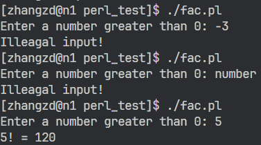
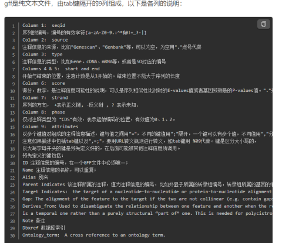
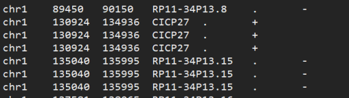

# Perl 基础考核

## 考核要求

1. 可以查阅书籍，不可以上网查询；
2. 考核时间4小时；
3. 需要提交结果及使用的命令或脚本；
4. 如果没有思路，可以提示，但不超过3次，且提示会扣分（2分/次），涉及到题目意思的问题不限次数且不扣分。
5. 70分为及格。


## 考核题目：

1. 写一个脚本，计算n的阶乘。（5分）
   要求根据输入的数，判断是否合法（只能输入自然数），不合法则输出提示信息，合法则输出结果；

   ```perl
   #!/usr/bin/perl
   
   sub fac {
   	my $num = $_[0];
   	if (($num =~ /\D+/) or ($num < 0)) {
           print("Illeagal input!\n");
           exit;
       } elsif ($num == 1) {
   		return 1;
   	} else {
   		return ($num * fac($num - 1));
   	}
   }
   
   print("Enter a number greater than 0: ");
   chomp($num = <STDIN>);
   print("$num! = ", fac($num), "\n");
   ```

   

2. 写一个脚本，根据基因ID列表（数目100），在表达量总表中提取出各样本中此基因的表达量。（10分）
   ```perl
   #!/usr/bin/perl
   
   my $geneIdFile = 'gene_ID.txt';
   my $expFile = 'expressed_gene_FPKM.txt';
   
   my $outputFile = 'extractedExpData.txt';
   open(my $geneId, '<', $geneIdFile) or die "Cannot open gene list!";
   open(my $expData, '<', $expFile) or die "Cannot open expression file!";
   open(my $output, '>', $outputFile) or die "Cannot open output file!";
   
   # save gene id into hash map
   my %genes;
   while (my $line = <$geneId>) {
       chomp $line;
       $genes{$line} = 1;
   }
   
   # write header
   my $header = <$expData>;
   print $output $header;
   # write data line
   while (my $line = <$expData>) {
       chomp $line;
       my @data = split(/\t/, $line); 
       my $gene_id = $data[0];
       if (exists $genes{$gene_id}) {
           print $output (join("\t", @data), "\n");
       }
   }
   
   close $geneId;
   close $expData;
   close $output;
   ```

   

3. 写一个命令行根据基因Symbol列表（数目100），在表达量总表中提取出各样本中此基因的表达量，把Symbol这一列放第一列，同时去掉 Chromosome	Genetype	Description 后3列。（10分）
   ```perl
   #!/usr/bin/perl
   
   my $geneSymbolFile = 'gene_Symbol.txt'; 
   my $expDataFile = 'expressed_gene_FPKM.txt'; # 表达量总表文件
   my $outputFilePath = 'extracted_expression_data_by_symbol.txt'; # 提取的表达量数据输出文件
   
   open my $geneSymbols, '<', $geneSymbolFile or die "Cannot open gene symbol list!";
   open my $expData, '<', $expDataFile or die "Cannot open expression data!";
   open my $outputFile, '>', $outputFilePath or die "Cannot open output file!";
   
   # save gene symbol into hash map
   my %genesSymbol;
   while (my $line = <$geneSymbols>) {
       chomp $line;    
       $genesSymbol{$line} = 1;
   }
   
   # save exp file field into array
   my $headerLine = <$expData>;
   chomp $headerLine;
   my @headerColumns = split(/\t/, $headerLine);
   
   
   # find Symbol col
   my $symbolIndex = -1;
   foreach my $index (0 .. $#headerColumns) {
       if ('Symbol' eq $headerColumns[$index]) {
           $symbolIndex = $index;
           last;
       }
   }
   
   # write header, trim last 3 col
   my @outputHeaders = ('Symbol', @headerColumns[1 .. $#headerColumns - 4]);
   $header = join ("\t", @outputHeaders);
   print $outputFile "$header\n";
   
   # write data line
   while (my $line = <$expData>) {
       chomp $line;    
       my @data = split(/\t/, $line);
       my $symbol = $data[$symbolIndex];
       if (exists $genesSymbol{$symbol}) {             
           my @outputData = ($symbol);
           for (my $i = 1; $i < 12; $i++) {
               push(@outputData, $data[$i]);
           }
           my $write = join ("\t", @outputData);
           print $outputFile "$write\n";
       }
   }
   
   close $geneSymbols;
   close $expData;
   close $outputFile;
   ```

   

4. 信息提取：写一个命令行（15分）：
   在附件文件中根据第一列 ID 提取每个样本的ratio同时去掉含有-的行
   格式如下：注意第一列格式为 ID_ Symbol

   ```perl
   #!/usr/bin/perl
   
   use warnings;
   use strict;
   
   open(my $CO, "<", "all_available_AS_NIR_events_co.txt") or die "Cannot open file!";
   open(my $OUT, ">", "out.txt") or die "Cannot open fiel!";
   
   my $headerLine = <$CO>;
   chomp $headerLine;
   my @headers = split(/\t/, $headerLine);
   
   
   # find symbol index
   my $symbolIndex = -1;
   foreach my $index (0 .. $#headers) {
       if ("Symbol" eq $headers[$index]) {
           $symbolIndex = $index;
           last;
       }
   }
   
   # find ratio col index
   my @ratioIndex = ();
   foreach my $index (0 .. $#headers) {
       if ($headers[$index] =~ /Ratio/) {
           push(@ratioIndex, $index);
       }
   }
   
   for(my $i = 0; $i < $#ratioIndex; $i++){
       print("$ratioIndex[$i]\n");
   }
   
   my @writeHeader = ("#ID_symbol");
   for (my $i = 0; $i <= $#ratioIndex; $i++) {
       push(@writeHeader, $headers[$ratioIndex[$i]]);
   }
   print $OUT join("\t", "@writeHeader\n");
   
   while (my $line = <$CO>) {
       chomp $line;
       # skip -
       if ($line !~ /-/) {
           my @data = split(/\t/, $line);
           my @write = ("$data[0]_$data[$symbolIndex]");
           for (my $i = 0; $i <= $#ratioIndex; $i++) {
               push(@write, $data[$ratioIndex[$i]]);
           }
           print $OUT join("\t", "@write\n");
       }
   }
   
   close($CO);
   close($OUT);
   ```

   写一个脚本（15分）：
   上述有了结果后，Th0 样本的 ratio 的平均值和 Th17 样本的 ratio 相减的差值添加到最后一列输出到一个文件，再根据此文件再输出差值 >=0.1 的输出一个文件

   

5. 命令行或脚本：将 fastq 文件中的 2 端 reads 序列反向并且互补，质量序列反向，最终结果输出到新文件中；（5分）
   fastq 文件格式

   + 第一行：记录测序时，序列的坐标信息

   + 第二行：测序得到的序列信息（分ATCGN5种情况，N代表不确定碱基类型）

   + 第三行：以 “+” 开始，可以储存一些附加信息

   + 第四行：以ASCII码形式储存碱基的质量信息（与第二行的碱基序列一一对应）
     只需要关注第二行和第四行
     
     ```perl
     #!/usr/bin/perl
     
     open(END, "<", "test_end2.fq") or die "Cannot open file!";
     open(REV, ">", "test_end1.fq") or die "Cannot open file!";
     
     while (<END>) {
         if ($. % 4 == 2) { # base
             chomp(my $read = $_);
             my $revRead = reverse($read);
             $revRead =~ tr/ATCGatcg/TAGCtagc/;
             print REV "$revRead\n";
         } elsif ($. % 4 == 0) { # score
             chomp($score = $_);
             my $revScore = reverse($score);
             print REV "$revScore\n";
         } else {
             print REV $_;
         }
     }
     
     close(END);
     close(REV);
     ```
     
     

6. 写一个脚本：统计上题反向互补后的 fastq 中 reads 的各碱基（ATCG）及 N 含量，将统计结果输出到新文件中；（10分）
   统计 A 有多少，T 有多少，C 有多少，G 有多少
   最终输出的文件格式：

       #base    Number
       A	1	
       T	1
       C	1
       G	1
       N	1

   ```perl
   #!/usr/bin/perl
   
   open(REV, "<", "test_end1.fq") or die "Cannot open file!";
   open(BASECOUNT, ">", "end1BaseCount.txt") or die "Cannot open file!";
   
   my %baseCount = (
       "A" => 0,
       "T" => 0,
       "G" => 0,
       "C" => 0,
       "N" => 0
   );
   
   while (<REV>) {
       if (($. % 4) == 2){
           chomp;
           for my $base (split(//, $_)) {
               if (exists $baseCount{$base}) {
                   $baseCount{$base}++;
               } else {
                   $baseCount{"N"}++;
               }
           } 
       }
   }
   
   print BASECOUNT "#base\tnumber\n";
   foreach my $key (keys %baseCount) {
       print BASECOUNT "$key\t$baseCount{$key}\n";
   }
   
   close(REV);
   close(BASECOUNT);
   ```

   输出：

   ```
   [zhangzd@n1 05]$ cat end1BaseCount.txt 
   #base   number
   A       33335
   T       31764
   N       0
   C       38034
   G       38163
   ```

7. 写一个脚本：把基因组 gff 文件转换成 bed 文件（5分）
   Human 的 gff 文件：

   
   gff 文件说明：
   Bed 的文件说明：
   https://www.jianshu.com/p/9208c3b89e44
   转换后的 bed 文件：
   

   ```perl
   #!/usr/bin/perl
   
   open(GFF, "<", "gencode.v38_chr1_5000.gff3.txt") or die "Cannot open file!";
   open(BED, ">", "gencode.v38_chr1_5000.bed") or die "Cannot open file!";
   
   @bedHeader = (
       "chrom",        # 染色体名称 fixed: chr1
       "chromStart",   # 染色体或支架中特征的起始位置。染色体中的第一个碱基编号为 0。
       "chromEnd",     # 染色体或支架中特征的结束位置。
       "name",         # 定义 BED 行的名称
       "score",        # 得分在 0 到 1000 之间 fixed: .
       "strand"        # 定义 strand， . + -
   );
   $header = join("\t", @bedHeader);
   # write header
   print BED "$header\n";
   
   while (<GFF>) {
       if ($. > 1) {
           chomp;
           (
               $seqid,     # chrom
               $source, 
               $type,
               $start,     # chromStart
               $end,       # chromEnd
               $score,     # score
               $strand,    # strand
               $phase,     
               $attributes # gene_name=<> -> name
           ) = split("\t", $_);
   
           # capture name gene_name=[\w-]+;
           $attributes =~ m/gene_name=(?<geneName>[\w-\.]+);/;
   
           # write data
           $line = join("\t", ($seqid, $start, $end, $+{geneName}, $score, $strand));
           print BED "$line\n";
       }
   }
   
   close(GFF);
   close(BED);
   ```

   

8. 写一个脚本(5分)：
   这是差异表达量 `deg_genes_fpkm_of_all_samples_in_deg.txt`，筛选出 90% 以上的样本的表达量 >=1 基因数目，90% 以上的样本表达量 >=0.5 的基因数目，90% 以上的样本表达量 >=0.2 的基因数目。
   最后输出文件格式参考：

   ```	
   #90%DElncRNA_filter_parameter	 Number
   0.2 55  18
   0.5 23  12
   1   15  8
   ```

   ```perl
   #!/usr/bin/perl
   
   use strict;
   use warnings;
   
   my $inputFile = "deg_genes_fpkm_of_all_samples_in_deg.txt";
   my $outputFile = "output.txt";
   
   open(INFILE, "<", $inputFile) or die "Could not open input file: $!";
   open(OUTFILE, ">", $outputFile) or die "Could not open output file: $!";
   
   my $minSamples = 0.9;
   my $minExpr1 = 1;
   my $minExpr2 = 0.5;
   my $minExpr3 = 0.2;
   
   my $headerLine = <INFILE>;
   
   my $countGenesExpr1 = 0; 
   my $countGenesExpr2 = 0; 
   my $countGenesExpr3 = 0; 
   
   while (my $line = <INFILE>) {
       chomp $line;
       my @fields = split("\t", $line);
   
       my $gene = $fields[0];
       my @expressions = @fields[1..$#fields];
   
       my $numSamplesExpr1 = 0;
       my $numSamplesExpr2 = 0;
       my $numSamplesExpr3 = 0;
   
       foreach my $expr (@expressions) {
           if ($expr >= $minExpr1) {
               $numSamplesExpr1++;
           }
   
           if ($expr >= $minExpr2) {
               $numSamplesExpr2++;
           }
   
           if ($expr >= $minExpr3) {
               $numSamplesExpr3++;
           }
       }
   
       if ($numSamplesExpr1 / $#expressions >= $minSamples) {
           $countGenesExpr1++;
       }
   
       if ($numSamplesExpr2 / $#expressions >= $minSamples) {
           $countGenesExpr2++;
       }
   
       if ($numSamplesExpr3 / $#expressions >= $minSamples) {
           $countGenesExpr3++;
       }
   }
   
   print OUTFILE "#90PercentDElncRNAFilterParameter\tNumber\n";
   print OUTFILE "0.2\t$countGenesExpr1\t$countGenesExpr2\n";
   print OUTFILE "0.5\t$countGenesExpr2\t$countGenesExpr3\n";
   print OUTFILE "1\t$countGenesExpr3\t$countGenesExpr1\n";
   
   close INFILE;
   close OUTFILE;
   ```
   
   
   
9. 统计 *Sig_DEG_cell_type_c0.5_p0.01.txt 每组中的每个细胞的基因数量（10分）
   输出格式：

   ```
   Type	MP_vs_MA	MA_vs_YC	SP_vs_YC	SP_vs_MP	SP_vs_MA	MP_vs_YC
   Monocytes	13	1	7	0	54	1
   ```

   ```perl
   #!/usr/bin/perl
   
   use strict;
   use warnings;
   
   my %gene_count;
   my @file_tags = qw(MP_vs_MA MA_vs_YC SP_vs_YC SP_vs_MP MP_vs_YC SP_vs_MA);
   
   foreach my $file (glob "*Sig_DEG_cell_type_c0.5_p0.01.txt") {
       open my $IN, '<', $file or die "Cannot open file '$file': $!";
       while (my $line = <$IN>) {
           chomp $line;
           my ($cell_type, $gene, $value1, $value2) = split /\t/, $line;
           if (exists $gene_count{$cell_type}) {
               $gene_count{$cell_type}++;
           } else {
               $gene_count{$cell_type} = 1;
           }
       }
       close $IN;
   }
   
   open my $OUT, '>:encoding(UTF-8)', 'output.txt' or die "Cannot open file 'output.txt': $!";
   
   print $OUT "Type\t" . (join "\t", @file_tags) . "\n";
   foreach my $cell_type (sort keys %gene_count) {
       print $OUT $cell_type . "\t";
       foreach my $file_tag (@file_tags) {
           my $count = $gene_count{$cell_type} // 0;
           print $OUT $count . "\t";
       }
       print $OUT "\n";
   }
   
   close $OUT;
   ```
   
   
   
10. 根据通路基因：goterm_symbol.txt，找到每个细胞上对应的基因的相关性系数DEG_cor_cell_type_c0.5_p0.01_ttest_0.05.txt(第三列是相关性系数)（10分）
    输出格式：

    ```
    Term    Gene    T cells follicular helper       Monocytes       Macrophages M2  Macrophages M0
    cell differentiation    Caprin1 0       0       0       0.5299146664032
    cell differentiation    Cav1    0       0       0       0.576299507156627
    cell differentiation    Fgf16   0.505747027221823       0       0       -0.595172036989326
    cell differentiation    Fgf23   0       0       0       -0.505423671903459
    cell differentiation    Fli1    0       0       0       -0.527742041559994
    cell differentiation    Mdfi    0       0       0       -0.547605635286485
    cell differentiation    Notch3  0       0       0       -0.50679258216516
    cell differentiation    Nsun2   0       0       0       0.567042435721529
    cell differentiation    Pik3cd  0       -0.590958292053976      0       -0.505780092789869
    cell differentiation    Sh2b3   0       0       0       -0.551137353267428
    cell differentiation    Thrb    0       0       0       -0.516377664704311
    immune response Ccl12   0.58754591155344        0       0       0
    ```

    这是第10题，第一列是通路，第二列是基因，接下来是细胞，如果这个基因的细胞有相关性系数，就有值，没有就是0
    
    ```perl
    #!/usr/bin/perl
    
    use strict;
    use warnings;
    
    open(my $termsFile, '<', 'goterm_symbol.txt') or die "Could not open goterm_symbol.txt: $!";
    
    my %pathways;
    while (<$termsFile>) {
        chomp;
        my @fields = split(/\t/);
        push @{$pathways{$fields[0]}}, $fields[1];
    }
    
    open(my $degCorrelationFile, '<', 'DEG_cor_cell_type_c0.5_p0.01_ttest_0.05.txt') or die "Could not open DEG_cor_cell_type_c0.5_p0.01_ttest_0.05.txt: $!";
    open(my $outputFile, '>', 'pathway_correlations.txt') or die "Could not open pathway_correlations.txt: $!";
    
    print $outputFile "CellType\tGene\tCorrelation\tPathway\n";
    
    readline($degCorrelationFile);
    
    while (<$degCorrelationFile>) {
        chomp;
        my @fields = split(/\t/);
        my $cellType = $fields[0];
        my $gene = $fields[1];
        my $correlation = $fields[2];
    
        foreach my $pathway (keys %pathways) {
            if (grep { $_ eq $gene } @{$pathways{$pathway}}) {
                print $outputFile "$cellType\t$gene\t$correlation\t$pathway\n";
            }
        }
    }
    
    close $termsFile;
    close $degCorrelationFile;
    close $outputFile;
    ```
    
    

