[TOC]

## Biochemistry

The study of structures, properties, metabolism, & functions of compounds found in living organisms, e.g. proteins, carbohydrates, lipids, nucleic acids, etc. 

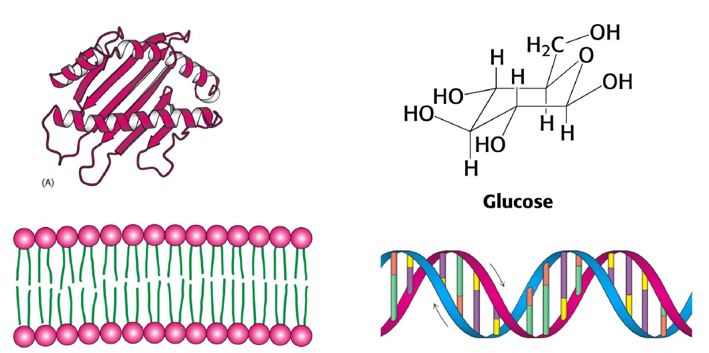

## Lives come with diverse forms, but organisms are remarkably uniform at the molecular level 

+   The diverse living organisms can be divided into three domains 
    +   Eukarya (Eukaryotes)
    2)	Bacteria (Eubacteria)
    3)	Archaea (Archaebacteria)

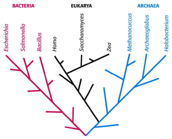

### Diverse living organisms share common features:

+   The same the genetic codons (DNA, RNA);
+   Possessing the same component units (e.g. nucleotides, amino acids, fatty acids, monosaccharides);
+   Make similar compounds through similar metabolic pathways.

# The Chemical Elements of Life

+   Only six nonmetallic elements: oxygen, carbon, hydrogen, nitrogen, phosphorous, and sulfur account for $>97\%$ of the weight of most organisms.
+   These elements can form stable covalent bonds.
+   Water is a major component of cells.
+   Carbon is more abundant in living organisms than it is in the rest of the universe.

```mermaid
graph LR
	A[Biochemical Substances]
	A --- B[Bioinorganic Substances<br>Substances that do not contain carbon]
	B --- C[Water<br>about 70%]
	B --- D[Inorganic Salts<br>about 5%]
	A --- E[Bioogranic Substances<br>Substances that contain carbon]
	E --- F[Proteins<br>about 15%]
	E --- G[Lipids<br>about 8%]
	E --- H[Carbonhydrates<br>about 2%]
	E --- I[Nucleic Acids<br>about 2%]
	
```

## Many important biomolecules are polymers

+   Biopolymers - macromolecules created by joining many smaller organic molecules (monomers). 
+   Condensation reactions join monomers ($H_2O$ is removed in the process)
+   Residue - each monomer in a chain.

### Structural hierarchy in the molecular organization of  cells

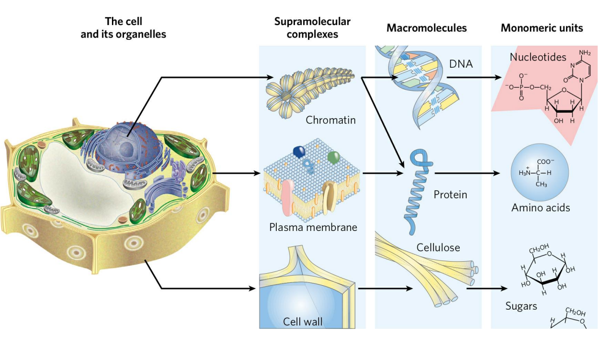

### Building blocks (monomers) for macromolecules 

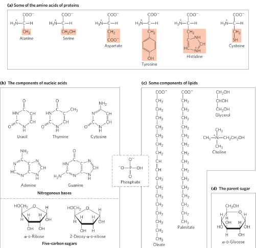

## Chemical bond and molecular interaction of biomolecules

Chemical bonds and forces for molecular interaction: 

1.   Covalent bond
2)	Electrostatic interactions
3)	Hydrogen bonds
4)	van der Waals forces
5)	Hydrophobic effect/interaction

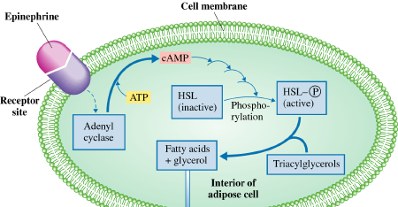

### They differ in geometry, strength, and specificity.

#### Covalent bonds

+   $1.5~Å$ in distance ($C-C$) 
+   $85.4 ~kcal/mol$ in energy 

#### Electrostatic interactions

+   $3 ~Å$ in distance  
+   $1.4 ~kcal/mol$  in energy between positively & negative charged atoms 
+   Hydrogen bonds  $2.4-3.5~Å$ in distance   
+   $1-3 kcal/mol$ in energy between the partial positive charge of H & the partial negative charge of $O, N$ 

#### van der Waals forces

+   $0.5-1 ~kcal/mol$ in energy 
+   Electrostatic interaction among permanent or induced dipoles, and London dispersion forces 

#### Hydrophobic effect

+   Nonpolar molecules have a tendency to aggregate in water to minimize their contact with water. 

---

>   Cal = calorie = 4.184 joule (J),  heat, energy 

### Covalent bond  and ionic bond are chemical bonds. 

The force of attraction between the two atoms when two atoms are joined together to form a chemical compound. 

+   Two types of chemical bonds
    1.   Ionic bond - an electron transfer process occurring before bond formation held together by electrostatic force interaction between metal and nonmetal found in many inorganic compounds   e.g. NaCl
    2.   Covalent bond - electrons are shared between atoms in the bonding process form between atoms with similar ability to gain or lose electrons found in organic compounds.
         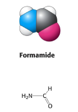
         +   Single bond (saturated): one pair of electrons is shared.
         +   Double bond (unsaturated): two pairs of electrons are shared.
         +   Triple bond (unsaturated): three pairs of electrons are share
    3.   Hydrogen bonds:
         Between the partial positive charge of $H$ & the partial negative charge of $O, N$. 
         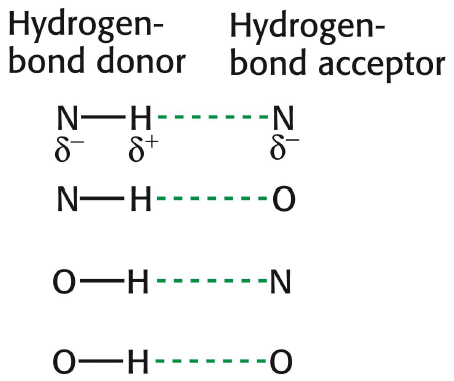
         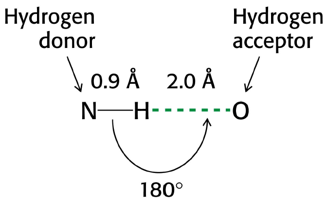
         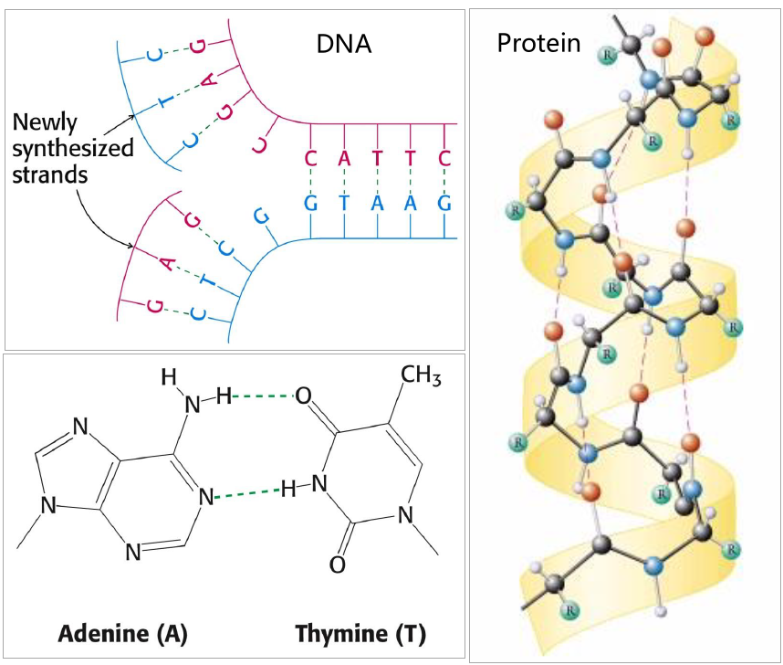
    4.   Van der Waals forces
         +   Electrostatic interaction among permanent or induced dipoles, and London dispersion forces. 
         +   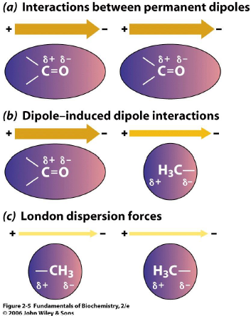
         +   London dispersion force: attraction resulting from transient dipoles (Erratic motions of electron cause uneven distributions of electrical charges within the molecules at any given time ) 
    5.   Hydrophobic effect
         +   Nonpolar molecules have a tendency to aggregate in water to minimize their contact with water. 
         +   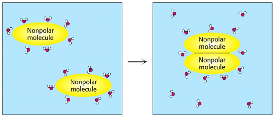
         +   The aggregation maximize the entropy of the entire system 
             +   Which one is: 
                 +   Electrostatic interaction 
                 +   Hydrogen bonding 
                 +   Covalent Interaction 
                 +   van der Waals force Hydrophobic effect 
             +   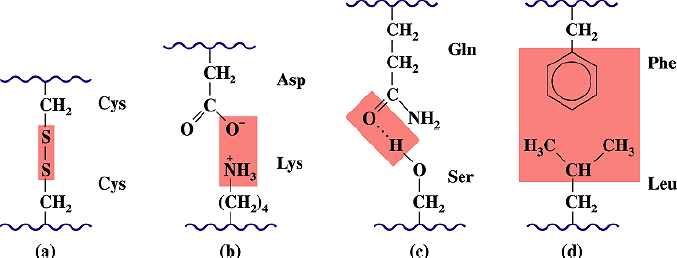

