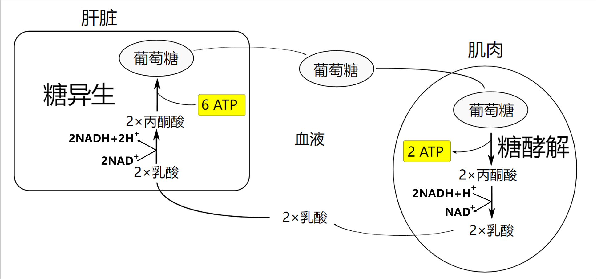
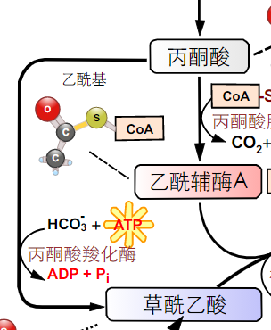

[toc]

# 名词解释

## 糖酵解

糖酵解（英语：glycolysis，又称糖解）是把葡萄糖（$C_6H_{12}O_{6}$）转化成丙酮酸（$CH3COCOO^− ~+~H^+$）同时产生少量 ATP 的代谢途径。糖酵解作用是动物, 植物, 微生物细胞葡萄糖分解产生能量的共同代谢途径. 

.svg)

## 糖的有氧氧化

糖的有氧氧化指葡萄糖或糖原在有氧条件下, 经过糖酵解, 三羧酸循环和呼吸链氧化成为 $CO_2$ 和 $H_2O$ 并产生大量 ATP 的过程. 是糖氧化的主要方式. 

## 柠檬酸循环

由乙酰 CoA 与草酰乙酸缩合成含三个羧基的柠檬酸开始, 经反复脱氢, 脱羧再生成草酰乙酸的循环反应过程称为柠檬酸循环, 又称三羧酸循环或 Krebs 循环.

## 巴斯德效应

巴斯德效应指有氧氧化抑制生物发酵的过程.

## 活性葡萄糖

在葡萄糖合成糖原的过程中, UDPG 中的葡萄糖基.

## 磷酸戊糖途径

磷酸戊糖途径指机体某些组织（如肝、脂肪组织等）以 6 - 磷酸葡萄糖为起始物在 6- 磷酸葡萄糖脱氢酶催化下形成 6 - 磷酸葡萄糖酸进而代谢生成磷酸戊糖为中间代谢物的过程，又称为磷酸已糖支路。

.svg.png)

.svg)

## 糖异生

。糖异生指非糖 (如丙酮 乳酸 甘油 生糖氨基酸等)转为葡萄糖或糖原的过程. 机体内只有肝能通过糖异生补充血糖

糖异生途径.svg)

## Cori 循环

乳酸循环是指肌肉收缩时(尤其缺氧), 产生大量乳酸, 部分乳酸随尿排出, 大部分经血液运到肝脏, 通过糖异生作用合成肝糖原或葡萄糖补充血糖, 血糖可再被肌肉利用, 这样形成的循环(肌肉$\to$肝脏$\to$肌肉)称乳酸内循环或 Cori 循环.

.svg)

## 别构调节

别构调节指某些调节物能与酶的调节部位以次级键结合, 使酶分子的构象发生改变, 从而改变酶的活性, 称酶的变构调节.

## 共价修饰调节

共价修饰调节指一种酶在另一种酶的催化下, 通过共价键结合或移去某种基团, 从而改变酶的活性, 由此实现对代谢的快速调节, 称为共价修饰调节。

## 底物水平磷酸化

底物水平磷酶化指底物在脱氢或脱水时分子内能量重新分布形成的高能磷酸根直接转移给 ADP 生成 ATP 的方式称为底物水平磷酸化.

# 填空题

1.   糖酵解途径的反应全部在细胞 **<u>胞液</u>** 进行。
2.   酵解途径唯一的脱氢反应是 <u>**$3-$ 磷酸甘油醛氧化为 ${1,3-}$二磷酸甘油酸**</u> 脱下的氢由 $ NAD^+$ 递氢体接受。
3.   酵解途径中最重要的关键酶(调节点) <u>**磷酸果糖激酶**</u> 
4.   乳酸脱氢酶在体内有 5 种同工酶, 其中肌肉中的乳酸脱氢酶对 **<u>丙酮酸</u>** 亲和力特别高, 主要催化 **<u>丙酮酸 $\to$ 乳酸</u>** 反应。
5.   丙酮酸脱氢酶系包括 **<u>丙酮酸脱羧酶, 硫辛酸乙酰转移酶, 二氢硫辛酸脱氢酶</u>** 三种酶和 <u>**6**</u> 种辅助因子。
6.   丙酮酸脱氢酶系位于 **<u>线粒体内膜</u>** 上，它所催化的丙酮酸氧化脱羧是葡萄糖代谢中第一个产生 $\underline{CO_2}$ 的反应
7.   丙酮酸脱氢酶系受 **<u>产物抑制, 能荷调控, 可逆磷酸作用的共价调节</u>** 三种调节控制。
8.   TCA 循环的第一个产物是 **<u>柠檬酸</u>**. 由 **<u>柠檬酸合酶, 异柠檬酸脱氢酶, $\alpha-$ 酮戊二酸脱氢酶系</u>** 所催化的反应是该循环的主要限速反应。
9.   TCA 循环中有二次脱羧反应，分别是由 **<u>异柠檬酸脱氢酶, $\alpha-$ 酮戊二酸脱氢酶系</u>** 催化。脱去的 $CO_2$ 中的 $C$ 原子分别来自于草酰乙酸中的 $\underline{C_1}$ 和 $\underline{C_4}$
10.   将乙酰 CoA 的二个 C 原子用同位素标记，经一轮 TCA 循环后，这两个同位素 C 原子的去向是 **<u>草酰乙酸</u>**. 二轮循环后这两个同位素 C 原子的去向是 $CO_2$ <u>**和草酰乙酸**</u>
11.   TCA 循环中大多数酶位于 **<u>线粒体基质</u>** 只有 <u>**琥珀酸脱氢酶**</u> 位于线粒体内膜
12.   葡萄糖的无氧分解只能产生 $\underline{2}$ 分子 ATP, 而有氧分解可以产生 $\underline{30\sim32}$ 分子ATP.
13.   乙醛酸循环中不同于 TCA 循环的两个关键酶是 <u>**异柠檬酸裂解酶**</u> 和 **<u>苹果酸合成酶</u>** 
14.   磷酸戊糖途径的生理意义是生成 $\underline{NADPH+H^+}$ 和 <u>**5-磷酸戊糖**</u>
15.   以乙酰 CoA 为原料可合成的化合物有 <u>**脂肪酸, 胆固醇, 酮体**</u> 等
16.   糖异生主要在 <u>**肝脏**</u> 中进行，饥饿或酸中毒等病理条件下 **<u>肾脏</u>** 也可以进行糖异生
17.   糖异生的关键酶是 <u>**丙酮酸羧化酶, 磷酸甘油酸激酶, 果糖1,6-二磷酸酶**</u> 
18.   糖异生的第一步必须在线粒体内进行, 因为 <u>**丙酮酸羧化酶**</u> 只存在于线粒体内
19.   在外周组织中, 葡萄糖转变为乳酸, 乳酸经血液循环到肝脏, 经糖原异生再转变为葡萄糖, 这个过程称为 <u>**Cori**</u> 循环，该循环净效应是 **<u>消耗</u>** 能量的。
20.   磷酸果糖激酶和果糖 $1,6-$二磷酸酶同时作用就会产生 <u>**无效**</u> 循环
21.   无效循环的主要生理意义在于 <u>**产热**</u> 和 <u>**扩大调控**</u>
22.   肌肉不能直接补充血糖的主要原因是缺乏 <u>**葡萄糖-6-磷酸酶**</u>
23.   合成反应过程中需要引物的代谢有 <u>**糖原**</u> 合成 和 <u>**DNA**</u> 合成。
24.   糖原合成的关键酶是<u>**糖原合成酶**</u>, 糖原分解的关键酶是 **<u>磷酸化酶</u>**
25.   体内糖原降解选用 <u>**磷酸解**</u> 方式切断 $\alpha-1, 4-$糖苷键, 选用 <u>**水解**</u> 方式切断 $\alpha-1,6-$糖苷键. 对应的酶分别是 <u>**糖原磷酸化酶**</u> 和 <u>**脱支酶**</u> 
26.   糖酵解过程中基本上是单向的关键酶是 **<u>磷酸果糖激酶, 丙酮酸激酶</u>**
27.   糖原酵解过程中的第一个酶是 **<u>磷酸化酶</u>** , 它有 A 和 B 两种形式, 有活性是 **<u>A</u>** 形式, A 和 B 的差别在于 A 形式是 **<u>磷酸化</u>** 型。
28.   合成糖原的直接前体分子是<u>**UDPG**</u>, 糖原分解的初始产物是 **<u>1-磷酸葡萄糖</u>**
29.   生物体内各类物质有各自的代谢途径, 不同代谢途径可通过交叉点上的关键中间物而相互转化, 使各代谢途径得以沟通形成网络, 其中三个最关键的中间代谢物是 <u>**6-磷酸葡萄糖, 丙酮酸, 乙酰 CoA**</u> 
30.   糖的分解代谢为细胞提供的三种产物是 **<u>ATP, NADPH, 代谢中间物</u>**

# 选择题

1.   下列有关葡萄糖磷酸化的叙述中，错误的是：
     A.己糖激酶有四种同工酶
     B.己糖激酶催化葡萄糖转变成 6-磷酸葡萄糖
     **C.磷酸化后的葡萄糖能自由通过细胞膜**
     D.葡萄糖激酶只存在于肝脏和胰腺 B细胞
     
2.   $6-$ 磷酸果糖 $\to1,6- $二磷酸果糖，需要哪些条件？
     A.果糖二磷酸酶, $ATP$ 和 $Mg^{2+}$
     B.果糖二磷酸酶, $ADP,Pi$ 和 $Mg^{2+}$
     **C.磷酸果糖激酶, $ATP$ 和 $Mg^{2+}$**
     D.磷酸果糖激酶, $ADP, Pi$ 和 $Mg^{2+}$
     
3.   糖酵解的脱氢反应步骤是：
     A. $1, 6-$ 二磷酸果糖 $\longrightarrow3-$ 磷酸甘油醛 + 磷酸二羟丙酮
     B. $3-$ 磷酸甘油醛 $\longrightarrow$ 磷酸二羟丙酮
     **C. $3-$ 磷酸甘油醛 $\longrightarrow$ $1,3-$ 二磷酸甘油酸**
     D. $1, 3-$ 二磷酸甘油酸 $\longrightarrow$ $3-$ 磷酸甘油酸
     
4.   糖酵解过程中最重要的关键酶是：
     A.己糖激酶
     **B.磷酸果糖激酶**
     C.酮酸激酶
     D.磷酸甘油酸激酶
     
5.   磷酸果糖激酶最强的别构激活剂是：
     A. $1, 6-$ 二磷酸果糖
     B. $ADP$ 
     **C. $2, 6-$ 二磷酸果糖**
     D. $3-$ 磷酸甘油
     
6.   糖酵解中, 下列哪一个酶催化的反应不是限速反应
     A. 丙酮酸激酶
     B. 磷酸果糖激酶
     C. 己糖激酶
     **D. 磷酸丙糖异构酶**
     
7.   与糖酵解途径无关的酶是
     A. 烯醇化酶
     B. 醛缩酶
     C. 丙酮酸激酶
     **D. 磷酸烯醇式丙酮酸羧激酶**  催化草酰乙酸生成磷酸烯醇式丙酮酸, 消耗一个 GTP
     
8.   缺氧情况下，糖酵解途径生成的 $NADH+H^+$ 的去路
     A. 进入呼吸链氧化供应能量
     **B. 丙酮酸还原为乳酸**
     C. $3-$ 磷酸甘油酸还原为 $3-$ 磷酸甘油醛
     D. 经苹果酸穿梭系统进入线粒体氧化
     
9.   $ATP$ 对磷酸果糖激酶的作用
     A. 酶的底物
     B. 酶的抑制剂
     **C. 既是酶的底物同时又是酶的变构抑制剂**
     D.酶的变构激活剂
     
10.   磷酸果糖激酶最强的变构激活剂是
      A. ADP
      В. АТР
      **C. AMP **
      D. $6-$ 磷酸果糖
      
11.   以下说明中代表 $EMP$ 途径(糖酵解)特征的应该是
      **A. 在哺乳动物的肌肉中, 葡萄糖在无氧条件下转变成乳酸**
      B. 为使葡萄糖转变成二氧化碳和乙醇需要氧气
      C. 该途径依赖于氧的分压而进行
      D. 在有氧条件下，每摩尔葡萄糖通过该途径可净产生 $2$ 摩尔 $ATP$
      
      > 不需要氧气
      
12.   糖酵解时下列哪一对代谢物提供 $\sim P$ 使 $ADP$ 生成 $ATP$
      
      (高能磷酸化合物)
      **A. $1, 3-$ 二磷酸甘油酸 及 磷酸烯醇式丙酮酸**
      B. $1, 6-$ 二磷酸果糖 及 $1, 3-$ 二磷酸甘油酸
      C. $1-$ 磷酸葡萄糖 及 磷酸烯醇式丙酮酸
      D. $1, 3-$ 二磷酸甘油酸 及 $6-$ 磷酸葡萄糖
      
13.   底物水平磷酸化指
      A. $ATP$ 水解为 $ADP$ 和 $Pi$ 
      B. 呼吸链上 $H^+$ 传递过程中释放能量使 $ADP$ 磷酸化为 $ATP$ 分子 
      C. 使底物分子加上一个 $ATP$ 分子
      **D.底物分子的高能磷酸键经磷酸基团转移使 $ADP$ 磷酸化成为 $ATP$** 
      
14.   糖原中一个糖基转变为 $2$ 分子乳酸, 可净得几分子 $ATP$ 
      
      A.1     В.2     **C.3**     D.4 (消耗1个,产生4个)
      
15.   丙酮酸脱氢酶复合体中最终接受底物脱下的 $2H$ 的辅助因子是
      A. $FAD$ 
      B. 硫辛酸
      C. 辅酶 $A$
      **D. $NAD^+$**
      
      > 丙酮酸经丙酮酸脱氢酶复合体催化生成乙酰辅酶 A
      
16.   下列哪种物质缺乏可引起血液丙酮酸含量升高
      **A. 硫胺素**   B. 叶酸   C. 吡哆醛   D. $B_{12}$
      
17.   丙酮酸脱氢酶系受到哪些因素调控
      **A. 产物抑制、能荷调控、磷酸化共价调节**
      B. 产物抑制、能荷调控、酶的诱导
      C. 产物抑制、能荷调控
      D. 能荷调控、磷酸化共价调节、酶的诱导
      
18.   下列酶中与控制三羧酸循环速度有关的一种变构酶是
      A. 苹果酸脱氢酶
      **B. 异柠檬酸脱氢酶**
      C. 顺乌头酸酶
      D. 丙酮酸脱氢酶
      
19.   从糖原开始一摩尔葡萄糖经糖的有氧氧化可产生 $ATP$ 摩尔数为
      A. $12$   **B. $32-33$**   C. $32$   D. $33$
      
20.   三羧酸循环与电子传递链相偶联的反应过程中, 以下各反应中产生 $ATP$ 最多的是
      A. 异柠檬酸 $\longrightarrow\alpha-$ 酮戊二酸
      B. 琥珀酸 $\longrightarrow$ 苹果酸
      C. 苹果酸 $\longrightarrow$ 草酰乙酸
      **D. $\alpha-$ 酮戊二酸 $\longrightarrow$ 琥珀酸**
      
21.   $1$ 分子乙酰 CoA 经三羧酸循环氧化后的产物是
      A. 草酰乙酸 和 $CO_2$
      B. $CO_2+H_2O$
      **C. $2CO_2, 3NADH+H^+$ 和 $1FADH_2$**
      D. 草酰乙酸
      
22.   下列途径中哪个主要发生在线粒体中
      A. 糖酵解途径 (细胞质)
      **B. 三羧酸循环** (线粒体)
      C. 磷酸戊糖途径 (细胞质)
      D. 乙醛酸循环 (线粒体和植物乙醛酸循环体)
      
23.   下列化合物中除哪个外, 均可抑制三羧酸循环
      A. 亚砷酸盐 
      B. 丙二酸
      C. 氟乙酸
      **D. 乙酰 CoA**
      
24.   下列酶中不是作用于三羧酸循环的酶是
      A. 琥珀酸硫激酶
      **B. 丙酮酸脱羧酶** (属于丙酮酸脱氢酶系, 不直接参与 TCA)
      C. 顺乌头酸酶
      D. 延胡索酸酶
      
25.   $1$ 分子葡萄糖有氧氧化时共有几次底物水平磷酸化
      A. $3$    B. $4$    C. $5$    **D. $6$**
      
      > 糖酵解 $2 \times 2$ + TCA $1\times 2$
      
26.   有关乙醛酸循环的以下说明, 其中错误的是
      A. 这是在植物与微生物中存在的一条三羧酸循环的辅助途径
      B. 这是一条由脂肪酸转变成糖的重要途径
      C. 这条途径对以二碳物为唯一碳源的微生物生长是必需的
      **D. 可代替三羧酸循环将二碳物氧化生成二氧化碳和水, 供给机体能量**
      
27.   下列哪条途径与核酸合成密切相关
      A. 糖异生
      B. 乙醛酸循环
      C. 三羧酸酸循环
      **D. 磷酸戊糖途径**
      
28.   下列哪一种酶作用时需 $NADP^+$
      A. 磷酸已糖异构酶
      B. 磷酸果糖激雨
      C. $3-$ 磷酸甘油醛脱氢酶
      **D. $6-$ 磷酸葡萄糖脱氢酶**
      
29.   下列各中间产物中，哪一个是磷酸戊糖途径所特有的？
      **A. $6-$ 磷酸葡萄糖酸**
      B. 丙酮酸
      C. $3-$ 磷酸甘油醛
      D. $6-$ 磷酸果糖
      
30.   下列有关草酰乙酸的叙述中, 哪项是错误的
      A. 草酰乙酸是三羧酸循环的中间产物
      B. 在糖异生过程中, 草酰乙酸是在线粒体内产生的
      **C. 草酰乙酸可自由通过线粒体膜**
      D. 一部分草酰乙酸可在线粒体内转变成磷酸烯醇式丙酮酸
      
31.   不能经糖异生合成葡萄糖的物质是：
      A. $\alpha-$ 磷酸甘油    B. 丙酮酸    C. 乳酸    **D. 乙酰 CoA**
      
32.   在肝脏中二分子乳酸转变为一分子葡萄糖, 需要消耗几分子 $ATP$
      **A.$ 6$**   B. $3$   C. $4$   D. $5$
      
      
      
33.   丙酮酸羧化支路中的丙酮酸羧化酶, 需下列化合物中除哪个以外的所有辅助因子
      A. 生物素     B. $Mg^{2+}$    **C. 乙酰 CoA**    D.ATP
      
      
      
34.   丙酮酸羧化酶的活性依赖哪种变构激活剂
      A. ATP    B. AMP     **C. 乙酰 CoA**     D. 柠檬酸
      
35.   糖异生过程中哪一种酶代替糖酵解的己糖激酶
      A. 磷酸烯醇式丙酮酸羧激酶 
      B. 果糖二磷酸酶
      C. 丙酮酸羧化酶 
      **D. 葡萄糖$-6-$磷酸酶**
      
36.   有关乳酸循环的描述，何者是不正确的
      A. 肌肉产生的乳酸经血液循环至肝后糖异生为糖
      B. 乳酸循环的生理意义是避免乳酸损失和因乳酸过多引起的酸中毒
      C. 乳酸糖异生为葡萄糖后可补充血糖并在肌肉中糖酵解为乳酸
      **D. 乳酸在肝脏形成，在肌肉中经糖异生成为葡萄糖**
      
37.   下列酶中催化糖酵解与糖异生过程的共同酶是
      
      (催化可逆过程的酶)
      **A. $3-$磷酸甘油醛脱氢酶** 
      B. 磷酸果糖激酶
      C. 己糖激酶
      D. 丙酮酸激酶
      
38.   在糖异生过程中, 若用抗生物素蛋白处理鼠肝抽提物, 下列反应不能发生的是
      **A. 丙酮酸$-$草酰乙酸**
      B. 苹果酸$-$草酰乙酸
      C. 烯醇式丙酮酸$-$糖原 
      D. 丙酮酸$-$丙酮酸烯醇式
      
39.   在多糖和寡糖的生物合成中, 葡萄糖的活性形式是
      A. 葡萄糖$-$磷酸
      B. 葡萄糖$-6-$磷酸
      **C. 尿苷二磷酸葡萄糖** (UDPG)
      D. 葡萄呋喃糖
      
40.   糖原合成酶参与的反应是
      A. $G+G\longrightarrow G-G$
      B. $UDPG+G\longrightarrow G-G+UDP $
      C. $G+G_n\longrightarrow G_{n+1}$
      **D. $UDPG + G_n\longrightarrow G_{n+1}+UDP$**
      
41.   糖原合成酶催化形成的键是
      A. $\alpha-1, 6 -$ 糖苷键
      B. $\beta-1, 6-$ 糖苷键
      **C. $\alpha-1, 4-$ 糖苷键**
      D. $\beta-1, 4-$ 糖苷键
      
42.   从葡萄糖合成糖原时, 每增加一个葡萄糖残基需消耗几个高能磷酸键
      A. $1$    **B. $2$**    C. $3$   D. $4$
      
      > 形成 UDPG
      
43.   糖原分解中水解 $\alpha-1, 6-$ 糖苷键的酶是：
      A. 葡萄糖 4 磷酸酶
      B. 磷酸化酶
      C. 葡聚糖转移酶 
      **D. 脱支酶**
      
44.   糖原分解过程中磷酸化酶磷酸解的键是
      A. $\alpha-1,6-$糖苷键
      B. $\beta-1,6-$糖苷键
      **C. $\alpha-1,4-$糖苷键**
      D. $\beta-1,4-$糖苷键
      
45.   肌糖原不能直接补充血糖的原因是
      **A. 缺乏葡萄糖$-6-$磷酸酶**
      B. 缺乏磷酸化酶
      C. 缺乏脱支酶
      D. 缺乏已糖激酶

# 判断题

1. 糖酵解过程在有氧无氧条件下都能进行

2. 在缺氧条件下, 丙酮酸还原为乳酸的意义是使 $NAD^+$ 再生 

   

3. 无氧条件下, 糖酵解途径中脱氢反应产生的 $NADH+H ^+$ 交给丙酮酸生成乳酸, 有氧条件下, $NADH+H^+$ 则进入线粒体氧化

4. 糖酵解过程中, 因葡萄糖和果糖的活化都需要 ATP, 故 ATP 浓度高时, 糖酵解速度加快 错误

   + **糖酵解的结果是产生 ATP, 过量 ATP 会抑制糖酵解**

5. 碘乙酸或碘乙酰胺能与疏基不可逆结合, 故能抑制 $3-$磷酸甘油醉脱氢酶活性
   +   1-5 $TTTFT$

6. $1$ 摩尔葡萄糖经糖酵解途径生成乳酸, 需经 $1$ 次脱氢, $2$ 次底物水平磷酸化过程最终净生成 $2$ 摩尔 ATP

7. 剧烈运动后肌肉发酸是丙酮酸被还原为乳酸的结果

8. 在 EMP 途径中有两步产生 ATP 的反应均是氧化还原反应 错误

   + **仅有一个氧化还原反应(3-磷酸甘油醛脱氢生成1,3-二磷酸甘油酸, 不产生 ATP)**
   + **另外两步产生 ATP 的反应均是底物水平磷酸化**

9. 催化 ATP 分子中的磷酰基转移到受体上的酶称为激酶

10. 激酶需要 $Mg^{2+}$ 作为反应的激活剂
    +   6-10 $TTFTT$

11. 葡萄糖激酶对葡萄糖的专一性强, 亲和力高, 主要在肝脏用于糖原合成 错误

    + 参与糖酵解的第一步
    + 糖原合成相关酶:
      + 糖原合成酶 (1,4)
      + 糖原分支酶 (1,6)

12. **葡萄糖激酶不受 $G-6-P$ 负反馈抑制**

13. ATP 是磷酸果糖激酶的别构抑制剂

14. 肝脏磷酸果糖激酶还受到 $2,6-$二磷酸果糖的抑制 错误

    + 收到其激活, 最强的激活剂
    + **磷酸果糖激酶催化产物为 1,6-二磷酸果糖**

15. $\alpha-$磷酸甘油的去路之一是转变为磷酸二羟丙酮, 进入糖酵解代谢 (也可以生成甘油)
    +   11-15 $FTTFT$

16. 丙酮酸脱氢酶系催化底物脱下的氢, 最终交给 $FAD$ 生成 $FADH_2$ 错误

    + **高能电子/氢载体$NAD^+$ , 同时生成二氧化碳和乙酰辅酶 A**

17. 三羧酸循环是分解与合成的两用途径

18. 在三羧酸循环中由 $1~mol$ 异柠檬酸转变成 $1~mol$ 琥珀酸, 同时伴有相当于 $6~mol$ ATP的产生

    + 过程中生成 2 mol NADH 和 1 mol GTP, 相当于 5 mol ATP 和 1 mol ATP

19. 三羧酸循环不仅是各类有机物最终氧化分解的共同途径, 也是各类有机物相互转变的「联络机构」, 在一定条件下, 循环是可以逆转的 错误

    + **三羧酸循环不可逆**

20. 三羧酸循环是需氧途径, 还原型的辅助因子通过电子传递链而被氧化, 以使循环所需的载氢体再生
    +   16-20 $FTTFT$

21. 三羧酸循环被认为是需氧途径, 因为氧在循环中是一些反应的底物 错误

    + **氧气不参与 TCA**
    + **氧气在电子传递链上接受电子生成水**

22. 三羧酸循环提供大量能量是因为底物水平磷酸化直接生成 ATP 错误

    + **不直接产生 ATP**
    + **因为产生的氢载体在电子传递链生成 ATP**

23. 三羧酸循环的所有中间产物中, 只有草酰乙酸可以被该循环中的酶完全降解 错误

    + **所有中间产物都可以**

24. 三羧酸循环可以产生 $NADH+H^+$ 和 $FADH_2$, 但不直接产生 ATP 

25. 糖分解时单糖活化以磷酸化为主, 其次是酰基化
    +   21-25 $FFFTT$

26. 磷酸戊糖途径能产生 ATP, 可以代替三羧酸循环, 作为生物供能的主要途径 错误

    + **不能产生 ATP**
    + **磷酸戊糖途径的意义是产生 NADPH 和磷酸核糖**

27. $6-$ 磷酸葡萄糖是糖代谢中各个代谢途径的交叉点

28. 所有来自磷酸戊糖途径的还原能(NADPH)都是在该循环的前三步反应中产生的

29. 就葡萄糖降解成丙酮酸而净生成 ATP 数目来说, 糖原的水解将比糖原的磷酸解获得的 ATP 多

30. 在生物体内 NADH 和 NADPH 的生理生化作用是相同的
    +   26-30 $FTTTT$

31. 在有氧条件下, 柠檬酸能变构抑制磷酸果糖激酶

32. 糖原生物合成时, 新加入的葡萄糖残基以 $\alpha-1, 4-$糖苷键连在引物的非还原端

33. 沿糖酵解途径简单逆行, 可从丙酮酸等小分子前体物质合成葡萄糖 错误

    + **糖酵解有三个不可逆过程, 不能逆行**

34. 糖异生是克服糖酵解三个关键酶催化的不可逆反应的途径, 主要由两种磷酸酯酶和一种羧化酶催化

35. 动物体中乙酰 CoA 不能作为糖异生的原料
    +   31-35 $TTFTT$

36. 丙酮酸脱氢酶系中电子传递方向硫辛酸$\longrightarrow FAD\longrightarrow NAD^+$ 

37. 丙酮酸脱氢酶系中的酶 $1$, 即丙酮酸脱羧酶受磷酸化激活 错误

    + **丙酮酸脱氢酶激酶受磷酸化激活**

38. 乙醛酸循环作为 TCA 循环的变体, 广泛存在于动物, 植物和微生物体内 错误

    + **动物体内没有乙醛酸循环体**

39. 乙醛酸循环和 TCA 循环中都有琥珀酸的净生成 错误

    + **TCA 没有琥珀酸的净生成, 只是作为中间产物**

40. 肝和骨胳肌一般储存糖原, 当动用糖原供能时, 在磷酸存在下, 经磷酸化酶的作用, 首先形成 $6-$磷酸葡萄糖 错误

    + **首先形成 1-磷酸葡萄糖**

    1.   36-40 $TFFFF$

41. 肾上腺素能促进肝脏中肝糖原和骨骼肌中肌糖原的分解, 两者分解后都变成血糖 错误

    + **只有肝糖原能变成血糖**
    + **肌肉中缺少 6-磷酸葡萄糖酶, 不能产生葡萄糖**

42. 从产生能量的角度来考虑, 糖原水解为葡萄糖参加酵解比糖原磷酸解生成 $1-$磷酸葡萄糖更有效 错误

    + **前者是从糖酵解从头开始, 后者直接生成 6-磷酸葡萄糖参与糖酵解和 TCA**
    + **葡萄糖生成 6-磷酸葡萄糖还要多消耗一分子 ATP**
    + 详见简答题 17

43. 糖原合成酶和糖原磷酸化酶磷酸化后活性都升高 错误

    + **糖原合成酶磷酸化后失活**
    + **糖原磷酸化酶磷酸化后激活**

44. 单糖在形成多糖时, 均以二核苷酸方式活化为主, 但在分解时, 以单磷酸化为主

45. 多糖, 淀粉和糖原的合成过程相同
    +   41-45  $FFFTT$

# 简答题

1.   **何谓激酶? 催化葡萄糖磷酸化的激酶有己糖激酶和葡萄糖激酶, 这两种酶的作用特点和性质有什么不同?**
     
     +   在生物化学里，激酶（英文：kinase）是一种能够催化从高能供体分子（如ATP）转移磷酸基团到特定靶分子（底物）的酶；这一过程谓之磷酸化。
     +   己糖激酶和葡萄糖激酶之间的**主要区别**是己糖激酶是**所有细胞中存在的酶，而葡萄糖激酶是仅存在于肝脏中的酶** 。 此外，己糖激酶对葡萄糖具有高亲和力，而葡萄糖激酶对葡萄糖具有低亲和力。
     +   己糖激酶和葡萄糖激酶是在糖酵解过程中涉及将葡萄糖转化为6-磷酸葡萄糖的两种酶。

2.   **当砷酸在细胞中与 NAD 和 Pi 共同存在时, 磷酸果糖转变为磷酸烯醇式丙酮酸的总反应会有什么不同?  写出总反应式.**

     +   由于砷酸的存在, 阻碍 $3-$磷酸甘油醛的氧化与磷酸化的偶联反应, 使 $3-$磷酸甘油醛直接氧化为 $3-$磷酸甘油酸, 越过了底物水平的磷酸化反应, 所以没有 ATP 产生.

     +   $$
         F-1,6-P+2NAD^+\longrightarrow2PEP^+(磷酸烯醇式丙酮酸)+2NADH+2H^++2H_2O
         $$

3.   **葡萄糖的第二位碳用 $^{14}C$ 标记,在有氧情况下进行彻底降解. 问经过几轮三羧酸循环, 该同位素碳可作为 $CO_2$ 释放?**

     +   第二轮循环

4.   **丙酮酸羧化酶催化丙酮酸转变为草酰乙酸. 但是, 只有在乙酰 CoA 存在时,它才表现出较高的活性.  乙酰 CoA 的这种活化作用, 其生理意义何在?**

     +   当乙酰-CoA的生成速度大于它进入三羧酸循环的速度时，乙酰-CoA就会积累。积累的乙酰-CoA可以激活丙酮酸羧化酶，使丙酮酸直接转化为草酰乙酸。新合成的草酰乙酸可以进入三羧酸循环，也可以进入糖异生途径。当细胞内能荷较高时草酰乙酸主要进入糖异生途径，这样不断消耗丙酮酸，控制了乙酰-CoA的来源。当细胞能荷较低时，草酰乙酸进入三羧酸循环，草酰乙酸增多加快了乙酰-CoA进入三羧酸循环的速度。所以不管草酰乙酸的去向如何，最终效应都是使体内的乙酰-CoA趋于平衡

5.   **简述 $6-$磷酸葡萄糖的代谢途径及其在糖代谢中的重要作用.**

     +   $6-$磷酸葡萄糖的代谢途径
         1.   在葡萄糖$-6-$磷酸酶的作用下水解成葡萄糖.
         2.   机体需要能量时进入糖酵解, 生成乳酸或者进行有氧氧化生成 $CO_2$ 和 $H_2O$, 释放能量.
         3.   在磷酸葡萄糖异构酶的催化下转变成 $1-$磷酸葡萄糖, 合成糖原.
         4.   在 $6-$磷酸葡萄糖脱氢酶的作用下进入磷酸戊糖途径.
     +   $6-$磷酸葡萄糖是糖酵解, 有氧氧化, 磷酸戊糖途径以及糖原合成与分解途径的共同中间产物. 是各代谢途径的交叉点. 主要由代谢途径中关键酶活性的强弱来决定 $6-$磷酸葡萄糖的代谢去向.

6.   **何谓糖酵解? 糖异生与糖酵解代谢途径有哪些差异?**

     +   糖酵解指葡萄糖或糖原分解成丙酮酸并产生少量能量的过程.
     +   糖异生途径基本上是糖酵解的逆过程.
     +   糖酵解与糖异生的差别是
         1.   糖酵解过程的 $3$ 个关键酶由糖异生的 $4$ 个酶(其中有三个是关键酶)代替催化反应.
         2.   作用部位糖酵解全部在胞液中进行; 由于丙酮酸羧化酶存在于线粒体,因此糖异生作用是在胞液和线粒体进行.
         3.   能量转化
              +   $1$ 分子葡萄糖经酵解成 $2$ 分子丙酮酸, 净产 $2$ 分子ATP
              +   $2$ 分子丙酮酸经糖异生转变成 $1$ 分子葡萄糖, 需要消耗 $6$ 分子 ATP.

7.   **ATP 是磷酸果糖激酶的底物, 为什么 ATP浓度高, 反而会抑制磷酸果糖激酶?**

     +   磷酸果糖激酶是酵解途径中最关键的限速酶. 酵解途径是分解代谢, 总的效应是放能的, ATP 浓度高表明细胞内能荷较高, 因此抑制磷酸果糖激酶, 从而抑制酵解作用.

8.   **为什么说成熟红细胞的糖代谢特点是 $90\%$ 以上的糖进入糖酵解途径? 磷酸戊糖途径的主要生理意义是什么?** 

     +   成熟红细胞没有线粒体等亚细胞器, 故能量来源主要是糖酵解, 不消耗氧. 
     +   成熟红细胞中需要还原型递氢体提供足够的 NADPH 和 NADH, 使细胞内膜蛋白, 酶和 $Fe^{2+}$ 处于还原状态, 其中 NADH 可来源于糖酵解, NADPH 则来源于磷酸戊糖途径.

9. **柠檬酸循环中并无氧参加, 为什么说它是葡萄糖的有氧分解途径?**

   +   柠檬酸循环中,有几处反应是底物脱氢生成 $NADH+H ^+$ 和 $FADH_2,$ 如
       +   异柠檬酸 $\longrightarrow$ $\alpha-$酮戊二酸
       +   $\alpha-$酮戊二酸 $\longrightarrow$ 琥珀酰 CoA
       +   琥珀酸 $\longrightarrow$ 延胡索酸
       +   苹果酸→草酰乙酸
   +   $NADH+H ^+$ 和 $FADH_2$ 必须通过呼吸链使 $H^+$ 与氧结合生成水, 否则就会造成 $NADH+H^+$ 和 $FADH_2$ 的积累, 使柠檬酸循环的速度降低, 严重时完全停止.

10.   **为什么说三羧酸循环是糖, 脂肪和蛋白质三大物质代谢的共同通路?**

      +   三羧酸循环是乙酰 CoA 最终氧化生成 $CO_2$ 和 $H_2O$ 的途径. 糖, 甘油和脂肪酸都可以降解成为乙酰 CoA 最终进入三羧酸循环彻底分解. 蛋白质的降解产物氨基酸经脱氨基后转变成三羧酸循环的中间产物进入循环. 同时, 三羧酸循环的中间产物也可接受氨基而转变成非必需氨基酸. 所以, 三羧酸循环是三大物质代谢的共同通路.

11.   **假如细胞内无 $6-$磷酸果糖激酶存在, 葡萄糖可以通过哪种途径转变为丙酮酸? 写出反应顺序和总反应式**

      +   酵解过程中产生的 $6-$磷酸葡萄糖可通过磷酸戊糖途径生成 $3-$磷酸甘油醛, 后者经过糖酵解途径转变成丙酮酸.

      +   $$
          6-磷酸葡萄糖\stackrel{磷酸戊糖途径}{\longrightarrow}3-磷酸甘油醛\stackrel{酵解途径}{\longrightarrow}丙酮酸
          $$

12.   **请指出血糖的来源与去路. 为什么说肝脏是维持血糖浓度的重要器官?** 

      +   血糖的来源
          1.   食物经消化吸收的葡萄糖
          2.   肝糖原分解
          3.   糖异生
      +   血糖的去路
          1.   氧化供能
          2.   合成肝糖原, 肌糖原
          3.   转变成脂肪及某些非必需氨基酸
          4.   转变成其他糖类(如核糖等)物质
      +   肝脏有较强的糖原合成与分解的能力, 可以通过调节肝糖原的合成与分解而使血糖浓度维持恒定. 肝脏又是糖异生的主要场所. 因此, 肝脏是维持血糖浓度的重要器官.

13.   **为什么说肌糖原不能直接补充血糖? 请说说肌糖原是如何转变为血糖的.** 

      +   肌肉缺乏葡萄糖$-6-$磷酸酶. 肌糖原分解出 $6-$磷酸葡萄糖后, 经酵解途径转变成乳酸, 乳酸进入血液循环到肝脏, 在肝脏以乳酸为原料经糖异生作用合成为葡萄糖, 并释放入血补充血糖.

14.   **简述草酰乙酸在糖代谢中的重要作用**

      1.   草酰乙酸是三羧酸循环的起始物, 糖氧化产生的乙酰 CoA 必须首先与草酰乙酸缩合成柠檬酸, 才能彻底氧化.
      2.   草酰乙酸可作为糖异生的原料, 沿糖异生途径合成糖.
      3.   草酰乙酸是丙酮酸, 乳酸及生糖氨基酸等异生为糖时的中间产物,这些物质必须转变成草酰乙酸后再异生为糖.

15.   **叙述 ATP, AMP 和柠檬酸在糖酵解和三羧酸循环的代谢调节控制中的作用**

      +   ATP 在酵解过程中激活己糖激酶, 但是抑制磷酸果糖激酶和丙酮酸激酶, 在三羧酸循环过程中抑制复合体系中的丙酮酸脱羧酶, 柠檬酸合酶和异柠檬酸脱氢酶. 
      +   AMP在糖酵解过程中所起的作用和 ATP相反, 可激活磷酸果糖激酶和丙酮酸脱羧酶.
      +   柠檬酸在糖酵解中抑制磷酸果糖激酶.

16.   **假定在一细胞匀浆中, 糖酵解, 柠檬酸循环, 电子传递和氧化磷酸化均充分活跃, NADH 不需要穿梭作用即可进入电子传递链, 那么下列各化合物完全氧化时, 每分子能产生多少个 ATP?**

      1.   丙酮酸
           +   $12.5~ATP$
      2.   葡萄糖
           +   $32~ATP$
      3.   NADH
           +   $3~ATP$
      4.   $1, 6-$二磷酸果糖
           +   $40~ATP$

17.   **为什么糖原降解选用磷酸解, 而不是水解?**

      +   糖原磷酸解的产物为 $1-$磷酸葡萄糖, 水解的产物为葡萄糖. $1-$磷酸葡萄糖可以异构为 $6-$磷酸葡萄糖, 再进入糖酵解途径降解, 葡萄糖通过糖酵解途径降解时, 首先需要被激酶磷酸化生成6-磷酸葡萄糖, 这一步需要消耗 ATP, 因此糖原选择磷酸解可以避免第一步的耗能反应.

18.   **机体如何调节糖原的合成与分解使其有条不素的进行?**

      +   糖原的合成与分解是两条不同的代谢途径, 这有利于进行精细调节. 糖原合成与分解的关键酶分别是糖原合成酶与磷酸化酶. 机体的调节方式是通过同一信号使一个酶呈活性状态, 另一个酶呈非活性状态, 可以避免由于糖原分解, 合成两个途径同时进行造成 ATP的浪费.
      +   磷酸化酶有 $a,b$ 两型, 磷酸化酶 $a$ 是有活性的磷酸型, 磷酸化酶 $b$ 是无活性的去磷酸型. 磷酸化酶 $b$ 激酶催化磷酸化酶 $b$ 磷酸化而成为磷酸化酶 $a$. 蛋白磷酸酶则水解磷酸化酶 $a$ 的磷酸, 使其转变为磷酸化酶 $b$, 糖原合成酶亦有 $a,b$ 两型,不同的是糖原合成酶 $a$ 是有活性的去磷酸型, 糖原合成酶 $b$ 是无活性的磷酸型.
      +   胰高血糖素和肾上腺素能激活腺苷酸环化酶, 后者使 ATP 转变成CAMP, CAMP 激活蛋白激酶, 后者使糖原合成酶磷酸化成无活性的糖原合成酶 $b$. 该蛋白激酶可使磷酸化酶 $b$ 激酶磷酸化, 从而催化磷酸化酶 $b$ 磷酸化成为有活性的磷酸化酶 $a$, 结果糖原分解加强, 糖原合成受到抑制, 使血糖升高.

19.   **糖代谢与脂肪代谢是通过哪些反应联系起来的?**

      1.   酵解途径的中间产物磷酸二羟丙酮可转变为 $\alpha- $磷酸甘油, 作为脂肪合成中甘油的原料.
      2.   糖有氧氧化过程中产生的乙酰 CoA 是脂肪酸和酮体的合成原料.
      3.   脂肪酸分解产生的乙酰 CoA 最终进入三羧酸循环氧化.
      4.   酮体氧化产生的乙酰 CoA 最终进入三羧酸循环氧化.
      5.   甘油可以转变成磷酸二羟丙酮进入酵解和三羧酸循环彻底氧化分解供能.

20. **为什么说 $6-$磷酸葡萄糖是各个糖代谢途径的交叉点？**

    +   各种糖的氧化代谢, 包括糖酵解, 磷酸戊糖途径, 糖有氧氧化, 糖原合成和分解, 糖异生途径均有 $6-$磷酸葡萄糖中间产物生成.

21.   **已知有一系列酶反应, 这些反应将导致从丙酮酸到 $\alpha-$酮戊二酸的净合成. 该过程并没有净消耗物. 请写出这些酶反应顺序。**

      +   $$
          \begin{aligned}
          &\ce{丙酮酸 + HSCoA + NAD+->[丙酮酸脱氢酶系]乙酰~CoA + NADH +  H+ + CO2}\\
          &\ce{丙酮酸+CO_2 + ATP->[丙酮酸羧化酶]草酰乙酸 + ADP + Pi}\\
          &\ce{H2O +草酰乙酸+乙酰~CoA->[柠檬酸合酶]柠檬酸+HSCoA}\\
          &\ce{柠檬酸->[顺乌头酸酶]异柠檬酸}\\
          &\ce{异柠檬酸 + NAD+->[异柠檬酸脱氢酶]\alpha-酮戊二酸 + NADH + H+ + CO2}\\
          \\
          &总反应式:\\
          & 2丙酮酸+ATP+2NAD^++H_2O\longrightarrow\alpha-酮戊二酸+CO_2+ADP+Pi+2NADH+2H^+
          \end{aligned}
          $$

