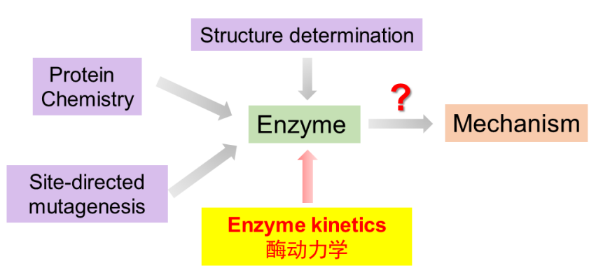
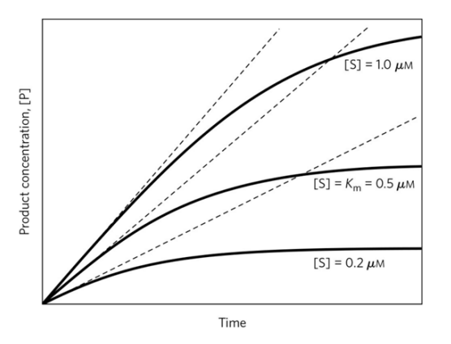
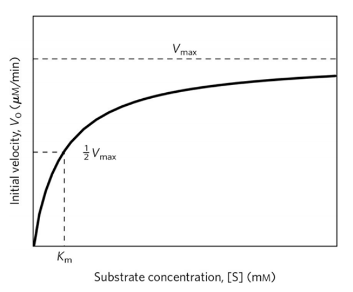
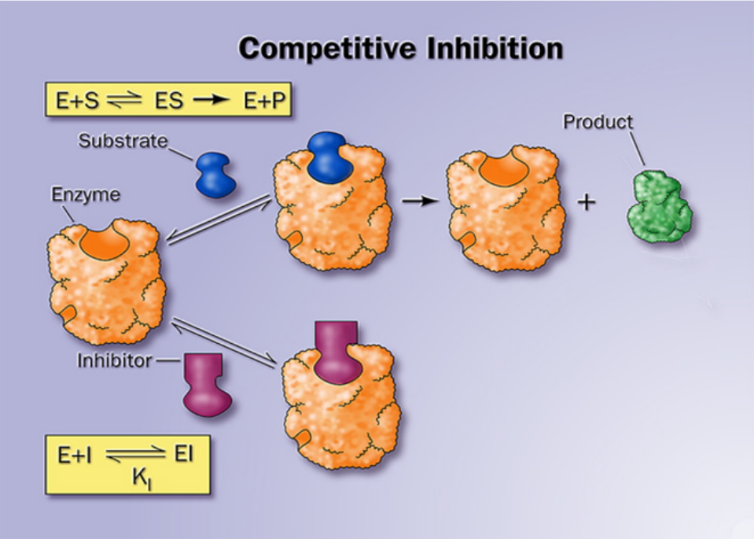
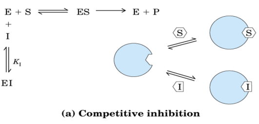
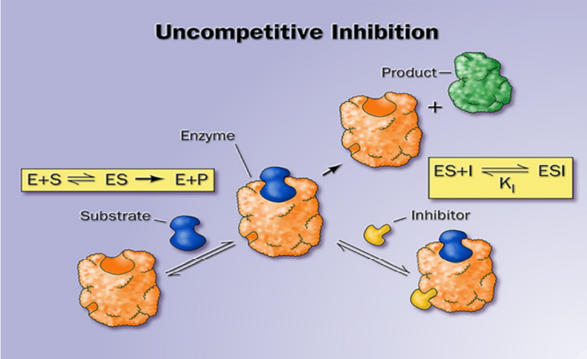

# Factors affecting enzyme-catalyzed reaction rates

+   Substrate concentration 底物浓度
+   Enzyme concentration 酶浓度
+   Temperature 温度
+   рH
+   Inhibitor or Activator 抑制剂或激活剂

## 底物浓度对酶催化反应速率的影响

## 底物浓度对酶催化反应$V_0$的影响

+   相对低浓度的底物, $V_0$ 几乎随底物浓度线性增加

+   

## ES复合物是理解动力学行为的关键

$$
\large {E}+{S} \underset{k_{-1}}{\stackrel{k_{1}}{\rightleftharpoons}} {ES} \stackrel{k_{2}}{\rightarrow} {E}+{P}
$$

>   +   $V_0$ 测试反应的初始速率
>   +   $[S]\gg[E]$ 
>   +   $k^2\ll[]$ 

# Reversible Inhibition 可逆抑制作用

## Competitive Inhibition 竞争性抑制

抑制剂与底物竞争活性位点

Formation of E.S. complex is reduced while a new E.I. complex id formed

$$
[E_t] = [E] + [ES] +[EI]
$$

$$
\large v=\frac{V_{\max }[S]}{K_{m}\left(1+\frac{[I]}{K_{i}}\right)+[S]}
$$

## Uncompetitive Inhibition 反竞争性抑制

抑制剂与E.S.复合物结合 阻止反应被催化
$$
E+S\to ES+I\neq P
$$

## Noncompetitive Inhibition 非竞争性抑制

## Mixed Inhibition 混合型抑制

