[TOC]

# 糖类与糖生物学

# 糖类 Carbonhydrates

- 供能，储能
- 细胞壁和外骨骼结构成分
- 其他有机化合物的骨架（核酸等）
- 细胞间信息交流

## 定义

- 碳水化合物是多羟基醛或多羟基酮的总称
- 许多糖的通式为$(CH_2O)_n,n\geq3$，也被称为糖
- 地球上储量最丰富的有机碳是淀粉和纤维素

> 地球上最丰富的生物分子

## 糖的命名

- 基于主要的官能团（醛基$aldo-$或者酮基$keto-$）

- 碳链长度（以$ose$结尾）

    叁糖 $Triose$ 	（丙）

    四糖 $Tetrose$ 	（丁）

    五糖 $Pentose$

    六糖 $Hexose$

    七糖 $Heptose$

> $Aldotriose$ 丙醛糖

- 立体化学
- 循环形式
- 俗名

# 单糖

由三到七个碳链形成骨架

**结构**：链状结构，环状结构

**性质**：可以成环，溶液下主要以环状形式存在

## D/L异构

以甘油醛为标准

判断依据:
**编号最大的手性碳**,如果其羟基位于右端,则是D式;
反之则是L式(前提: 严格按照规范书写的结构式).自然界中以D式为主.

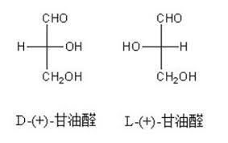

## 旋光性

由不对称碳原子(手性碳原子)造成

## 异构体 Stereoisomers

有 $n$ 个手性碳的糖有 $2^n$ 种异构体

对于$i$碳全糖，$n=i-2$

对于$i$碳酮糖，$n=i-3$

- 对映体与差向异构体

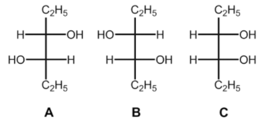

AB之间为对映体，AC之间是差向异构体

- 成环，成环会引入新的手性原子（半缩醛/酮）

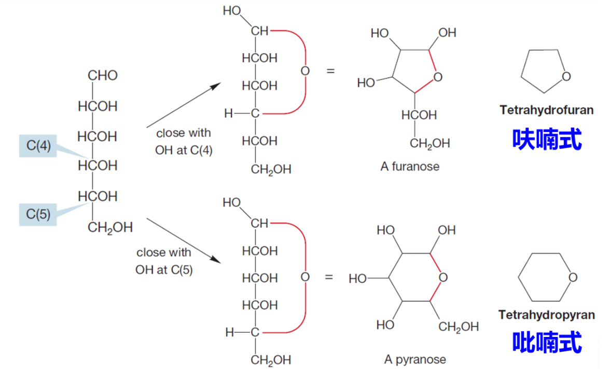

---

异头物，异头碳概念 由于羟基的位置，分为$\alpha,\beta$

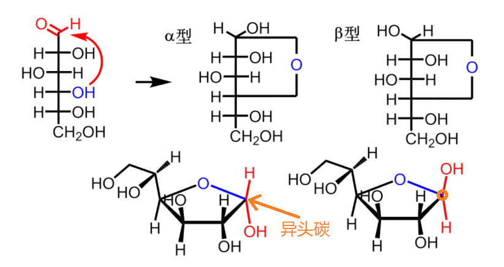

成环后的六碳醛糖被称为吡喃糖

六碳酮糖被称为呋喃糖，各自又分为$\alpha,\beta$型

六碳糖成环后分为船式和椅式，equatorial，axial

## 性质⭐

吡喃糖开环时醛基可以被氧化为羧基（还原糖）

$Cu^{2+}$条件下

> 醛糖是还原性糖
> 酮糖是非还原性糖

## 单糖的衍生物

- 羟基磷酸化     $\to$糖酵解*
- 羟基被取代
- 羟基被氧化为羧基

### 肌醇

属于糖醇，不是糖

> 羟基磷酸化之后变为磷酸肌醇$IP3$
> 是一种重要的信号分子
> 第二信使
> 负责细胞膜与内质网的交流

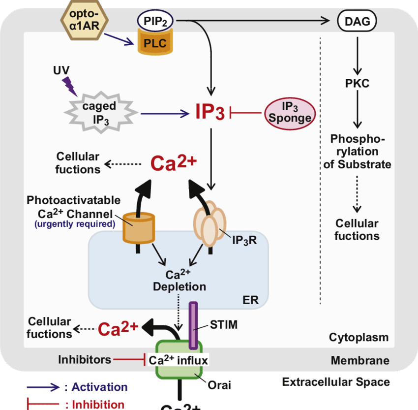

### 己糖衍生物

乙酰化$\to$氨基乙酰糖 外骨骼 

酸化（羧基） $\to$唾液酸

> 流感病毒的HA(血球凝集素)能与唾液酸结合
> HA是一个氨基酸导致的突变体

# 寡糖 Oligosaccharides

两个单糖缩合形成糖苷键(O-glycosidic bond)导致去旋光性

糖苷键能在酸性条件下水解

## 蔗糖 Sucrose

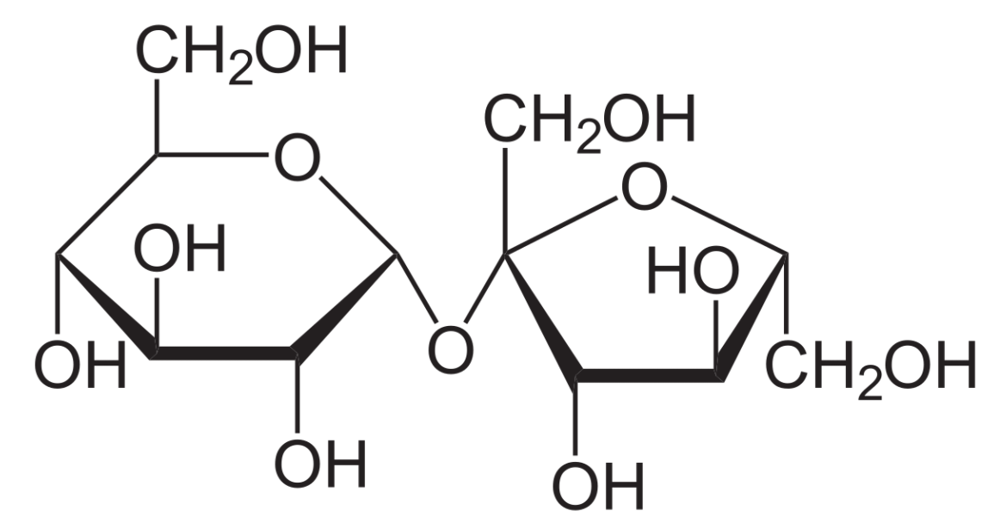

吡喃糖与呋喃糖缩合形成的糖，因为由呋喃糖，所以蔗糖没有还原性

主要在植物中形成

## 乳糖 Lactose

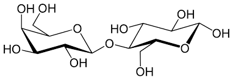

$\beta-1,4-$糖苷键

## 麦芽糖 Maltose

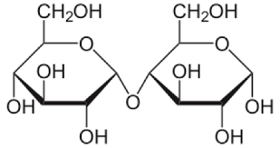

淀粉水解生成

还原性

# 多糖 Polysaccharides

## 淀粉 Polysaccharides

也称为聚糖glycans

$homopolusaccharides$   同多糖 只有一种单糖缩合

$heteropolusaccharides$ 杂多糖 由两种以上的单糖缩合

### 直链淀粉 Amylose

 $\alpha-1,4-糖苷键$ 有多余的羟基，可以与其他的糖缩合

### 支链淀粉 Amylopectin

$\alpha-1,6-糖苷键$

## 糖原 Glycogen

与支链淀粉类似

动物细胞中的主要多糖储能物质

> 将单糖缩合成糖原的目的 
> 减小渗透压，促进血糖进入细胞

### 结构

$\alpha-1,4-糖苷键$ 

螺旋 

---

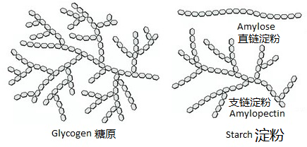

---

## 纤维素 Cellulose

## 结构

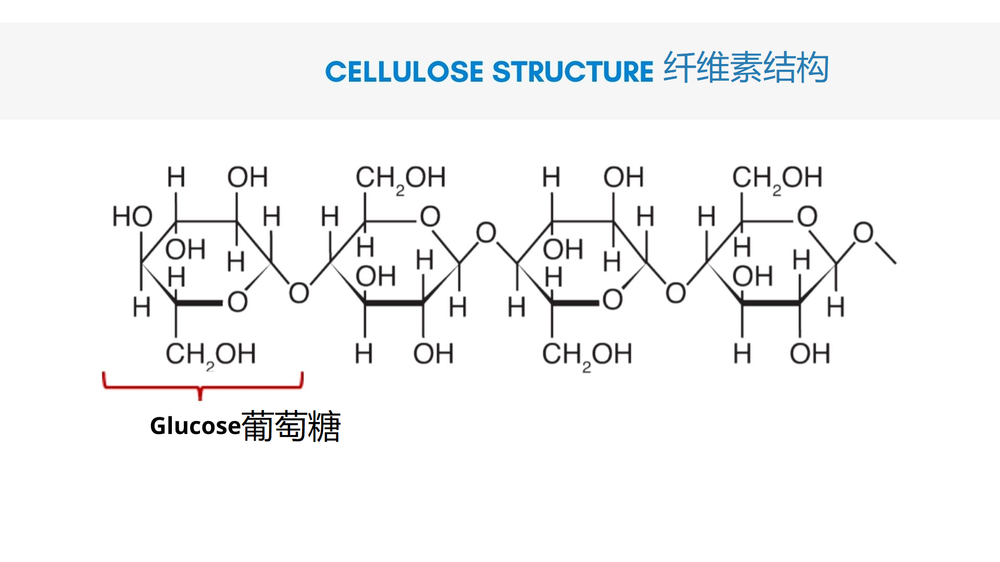

无支链的同多糖

线性分子

$\beta-1,4-糖苷键$    

分子内，分子间可形成氢键  可堆叠 致密

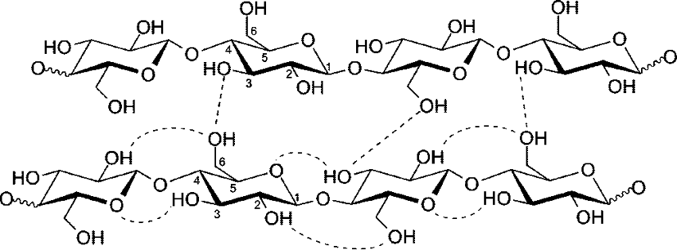

## 合成

纤维素合酶

cellulose synthase

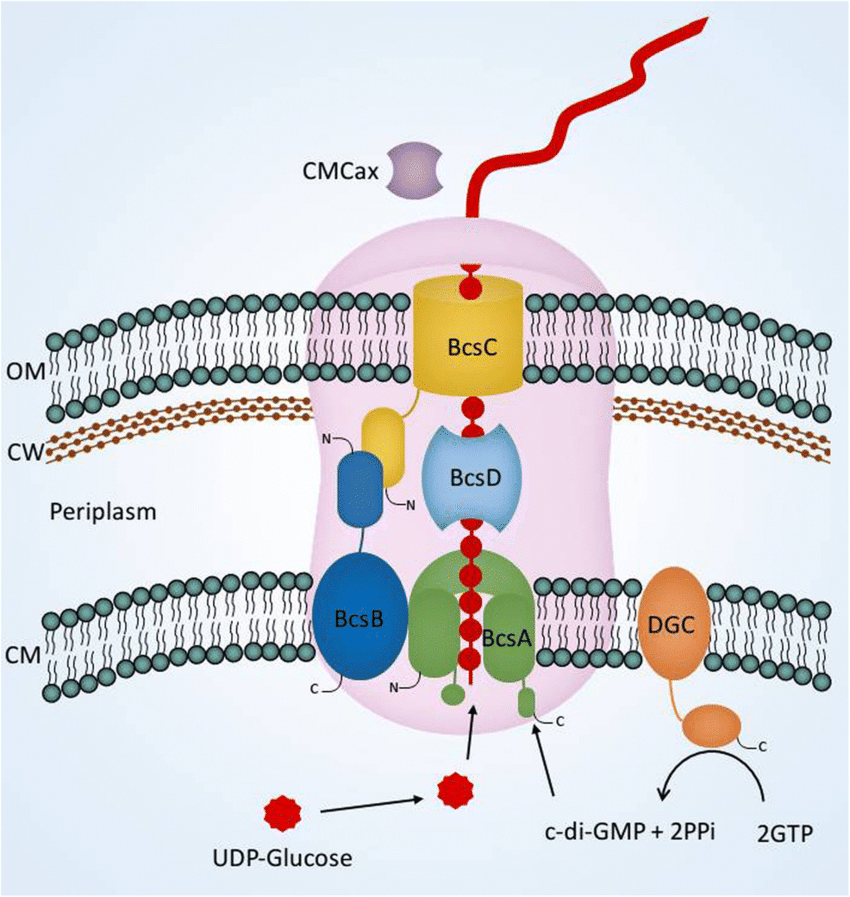

## 分解

可由木真菌降解

> 高效降解$\to$ 生物能

## 几丁质 Chitin

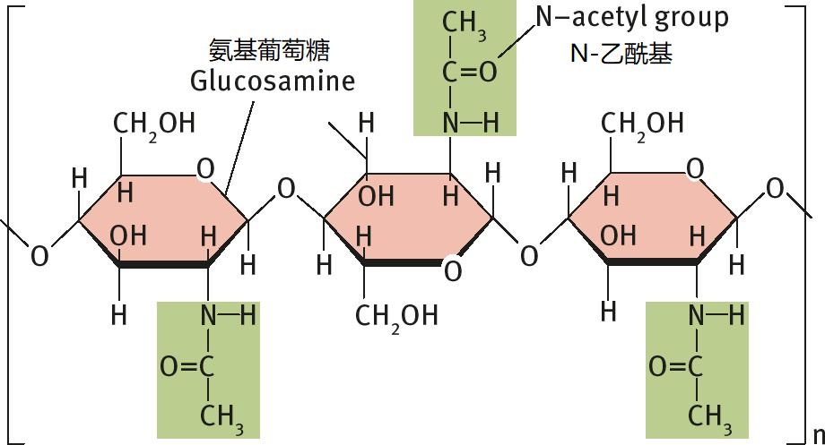

乙酰氨基葡萄糖(NAG)

甲虫的外骨骼

作为信号分子

植物中几丁质受体 可以特异性地识别几丁质 

植物的防御机制

# 糖缀合物 Glucoconjugates

与脂，蛋白质结合

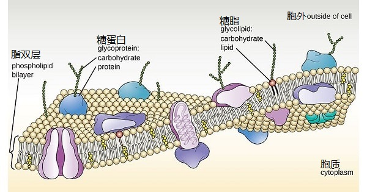

## 蛋白聚糖 Proteoglycans

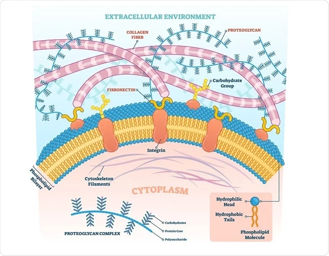

## 糖蛋白 Glycoproteins

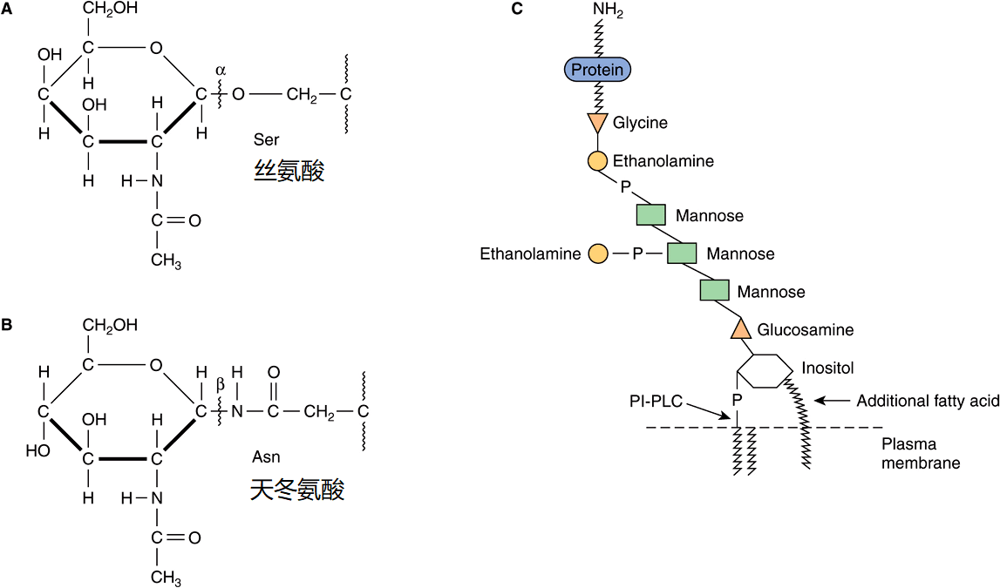

$Ser$，$Asn$可以与糖缩合

## 糖脂 Glycolipids

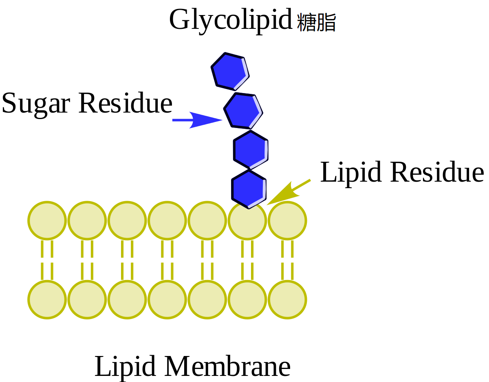

## 脂多糖 Lipopolysaccharides

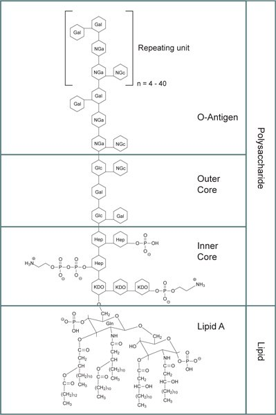

   
