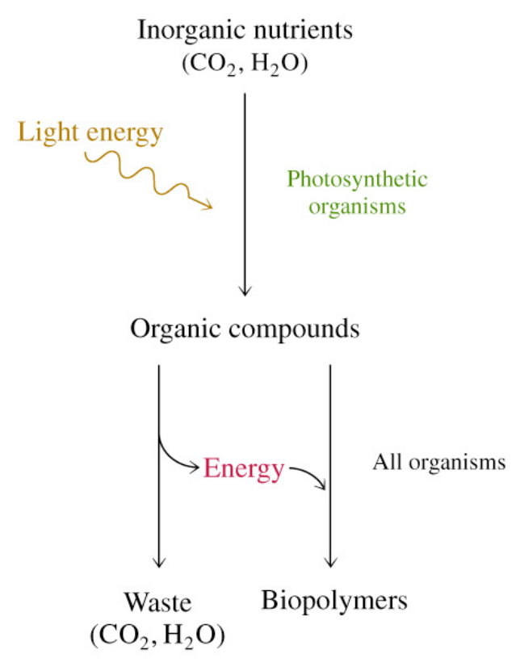

# 热力学定律 (The laws of thermodynamics)

## 1st Law of  Thermodynamics

+   Energy is conserved. e.g. it can  neither be created or destroyed. 

+   The total energy of a system  and surroundings is constant. 

---

>   If the First Law of Thermodynamics is true, how  can biological processes be carried out?
>
>   Although energy cannot be created or  destroyed, it can take on different forms, such  as heat or chemical energy. Thus, the energy  can be stored as chemical bond energy, which  can be used to do work. 

## 2nd Law of  Thermodynamics

Entropy tends to increase

Entropy= The level of randomness or disorder in a system

>   Entropy in a local area can be decreased, but only at  the expense of increased entropy in the larger area, or  universe.

# 化学反应的自由能
细胞是一个等温体系，必须在恒温恒压条件下生长。热传导不能作为其能量来源，生物体在生命活动过程中所需的能量，都来自体能生物化学反应释放的自由能。
## 化学反应的自由能
### 自由能
在一个体系中，能够用来做有用功的那一部分能量称为自由能，用符号 G 表示。
在恒温，恒压下进行的化学反应，其产生有用功的能力可以用反应前后自由能的变化来衡量

$$G=H-TS$$

自由能的变化
$$\Delta G=\Delta H-T\Delta S=G_{产物}\cdot G_{反应物}$$

### 自由能变化与反应自发进行的关系
$\Delta G=G_{产物}-G_{反应物}$ 

$\Delta G <0$ ，反应能自发进行，能做有用功
$\Delta G >0$, 反应不能自发进行，必须供给有用功
$\Delta G －0$， 反应处于平衡状态

一个放热反应（或吸热反应）总热量的变化（$\Delta H$）， 不能作为此反应能够自发进行的潘局，只有自由能的变化才是准确的判据。