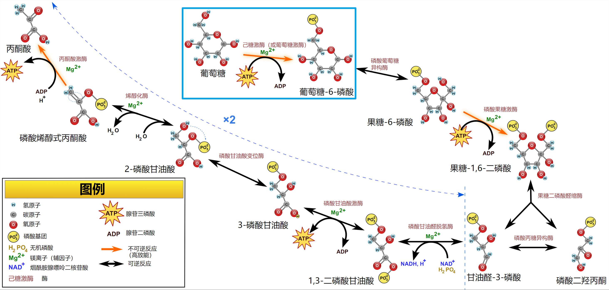
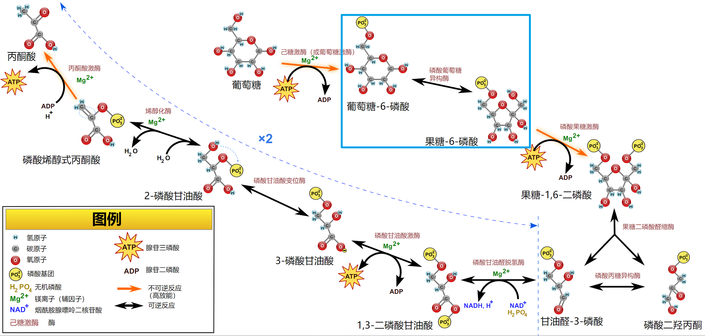
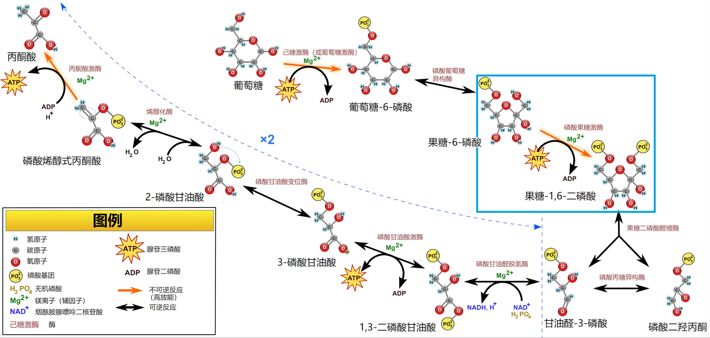
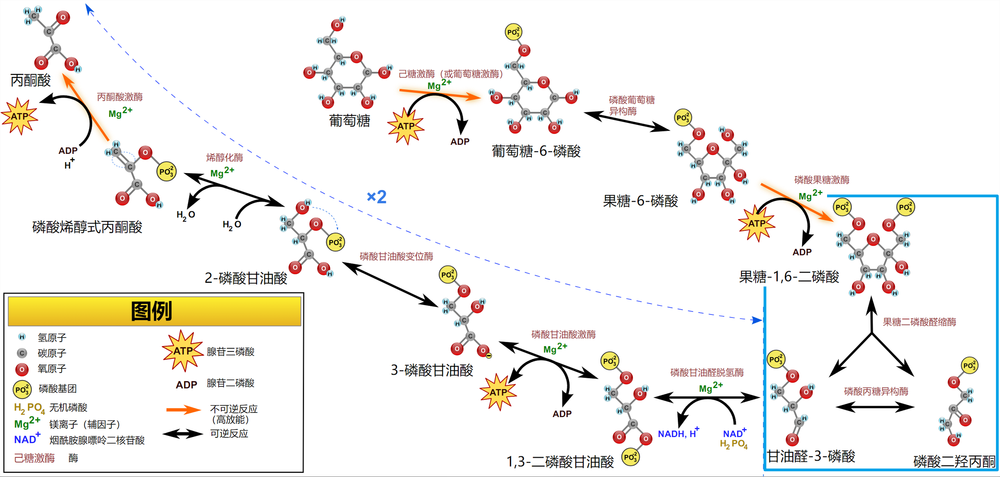
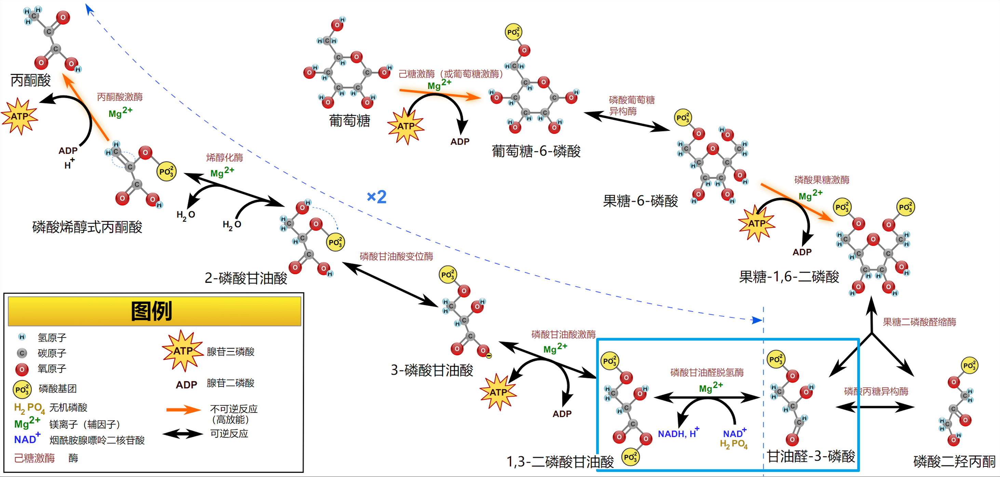
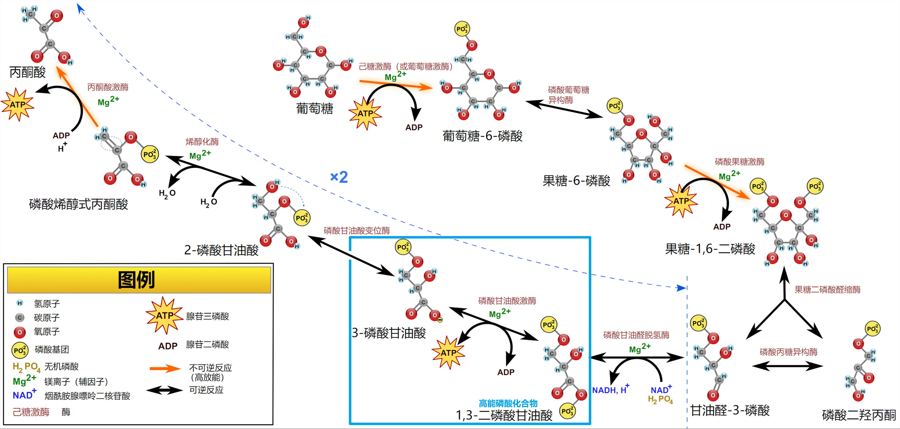
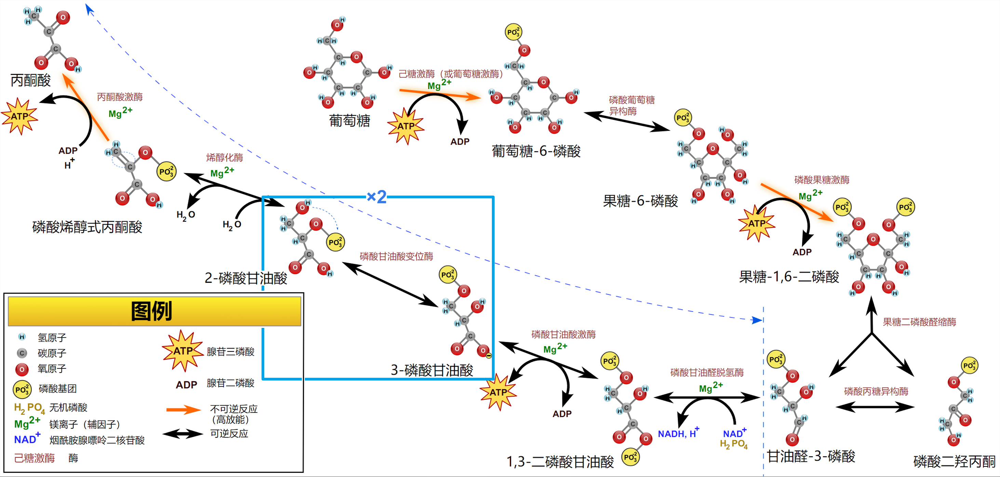
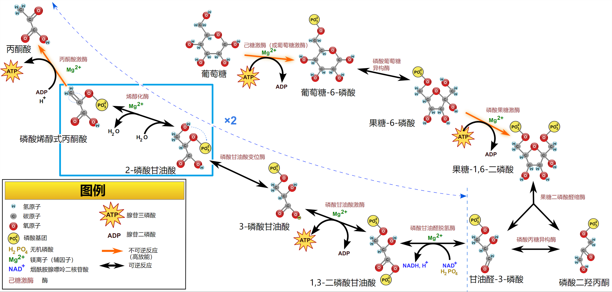
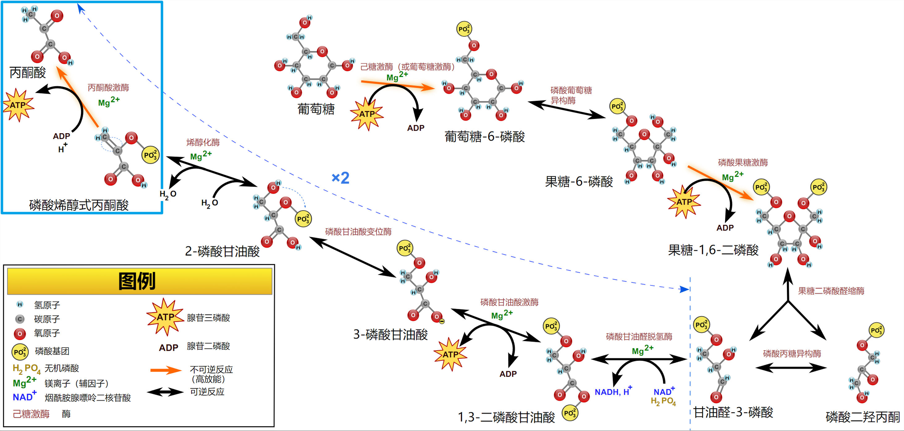

# 糖酵解作用

[toc]

## 概述

### 糖酵解

葡萄糖在无氧条件下降解为丙酮酸并伴随 $ATP$ 生成的过程, 是一切有机体普遍存在的葡萄糖降解途径.

Embden, Meyerhof, Parnas 等人贡献最多, 故糖酵解过程一也叫 Embden-Meyerhof-Parnas 途径, 简称 $EMP$ 途径.

### 亚细胞定位

细胞质中

糖酵解过程 $9$ 个中间产物均是磷酸化的.

### 磷酸基团的作用

+ 细胞膜缺乏磷酸化糖类的转运体, 能使其进入细胞后不易流失, 糖类磷酸化的维持无需后续能量输入.
+ 磷酸基团在后续酶促能量转化过程是必需的, $ATP$ 水解释放的能量部分的保存在了磷酯键中, 如 $G6P$, 后续高能磷酸化合物的形成如 $2,3-$二磷酸甘油酸, 磷酸烯醇式丙酮酸可为 $ATP$ 形成提供磷酸基团; 磷酸基团结合在酶的活性部位后, 可降低活化能, 提高酶的专一性.

## 反应过程

-16415451341573.svg)

### 葡萄糖磷酸化生成 $6-$磷酸葡萄糖

+ 能量来源
  + 消耗一分子$ATP$
+ 关键酶
  + 己糖激酶
    + 已糖激酶有 4 种同工酶: $\mathrm{I, II, III, IV}$
      + $\mathrm{I}$ 型: 脑, 肾脏
      + $\mathrm{II}$ 型: 骨骼肌, 心肌, 
      + $\mathrm{III}$ 型: 肝脏, 肺
      + $\mathrm{IV}$ 型(葡萄糖激酶): 只存在于肝组织
    + 它对 $D-$葡萄糖有专一性强, 不被葡萄糖$-6-$磷酸所抑制, 主要维持血糖平衡.
    + 只有当进食以后, 血液和肝细胞内葡萄糖浓度变高时才起作用, 葡萄糖激将葡萄糖转化成葡萄糖$-6-$磷酸,再以糖原形式贮存于细胞中(葡萄糖激酶主要在糖原合成中起作用).
    + 葡萄糖激酶是一个诱导酶, 是由胰岛素促使合成.
    + 已糖激酶底物是六碳糖
      + $D-$葡萄糖
      + $D-$果糖
      + $D-$甘露糖
      + 氨基葡
      + 萄糖
    + 激活剂
      + $Mg^{2+}$ 或 $Mn^{2+}$ 等二价金属离子
    + 调节酶: 葡萄糖$-6-$磷酸和 $ADP$ 是该酶的变构抑制剂, 无机磷酸可解除葡萄糖$-6-$磷酸和 $ADP$ 的抑制作用.

### $6-$磷酸葡萄糖转变为 $6-$磷酸果糖

可逆反应

### $6-$磷酸果糖转变为 $1,6-$二磷酸果糖

+ 关键酶: 磷酸果糖激酶$-1$ ($PFK-1$)
  + 高 $H^+$ 浓度(即 pH 值低)抑制该酶活性.
  + 生物学意义
    + 可阻止酵解途径继续进行, 防止乳酸进一步生成
    + 可防止血液 pH 下降, 避免酸中毒
+ 能量来源
  + 消耗一分子 $ATP$

### $1,6-$二磷酸果糖(FBP)裂解成 $2$ 分子 磷酸丙糖($3-$磷酸甘油醛(GAP)+二羟丙酮磷酸(DHAP))

醛缩酶

### $3-$磷酸甘油醛氧化为 $1,3-$二磷酸甘油酸

+ 酶
  + $3-$磷酸甘油醛脱氢酶
    + $NAD^+$ 是甘油醛$-3-$磷酸脱氢酶的辅酶
    + 该酶的活性部位有一个巯基 ($-SH$), 重金属离子和烷化剂如碘乙酸能抑制该酶活性
    + 砷酸盐是无机磷酸的结构类似物, 可形成 $1-$砷酸$-3-$磷酸甘油酸, 在有砷酸盐存在的情况下, 酵解过程可以照样进行下去, 但不能形成高能磷酸键, 即砷酸盐起着解偶联作用
+ 糖酵解唯一的氧化反应
+ 消耗一分子无机磷酸

### $1,3-$二磷酸甘油酸转变为 $3-$磷酸甘油酸

+ 产生一分子 $ATP$, 产生方式为底物水平磷酸化
  + 底物水平磷酸化: $ADP$ 或其他核苷酸二磷酸的磷酸化作用与底物的脱氢作用直接相偶联的反应过程称为底物水平磷酸化.

### $3-$磷酸甘油酸转变为 $2-$磷酸甘油酸

### $2-$磷酸甘油酸脱水生成磷酸烯醇式丙酮酸

+ 催化此反应的酶是烯醇化酶, 它在结合底物前必须先结合 $2$ 价阳离子如  $Mg^{2+},  Mn^{2+}$ , 形成复合物,  才能表现出活性.
+ 氟化物是该酶的强烈抑制剂, 原因是氟与 $Mg^{2+}$  和无机磷酸结合形成一个复合物, 取代了酶分子上 $Mg^{2+}$ 的位置, 从而使酶失活.

### 磷酸烯醇式丙酮酸将高能磷酸基转移给 $ADP$ 生成 $ATP$ 和丙酮酸

+ 关键酶
  + 丙酮酸激酶
+ 产生一分子 $ATP$, 产生方式为底物水平磷酸化

## 糖酵解的调节

### 磷酸果糖激酶$-1$

+ 磷酸果糖激酶是酵解过程中最重要的调节酶, 酵解速度主要取决于该酶活性, 因此它是一个限速酶
+ 高浓度的 $ATP$ 是该酶的变构抑制剂, $ATP$ 的抑制作用可被 $AMP$ 解除.
+ 柠檬酸, 脂肪酸也可抑制该酶活性, 柠檬酸通过增加 $ATP$ 对该酶的抑制作用而起抑制作用.
+ 当 pH 下降时, $H^{+}$对该酶有抑制作用. 防止缺氧时有过量的乳酸形成.
+ 果糖$-2,6-$二磷酸是磷酸果糖激酶的激活剂, 增加该酶与其底物的亲和力.

### 丙酮酸激酶

+ 激活剂
  + 果糖$-1,6-$二磷酸
+ 抑制剂
  + $ATP$
  + 丙氨酸
  + 胰高血糖素
+ 丙酮酸激酶有三种同工酶, 肝脏中的同工酶的活性受可逆磷酸化调节, 而肌肉中的同工酶不受此调节.

### 己糖激酶

+ 激活剂

  + 葡萄糖激酶受胰岛素的激活

+ 抑制剂

  + 葡萄$-6-$磷酸

  + 长链脂酰基辅酶 $A$

  + > 葡萄糖激酶不受葡萄糖$-6-$磷酸的影响, 受到长链脂酰酶 $A$ 的抑制.

## 糖酵解的意义

1. 糖酵解是存在一切生物体内糖分解代谢的普遍途径.
2. 通过糖酵解使葡萄糖降解生成 $ATP$, 为生命活动提供部分能量, 尤其对厌氧生物是获得能量的主要方式.
3. 糖酵解途径的许多中间产物可作为合成其他物质的原料(提供碳骨架), 如磷酸二羟丙酮, 甘油.
4. 是糖有氧分解的准备阶段.

## 糖的无氧氧化

+ 葡萄糖转变为乳酸的过程
+ 糖的无氧氧化的意义
  + 糖无氧氧化的生理意义在于迅速提供能量.
  + 肌内 $ATP$ 含量很低, 需要通过无氧氧化迅速得到 $ATP$. 当机体缺氧或剧烈运动时, 肌肉局部血流不足,能量主要通过糖无氧氧化获得.
  + 成熟红细胞没有线粒体, 只能依赖糖的无氧氧化提供能量.
  + 神经细胞, 白细胞, 骨髓细胞等代谢极为活跃, 即使不缺氧也常由糖无氧氧化提供部分能量.

## 丙酮酸的去路

### 生成乳酸

+ 动物在激烈运动时或由于呼吸, 循环系统障碍而发生供氧不足时; 生长在厌氧或相对厌氧条件下的许多细菌
+ 在乳酸脫氢酶的催化下, 丙酮酸生成乳酸
+ 乳酸发酵: 生长在厌氧或相对厌氧条件下的许多细菌, 以乳酸为最终发酵产物, 称为乳酸发酵, 如乳糖的厌氧发酵.

### 生成乙醇

+ 丙酮酸脱羧形成乙醛
+ 乙醛还原成乙醇同时产生氧化型 $NAD^+$

### 生成乙酰辅酶A

+ 进入线粒体生成乙酰辅酶 $A$
+ 乙酰辅酶 $A$ 进入三羧酸循环

### 转变为氨基酸

转变为丙氨酸

### 异生成糖

## 其他六碳糖进入糖酵解途径

### 果糖

+ 在肌肉中, 果糖由己糖激酶催化磷酸化形成果糖$-6-$磷酸
+ 在肝脏中, 因只含有葡萄糖激酶, 此酶只催化葡萄糖的磷酸化, 所以果糖在肝脏中进入糖酵解途径不能像在肌肉中那么简单, 需经过 $6$ 种酶的催化转变
  + 进入位点: 甘油醛$-3-$磷酸和磷酸二羟丙酮
+ 果糖不耐症
  + 肝脏中缺乏 $B$ 型醛缩酶. 食用的果糖不能被正常代谢, 造成果糖$-1-$磷酸的积累. 这种病人对任何甜味失去感觉.

### 半乳糖

+ 半乳糖能进入糖酵解途径的中间产物,包括5个步骤
+ 进入位点: 葡萄糖-6-磷酸
  + 半乳糖血症
    半乳糖血症是一种遗传病. 这种患者体内不能将半乳糖转化为葡萄糖. 原因是缺乏半乳糖$-1-$磷酸尿苷酰转移酶, 不能使半乳糖$-1-$磷酸转变为 $UDP-$半乳糖. 结果使血中半乳糖积累, 进一步造成眼睛晶状体半乳糖含量升高. 并还原为半乳糖醇, 晶状体内的半乳糖醇最后造成晶状体混浊引起白内障

### 甘露糖

甘露糖进入糖酵解途径是经过两步反应转变为果糖$-6-$磷酸