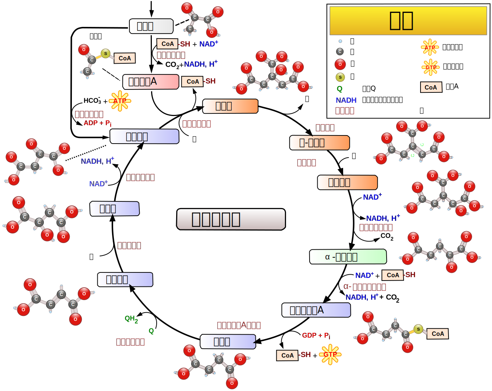
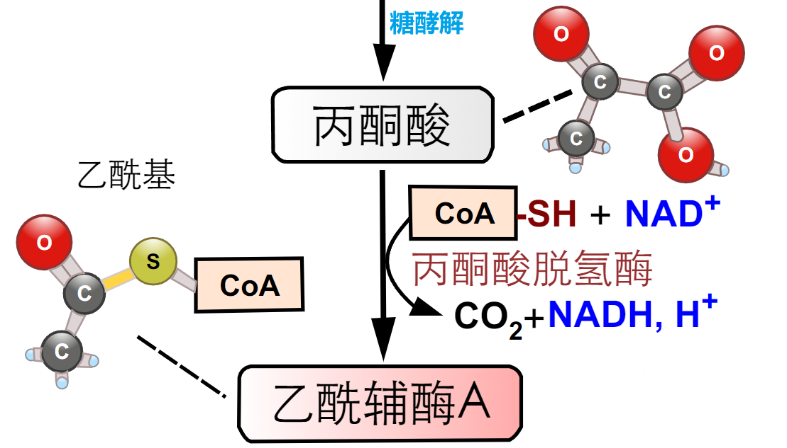

# 三羧酸循环

[toc]

## 糖的有氧氧化

+ 有氧氧化
  + 机体利用氧将葡萄糖彻底氧化成二氧化碳和水的反应过程称为有氧氧化, 有氧氧化是体内糖分解供能的主要方式, 绝大多数细胞都通过它获得能量
+ 有氧条件下: 丙酮酸可继续进行有氧分解, 最后完全氧化, 形成 $CO_2$ 和水.
+ 此途径分为柠檬酸循环和氧化磷酸化两个阶段.
+ 糖的有氧氧化的意义
  + 有氧氧化是体内糖分解供能的主要方式, 绝大多数细胞都通过它获得能量.
+ 糖的有氧氧化分为三个阶段
  1. 葡萄糖经糖酵解生成丙酮酸
  2. 丙酮酸进入线粒体氧化脱羧生成乙酰辅酶 $A$ 
     + 
     + 丙酮酸脱氢酶复合体
       + 组成
         + $E1$: 丙酮酸脱氢酶
         + $E2$: 二氢硫辛酰胺转乙酰酶
           + 砷化物对丙酮酸脱氢酶复合体 $E2$ 中的辅基硫辛酰胺的毒害作用.(由于 $\alpha-$酮戊二酸脱氢酶复合体也含硫辛酰胺辅基,因此砷化物对该酶也有毒害作用)
           + 微生物中许多酶对有机砷化物比人更敏感, 曾作为抗生药物用于治疗锥虫, 梅毒等病, 但有严重的副作用(如: 头晕, 心悸, 恶心, 关节炎)
         + $E3$: 二氢硫辛酰胺脱氢酶
       + 辅酶
         + $TPP$ (磷酸硫胺素), $FAD,NAD^+$, 硫辛酰胺, 辅酶 $A$ 
         + 乏维生素 $B_1$ 主要引起糖代谢障碍, 能量生成不足, 导致血中丙酮酸和乳酸堆积, 进而损伤大脑, 神经, 心脏等器官, 由此出现的一系列症状, 总称为「脚气病」
         + 婴儿多为急性发病, 以神经系统为主者称脑型脚气病; 出现心功能不全者称心型脚气病; 以水肿症状显著者称水肿型脚气病, 亦可数型症状同时出现. 年长者则以水肿和多发性周围神经炎为主要表现.
       + 丙酮酸脱氢酶复合体的调节
         + 别构激活剂: $AMP; ADP; NAD^+$
         + 别构抑制剂: $乙酰 CoA; NADH; ATP;$ $乙酰 CoA / HSCoA$ 或 $NADH/NAD^+$ 较高时, 其活性也受到抑制. 这两种情况见于饥饿, 大量脂酸被动员利用时, 这时糖的有氧氧化被抑制, 大多数组织器官利用脂酸作为能量来源以确保脑等重要组织对葡萄糖的需要
  3. 乙酰辅酶 $A$ 进入柠檬酸循环以及氧化磷酸化生成 $ATP$
     + 
+ 巴斯德效应
  + 有氧氧化抑制无氧氧化的现象称为巴斯德效应

## 三羧酸循环

### 概述

+ 在有氧的情况下,葡萄糖酵解产生的丙酮酸氧化脱羧形成乙酰 $CoA$ ,乙酰 $CoA$ 再经一系列氧化, 脱羧, 最终生成 $CO_2$ 和 $H_2O$ 并产生能量过程, 称柠檬酸循环.
+ 由于柠檬酸含三个基, 所以亦称为三羧酸循环, 简称 $TCA$ 循环.
+ 由于它是由 H.A.Krebs(德国)正式提出的, 所以又称 Krebs 循环.
+ 场所: 三羧酸循环在线粒体基质中进行.
+ 柠檬酸循环生成的中间物质也是许多生物合成的前体. 因此柠檬酸循环是两用代谢途径
+ 柠檬酸循环是糖, 脂肪和氨基酸等氧化所共同经历的途径.

### 具体步骤

#### 乙酰辅酶 $A$ 与草酰乙酸缩合成柠檬酸

+ 关键酶: 柠檬酸合成酶
  + 氟乙酰 $CoA$ 导致致死合成, 常作为杀虫药.
  + 由氟乙酸形成的氟乙酰$-CoA$ 可被柠檬酸合酶催化与草酰乙酸缩合生成氟柠檬酸, 氟柠檬酸结合到顺-乌头酸酶的活性部位上, 抑制柠檬酸循环向下进行. 氟乙酸和氟乙酰 $CoA$ 可做杀虫剂或灭鼠药. 各种有毒植物的叶子大部分含有氟乙酸, 可作为天然杀虫剂.

### 柠檬酸转变为异柠檬酸

可逆反应

### 异柠檬酸转变为 $\alpha-$酮戊二酸

+ 关键酶:异柠檬酸脱氢酶
+ $NAD^+$

### $\alpha-$酮戊二酸生成琥珀酰辅酶 $A$

+ 关键酶: $\alpha-$酮戊二酸脱氢酶复合体
+ $NAD^+$

### 琥珀酰辅酶 $A$ 生成琥珀酸

+ 底物水平磷酸化: 生成一分子 $GTP$

### 琥珀酸生成延胡索酸

+ 脱氢: $FAD$
+ 琥珀酸脱氢酶
  + 丙二酸为该酶的竞争性抑制剂
  + 该酶含 $FAD$ 外, 还有三种铁硫聚簇
  + 是 $TCA$ 循环中唯一镶嵌在线粒体内膜的酶

### 延胡索酸与水生成 $L-$苹果酸

可逆反应

### $L-$苹果酸生成草酰乙酸

脱氢: $NAD^+$

## 三羧酸循环的调节

1. 柠檬酸合酶的调节(限速酶)
   + 抑制剂: $ATP$, 柠檬酸, $NADH$, 琥珀酰 $CoA $
   + 激活剂: $ADP$
2. 异柠檬酸脱氢酶
   + 激活剂: $ADP,~ NAD,~ Ca^{2+}$
   + 抑制剂: $ATP,~ NADH$
3. $\alpha-$酮戊二酸脱氢酶复合体
   1. 激活剂: $ADP,~NAD, ~Ca^{2+}$
   2. 抑制剂: 琥酸 $CoA,~ATP, ~NADH$

## 柠檬酸循环在三大营养物质代谢中具有重要生理意义

+ 柠檬酸循环三大物质营养代谢的共同通路
+ 柠檬酸循环是糖,脂肪,氨基酸代谢联系的枢纽
+ 为其他生物合成提供原料

## 三羧酸循环的回补反应

1. 三羧酸循环不仅是产生 $ATP$ 的途径, 它的中间产物也是生物合成的前体
   + $\alpha-$酮戊二酸 $\Longrightarrow$ 谷氨酸
   + 草酰乙酸 $\Longrightarrow$ 天冬氨酸
   + 琥珀酰 $CoA$ $\Longrightarrow$ 卟啉环
2. 上述过程均可导致草酰乙酸浓度下降, 从而影响三羧酸循环的运转, 因此必须不断补充才能维持其正常进行, 这种补充称为回补反应或填补反应丙酮酸羧化
   + 丙酮酸羧化
   + $PEP$ 的羧化
   + 苹果酸脱氢
   + 由氨基酸形成