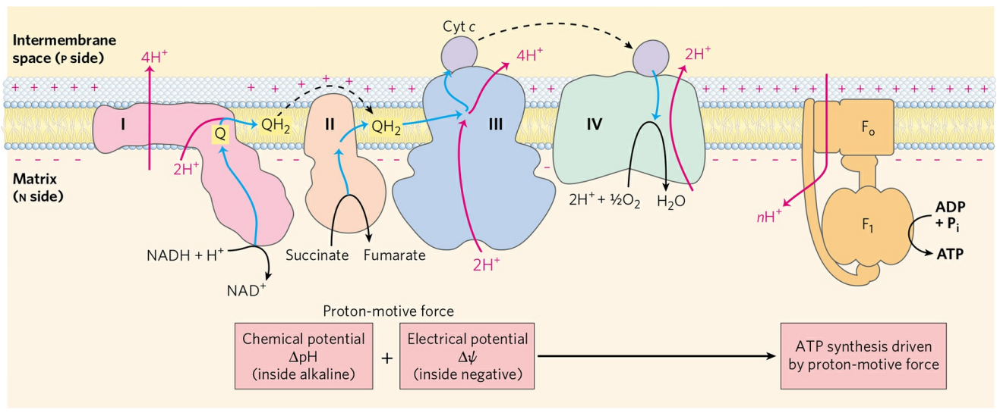
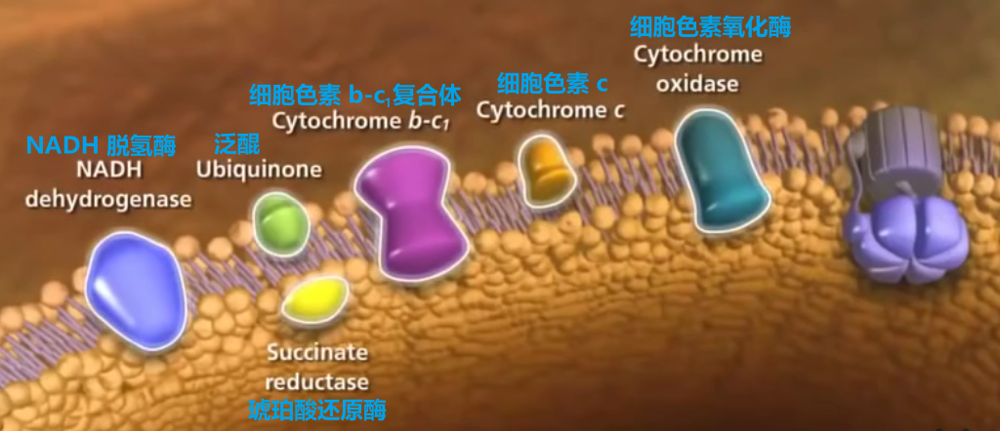

# 生物氧化, 电子传递链和氧化磷酸化

[toc]

## 概念

### 电子传递链

+ 需氧细胞内有机物通过各自的分解途径所形成的还原性辅酶($NADH$ 和 $FADH_2$), 经过电子传递途径被重新氧化, 即还原型辅酶上的氢原子以质子的形式脱下, 其电子沿按一定顺序排列的电子传递体转移, 最后转移给分子氧并生成水, 这个电子传递体系称为电子传递链
+ 由于消耗氧, 故也叫呼吸链.
+ 电子传递链在原核生物存在于质膜上, 在真核细胞存在于线粒体内膜上.

### 生物氧化

机体内的营养物质经过一系列的氧化还原反应, 最终生成水的过程称为生物氧化. 

+ 特点
  + 活的细胞中(pH 中性, 体温), 在一系列酶, 辅酶和中间传递体参与下进行
  + 能量逐步释放, 其中一部分直接以由高能化合物如 $ATP$ 截获, 另一部分形成还原性辅酶如 $NADH$, 经过电子传递途径被重新氧化形成 $ATP$
  + 不会因氧化过程中能量骤然释放而伤害机体, 又能使释放的能量尽可得到有效的利用.

### 氧化磷酸化

代谢物脱下的氢, 经线粒体内氧化呼吸链电子传递释放能量, 此释能过程与驱动 $ADP$ 磷酸化生成 $ATP$ 相偶联, 即还原当量的氧化过程与 $ADP$ 的磷酸化过程相偶联, 产生能量 $ATP$, 因此又称为偶联磷酸化.

## 电子传递链

1. 定位: 电子传递链在原核生物存在于质膜上,在真核细胞存在于线粒体内膜上.

2. 组成

   1. 复合体 $\mathrm{I}$

      + 名称: $NADH-$泛醌还原酶或 $NADH$ 脱氢酶
      + $NADH-Q$ 还原酶是电子传递链中第一个质子泵, 它是一个大的蛋白质复合体.
      + 功能: 复合体 $\mathrm{I}$ 将 $NADH$ 中的电子传给泛醌
      + 辅基: $FMN, Fe-S$;
        + 以 $FMN$ 或 $FAD$ 为辅基的蛋白质统称黄素蛋白, $FMN$ 通过氧化还变化可接受 $NADH+H^+$ 的氢和电子.
      + 辅酶: 辅酶 $Q$

   2. 复合体 $\mathrm{II}$

      + 名称: 琥珀酸-泛醌还原酶或琥珀酸脱氢酶
      + 位于线粒体内膜上
      + 功能: 复合体 $\mathrm{II}$ 将电子从琥珀酸传递到泛醌
      + 辅基: $FAD,Fe-S$
        + 铁硫聚簇(铁硫中心)主要以($Fe-S$), ($2Fe-2S$)或($4Fe-4S$)形式存在, 铁硫聚簇与蛋白质结合称为铁硫蛋白.
        + 铁硫聚簇通过 $Fe^{3+}$ 和 $Fe^{2+}$ 变化, 将电子从 $FMNH_2$ 传给 $CoQ$, 每次传递一个电子.

   3. 复合体 $\mathrm{III}$

      + 名称: 泛醌-细胞色素还原酶或称细胞色素 $b-c1$ 复合体/辅酶 $Q-$细胞色素 $c$ 还原酶
      + 位于线粒体内膜
      + 可以写成 $b\to c1$
      + 功能: 复合体 $\mathrm{III}$ 将电子从还原型泛醌传递至细胞色素 $c$
      + 辅基: 血红素 $b$, 血红素 $c1$

   4. 复合体 $\mathrm{IV}$

      + 名称: 细胞色素氧化酶或称为细胞色素 $c$ 氧化酶; 可以写成 $a\to a3$
      + 功能: 复合体 $\mathrm{IV}$ 将电子从细胞色素 $c$ 传递给氧
      + 辅基: $Fe-S$, 血红素 $a$, 血红素 $a3$

   5. 在复合体 $\mathrm{III,IV}$ 之间两个游离的组分: $CoQ$ 和 $CytC$

      1. 辅酶 $Q$ (泛醌, 亦简称 $Q$)

         + 它在线粒体呼吸链中作为电子和质子的传递体.
         + 非蛋白
         + $Q$ (醌型结构)很容易接受 $2$ 个电子和 $2$ 个质子, 还原成 $QH_2$ (还原型)
         + 位于线粒体内膜
         + 接受: $NADH$, 琥珀酸脱氢酶, 脂酰$-CoA$ 脱氢酶以及其它黄素酶类脱下的氢.

      2. 细胞色素 $c$

         + 在复合体 $III$ 和 $IV$ 之间传递电子

         + 细胞色素: 以铁卟啉(血红素)为辅基的电子传递蛋白质的总称, 几乎存在于所有的生物体内, 高等动物线粒体呼吸链中主要含有5种:

           + $Cyta$

           + $Cyta3$

           + $Cytb$

           + $Cytc$

           + $Cytc1$

             >  $Cytc$ 是唯一能溶于水的细胞色素

## 呼吸链的电子传递抑制剂

### 概念

+ 能够阻断呼吸链中某部位电子传递的物质称为电子传递抑制剂
+ 电子传递抑制剂的使用是研究呼吸链中电子传递体顺序的有效方法(阻断部位物质的氧化-还原状态可以测出)

### 几种电子传递抑制剂

+ 鱼藤酮, 安密妥, 杀粉蝶菌素
  + 其作用是阻断电子在 $NADH-Q$ 还原酶内的传递, 所以阻断了电子由 $NADH$ 向 $CoQ$ 的传递.
+ 抗霉素 $A$
  + 干扰电子在细胞色素还原酶中 $Cytb$ 上的传递, 所以阻断电子由 $QH_2$ 向 $Cytc1$ 的传递
+ 氰化物($CN^-$), 叠氮化物($N_3^-$), 一氧化碳($CO$)等
  + 其作用是阻断电子在细胞色素氧化酶中传递, 即阻断了电子由 $Cytaa3$ 向分子氧的传递.

## 氧化磷酸化

### Р/О比

+ **当一对电子经呼吸链传给氧($\frac{1}{2}O_2$)的过程中所产生的 $ATP$ 分子数**. 实质是伴随 $ADP$ 磷酸化所消耗的无机磷酸的分子数与消耗氧原子数之比, 称为 $P/O$ 比.

+ 一对电子沿呼吸链传递, 相当于消耗一个 $O$ 原子产生的 $ATP$ 的数目
+ $NADH+H^+$ 经呼吸链氧化 $P/O$ 比为 $2.5(3)$
  $FADH_2$ 经呼吸链氧化 $P/O$ 比为 $1.5(2)$
+ 1940 年, S.Ochoa 测定了在呼吸链中 $O_2$ 的消耗与 $ATP$ 生成的关系, 提出 $P/O$ 比的概念.

### 形成 ATP 的部位(氧化与磷酸化偶联部位)

+ 电子传递链将 $NADH$ 和 $FADH_2$ 上的电子传递给氧过程中释放自由能, 供给 $ATP$ 的合成. 其中释放大量自由能的部位有 $3$ 处, 这 $3$ 个部位就是 $ATP$ 合成的部位, 称为偶联部位.
+ 复合物 $I$ (将 $NADH$ 上的电子传递给 $CoQ$ 的过程)
+ 复合体 $II$ (将电子由 $CoQ$ 传递给细胞色素 $c$ 的过程)

### 氧化磷酸化机理假说

#### 化学渗透假说

电子经氧化呼吸链传递时释放的能量, 通过复合体的质子泵功能, 驱动 $H^+$ 从线粒体基质泵出至内膜. 由于质子不能自由穿过线粒体内膜返回基质, 这种质子的泵出引起内膜两侧的质子浓度和电位的差别, 从而形成跨线粒体内膜的质子电化学梯度, 储存电子传递释放的能量. 当质子顺浓度梯度回流至基质时, 驱动 $ADP$ 与磷酸生成 $ATP$

##### 化学渗透假说的实验证据

1. 氧化磷酸化作用的进行需要封闭的线粒体内膜存在
2. 线粒体内膜对 $H^+,OH^-,K^+,Cl^-$ 等离子都是不通透的
3. 破坏 $H^+$ 浓度梯度的形成都必然破环氧化磷酸化作用的进行
4. 线粒体电子传递所形成的电子流能够将 $H^+$ 从线粒体内膜逐出到线粒体膜间隙
5. 膜表面不仅能滞留大量质子, 而且在一定条件下, 质子沿膜表面迅速的转移, 其速度超过在大量水相中的速度.

#### 化学偶联假说(1953 年, E.Slater)

认为电子传递反应释放的能量通过一系列连续的化学反应形成高能共价中间物, 它们随后裂解驱动氧化磷酸化, 即将其能量转移到 $ADP$ 中形成 $ATP$.

#### 构象偶联假说(1964 年, P.Boyer)

认为电子沿电子传递链传递使线粒体内膜的蛋白质组分发生了构象变化, 形成一种高能构象, 这种高能形式通过 $ATP$ 的合成而恢复其原来的构象.

## $ATP$ 合成机制

1. $ATP$ 合酶
   + $ATP$ 的合成是由 $ATP$ 合酶催化完成的
   + $ATP$ 合酶是由两个主要的单元构成, 又称为 $F0F1-ATP$ 酶
     + 起质子通道作用的单元称为 $F0$ 单元
       + 寡霉素和二环已基二亚胺能直接作用于 $F0$, 抑制 $ATP$ 的合成.
   + 催化 $ATP$ 合成的单元称为 $F1$ 单元(球状结构)
2. 质子流通过 $ATP$ 合酶同时释出与酶牢固结合的 $ATP$ 分子
   + 质子梯度的作用是使 $ATP$ 从酶分子上解脱下来. $ATP$ 合酶分子与 $ADP$ 和 $Pi$ 的结合, 有促使 $ATP$ 分子从酶上解脱下来的作用. 表明 $ATP$ 合酶分子上的核苷酸结合部位在催化过程中有相互协调的作用.
   + $ATP$ 合酶的作用是由质子动力所驱动的. 这种动力是由 $pH$ 梯度和膜电势产生的. 某些氨基酸残基在 $pH$ 梯度的条件下可以发生质子化或去质子化

## 氧化磷酸化的解偶联剂和抑制剂
1. 解偶联剂
   + 其作用是使电子传递和 $ATP$ 形成的两个过程分开, 使 $ATP$ 不能合成, 这种作用称为解偶联作用, 这类化合物成为解偶联剂.
   + 解偶联剂不抑制电子传递, 不抑制底物水平的磷酸化.
   + 在解偶联剂存在时, 有电子传递, 但无 $ATP$ 合成
   + 常见的: $2,4-$二硝基苯酚
2. 氧化磷酸化抑制剂
   + 直接作用于 $ATP$ 合酶复合体而抑制 $ATP$ 合成的一类化合物. 由于它干扰了由电子传递的高能状态: 形成 $ATP$ 的过程, 从而间接抑制电子传递和降低 $O_2$ 的利用率(区别于电子传递链抑制剂)
   + 常见的如: 寡霉素, 双环己基碳二亚胺
   + 寡霉素等对利用氧的抑制作用可被 DNP(2,4-二硝基苯酚)解除.
3. 离子载体(离子载体抑制剂)
   + 是一类脂溶性物质, 能与 $H^+$ 以外的其他一价阳离子结合, 并作为他们的载体使他们能过穿过膜, 消除跨膜的电位梯度.
   + 常见的: 缬氨霉素($K^+$), 短杆菌肽 $A$ ($K^+,Na^+$)

## 氧化磷酸化的调控

+ 电子传递和 $ATP$ 形成的偶联关系是相辅相成的:
  + $ATP$ 的产生必须以电子传递为前提, 呼吸链只有生成 $ATP$ 才能推动电子的传递, 只有当无机磷酸和 $ADP$ 都充分时电子传递速度才能达到最高水平.
  + $[ATP]/[ADP]$ 之比再细胞内对电子传递速度起着重要的调节作用, 同时对还原型辅酶的积累和氧化也起调节作用.
  + **$ADP$ 作为关键物质对于氧化磷酸化作用的调节称为呼吸控制**(受体控制).
+ 当细胞利用 $ATP$ 做功时, $ADP$ 含量上升, 促进氧化磷酸化作用合成 $ATP$
