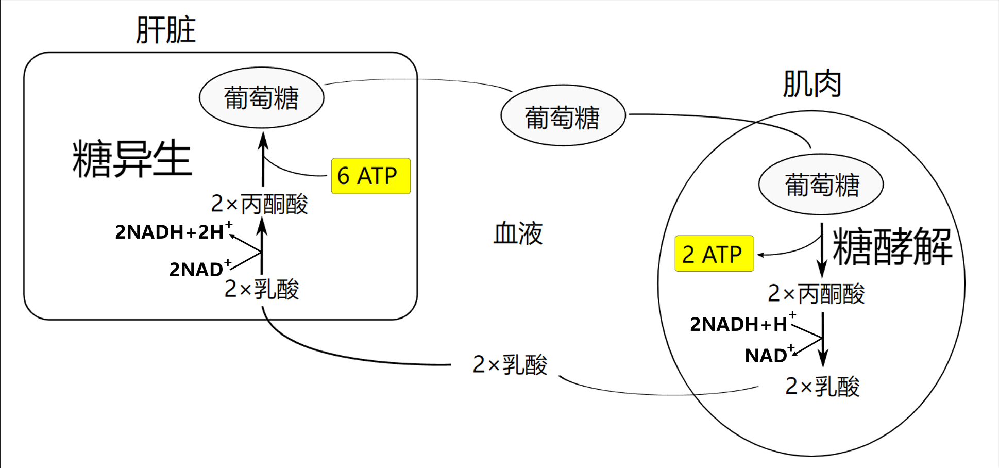

# 戊糖磷酸途径和糖的其他代谢途径

[toc]

## 戊糖磷酸途径 (PPP)

.svg)

.svg)

+ 定义
  + 是指从糖酵解的中间产物 $6-$磷酸葡萄糖开始形成旁路，通过氧化，基团转移两个阶段生成 $6-$磷酸果糖和 $3-$磷酸甘油醛，从而返回糖酵解的代谢途径，亦称为磷酸戊糖旁路。磷酸戊糖途径不能产生 $ATP$, 其主要意义是生成 $NADPH$ 和磷酸核糖
    + 是糖代谢的第二条重要途径
    + 在细胞浆中进行
    + 广泛存在于动植物细胞内
+ 过程
  + 磷酸戊糖途径分为两个反应阶段
  + 第一阶段是氧化反应
    + 一分子葡萄糖$-6-$磷酸生成核糖$-5-$磷酸，$2$ 分子 $NADPH$ 和 $1$ 分子二氧化碳
  + 第二阶段是基团转移反应
    + 核糖$-5-$磷酸最终转变为果糖$-6-$磷酸和 $3-$磷酸$-$甘油醛
  + 关键酶
    + 葡萄糖$-6-$磷酸脱氢酶
      + 限速酶，催化不可逆反应，活性受 $NADPH/NADP^+$ 调节
    + 蚕豆病：$6-$磷酸葡萄糖脱氢酶缺陷者，其红细胞不能经过磷酸戊糖途径获得充足的 $NADPH$, 难以使谷胱甘肽保持还原状态，因而表现出红细胞易于破裂，发生溶血性黄疸，这种溶血现象常在食用蚕豆后出现，故称为蚕豆病
+ 调节
  + 磷酸戊糖途径主要受 $NADPH/NADP^+$ 比值的调节
  + 比值升高时，磷酸戊糖途径被抑制
+ 意义
  + 为核酸的生物合成提供核糖
  + 产生大量 $NADPH,$ 主要用于还原（加氢）反应，为细胞提供还原力
    1. $NADPH$ 是许多合成代谢的供氢体
    2. $NADPH$ 参与羟化反应
    3. $NADPH$ 可维持谷胱甘肽的还原状态

## 糖异生

.svg)

+ 定义
  + 由非糖物质转化为葡萄糖或糖原的过程称为糖异生，糖异生的主要器官是肝，长期饥饿时，肾的糖异生作用大大增强
  + 由丙酮酸，草酰乙酸，乳酸，丙酸，甘油，氨基酸等非糖物质转变成葡萄糖的过程称为糖异生。
  + 场所
    + 器官：主要在肝，肾细胞
    + 亚细胞定位：胞浆，线粒体
  + 作用物的互变反应分别由不同的酶催化其单向反应，这种互变循环就称为底物循环。
+ 过程
  + 三个「能障」
    1. 丙酮酸转变成磷酸烯醇式丙酮酸
       + 丙酮酸$-$草酰乙酸：丙酮酸羧化酶；仅存在线粒体中
       + 草酰乙酸出线粒体：转变为苹果酸出线粒体；转变为天冬氨酸出线粒体
       + 草酰乙酸$-$磷酸烯醇式丙酮酸：$PEP$ 羧激酶
       + 一共消耗 $2$ 分子 $ATP$
    2. 果糖$-1,6-$二磷酸的水解
       + $1,6-$二磷酸果糖转变为 $6-$磷酸果糖
       + 果糖二磷酸酶$-1$
    3. 葡萄糖$-6-$磷酸的水解
       + $6-$磷酸葡萄糖水解水葡萄糖
       + 葡萄糖$-6-$磷酸酶
       + 不生成 $ATP$
+ 糖异生的意义
  + 维持血糖恒定是糖异生最重要的生理作用
  + 糖异生是补充或恢复肝糖原储备的重要途径
  + 肾糖异生增强有利于维持酸碱平衡
  + 有利于乳酸的利用

## 乳酸循环

+ 乳酸循环（可立氏循环，Cori 循环）
+ 氧供应不足时，肌肉收缩通过无氧氧化生成乳酸，乳酸透过细胞膜弥散进入血液后，再入肝异生为葡萄糖，葡萄糖释放入血又可被肌摄取，由此构成了一个循环，称为乳酸循环
+ 乳酸循环的意义
  + 回收乳酸中的能量，又可避免因乳酸堆积而引起酸中毒

## 乙醛酸途径

.svg)

+ 定义
  + 由于循环中产物为乙醛酸而得名
    乙醛酸循环使乙酰辅酶 $A$ 转变为草酰乙酸，进而通过糖异生产生葡萄糖。
  + 只有一些植物和微生物兼具有这样的途径，动物中不存在。
  + 乙醛酸途径中的酶存在于线粒体和植物的乙醛酸循环体中。
+ 过程
+ 关键酶
  + 苹果酸合酶
  + 异柠檬酸裂合酶
+ 乙醛酸循环在植物种子中的意义
  + 乙醛酸循环使萌发的种子将贮存的三酰甘油通过乙酰$-CoA$ 转变为葡萄糖
  + $2 乙酰-CoA + 2 NAD^+ + FAD → 草酰乙酸 + 2 CoA-SH + 2 NADH + FADH_2 + 2 H^+$

## 寡糖类的生物合成和分解

+ 乳糖的生物合成和分解
+ 乳糖不耐症
  + 几乎所有的婴儿和幼儿都能消化乳糖，但到青年或成年之后，许多人小肠细胞的乳糖酶活性或是大部分或是全部消失，致使乳糖不能被完全消化或完全不能消化，也不能被小肠吸收。乳糖在小肠腔内会产生很强的渗透效应导致流体向小肠内流；在大肠内，乳糖被细菌转变为有毒物质。因此出现腹胀，恶心，绞痛以及腹泻等症状，临床上称为乳糖不耐症。
  + 大肠杆菌能利用乳糖作为唯一的碳源，在乳糖代谢中所必需的酶就是 $\beta-$半乳糖苷酶，$\beta-$半乳糖苷酶是一种可诱导酶，可将乳糖水解为半乳糖和葡萄糖