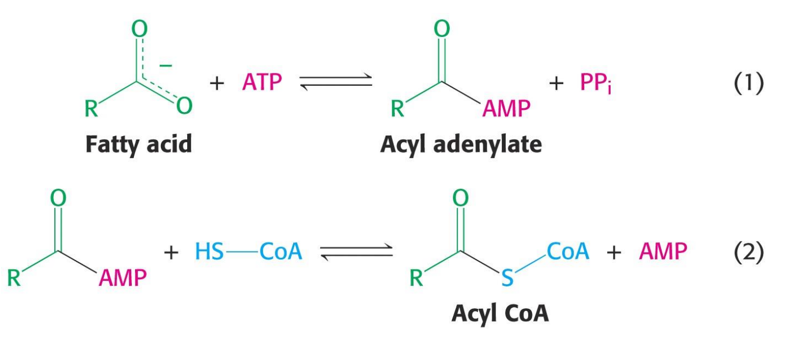
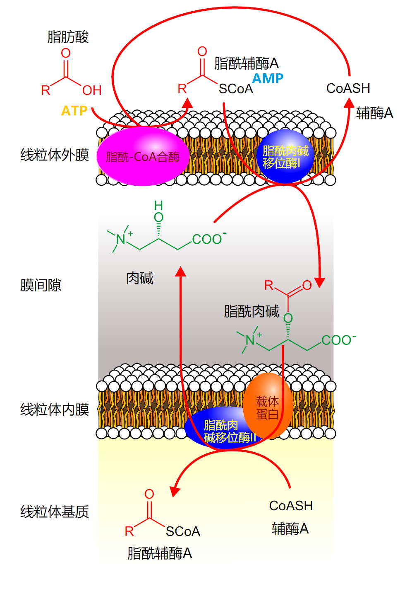
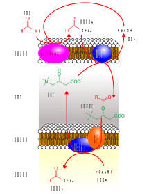
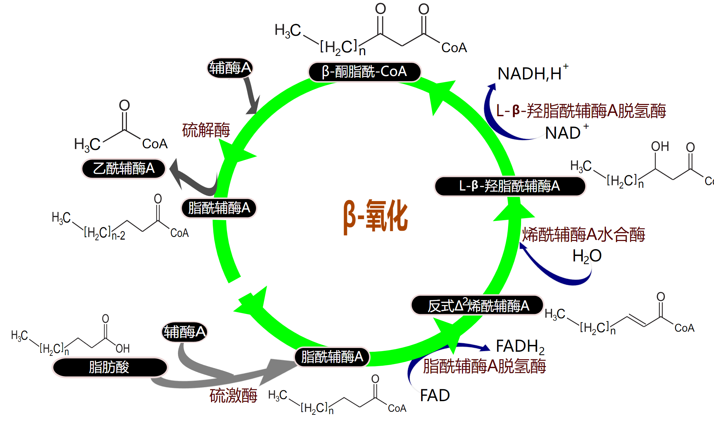
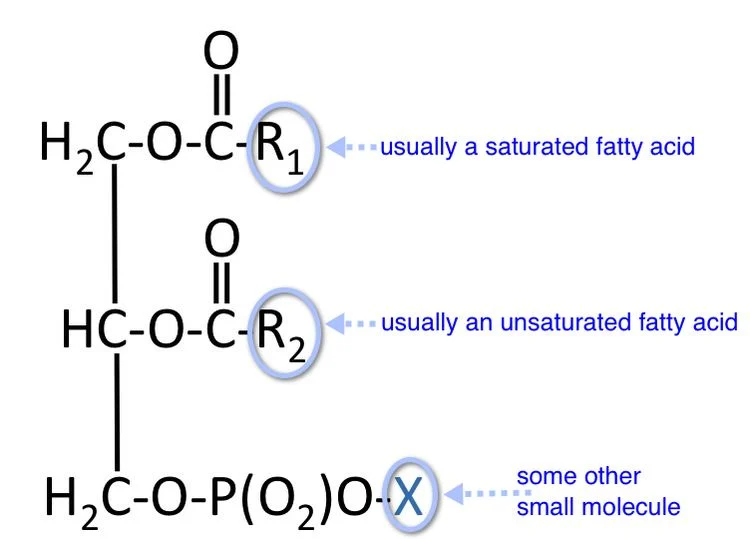
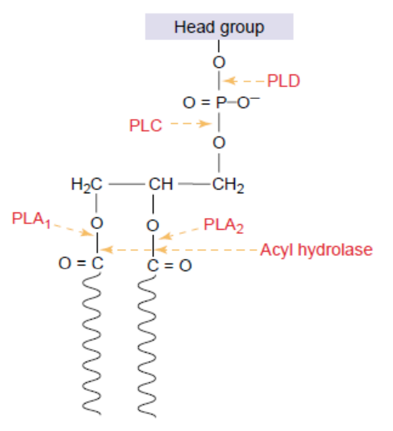

# 脂肪酸的分解代谢

[toc]

## 概述

### 脂肪动员

+ 指把储存在脂肪细胞内的脂肪在脂肪酶的作用下, 逐步水解, 释放游离脂肪酸和甘油供其他组织细胞氧化利用的过程.
+ 关键酶是激素敏感性甘油三酯脂肪酶

### 脂肪酸对生物体的重要功能

1. 脂肪酸是磷脂和糖脂的组成单元, 这些分子又是生物膜的组成成分
2. 脂肪酸以共价键与糖蛋白的蛋白质部分相接, 经过修饰的这个糖蛋白在脂肪酸残基的引导下指向膜的靶标位置;
3. 脂肪酸是燃料分子, 它们以三脂酰甘油形式贮存起来
4. 脂肪酸的某些衍生物担当着激素及胞内信使的职能

## 脂肪的消化, 吸收和传送

### 脂肪的消化

1. 由于三脂酰甘油是水不溶性的, 而消化作用的酶却是水溶性的, 因此三脂酰甘油的消化是在脂质$-$水的界面处发生的.
2. 脂肪的消化开始于胃中的胃脂肪酶, 彻底的消化是在小肠内由胰脏分泌的胰脂肪酶完成. 另外, 胰脏还分泌磷脂酶, 它催化磷脂的 $2-$酰基的水解.
3. 脂质中的磷脂可被磷脂酶 $A_2$ ($PLA_2$)催化降解, 水解发生于 C(2) 处, 产生脂肪酸及相应的溶血磷脂.
4. 胰磷脂酶 $A_2$ 与胰脂肪酶一样, 在界面上优先地进行催化反应

### 胆汁盐促进脂类在小肠中被吸收

1. 胆汁盐包括胆酸, 甘氨胆酸和牛磺胆酸是胆固醇的氧化产物, 作为载体把脂肪从小肠腔移送到上皮细胞. 小肠对脂肪的吸收在上皮细胞发生.
2. 胆汁盐不仅有助于脂肪的吸收, 而且有助于脂肪消化产物的吸收

### 吸收

1. 脂肪经消化后的产物脂肪酸和 $2-$单酰甘油由小肠上皮黏膜细胞吸收, 随后又经黏膜细胞转化为三脂酰甘油, 后者和蛋白质一起包装成乳糜微粒, 释放到血液, 它们被吸收进入静脉血液, 并以游离酸形式被送入肝脏.
2. 在脂肪组织和骨骼肌毛细血管中在脂蛋白脂肪酶($LPL$)的作用下, 乳糜微粒的三脂酰甘油被水解为游离脂肪酸和甘油. 产生的游离脂肪酸被这些组织吸收, 同时甘油转化为糖酵解的中间产物二羟丙酮磷酸

## 甘油三酯的水解

$$
\begin{aligned}
&\ce{甘油三酯+H_2O ->[脂肪酶] 脂肪酸(R3COOH) +甘油二酯}\\
&\ce{甘油二酯+H2O ->[甘油二酯脂肪酶] 脂肪酸(R1COOH) + 甘油单酯}\\
&\ce{甘油单酯+H2O ->[甘油单酯脂肪酶] 脂肪酸(R2COOH) + 甘油 }
\end{aligned}
$$

### 甘油代谢
$$
\ce{甘油 ->[\ce{ATP->ADP}][甘油激酶] 3-磷酸甘油}
$$
.svg)

## 脂肪酸的氧化

### 脂肪酸的活化 - 脂酰 $CoA$ 的生成(胞浆)

+ 脂酰 $CoA$ 合成酶
  + 脂酰 $CoA$ 合成酶存在于内质网及线粒体外膜上, 需 $ATP$ 和 $Mg^{2+}$, 形成一个高能硫酯键,  消耗 $2$ 个高能磷酸键
  + 消耗 $1$ 分子 $ATP$
  + $\leq12C$ 的脂酰 $CoA$ 可以通过扩散进入线粒体, 长链脂酰 $CoA$ 必须经过一个特殊的转运机制 - 肉碱穿梭

### 脂酰 $CoA$ 进入线粒体

+ 肉碱脂酰转移酶$-I$: $\beta-$氧化的关键酶

+ 过程
  1. 脂酰$-CoA$ 分子通过线粒体内膜需要一个特殊的运送机制: 肉碱脂酰转移酶 $I$
  
  2. $CoA$ 基团脱下, 肉碱分子进行取代, 得到脂酰肉碱;
  
  3. 脂酰肉碱在肉碱脂酰肉碱移位酶的催化下, 被运送透过线粒体内膜;
  
  4. 脂酰肉碱进入线粒体基质后, 又在肉碱-脂酰肉碱移位酶 $II$ 作用下, 释出游离肉碱, 肉碱被运出, 同时脂酰基又回到 $CoA$ 上, 完成脂酰$-CoA$ 的穿梭.
  
     > 脂酰基进入线粒体的速度是限速步骤

### 脂肪酸的 $\beta$ 氧化(线粒体内)

.svg)

+ 过程
  1. 脱氢: 
     $FAD$;
     脂酰辅酶 $A$ 转变为烯脂酰辅酶 $A$;
     脂酰 $CoA$ 脱氢酶
     + 婴儿猝死综合征: 部分原因缺乏中长链脂酰脱氢酶,导致葡糖与脂肪酸氧化不平衡;
     + 牙买加呕吐病: 西非荔枝果中含一种降糖氨酸 $A$ ,抑制脂酰脱氢酶.
  2. 加水: 转变为羟脂酰辅酶 $A$; 烯酰 $CoA$ 水合酶
  3. 再脱氢: $NAD$; 转变为酮脂酰辅酶 $A$; 羟脂酰 $CoA$ 脱氢酶;
  4. 硫解: 生成比原来少两个碳的脂酰辅酶A和一分子乙酰辅酶A;硫解酶重复上述四个步骤,最终完成脂肪酸的b-氧化
+ 定义: 1904 年 Franz. Knoop 实验证明: 脂肪酸的氧化在肝脏中逐步进行, 每次从羧基端断下一个二碳物(2C), 即位碳原子首先氧化, 故称为 $\beta-$氧化.
+ $\beta-$氧化的意义: 产生大量 $ATP$ 供机体需要

> 饱和偶数脂肪酸 $\beta$ 氧化净产生 ATP 通式
> $$
> \left( \frac{N-2}{2}\times 4+\frac{N}{2}\times 10 \right)-2 =7N-6
> $$

### ~~奇数碳原子脂肪酸的氧化~~

+ $17$ 碳直链脂肪酸经 $\beta-$氧化$\longrightarrow7$乙酰$-CoA+1$ 丙酰$-CoA$
+ 丙酰$-CoA-$琥珀酰$-CoA$, 需三步完成.
  1. 丙酰$-CoA$ 化酶催化的反应, 生物素作为辅因子
  2. 在甲基丙二酰$-CoA$ 消旋酶催化下, $D-$甲基丙二酰$-CoA\longrightarrow L-$甲基丙二酰$-CoA$
  3. 在维生素 $B_{12}$ 的酶 - 甲基丙二酰$-CoA$ 变位酶 的作用下, 发生羰基$-CoA$ 基团转移到甲基并置换一个氢的反应. 产物琥珀酰$-CoA$ 可以进入柠檬酸循环进一步进行代谢.

### ~~脂肪酸的 $\alpha-$氧化, $\omega-$氧化~~

+ $\alpha-$​氧化
  + 这种代谢途径发生在某些因 β-碳被封闭（如连有甲基）而无法进行 β-氧化的脂肪酸中，例如植烷酸
  + $C-3$ 位有一个甲基, 不属于 $\beta-$氧化
  + 脂肪酸氧化作用发生在 $\alpha-$碳原子上, 释放出 $CO_2$, 生成比原来少一个碳原子的脂肪酸, 这种氧化作用称为$\alpha-$氧化, 例如植烷酸的 $\alpha-$氧化.
  + $\alpha-$氧化对于降解支链脂肪酸, 奇数碳脂肪酸, 过分长链脂肪酸有重要作用
+ $\omega-$氧化
  + 少数的 $12~C$ 以下的脂酸可通过 $\omega-$氧化途径, 产生二羧酸
  + $\omega-$氧化包括末端甲基的羟基化, 催化此反应的酶为单加氧酶, 需要 $NADPH$ 和 $O_2$, 生成一级醇, 并继而氧化成醛, 再转化成羧酸;
  + $\omega-$氧化在脂肪烃的生物降解中有重要作用. 如泄漏的石油, 可被细菌 $\omega-$ 氧化, 把烃转变成脂肪酸, 然后经 $\beta-$氧化降解.

## 脂肪酸代谢的调节

+ 脂肪酸进入线粒体的调节
  + 主要控制点: 肉碱脂酰转移酶受丙二酰 $CoA$ 的抑制
+ 心脏中脂肪酸氧化(为心脏主要能源)的调节
  1. 高浓度乙酰 $CoA$ 抑制硫解酶,
  2. $NADH/NAD^+$ 抑制 $3-$羟脂酰$-CoA$ 脱氢酶.
+ 激素对脂肪酸代谢的调节

## 乙酰辅酶 $A$ 的去路

1. 进入三羧酸循环

2. 生成酮体

   1. 脂肪酸在肝内 $\beta-$氧化产生的大量乙酰辅酶 $A$, 部分转变为酮体, 向肝外输出, 酮体包括乙酰乙酸, $\beta-$羟丁酸和丙酮
      + 酮体在肝脏合成. 在肝脏线粒体基质合成
      + 丙酮很少 $\to$ 由肺部呼出.
      + 乙酰乙酸, $\beta-$羟丁酸经血液到肝外, 如: 骨骼, 心肌, 肾皮质, 脑, 通过 $TCA$ 循环氧化提供能量(饥饿状态)

   2. 合成过程(在肝内合成)
      .svg)

      + 以乙酰辅酶 $A$ 为原料, 合成 $HMG-$辅酶 $A$ ;
      + 关键酶为: $HMG-$辅酶 $A$ 合成酶, $HMG-$辅酶 $A$ 裂解为乙酰乙酸
      + 乙酰乙酸还原成 $\beta-$羟丁酸, 少量乙酰乙酸转化为丙酮

   3. 酮体在肝外的利用

      .svg) 

      1. 乙酰乙酸被琥珀酰 $CoA$ 转硫酶($\beta-$酮脂酰 $CoA$ 转移酶)活化成乙酰乙酰 $CoA$ 
      2. 乙酰乙酰 $CoA$ 被 $\beta$ 氧化酶系中的硫解酶硫解, 生成 $2$ 分子乙酰 $CoA$, 进入 $TCA$.
      3. $\beta-$羟基丁酸被 $\beta$ 羟基丁酸脱氢酶催化, 生成乙酰乙酸, 然后进入上述途径.
      4. 丙酮可在一系列酶作用下转变成丙酮酸或乳酸, 进入 $TCA$ 或异生成糖.

   4. 调节
      + 餐食状态影响酮体的生成
        + 吃饱了抑制
        + 饥饿激活
      + 糖代谢影响酮体的生成
        + 糖分解旺盛抑制酮体合成
        + 糖利用障碍或来源不足, 酮体合成加强
      + 丙二酸单酰辅酶 $A$ 抑制酮体生成

   5. 肝脏线粒体中的乙酰$-CoA$ 去向, 主要取决于草酰乙酸的可利用性
      + ①饥饿状态下, 草酰乙酸离开 $TCA$ 循环, 用于异生合成葡萄糖;
      + ②当草酰乙酸浓度很低时, 只有少量乙酰$-CoA$ 进入 $TCA$, 大多数乙酰$-CoA$ 用于合成酮体
      + ③当乙酰$-CoA$ 不能再进入 $TCA$ 时, 肝脏合成酮体送至肝外组织利用, 肝脏仍可继续氧化脂肪酸.

   6. 酮体生成的意义
      + 酮体是肝向肝外组织输出能量的重要形式
        + 在肝外组织中, $D-\beta-$羟丁酸被 $D-\beta-$羟丁酸脱氢酶催化, 氧化成为乙酰乙酸. 乙酰乙酸与 $CoA$ 相接而被活化, 这步反应是由柠檬酸循环中间产物琥珀酰$-CoA$ 供给 $CoA$, 乙酰乙酰$-CoA$ 被硫解酶裂解, 生成两个分的乙酰$-CoA$, 进入 $TCA$ 生成 $ATP$, 由此提供能量给肝外组织
        + 心肌和肾利用酮体的能力大于利用葡萄糖的能力
        + 脑组织不能氧化分解脂肪酸, 但能有效利用酮体, 葡萄糖供应充足时, 脑组织优先用葡萄糖氧化供能, 葡萄糖供应不足或利用障碍时, 酮体是脑组织的主要能源物质

3. ~~生成胆固醇~~

   1. 乙酰辅酶 $A$ 和 $NADPH$ 是胆固醇合成的基本原料

      + 合成 $1$ 分子胆固醇需要 $18$ 分子乙酰辅酶 $A$, $36$ 分子 $ATP$, $16$ 分子 $NADPH$ 
      + 合成部位: 肝是主要场所
      + 合成酶系: 存在于胞液及光面内质网中

   2. 合成过程

      1. 酰辅酶 A 合成甲羟戊酸
         + 乙酰辅酶 $A\to$ 乙酰乙酰辅酶 $A\to HMG-$辅酶 $A$ (羟甲基戊二酸单酰辅酶 $A$) $\to$ 甲羟戊酸($MVA$)
         + 关键酶: $HMG-$辅酶 $A$ 还原酶
      2. 甲羟戊酸经 $15$ 碳化合物转变成 $30$ 碳鲨烯
      3. 鲨烯环化为羊毛固醇后转变为胆固醇

   3. 调节

      1. $HMG-$辅酶 $A$ 还原酶活性具有与胆固醇合成相同的昼夜节律性: 合成午高, 午夜最低

      2. $HMG-$辅酶 $A$ 还原酶活性受别构调节, 化学修饰调节和酶含量的调节

         + 别构调节: 胆固醇及合成产物抑制 $HMG-CoA$ 还原酶
         + 化学修饰: 磷酸化失活; 去磷酸化有活性

      3. 餐食状态影响胆固醇合成

         + 饥饿节食抑制合成胆固醇
         + 饱食促进胆固醇的合成

      4. 胆固醇合成受激素调节

         + 胰岛素及甲状腺素能增加胆固醇的合成
         + 甲状腺素促进胆固醇转化为胆汁酸
         + 胰高血糖素抑制胆固醇的合成

         + 皮质醇减少胆固醇的合成

   4. 胆固醇的去路

      1. 转变为胆汁酸: 在肝中转变为胆汁酸是胆固醇在体内代谢的主要去路
      2. 转化为类固醇激素: 在肾上腺皮质, 睾丸, 卵巢等内分泌腺可以胆固醇为原料合成肾上腺皮质激素, 性激素等
      3. 转变为维生素 $D$ : 胆固醇在肝脏转化为 $7-$脱氢胆固醇, 通过血液运输至皮下储存, 经阳光中紫外线的照射, $7-$脱氢胆固醇即转变为维生素 $D_3$, 后者经肝, 肾羟化酶的作用最终生成具有活性的 $1,25-(OH)_2VitD_{3}$

## 磷脂的代谢

### 膜结构脂质 - 磷脂和糖脂

+ 磷脂是构成生物膜脂双层的主要成分, 具有两亲性质, 它们的亲水性区和疏水性区使它们固定成为膜的双分子层排列
+ 构成膜脂的磷脂或糖脂中, 磷酸甘油酯的疏水区由两个与甘油相接的脂肪酸构成
+ 鞘脂的疏水区由一个与羟基化的二级胺相连接的脂肪酸构成

### 磷酸甘油酯

+ 磷酸甘油酯是磷脂酸的衍生物, 生物膜中存在一些极性脂肪大多是甘油磷脂
+ 

### 磷脂的代谢

1. 磷脂酶 $A_1$: 产物溶血磷脂$-2$ 和脂肪酸
2. 磷脂酶 $A_2$: 产物溶血磷脂$-1$ 和脂肪酸; 溶血磷脂$-1$, 能使细胞膜破坏引起容血或细胞坏死
3. 磷脂酶 $C$: 产物甘油二酯和磷酸含氮化合物
4. 磷脂酶 $D$: 产物是磷脂酸和胆碱.
5. 磷脂酶 $B_1$: 产物为脂肪酸和甘油磷酸含氮化合物
6. 磷脂酶 $B_2$: 产物为脂肪酸和甘油磷酸含氨化合物

