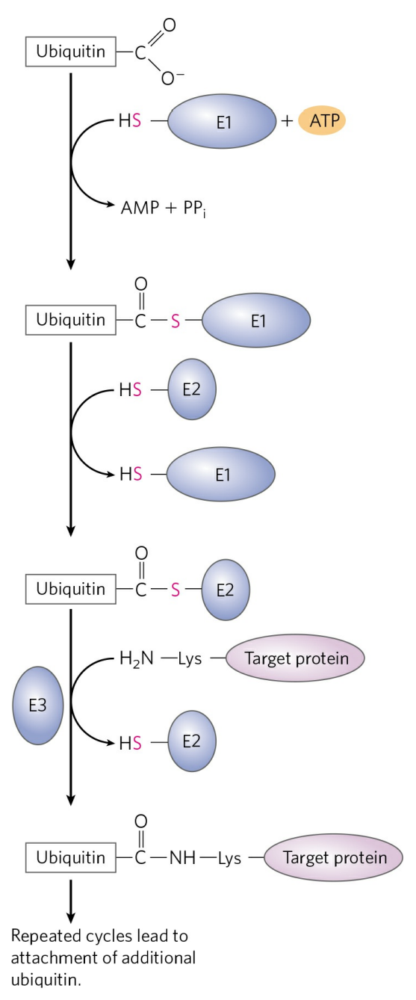
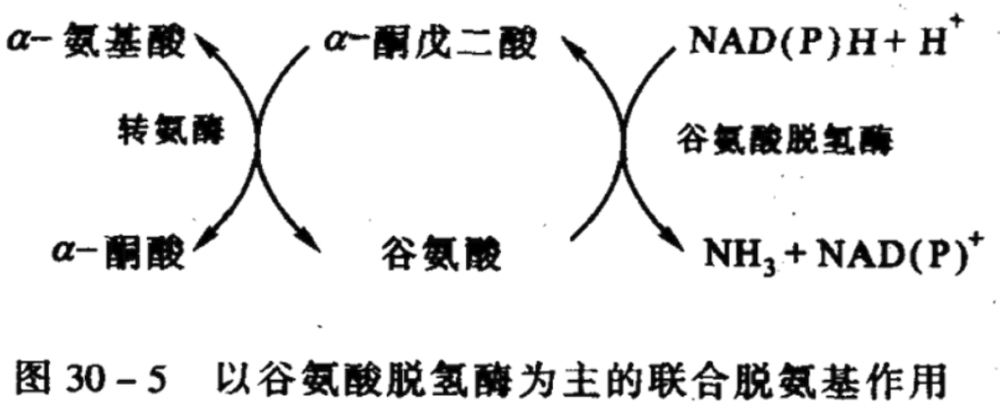
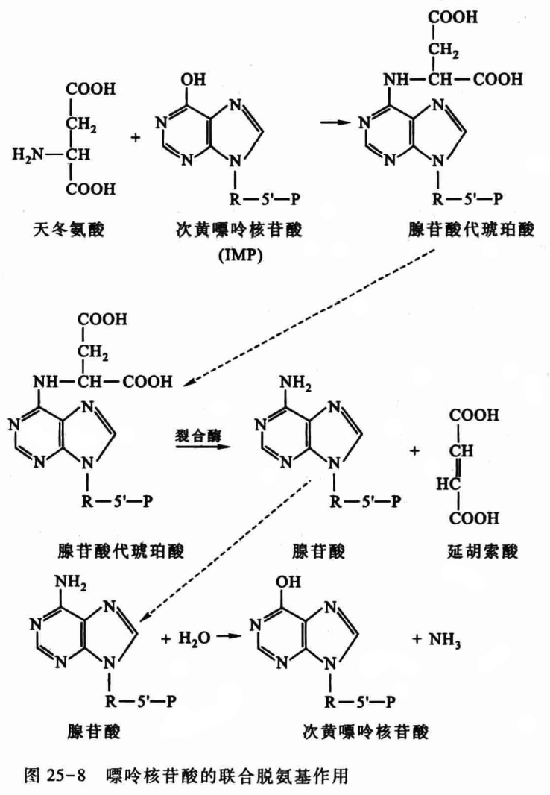

# 蛋白质降解和氨基酸的分解代谢

## 蛋白质的降解

+ 蛋白质在溶酶体通过 $ATP$ 非赖途被降解:
  + 溶酶体的主要功能是消化作用, 是细胞内的消化器官. 溶酶体含有多种蛋白酶, 这些蛋白酶对所降解的蛋白质选择性较差, 主要降解细胞外来的蛋白, 膜蛋白和胞内长寿蛋白质.
  
+ 蛋白质在蛋白酶体通过ATP依赖途径被降解:
  + 蛋白质通过此途径需要泛素的参与, 在 $E1, E2, E3,$ 三种酶的参与下, 经过一系列级联反应将泛素连接在靶蛋白上, 然后蛋白酶体特异性的识别泛素标记的蛋白质并将其降解并释放出泛素, 以备下一次循环利用
  + 泛素是一种小分子蛋白质, 普遍存在于真核细胞内. 一级结构高度保守, 它能与被降解的蛋白质共价结合, 使后者活化, 然后被蛋白酶降解.
  
  

## 氨基酸的分解代谢

+ 概述
  1. 氨基酸代谢库
     + 食物蛋白质经消化吸收的氨基酸, 体内组织蛋白质降解产生的氨基酸和体内合成的非必须氨基酸共同分布于体内各处, 参与代谢, 称为氨基酸代谢库
  2. 氨基酸的生物功能
     1. 作为蛋白质, 多肽, 酶合成的原料.
     2. 提供人体必需氨基酸, 具有营养作用.
     3. 是体内重要的调节物质, 如氨基酸激素, 神经递质.
     4. 是体内氨的运输, 储存形式, 可转变生成尿素.
     5. 代谢转变生成糖, 脂, 氧化供能. 提供核苷酸, 核苷酸辅酶合成的原料.
     6. 代谢产生体内的特殊基团, 生理活性物质.
  3. 氨基酸的去向
     1. 重新合成蛋白质(蛋白质周转)
     2. 合成血红素, 活性胺, $GSH$, 核苷酸, 辅酶等
     3. 彻底分解, 提供能量
     4. 多余的氨基酸转化为葡萄糖, 脂肪酸, 酮体等
  4. 氨基酸的分解一般分三步
     + 第一步: 脱氨基作用, 脱下来的氨基或转变为氨 $NH_3$, 或转化为天冬氨酸或谷氨酸的氨基.
     + 第二步: 氨与天冬氨酸的氨原子结合, 成为尿素并被释放.
     + 第三步: 氨基酸的碳骨架转化为一般的代谢中间体.
+ 脱氨基作用
  1. 转氨基作用
     + 在转氨酶作用下, 某一氨基酸去掉 $\alpha-$氨基生成相应的 $\alpha-$酮酸, 而另一种 $\alpha-$酮酸得到此氨基生成相应的氨基酸的过程
       + $\alpha $酮戊二酸和谷氨酸
       + 天冬氨酸和草酰乙胺
       + 丙氨酸和丙酮酸
     + 转氨酶的辅酶: 迄今发现的转氨酶都以磷酸吡哆醛($PLP$)为辅基, 它与酶蛋白以牢固的共价键形式结合
     + 重要的转氨酶有:
       + 谷丙转氨酶($GPT$)或丙氨酶氨基转移酶($ALT$)
       + 谷草转氨酶($GOT$)或天冬氨酸氨基转移酶($AST$)
     + 查肝功为什么要抽血化验转氨酶指数呢?
       + 肝细胞中转氨酶活力比其他组织高出许多, 是血液的 $100$ 倍. 血清酶检测常包括丙氨酸氨基转移酶($ALT$)和门冬氨酸氨基转移酶($AST$)等.
       + 在各种酶试验中, $ALT$ 和 $AST$ 能敏感地反映肝细胞损伤与否及损伤程度. 各种急性病毒性肝炎, 药物或酒精引起急性肝细胞损伤时, 血清 $ALT$ 最敏感, 在临床症状如黄疸出现之前 $ALT$ 就急剧升高, 同时 $AST$ 也升高, 但是 $AST$ 升高程度不如 $ALT$. 而在慢性肝炎和肝硬化时, $AST$ 升高程度超过 $ALT$, 因此 $AST$ 主要反映的是肝脏损伤程度. (结合乙肝抗原等指标进-步确定是什么原因引起的)
  2. 联合脱氨基作用
     + 氨基酸脱下的氨基聚集在 $\alpha-$酮戊二酸上生成谷氨酸, 谷氨酸在谷氨酸脱氢酶的作用下生成 $\alpha-$酮戊二酸和氨
       + 此种方式既是氨基酸脱氨基的主要方式, 也是体内合成非必需氨基酸的主要方式.
       + 主要在肝, 肾和脑组织进行.
       + 关键酶: $L-$谷氨酸脱氢酶, 辅酶为 $NAD^+$
       + 转氨基作用与谷氨酸脱氢作用的结合被称为转氨脱氨作用, 又称联合脱氨作用.
         
     + 氨基酸通过嘌呤核苷酸循环脱去氨基
       + 氨基酸通过转氨基作用将氨基转给草酰乙酸生成天冬氨酸,天冬氨酸与次黄嘌呤核苷酸反应生成腺苷酸代琥珀酸,后者裂解释放延胡索酸和腺嘌呤核苷酸.腺嘌呤核昔酸在腺苷酸脱氨酶的作用下生成次黄嘌呤核苷酸和氨
       + 心肌, 骨骼肌
         
  3. 氨基酸通过氨基酸氧化酶脱去氨基
     + $L-$氨基酸氧化酶, $D-$氨基酸氧化酶
       + $L-$氨基酸氧化酶: 催化 $L-$氨基酸氧化脱氨, 体内分布不广泛, 最适 $pH=10$ 左右, 以 $FAD$ 或$FMN$ 为辅基. 在动物体内仅分布于肝, 肾且活性不高, 因此作用不大.
       + $D-$氨基酸氧化酶: 主要存在于肾脏, 以 $FAD$ 为辅基. 但体内 $D-$氨基酸不多.
       + $L-$谷氨酸脱氢酶: 专一性强, 分布广泛(动, 植, 微生物), 活力强, 以 $NAD^+$ 或 $NADP^+$ 为辅酶. 是别构酶, 别构抑制剂: $ATP, GTP$; 别构激活剂: $ADP,GDP$
  4. 非氧化脱氨
     + 还原脱氨基
     + 脱水脱氨基
     + 水解脱氨基
     + 脱硫氢基脱氨基

## 脱羧基作用

$$
\begin{aligned}
&谷氨酸\longrightarrow \gamma-氨基丁酸+CO_2\\
&天冬氨酸\longrightarrow \beta-丙氨酸+CO_2\\
&赖氨酸\longrightarrow 尸胺+CO_2\\
&鸟氨酸\longrightarrow 腐胺+CO_2\\
&丝氨酸\longrightarrow乙醇胺\longrightarrow单间\longrightarrow卵磷脂\\
&色氨酸\longrightarrow吲哚丙酮酸\longrightarrow吲哚乙醛\longrightarrow吲哚乙酸\\
&组氨酸\longrightarrow组胺\longrightarrow降压\\
&酪氨酸\longrightarrow酪胺\longrightarrow升压
\end{aligned}
$$

## 氨的代谢

+ 氨的重要来源
  + 氨基酸脱氨基作用和胺类分解均可产生氨
  + 肠道细菌腐败作用产生氨
  + 肾小管上皮细胞分泌的氨主要来自谷氨酰胺
+ 氨的去路
  + 排氨生物: 以 $NH_3$ 转变成酰胺($GIn$), 运到排泄部位后再分解. (原生动物, 线鱼和鱼类)
  + 以尿酸排出: 将 $NH_3$ 转变为溶解度较小的尿酸排出. 通过消耗大量能量而保存体内水分. (陆生爬虫及鸟类)
  + 以尿素排出: 经尿素循环(肝脏)将 $NH_3$ 转变为尿素而排出.(哺乳动物)
  + 重新利用合成氨基酸: 合成酰胺(高等植物中)
  + 嘧啶环的合成(核酸代谢)
+ 氨的转运
+ .svg)
  1. 氨通过丙氨酸 - 葡萄糖循环从骨骼肌运往肝
     + 丙氨酸 - 葡萄糖循环: 骨骼肌中的氨基酸经转氨基作用将氨基转给丙酮酸生成丙氨酸, 丙氨酸经血液运往肝. 在肝中, 丙氨酸通过联合脱氨基作用, 生成丙酮酸, 并释放氨. 氨用于合成尿素, 丙酮酸经糖异生途径生成葡萄糖. 葡萄糖由血液运往肌肉, 沿糖酵解途径转变成丙酮酸, 后者再接受氨基生成丙氨酸. 丙氨酸和葡萄糖周而复始的转变, 完成骨骼肌和肝之间氨的转运
  2. 氨通过谷氨酰胺从脑和骨骼肌等组织运往肝或肾
     + 氨与谷氨酸在谷氨酰胺合成酶的催化下合成谷氨酰胺, 并由血液运往肝或肾, 在经谷氨酰胺酶水解成谷氨酸及氨
+ 氨在肝内合成尿素是氨的主要代谢去路
  1. 尿素循环=鸟氨酸循环
     + 是体内氨的主要去路,在肝脏合成
     + 步骤
       + $NH_3,CO_2$ 和 $ATP$ 缩合生成氨基甲酰磷酸
         + 在镁离子, $ATP$, 及 $N-$乙酰谷氨酸($AGA$)存在时, $NH_3$ 与 $CO_2$ 可由氨基甲酰磷酸合成酶$-1$($CPS-1$)催化生成氨基甲酰磷酸
         + 关键酶: 氨基甲酰磷酸合成酶$-1$($CPS-1$)
       + 氨基甲酰磷酸与鸟氨酸反应生成瓜氨酸
         + 以上两步反应在线粒体
       + 瓜氨酸与天冬氨酸反应生成精氨酸代琥珀酸
         + 关键酶:精氨酸代琥珀酸合成酶
       + 精氨酸代琥珀酸裂解生成精氨酸与延胡索酸
       + 精氨酸水解释放尿素并再生成乌氨酸
         + 鸟氨酸进入线粒体,参与瓜氨酸的合成
     + 调节
       + 高蛋白膳食促进尿素合成
       + $AGA$ 激活氨基甲酰磷酸合成酶$-1$($CPS-1$)启动尿素合成
       + 精氨酸代琥珀酸合成酶活性促进尿素合成
     + 总结
       + 原料
         + $2$ 分子氨, 一个来自于游离氨, 另一个来自天冬氨酸
         + (间接来自氨基酸脱氨基)
       + 产物
         + 尿素(水溶性强, 随尿液排出体外)
       + 场所
         + 线粒体 - 胞液 - 线粒体
       + 耗能
         + $3$ 个 $ATP$, $4$ 个高能磷酸键
       + 关键酶
         + $CPS-1$, 精氨酸代琥珀酸合成酶
       + 意义
         + 解氨毒
         + .svg)

## 氨基酸的其他代谢

### 氨基酸碳架的去向

+ 概述
  + 20种氨基酸的碳架可转化成7种物质: 丙酮酸, 乙酰 $CoA$, 乙酰乙酰 $CoA$, $\alpha-$酮戊二酸, 琥珀酰 $CoA$, 延胡索酸, 草酰乙酸.
  + 最后集中为 $5$ 种物质进入 $TCA$: 乙酰$CoA$, $\alpha-$酮戊二酸, 琥珀酰 $CoA$, 延胡索酸, 草酰乙酸.
+ 形成乙酰$-CoA$ 的途径
  + 通过丙酮酸到乙酰$-CoA$ 的途径($Ala, Gly, Ser, Thr, Cys$)
  + 通过乙酰乙酰 $CoA$ 到乙酰$-CoA$ 的途径($Phe, Tyr, Leu, Lys, Trp$)
+ 形成 $\alpha-$酮戊二酸途径($Arg, His, GIn, Pro, Glu$)
+ 形成琥珀酰  $CoA$ 途径($Met, Ile, Val$)
+ 延胡索酸途径: $Phe, Tyr$ 可生成延胡索酸
+ 形成草酰乙酸途径: $Asp$ 和 $Asn$ 可转变成草酰乙酸进入 $TCA$, $Asn$  先转变成 $Asp$($Asn$ 酶), $Asp$ 经转氨作用生成草酰乙酸

### 生糖氨基酸与生酮氨基酸

1. 生酮氨基酸:Phe,Tyr.Trp.Leu,Lys.
   + 在分解过程中转变为乙酰乙酰 $CoA$, 后者在动物肝脏中可生成乙酰乙酸和$$\beta-$羟丁酸(酮体)
2. 生糖氨基酸
   + 凡能生成丙酮酸, $\alpha-$酮戊二酸, 琥珀酸, 延胡索酸, 草酰乙酸的氨基酸都称为生糖氨基酸, 它们都能生成葡萄糖.
3. $Phe, Tyr$ 是生酮兼生糖氨基酸

### 一碳单位
+ 一碳单位: 是指某些氨基酸在分解代谢过程中产生的含有一个碳原子的基团, 包活甲基, 甲酰基等. 一碳单位不能游离存在, 常与四氢叶酸结合而转运和参与代射. 四氢叶酸是一碳单位的运载体
+ 一碳单位主要来自丝氨酸, 甘氨酸, 组氨酸和色氨酸的分解代谢
+ 一碳单位由氨基酸生成的同时即结合在四氢叶酸的 N5, N10上.
  + N5 结合甲基或亚胺甲基
  + N5 和 N10 结合甲基或者甲炔基
  + N5 或 N10 结合甲酰基
+ 碳单位的主要功能是参与嘌呤和嘧啶的合成
  + 为嘌哈合成提供 C2 和 C8
  + 为胸腺密啶核苷酸合成提供甲基

### 甲硫氨酸循环

.svg)

+ 甲硫氨酸与 $ATP$ 反应生成 $S-$腺苷甲硫氨酸($SAM$), 后者脱去一个甲基变成 $S-$腺苷同型半胱氨酸, $S-$腺昔同型半胱氨酸脱去腺苷生成同型半胱氨酸, 后者接受四氢叶酸的甲基重新生成甲硫氨酸
+ 甲硫氨酸循环的意义
  + 由四氢叶酸供给甲基生成甲硫氨酸, 在通过此循环的 $SAM$ 提供甲基, 以进行体内广泛存在的甲基化反应, 四氢叶酸可以看成是体内甲基的间接供体
  + $SAM$ 是体内的甲基最重要的直接供体

### 芳香族氨基酸的代谢

+ 苯丙氨酸羟化成酪氨酸
+ 酪氨酸转变为儿茶酚胺和黑色素或彻底氧化分解
+ 色氨酸分解代谢可产生丙酮酸和乙酰乙酰辅酶 $A$ 

### 氨基酸与生物活性物质

1. 酪氨酸代谢与黑色素的形成
2. 酪氨酸代谢和肾上腺素、去甲肾上腺素、多巴及多巴胺的形成
   + 儿茶酚胺: 多巴胺, 去甲肾上腺素, 肾上腺素统称为儿茶酚胺
   + 酪氨酸羟化酶是合成儿茶酚胺的关键酶
3. 色氨酸代谢与 $5-$羟色胺及吲哚乙酸
   + $5-$羟色胺是脊椎动物的一种神经递质, 在神经系统中的含量与神经的兴奋和抑制状态有密切关系, 也是一种血管收缩素.
   + 吲哚乙酸是一种植物生长激素
   + 二者都是由色氨酸形成的
4. 肌酸和磷酸肌酸的形成
   + 肌酸存在于动物的肌肉, 脑和血液. 既可以游离形式存在,也可以磷酸化形式存在. 后者称为磷酸肌酸. 肌酸和磷酸肌酸在贮存和转移磷酸键能中起重要作用(参与肌酸合成的有 $3$ 种氨基酸: 精氨酸, 甘氨酸和甲硫氨酸)
5. 组胺的形成
   + 肺, 肝, 胃黏膜的壁细胞, 肌肉, 乳腺及神经组织都有组胺存在. 它是一种强烈的血管舒张物质, 浓度过高可引起虚脱. 创伤性休克或炎症病变部位都有组胺释放. 它还有刺激胃黏膜分泌胃蛋白酶和胃酸的作用. 在神经组织中它是感觉神经的一种递质, 和周围神经的感觉与传递有密切关系.
   + 组胺是组氨酸脱羧基的产物
6. 腐胺, 精胺, 亚精胺(精脒)的形成
   + 腐胺名称的起源是因为它发现于腐败的肉中. 它是鸟氨酸脱羧的产物, 鸟氨酸来源于精氨酸的水解
   + 亚精胺和精胺名称的来源是因为它们发现于人的精液中. 这两种物质在法律上一直用于鉴定犯罪事实.
   + 亚精胺来源于腐胺.
7. 谷氨酸和 $\gamma-$氨基丁酸
   + 谷氨酸在动物脑中含量占全身各组织的首位. 在脑和脊髓中是一种广泛存在的具有兴奋作用的神经递质.
   + 谷氨酸脱羧形成 $\gamma-$氨基丁酸(简称 $GABA$), 可增加突触后神经元细胞膜对 $Na^+$ 的通透性, 使神经元细胞膜超极化, 从而提高动作电位的启动阈值, 因此, 是脑组织中具有抑制作用的神经递质.
8. 牛磺酸和半胱氨酸
   + 牛磺酸来源于半胱氨酸氧化脱羧,牛磺酸是某些胆酸的组分,也被认为是一种抑制性神经递质
9. 氧化氮的形成
   + 精氨酸在氧化氮合酶的催化下形成氧化氮和瓜氨酸
10. 谷胱甘肽
    + 甘氨酸
    + $\gamma-$谷氨酸
    + 半胱氨酸
11. 卟啉, 血红素的生物合成
    + 卟啉是从琥珀酰辅酶 $A$ 及甘氨酸衍生而来
    + 血红素合成的原料是琥珀酰辅酶 $A$ 和甘氨酸