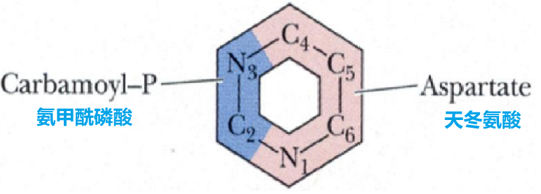

# 核酸的降解和核苷酸的代谢

[toc]

## 核苷酸代谢作用

+ 作为核酸合成的原料
+ 体内能量的利用形式($ATP, GTP$)
+ 参与代谢和生理调节($cAMP, cGMP$)
+ 组成辅酶($FAD, NAD^+, NADP^+, HS-CoA$)
+ 活化中间代谢物($UDPG, CDP-$胆碱, $SAM$ 等)

## 核苷酸的解聚作用

+ 核酸酶, 作用于核酸的磷酸二酯酶称为核酸酶

  + 按作用位置分为

    + 核酸外切酶: 作用于核酸链的末端($3'$ 端或 $5'$ 端), 逐个水解下核苷酸. 脱氧核糖核酸外切酶只作用于 $DNA$; 核糖核酸外切酶: 只作用于 $RNA$
    + 核酸内切酶: 从核酸分子内部切断 $3,5-$磷酸二酯键.
    + 限制性内切酶: 原核生物中存在着一类能识别外源 $DNA$ 双螺旋中 $4\sim8$ 个碱基对所组成的特异的具有二重旋转对称性的回文序列, 并在此序列的某位点水解 $DNA$ 双螺旋链, 产生粘性末端或平末端,这类酶称为限制性内切酶.

  + 核苷酸的降解

    + $$
      \ce{核酸 ->[核酸酶] 核苷酸->[核苷酸酶] 核苷+磷酸 <=>[核苷酸酸化酶]碱基+戊糖-1-磷酸 }\\
      \ce{核苷->[核苷水解酶]碱基+核糖}
      $$

## 嘌呤核苷酸的合成代谢

### 从头合成

+ 定义: 利用磷酸核糖, 氨基酸, 一碳单位及二氧化碳等简单物质为原料, 经过一系列酶促反应, 合成嘌呤核苷酸, 反应可分为两个阶段: 首先合成次黄嘌呤核苷酸, 然后次黄嘌呤核苷酸再转变成腺嘌呤核苷酸与鸟嘌呤核苷酸

+ 原料

  + 磷酸核糖, 氨基酸, 一碳单位及二氧化碳

  + 甲酰基来自于四氢叶酸, 一碳单位提供 

  + $C$ 和 $N$ 的来源

    + $6$ 号碳来自二氧化碳
    + $2$ 号碳自一碳单位
    + $7$ 号氮来自甘氨酸
    + $8$ 号碳来自一碳单位

  + $3, 9$ 号氮来自谷氨酰胺

  + $1$ 号氮来自天冬氨酸

    

+ 过程

+ 

+ 

  1. $IMP$(次黄嘌呤核苷酸)的合成
     + 核糖$-5'-$磷酸经过 $PRPP$ 合成酶作用, 活化生成磷酸核糖焦磷酸($PRPP$)
     + 谷氨酰胺提供酰胺基取代PRPP上的焦磷酸, 形成 $5-$磷酸核糖胺($PRA$), 此反应由磷酸核糖酰胺转移酶($PRPP$ 酰胺转移酶)催化
     + $ATP$ 供能, 甘氨酸与 $PRA$ 加合, 生成甘氨酰胺核苷酸($GAR$)
     + 经过一系列复杂的反应生成 $IMP$
  2. $AMP$ 和 $GMP$ 的生成
     + 由 $IMP$ 转化而来
     + $AMP,GMP,IMP$ 之间可以相互转变
     + $AMP$ 和 $GMP$在激酶的催化下, 可以生成 $ATP,GTP$
  3. 脱氧核苷酸的生成在二磷酸水平进行
     + 腺苷酸还原酶催化 $NDP$ 生成 $dNDP$ 
     + $NADPH$ 提供氢
     + 核糖核苷酸的还原$-dADP,dGDP,dUDP,dCDP$的生成

+ 注意

  + 嘌呤核苷酸是在磷酸核糖分子上逐步合成嘌呤环的
  + 嘧啶核苷酸先合成嘧啶环然后再与磷酸核糖结合
  + 肝是体内从头合成腺嘌呤核苷酸的主要器官, 其次是小肠粘膜和胸腺. 并不是所有的细胞都有从头合成腺嘌呤核苷酸的能力

### 补救合成

+ 原料
  + 游离的嘌呤和嘌呤核苷
+ 补救合成有两种方式
  1. 利用现成的嘌呤碱或嘌呤核苷重新合成嘌呤核苷酸
  2. 嘌呤核苷通过腺苷激酶催化的磷酸化反应, 是腺嘌呤核苷生成腺嘌呤核苷酸
+ 关键酶
  + 腺嘌呤磷酸核糖转移酶($APRT$), 次黄嘌呤 - 鸟嘌呤磷酸核糖转移酶($HGPRT$)
    + $HGPRT$ 缺乏 - 自毁容貌症
  + 腺苷激酶
+ 脑, 骨髓等只能进行此途径
+ 补救合成的意义
  1. 减少能量和氨基酸的消耗
  2. 弥补某些组织(脑, 骨髓)不能从头合成嘌呤核苷酸的不足.

### 嘌呤核苷酸的抗代谢物

+ 主要以竞争性抑制剂的方式干扰或阻断嘌呤核苷酸的合成代谢,从而进一步阻止核酸以及蛋白质的生物合成

1. 嘌呤类似物:
   + $6-$疏基嘌呤, $6-$疏基鸟嘌呤, $8-$氨杂鸟嘌呤
   + $6-$疏基嘌呤与次黄嘌呤相似
2. 氨基酸类似物
   + 氮杂丝氨酸, $6-$重氮$-5-$氧正亮氨基酸
   + 他们的结构与谷氨酰胺相似
3. 叶酸类似物
   + 氨蝶呤和甲氨蝶呤

	## 嘌呤核苷酸的分解代谢

+ 嘌呤核苷酸的分解代谢终产物是尿酸
+ 临床上常用别嘌呤醇治疗痛风症
  + 痛风症: 就是尿酸排泄障碍引起的
  + 饮食上注意:
    + 不吃海鲜, 尤其是鱿鱼, 墨鱼, 虾, 螃蟹
    + 不吃蘑菇, 尤其是香菇(香菜, 紫菜)
    + 少吃肉类, 尤其是动物内脏
    + 不喝酒, 尤其是啤酒点滴不沾
    + 饮食要清淡, 少油腻少盐, 多吃粗粮好
+ 分解过程

	1. $AMP$ 生成次黄嘌呤, 后者再黄嘌呤氧化酶的作用下氧化成黄標呤最后生成尿酸.
	1. $GMP$ 生成鸟嘌呤, 后者转变成黄嘌呤, 在黄嘌呤氧化酶的作用下, 最后生成尿酸
	3. 别嘌呤醇与次黄嘌呤结构类似, 可以抑制黄嘌呤氧化酶, 从而抑制尿酸的生成

## 嘧啶核苷酸的合成代谢

### 从头合成

+ 运用谷氨酰胺,二氧化碳和天冬氨酸等简单物质为原料,经过一系列酶促反应最终生成嘧啶核苷酸

+ 原料

  + 谷氨酰胺,  二氧化碳和天冬氨酸

  + N和C的来源

    + $4, 5, 6$ 碳和 $1$ 号氮来自天冬氨酸
    + $2$ 号碳和 $3$ 号氨来自氨基甲酰磷酸

  + 氨甲酰磷酸由谷氨酰胺和二氧化碳合成

    

+ 合成过程

  1. 尿嘧啶核苷酸(UMP)的合成
     + 氨基甲酰磷酸的生成
       + 尿素中的氨基甲酰磷酸是在线粒体中又氨基甲酰磷酸合成酶催化生成的
       + 嘧啶合成的氨基甲酰磷酸是在细胞质中用谷氨酰胺为 $N$ 源, 由氨基甲酰磷酸合成酶催化生成的
     + 氨基甲酰磷酸在天冬氨酸氨基转移酶催化, 与天冬氨酸化合生成氨基甲酰天冬氨酸
     + 经过一系列反应, 生成UMP
  2. CTP的合成
     + 尿嘧啶核昔酸生成三磷酸尿嘧啶核苷, 在 $CTP$ 合成酶的作用下生成 $CTP$
  3. 脱氧胸腺核苷酸的合成($dTMP$ 或 $TMP$)
     + $dTMP$ 由脱氧尿嘧啶核苷酸($dUMP$)甲基化合成(一碳单位作为甲基供体)
     + $dUMP$ 的来源
       + $dUDP$ 水解脱磷酸
       + $dCMP$ 脱氨基, 以这种为主要来源

+ 调节

  + 细菌中, 天冬氨酸氨基甲酰转移酶是嘧啶核苷酸从头合成的主要调节酶
  + 哺乳动物中, 嘧啶核苷酸的主要调节酶是氨基甲酰磷酸合成酶$-II$
  + 嘧啶和嘌呤的的合成有着协调控制的关系
    + $PRPP$ 合成酶是嘧啶和嘌呤核苷酸合成过程中共同需要的酶

+ 补救合成

  + 嘧啶磷酸核糖转移酶是嘧啶核苷酸补救合成的主要酶

+ 嘧啶核苷酸的抗代谢物

  + 嘧啶, 氨基酸或叶酸等的类似物
  + $5-Fu$ 尿嘧啶
  + 重氮丝氨酸
  + 甲氨蝶呤
  + 三甲氧苄二氨嘧啶

## 嘧啶核苷酸的分解代谢

+ 尿嘧啶
  + 尿嘧啶还原成二氢尿嘧啶,最终生成: $NH_3$, 二氧化碳及 $\beta-$丙氨酸
+ 胞嘧啶
  + 胞嘧啶脱氨基转变成尿嘧啶
+ 胸腺嘧啶
  + 分解成b-氨基异丁酸
+ 胸腺嘧啶核苷酸($dTMP$)是脱氧核糖核酸的组成部分, 它是由尿嘧啶脱氧核糖核苷酸($dUMP$)经甲基化而生成.
+ 催化尿嘧啶脱氧核糖核苷酸甲基化的酶称为胸腺嘧啶核苷酸合酶(thymidylate synthase).
  
+ 合成胸腺嘧啶核苷酸时所需要的底物尿嘧啶脱氧核苷酸, 可以由尿嘧啶核苷二磷酸还原成尿嘧啶脱氧核苷二磷酸, 经磷酸化成为尿嘧啶脱氧核苷三磷酸, 再经尿嘧啶脱氧核苷三磷酸酶转变成尿嘧啶脱氧核苷一磷酸.
+ 另一条途径是由胞嘧啶脱氧核苷三磷酸脱氨, 经尿嘧啶脱氧核苷三磷酸再转变成尿嘧啶脱氧核苷酸. 这在不同生物体内可能不一样. 胸苷酸(thymidylate)的合成途径如下:
  