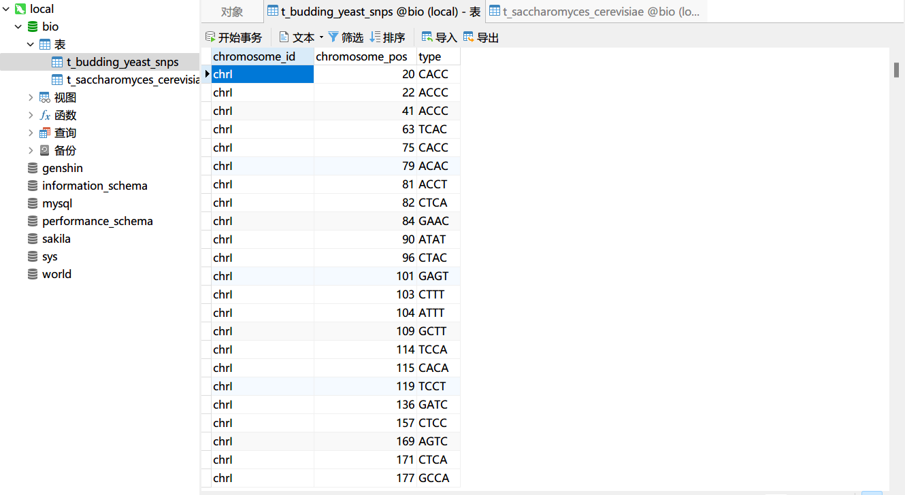
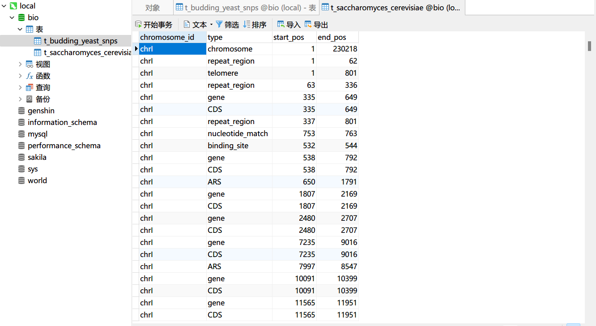
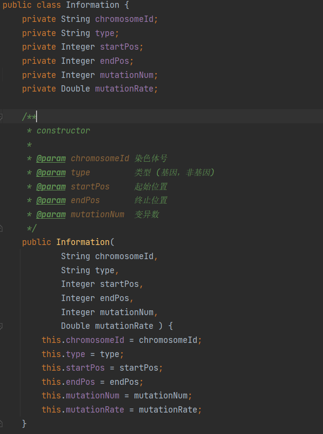
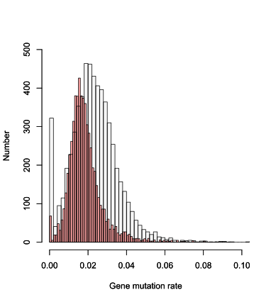

# **出芽酵母单核苷酸突变特征**

## 成员与分工

+ 生信 2001 张子栋
  + 代码实现
  + 项目展示
  + 实验报告书
+ 生信 2002 梁国相
  + 思路与模型建立
  + 代码校对
  + R 语言绘图

# 基因序列和非基因序列突变率的差异

## 实验思路

使用 Java 通过 MyBatis 操作数据库，完成统计量计算；再通过 R 绘图。

## 数据预处理

### 数据导入

利用 Navicat 导入向导，导入`Budding	Yeast_SNPs.txt` `saccharomyces_cerevisiae_R64-1-1_20110208.gff` 文件到 MySQL 数据库

其中，`saccharomyces_cerevisiae_R64-1-1_20110208.gff` 文件仅提取第 1，3，4，5 列为有效信息





## 创建实体类

`Information` 类，存储基因位置

```java
package com.zidongzh.pojo;

/**
 * @author ZidongZh
 * @date 2022/3/3
 */
public class Information {
    private String chromosomeId;
    private String type;
    private Integer startPos;
    private Integer endPos;

    /**
     * constructor
     *
     * @param chromosomeId 染色体号
     * @param type         类型 (基因，非基因)
     * @param startPos     起始位置
     * @param endPos       终止位置
     */
    public Information(
            String chromosomeId,
            String type,
            Integer startPos,
            Integer endPos) {
        this.chromosomeId = chromosomeId;
        this.type = type;
        this.startPos = startPos;
        this.endPos = endPos;
    }

    @Override
    public String toString() {
        return "Information{" +
                "chromosomeId='" + chromosomeId + '\'' +
                ", type='" + type + '\'' +
                ", startPos=" + startPos +
                ", endPos=" + endPos +
                '}';
    }

    // getter and setter


    public String getChromosomeId() {
        return chromosomeId;
    }

    public void setChromosomeId(String chromosomeId) {
        this.chromosomeId = chromosomeId;
    }

    public String getType() {
        return type;
    }

    public void setType(String type) {
        this.type = type;
    }

    public Integer getStartPos() {
        return startPos;
    }

    public void setStartPos(Integer startPos) {
        this.startPos = startPos;
    }

    public Integer getEndPos() {
        return endPos;
    }

    public void setEndPos(Integer endPos) {
        this.endPos = endPos;
    }

}

```

`Mutation` 类，存储变异信息。

```java
package com.zidongzh.pojo;

/**
 * @author ZidongZh
 * @date 2022/3/3
 */
public class Mutation {
    private String chromosomeId;
    private Integer chromosomePos;
    private String type;

    /**
     * constructor
     *
     * @param chromosomeId  染色体号
     * @param chromosomePos 染色体位置
     * @param type          变异类型
     */
    public Mutation(
            String chromosomeId,
            Integer chromosomePos,
            String type) {
        this.chromosomeId = chromosomeId;
        this.chromosomePos = chromosomePos;
        this.type = type;
    }

    @Override
    public String toString() {
        return "Mutation{" +
                "chromosomeId='" + chromosomeId + '\'' +
                ", chromosomePos=" + chromosomePos +
                ", type='" + type + '\'' +
                '}';
    }

    // getter and setter

    public String getChromosomeId() {
        return chromosomeId;
    }

    public void setChromosomeId(String chromosomeId) {
        this.chromosomeId = chromosomeId;
    }

    public Integer getChromosomePos() {
        return chromosomePos;
    }

    public void setChromosomePos(Integer chromosomePos) {
        this.chromosomePos = chromosomePos;
    }

    public String getType() {
        return type;
    }

    public void setType(String type) {
        this.type = type;
    }
}

```

## 数据处理

对 `saccharomyces_cerevisiae_R64-1-1_20110208` 数据中基因重叠起始位置的处理

```java
    /**
     * 合并重叠基因区间
     *
     * @param information 原始数据
     */
    void connect(List<Information> information) {
        int i = 0;
        int j = 1;
        Information previous = null;
        Information next = null;
        while (j < information.size()) {
            previous = information.get(i);
            next = information.get(j);
            if (previous.getEndPos() >= next.getStartPos() && previous.getEndPos() <= next.getEndPos()) {
                previous.setEndPos(next.getEndPos());
                information.remove(j);
                information.set(i, previous);
            } else {
                i++;
                j++;
            }
        }
    }
```

获取非基因区间

```java
    /**
     * @param genes       基因信息
     * @param chromosomes 染色体信息
     * @return 非基因区间
     */
    List<Information> getNonGenes(List<Information> genes,
                                  List<Information> chromosomes) {
        int pos = 0;

        List<Information> nonGenes = new ArrayList<>();
        Information nonGeneHead = new Information(chromosomes.get(0).getChromosomeId(), "nonGene", 1, genes.get(0).getStartPos() - 1);
        nonGenes.add(nonGeneHead);
        for (int i = 0; i < chromosomes.size(); i++) {
            for (int j = 0; j < genes.size(); j++) {
                if (genes.get(j).getChromosomeId().equals(chromosomes.get(i).getChromosomeId()) &&
                        genes.get(j + 1).getChromosomeId().equals(chromosomes.get(i).getChromosomeId())) {
                    Information nonGene = new Information(genes.get(j).getChromosomeId(), "nonGene", genes.get(j).getEndPos() + 1, genes.get(j + 1).getStartPos() - 1);
                    nonGenes.add(nonGene);
                    pos = j + 2;
                }
            }
            if (null != genes.get(pos)){
                System.out.println(genes.get(pos));
                Information nonGeneHead1 = new Information(genes.get(pos).getChromosomeId(), "nonGene", 1, genes.get(pos).getStartPos() - 1);
                nonGenes.add(nonGeneHead1);
            }
        }
        return nonGenes;
    }
```

### 统计变异数

在 `Information` 类中添加属性 `mutationNum` 与 `mutationRate`



### 获取变异数 计算变异率 并存入数据库

```java
//计算变异数与变异率
for (int i = 0; i < allMutation.size(); i++) {
    for (int j = 0; j < genes.size(); j++) {
        if (allMutation.get(i).getChromosomeId().equals(genes.get(j).getChromosomeId()) && allMutation.get(i).getChromosomePos() >= genes.get(j).getStartPos() &&
            allMutation.get(i).getChromosomePos() <= genes.get(j).getEndPos()) {
            genes.get(j).setMutationNum(genes.get(j).getMutationNum() + 1);
            genes.get(j).setMutationRate((double) genes.get(j).getMutationNum() / (double) (genes.get(j).getEndPos() - genes.get(j).getStartPos() + 1));
        }
    }
    for (int j = 0; j < nonGenes.size(); j++) {
        if (allMutation.get(i).getChromosomeId().equals(nonGenes.get(j).getChromosomeId()) && allMutation.get(i).getChromosomePos() >= nonGenes.get(j).getStartPos() &&
            allMutation.get(i).getChromosomePos() <= nonGenes.get(j).getEndPos()) {
            nonGenes.get(j).setMutationNum(nonGenes.get(j).getMutationNum() + 1);
            nonGenes.get(j).setMutationRate((double) nonGenes.get(j).getMutationNum() / (double) (nonGenes.get(j).getEndPos() - nonGenes.get(j).getStartPos() + 1));
        }
    }
}

//将基因与非基因添加到数据库
for (int i = 0; i < genes.size(); i++) {
    informationMapper.addGeneInfo(genes.get(i));
}
for (int i = 0; i < nonGenes.size(); i++) {
    informationMapper.addNonGeneInfo(nonGenes.get(i));
}

//提交修改至数据库
sqlSession.commit();
```

## 数据可视化

```R
> geneMutationRate = read.table(file.choose(), header = F, sep = ",")
> geneMutationRate = as.matrix(geneMutationRate)
> nonGeneMutationRate = read.table(file.choose(), header = F, sep = ",")
> nonGeneMutationRate = as.matrix(nonGeneMutationRate)
> hist(geneMutationRate, xlab="Gene mutation rate",ylab="Number",col=rgb(255, 0, 0, 90, maxColorValue=255), breaks = 100, xlim = c(0.0,0.1), ylim = c(0,500), main = NULL)
> par(new = T)
> hist(nonGeneMutationRate, xlab="Gene mutation rate",ylab="Number",col=rgb(2, 0, 0, 10, maxColorValue=255), breaks = 100, xlim = c(0.0,0.1), ylim = c(0,500), main = NULL)
```



## 假设检验

```java
	@Test
    public void bioTest() throws IOException {
        InputStream inputStream = Resources.getResourceAsStream("mybatis-config.xml");
        SqlSessionFactoryBuilder sqlSessionFactoryBuilder = new SqlSessionFactoryBuilder();
        SqlSessionFactory sqlSessionFactory = sqlSessionFactoryBuilder.build(inputStream);
        SqlSession sqlSession = sqlSessionFactory.openSession();

        InformationMapper informationMapper = sqlSession.getMapper(InformationMapper.class);

        List<Information> genes = informationMapper.getGenes();
        List<Information> nonGenes = informationMapper.getNonGenes();
        
        double geneMutRateMean = 0.0;
        double geneVariance = 0.0;
        
        double nonGeneMutRateMean = 0.0;
        double nonGeneVariance = 0.0;

        geneMutRateMean = getMean(genes);
        geneVariance = getVariance(genes, geneMutRateMean);
        System.out.println("geneMutRateMean = " + geneMutRateMean);
        System.out.println("geneVariance  = " + geneVariance);

        nonGeneMutRateMean = getMean(nonGenes);
        nonGeneVariance = getVariance(nonGenes, nonGeneMutRateMean);
        System.out.println("nonGeneMutRateMean = " + nonGeneMutRateMean);
        System.out.println("nonGeneVariance = " + nonGeneVariance);

        //t检验
        double t = 0.0;
        t = (geneMutRateMean - nonGeneMutRateMean) / (sqrt((((genes.size() - 1) * geneVariance) + ((nonGenes.size() - 1) * nonGeneVariance)) / (genes.size() + nonGenes.size() - 2)) * sqrt((1 / (double) genes.size()) + (1 / (double) nonGenes.size())));
        System.out.println("t = " + t);
        //u 检验
        double u = 0.0;
        u = (geneMutRateMean - nonGeneMutRateMean) / (sqrt((geneVariance / genes.size()) + (nonGeneVariance / nonGenes.size())));
        System.out.println("u = " + u);
    }
```

运行结果：

```
geneMutRateMean = 0.018604969719609406
geneVariance  = 8.597880264141603E-5
nonGeneMutRateMean = 0.023312667924136225
nonGeneVariance = 1.7675824048238737E-4
t = -22.612916116843113
u = -22.610982585720944
```

### U 检验

1. 提出: 

   + $H_0:\mu_1=\mu_2$ , 出芽酵母基因区间突变率与非基因区间突变率没有显著差异
   + $H_A: \mu_1\neq\mu_2$

2.  假定 $H_0$ 成立

3. 选取显著水平 $\alpha=0.01$

4. 统计量:
   $$
   s_{\overline{x_1}-\overline{x_2}}=\sqrt{\frac{s_1^2}{n_1}+\frac{s_2^2}{n_2}}\\
   u=\frac{\left ( \overline{x_1}-\overline{x_2}\right )}{s_{\overline{x_1}-\overline{x_2}}}
   $$
   设计程序计算得出 `u = -22.610982585720944` 
   $$
   |u|>2.58,\ P<0.01
   $$

5. 推断: 在 $0.01$ 显著水平上, 拒绝 $H_0$, 接受 $H_A$
   认为出芽酵母基因区间突变率与非基因区间突变率有显著差异

### T 检验

1. 提出: 

   + $H_0:\mu_1=\mu_2$ , 出芽酵母基因区间突变率与非基因区间突变率没有显著差异
   + $H_A: \mu_1\neq\mu_2$

2.  假定 $H_0$ 成立

3. 选取显著水平 $\alpha=0.01$

4. 统计量:
   $$
   t=\frac{\overline{x_1}-\overline{x_2}}{\sqrt{\frac{(n_1-1)s_1^2+(n_2-1)s_2^2}{n_1+n_2-2}}\sqrt{\frac{1}{n_1}+\frac{1}{n_2}}}
   $$
   设计程序计算得出 `t = -22.612916116843113`
   $$
   |t|>2.576,\ P<0.01
   $$

5. 推断: 在 $0.01$ 显著水平上, 拒绝 $H_0$, 接受 $H_A$
   认为出芽酵母基因区间突变率与非基因区间突变率有显著差异

### 使用 R 进行 T 检验

使用 R 内置的 T 检验，验算结果

```R
> t.test(geneMutationRate,nonGeneMutationRate)

	Welch Two Sample t-test

data:  geneMutationRate and nonGeneMutationRate
t = -22.611, df = 10825, p-value < 2.2e-16
alternative hypothesis: true difference in means is not equal to 0
95 percent confidence interval:
 -0.005115816 -0.004299580
sample estimates:
 mean of x  mean of y 
0.01860497 0.02331267 
```

与 Java 计算出的结果一致

# 突变方向的差异性

# 实验结果


# 生物学意义


# 完整代码

+ 源代码
  + GitHub: [Bluuur/BiostaticsProject1: 生物统计学课程项目1 (github.com)](https://github.com/Bluuur/BiostaticsProject1)
  + 同步至 Gitee: [BiostaticsProject1: 生物统计学课程项目1 (gitee.com)](https://gitee.com/bluur/BiostaticsProject1)
+ 实验报告
  + GitHub: [MarkdownNotes/Biostatics at main · Bluuur/MarkdownNotes (github.com)](https://github.com/Bluuur/MarkdownNotes/tree/main/Biostatics)
  + 同步至 Gitee: [Biostatics · blur/MarkdownNotes - 码云 - 开源中国 (gitee.com)](https://gitee.com/bluur/MarkdownNotes/tree/main/Biostatics)


