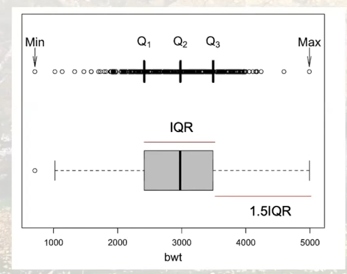

# Summary Statistics

+ Sample mean
  $$
  \overline{x}=\frac{\sum_i x_i}{n}
  $$

+ Sample median

+ Sample variance
  $$
  s^2=\frac{\sum\limits_{i=1}^{n} \left(x_i-\overline{x}\right)^2}{n-1}
  $$

+ Sample standard deviation
  $$
  s=\sqrt{\frac{\sum\limits_{i=1}^{n} \left(x_i-\overline{x}\right)^2}{n-1}}
  $$

# Quantiles

+ Median: the smallest value that greater than or equal to at least half of the values
+ qth quantile: the smallest value that greater than or equal to at least 100q% of the values
+ $1^{st}$ quantile Q1: the 25% quantile
+ $3^{rd}$ quantile Q3: the 75% quantile
+ Interquantile range (IQR): Q3-Q1

## Box plot

# Statistical Inference

+ Draw conclusions about a population from a sample 
+ Two approaches
  + Estimation with confidence
  + Hypothesis testing

## Estimation

+ Point estimation-summary statistics from sample to give an estimate of the true population parameter
  $$
  \overline{X}\to \mu\\
  s\to\sigma
  $$

  + The LLN implies that when n is large, these should be close to the true parameter values
  + These estimates are random

+ Confidence intervals (CI): indicate the variability of point estimates from sample to sample