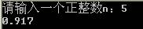
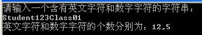

+   本题要求编写程序,计算交错序列 $1-\frac{2}{3}+\frac{3}{5}-\frac{4}{7}+\frac{5}{9}-\frac{6}{11}+\cdots$的前$n$项之和。其中，$n$为正整数，由用户输入；输出结果保留$3$位小数。运行效果参考下图。



```c++
#include<iostream>
#include<iomanip>

using namespace std;

int main(){
	double m;
	double j;
    double sum=0;
  	cout<<"请输入一个正整数n:\n";

  	int i;
   	int n;
  	cin >> n;

	for(i=1;i<=n;i++){
		m=(double)i/(2*i-1);
		if(i%2==0){
            m=-m
        }
		sum=sum+m;
  	}

  	cout << fixed << setprecision(3) << sum;

  	return 0;

}
```

+   输入一串字符串，统计其中数字字符和英文字符的个数。运行效果参考下图。



```c++ 
#include <iostream>
using namespace std;

int main(){
  	char a[101];

  	cin >> a;

  	int i=0,d=0,letter=0;

  	while(a[i]!='\0'){
        if (*a[i]>='0'&&a[i]<='9')* d++;
        if (a[i]>='A'&&a[i]<='Z'||a[i]>='a'&&a[i]<='z') letter++;
        i++;
  	}

  cout << "英文字母和数字的个数分别是：" << letter << ","<< d << endl;
  return 0;

}

```

 

+   设计一个时间类`Time`,该类中有表示时、分、秒的数据成员。要求设计合适的构造函数、析构函数以及其它必须的基本成员函数。测试用的主函数如下：

```c++
int main(){

 	Time t1,t2(22,30,2);

 	T1.Show();t2.Show();

 	t2.AddMinute(100);//将时间t2增加100分钟

 	t2.Show();

 	return 0;

}
```

注意：在试卷上只需记录下`Time`类的声明和实现即可，不用记录下主函数。

运行结果：

```plaintext
构造Time对象：0 0 0

构造Time对象：22 30 2

0时0分0秒

22时30分2秒

0时10分2秒
```

 

```c++
#include<iostream>

using namespace std;

class Time {

public:

    Time() {

        h = 0;
        m = 0;
        s = 0;

        cout << "构造Time对象：" << h << ' ' << m << ' ' << s << ' ' << endl;

    }

    Time(int H, int M, int S) {

        h = H;
        m = M;
        s = S;

        cout << "构造Time对象：" << h << ' ' << m << ' ' << s << endl;

    }

    void Show() {

        cout << h << "时" << m << "分" << s << "秒" << endl;

    }

    void AddMinute(int m1) {

        m = m + m1;

        h = h + m / 60;

        if (h > 23) {

            h = h - 24;
        }

        m = m % 60;

    }

    Time() {


    }

private:

    int h, m, s;

};


int main() {

    Time t1, t2(22, 30, 2);

    t1.Show();
    t2.Show();

    t2.AddMinute(100);//将时间t2增加100分钟

    t2.Show();

    return 0;

}
```

