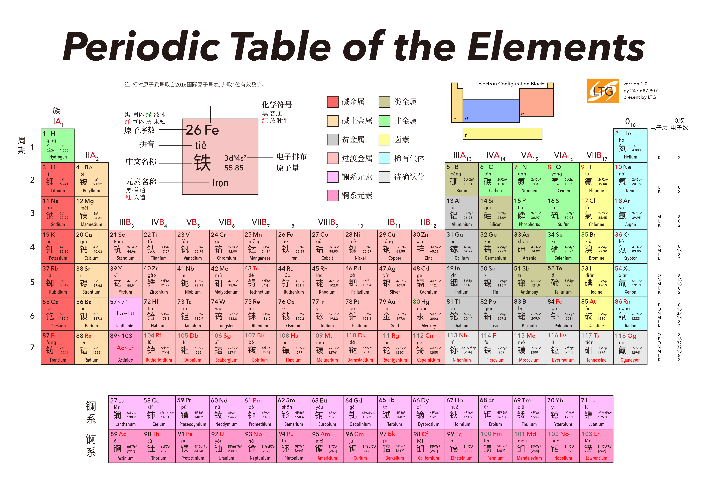

# Intro

化学是一门研究物质的性质、组成、结构、以及变化规律的物理的子学科。化学是以实验为基础的学科。

## 理论与实际

理论模型是通过观察到的现象、对猜想的验证，总结出的一套在某些领域适用的结论。

+ 不同领域之间的结论不一定相通。
  + 宏观与微观
  + 光沿直线传播？

+ 部分理论与实际并不相符
  + 原子模型发展史
    + 枣糕模型
    + 原子轨道理论
    + 概率云
  + 酸与碱

## 物质的组成

+ 分子
  + 原子 Atom
    + 原子核
      + 质子
      + 中子
    + 核外电子

物质由原子和分子构成，分子中原子的重新组合是化学变化的基础。

