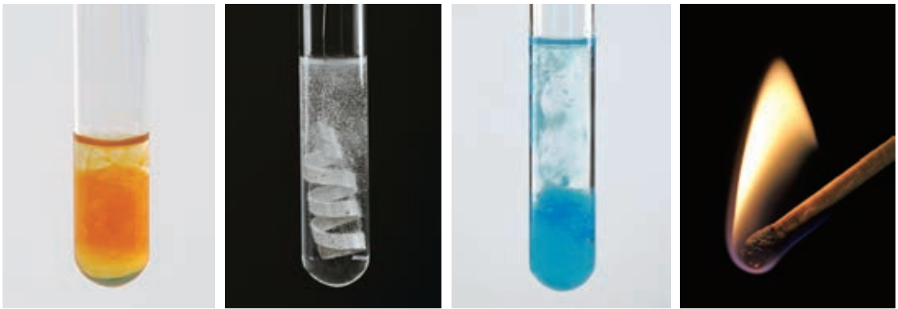
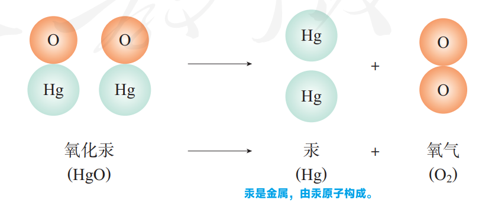
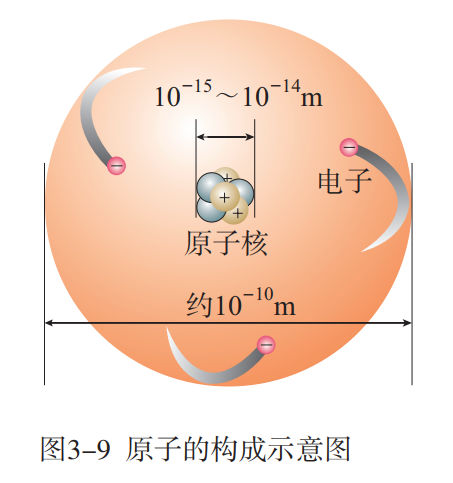
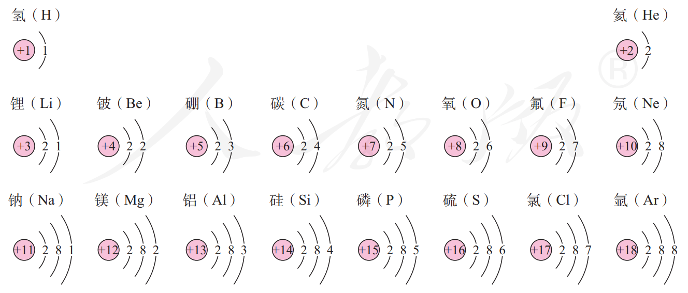
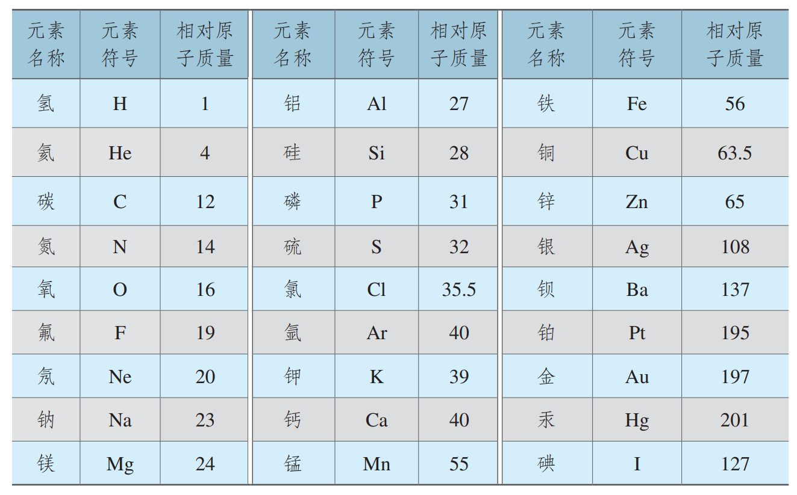
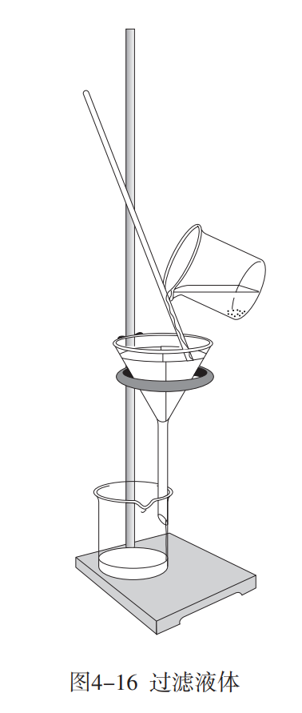
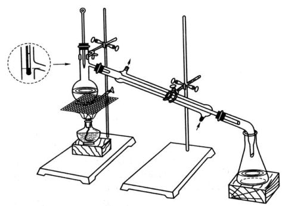
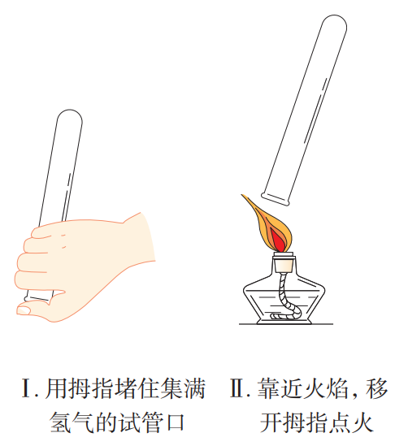

# 初中化学

[toc]

## 走进化学世界

### 物质的变化和性质

#### 化学变化和物理变化

没有生成其他物质的变化叫做**物理变化**；生成其他物质的变化叫做**化学变化**，又叫做**化学反应**。

化学变化的基本特征是**有其他物质生成**，常表现为颜色改变、放出气体、 生成沉淀等。化学变化不但生成其他物质，而且还伴随着能量的变化，这种能量变化常表现为吸热、放热、发光等。

在物质发生化学变化的过程中，会同时发生物理变化。

#### 化学性质和物理性质

+ 物质在化学变化中表现出来的性质叫做化学性质。
  + 氧化性、还原性
  + 酸性、碱性
+ 物质不需要发生化学变化就表现出来的性质叫做物理性质。
  + 颜色、状态、气味、硬度、熔点等

当外界条件改变时，物质的性质也会随着变化，因此，描述物质性质时往往要注明条件。

### 化学是一门以实验为基础的科学

### 走进化学实验室

## 我们周围的空气

### 空气

#### 空气的组成

| 成分       | 比例 (体积) |
| ---------- | ----------- |
| 氮气 $N_2$ | 78%         |
| 氧气 $O_2$ | 21%         |
| 其他成分   | 1%          |

#### 混合物与纯净物

+ 由两种或两种以上混合而成的物质叫做混合物
  + 比如空气
+ 只由一种物质组成的物质叫做纯净物
  + 氮气、氧气、二氧化碳等

### 氧气

氧气能支持燃烧。**氧气的化学性质比较活泼**，物质在空气中燃烧，实际上是与其中的氧气发生反应，由于空气中的氧气含量相对较少，因此在空气中燃烧不如在氧气中剧烈。

#### 硫与氧气反应

硫与氧气发生化学反应，生成带有刺激性气味的二氧化硫气体，并放出热量。

反应可以表示为：
$$
\ce{\text{硫} + \text{氧气} ->[点燃] \text{二氧化硫} }
$$
也可以用元素符号表示：
$$
\ce{S + O_2 ->[点燃] SO_2}
$$

> 注：反应物里有气体，气体生成物不标气体符号($\ce{^}$)；反应物有固体，固体生成物不标沉淀符号 ($\ce{v}$)。
>
> **如果用元素符号书写化学方程式，需要配平**。

硫在空气里燃烧发出微弱的淡蓝色火焰，而在氧气里燃烧得更旺，发出蓝紫色火焰。

#### 氧气与铁反应

在空气中加热铁丝时，铁丝只能发生红热现象，不能燃烧；但在氧气里点燃细铁丝可发生剧烈燃烧，火星四射。铁与氧气反应生成黑色的四氧化三铁（$Fe_3O_4$）固体。

反应可以表示为：
$$
\ce{\text{铁} + \text{氧气} ->[点燃] \text{四氧化三铁} }
$$
也可以用元素符号表示：
$$
\ce{Fe + O_2 ->[点燃] Fe_{3}O_{4}}
$$

#### 化合反应

由两种或两种以上物质生成另一种物质的反应，叫做**化合反应**。

#### 氧化反应

以上反应还有另一个共同特点：它们都是物质与氧气发生的反应。这类反应属于**氧化反应**。氧气在氧化反应中提供氧，它具有**氧化性**。

物质在氧气中燃烧是较剧烈的氧化反应，但并不是所有的氧化反应都像燃烧那样剧烈并发光、放热。有些氧化反应进行得很慢，甚至不容易被察觉，这种氧化叫做缓慢氧化。

### 制取氧气

在实验室里，常采用加热高锰酸钾、分解过氧化氢或加热氯酸钾的方法制取氧气。

#### 高锰酸钾的分解反应

高锰酸钾是一种暗紫色的固体，它受热时，分解出氧气，同时还有锰酸钾和二氧化锰生成。

可以表示为：
$$
\ce{\text{高锰酸钾} ->[加热] \text{锰酸钾} + \text{二氧化锰} + \text{氧气} ^}
$$
也可以用元素符号表示为：
$$
\ce{2 KMnO_{4} \xlongequal{\triangle} K_{2}MnO_{4} + MnO_{2} + O_{2} ^}
$$

#### 过氧化氢的分解反应

$$
\ce{\text{过氧化氢} ->[二氧化锰] \text{水} + \text{氧气} ^}
$$

符号表示：
$$
\ce{2H_{2}O_{2} \xlongequal{\ce{MnO_{2}}} 2H_{2}O + O_{2} ^}
$$
如果在实验前用精密的天平称量二氧化锰的质量，实验后把二氧化锰洗净、干燥，再称量，你会发现它的质量没有发生变化。把它再加到过氧化氢溶液中，还可以加速过氧化氢分解。这种在化学反应里能改变其他物质的化学反应速率，而本身的质量和化学性质在反应前后都没有发生变化的物质叫做催化剂（又叫触媒）。催化剂在化学反应中所起的作用叫做**催化作用**。

#### 氯酸钾的分解反应

$$
\ce{\text{氯酸钾} ->[二氧化锰][加热] 氯化钾 + 氧气 ^}
$$

符号表示：
$$
\ce{2KClO3}\xlongequal[\triangle]{\ce{MnO2}}\ce{2KCl + 3O2 ^}
$$

### 实验 氧气的实验室制取与性质

## 物质构成的奥秘

### 分子和原子

#### 物质由微观粒子构成

**一滴水有多少个水分子？**

> 阿伏伽德罗常数：一摩尔（mol） 物质所含的基本单元（分子或原子）的数量为 $6.02\times 10^{23}$ 个。
> 摩尔质量：单位物质的量的物质的质量。 如水的摩尔质量为 $18~g/mol$。
> 一般认为 20 滴水为 $1~mL$。

#### 分子可以分为原子

+ 由分子构成的物质，分子是保持其化学性质的最小粒子。
+ 原子时化学变化中的最小粒子。

### 原子的结构

#### 原子的构成

原子是由居于原子中心的原子核与核外电子构成的。原子核是由质子和中子构成的。每个质子带 1 个单位的正电荷，每个电子带 1 个单位的负电荷，中子不带电。

+ **分子** Molecular 电中性
  + **原子** Atom 电中性
    + **原子核** Core 带正电 $\oplus$
      + **质子** Proton 带正电 $\oplus$
      + **中子** Neutron 电中性 
    + 核外**电子** Electron 带负电 $\ominus$

原子呈电中性，所以质子数 = 核电荷数 = 核外电子数量。

> 核电荷数：原子核所带的电荷数。

#### 原子核外电子的排布

原子中的核外电子是分层排布的，可以用原子结构示意图来表示。
原子最外层电子不超过 8 个。

原子结构示意图：

#### 离子

粒子是带电的原子或原子团。

#### 相对原子质量

以 $^{12}C$ 质量的 $\frac{1}{12}$ 为标准，其他原子的质量与它相比较所得到的比。

> 同样，分子也有相对分子质量， 简称分子量。

### 元素

#### 元素

元素是质子数相同的一类原子的总称。

> 在物质反苏杠化学变化时，原子的种类不变，元素也不会改变。

自然界中元素含量：$\ce{O>Si>Al>Fe>Ca}$；人体中的大量元素：$\ce{O>C>H>N>P>S>K>Ca>Mg}$

#### 元素符号

### 元素周期表简介

元素周期表共有 7 个横行，18 个纵列。**每一个横行叫做一个周期，每一个纵列叫做一个族**（8，9，10 三个纵列共同组成一个族）。

## 自然界的水

### 爱护水资源

### 水的净化

+ 精华水的方法
  + 沉淀
  + 过滤
    + 在化学中是用于分离液体与不溶性固体的方法
  + 吸附

+ 有时可利用明矾溶于水后生成的胶状物对杂质的吸附，使杂质沉降来达到净水的目的。

#### 过滤

「一贴、二低、三靠」

+ 一贴
  1. 滤纸要紧贴着漏斗
+ 二低
  1. 滤纸要略微低于漏斗边缘
  2. 倒入漏斗中的溶液面不能高于过滤纸
+ 三靠
  1. 过滤时漏斗的下方要紧靠烧杯壁
  2. 玻璃棒则要紧靠在滤纸（三层的那一边）上
  3. 盛装溶液的烧杯要紧靠在玻璃棒上面

过滤操作中，玻璃棒起到的作用是引流。

---

#### 硬水与软水

含有较多可溶性钙、镁化合物的水叫做硬水，不含或含较少可溶性钙、镁化合物的水叫做软水。
煮沸可以降低水的硬度。

### 水的组成

#### 氢气

氢气是无色、无臭、难溶于水的气体，密度比空气的小。氢气在空气中燃烧时，产生淡蓝色火 焰；混有一定量空气或氧气的氢气遇明火会发生爆炸。

> 补充：氢气的相对分子质量为 2，空气的平均相对分子质量为 29.

+ 氢气的验纯

  

  + 点燃氢气时，发出**尖锐爆鸣声**表明气体不纯，声音很小则表示气体较纯。

$$
\ce{2H2 + O2\xlongequal{\text{点燃}} 2H2O}
$$

### 化学式与化合价

钾钠氢银正一价 钙镁锌钡正二价
氟溴负一氧负二 铜正一二铁二三
磷有正五正负三

#### 化学式

用元素符号和数字的组合表示物质组成的式子。

#### 化合价

化合物有固定的组成，即形成化合物的元素有固定的原子个数比。
元素的化合价有正、有负，在化合物里，正、负化合价的代数和为零。
$$
\ce{10\overset{+2}{Fe}SO4 + 2K\overset{+7}{Mn}O4 + 8H2SO4 = 5\overset{+3}{Fe2}(SO4)3 + K2SO4 + 2\overset{+2}{Mn}SO4 + 8H2O}
$$

1. 金属元素与非金属元素化合时，金属元素显正价，非金属元素显负价；
2.  一些元素在不同物质中可显不同的化合价； 
3. 元素的化合价是元素的原子在形成化合物时表现出来的一种性质，因此，在单质里，元素的化合价为 0。

+ 氨 $\bar{a}n$ 
+ 铵 $\check{a}n$
+ 胺 

## 化学方程式

### 质量守恒定律

#### 质量守恒定律

参加**化学反应**的各物质的质量总和，等于反应后生成的各物质的质量总和。

> 某些物理反应前后，反应物和生成物质量不守恒，比如核反应。

### 如何正确书写化学方程式

### 利用化学方程式的简单计算

## 碳和碳的氧化物

### 金刚石、石墨和 $C_{60}$

### 二氧化碳制取的研究

### 二氧化碳和一氧化碳

### 实验 二氧化碳的实验室制取与性质

## 燃料及其利用

### 燃烧和灭火

### 燃料的合理利用与开发

### 实验 燃烧的条件