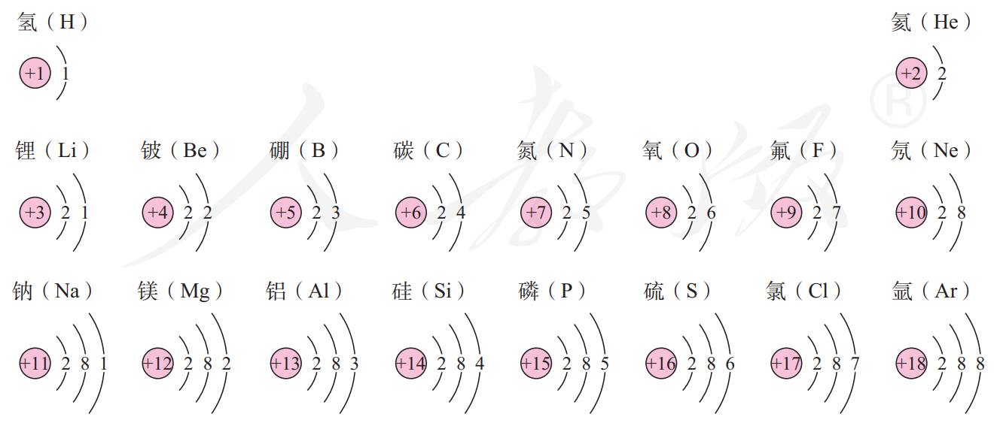

## 物质构成的奥秘

### 分子和原子

#### 物质由微观粒子构成

**一滴水有多少个水分子？**

> 阿伏伽德罗常数：一摩尔（mol） 物质所含的基本单元（分子或原子）的数量为 $6.02\times 10^{23}$ 个。
> 摩尔质量：单位物质的量的物质的质量。 如水的摩尔质量为 $18~g/mol$。
> 一般认为 20 滴水为 $1~mL$。

#### 分子可以分为原子

+ 由分子构成的物质，分子是保持其化学性质的最小粒子。
+ 原子是化学变化中的最小粒子。

### 原子的结构

#### 原子的构成

原子是由居于原子中心的原子核与核外电子构成的。原子核是由质子和中子构成的。每个质子带 1 个单位的正电荷，每个电子带 1 个单位的负电荷，中子不带电。

+ **分子** Molecular 电中性
  + **原子** Atom 电中性
    + **原子核** Core 带正电 $\oplus$
      + **质子** Proton 带正电 $\oplus$
      + **中子** Neutron 电中性 
    + 核外**电子** Electron 带负电 $\ominus$

原子呈电中性，所以质子数 = 核电荷数 = 核外电子数量。

#### 原子核外电子的排布

原子中的核外电子是分层排布的，可以用原子结构示意图来表示。原子最外层电子不超过 8 个。
原子结构示意图：

#### 离子

粒子是带电的原子或原子团。

#### 相对原子质量

以 $^{12}C$ 质量的 $\frac{1}{12}$ 为标准，其他原子的质量与它相比较所得到的比。

> 同样，分子也有相对分子质量， 简称分子量。

### 元素

元素是质子数相同的一类原子的总称。

> 在物质反苏杠化学变化时，原子的种类不变，元素也不会改变。

自然界中元素含量：$\ce{O>Si>Al>Fe>Ca}$；人体中的大量元素：$\ce{O>C>H>N>P>S>K>Ca>Mg}$

#### 元素符号

### 元素周期表简介

元素周期表共有 7 个横行，18 个纵列。**每一个横行叫做一个周期，每一个纵列叫做一个族**（8，9，10 三个纵列共同组成一个族）。