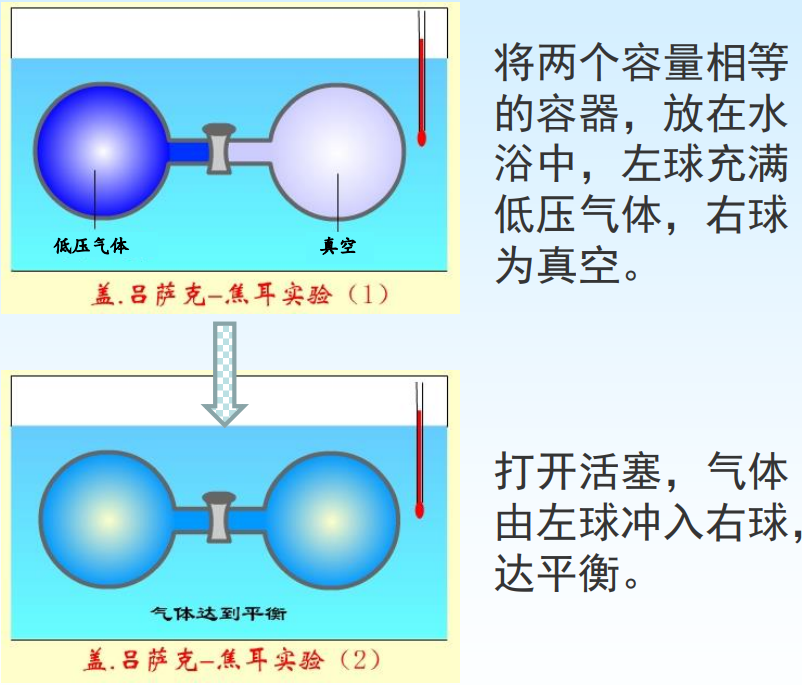
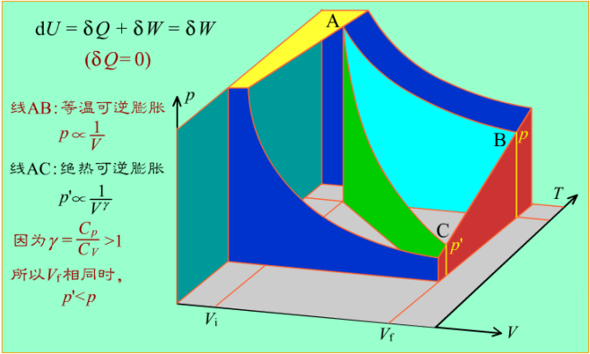
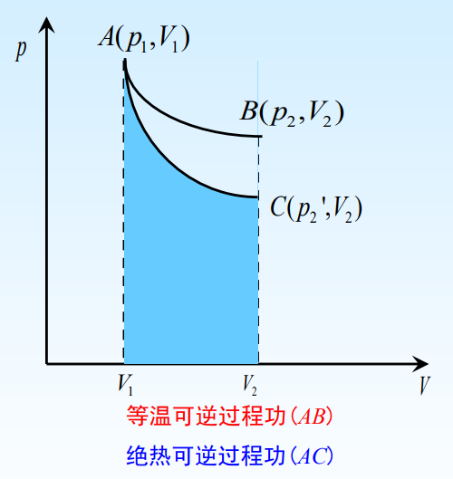

[TOC]

# 理想气体

严格遵从状态方程( $pV=nRT$ )的气体, 从微观角度来看是指: 分子本身的体积和分子间的作用力忽略不计, 并且分子之间及分子与器壁之间发生的碰撞不造成动能损失.

>   注意
>
>   +   理想气体并不存在. 实际气体中, 凡是本身不易被液化的气体, 它们的性质很近似理想气体, 如氢气和氦气.
>   +   一般可认为温度不低于 $0,$ 压强不高于$101kPa$ 时的气体为理想气体. 把实际气体近似看作理想气体, 对研究问题非常用.
>   +   当气体处于高压, 低温条件下, 状态变化较显著地偏离状态方程, 需要按实际情况加以修正, 常用的一种修正方程叫做范德瓦耳斯方程, 考虑了分子间相互作用以及分子本身的体积.

## 盖-吕萨克-焦耳实验

### 实验现象

水浴温度没有变化。

### 实验结论

(1) 以气体为体系, $\mathrm{d} T=0, Q=0$
(2) 体系没有对外做 功, $W=0$ 。
(3) $\Delta U=0$

---

### 热力学能与温度的关系

设理想气体的热力学能是 $T, V$ 的函数
$$
U=U(T, V) \quad \Longrightarrow \quad \mathrm{d} U=\left(\frac{\partial U}{\partial T}\right)_{V} \mathrm{~d} T+\left(\frac{\partial U}{\partial V}\right)_{T} \mathrm{~d} V
$$
由上述实验得知，对理想气体自由膨胀过程:
$$
\begin{aligned}
\mathrm{d} T&=0, \mathrm{~d} U=0 \\

\left( \frac{\partial U}{\partial p}\right)_T\mathrm{d}p&=0\\
\\
\mathrm{~d} p &\neq 0\\
\\
\Rightarrow\left(\frac{\partial U}{\partial V}\right)_{T}&=0
\end{aligned}
$$
**理想气体**在等温时, 改变体积, 其热力学能不变。

---

设理想气体的热力学能是 $T, p$ 的函数
$$
U=U(T, p) \quad \Longrightarrow \quad \mathrm{d} U=\left(\frac{\partial U}{\partial T}\right)_{p} \mathrm{~d} T+\left(\frac{\partial U}{\partial p}\right)_{T} \mathrm{~d} p
$$
由上述实验得知，对理想气体自由膨胀过程:
$$
\begin{aligned}
&\mathrm{d} T=0, \mathrm{~d} U=0 \\
&\left.\qquad \begin{array}{r}
\left(\frac{\partial U}{\partial p}\right)_{T} \mathrm{~d} p=0 \\
\mathrm{~d} p \neq 0
\end{array}\right\}\left(\frac{\partial U}{\partial p}\right)_{T}=0
\end{aligned}
$$
**理想气体**在等温时, 改变压力，其热力学能不变。

>   理想气体的热力学能只是温度的函数, 不随体系体积和压力的变化而变化.

---

### 焓与温度的关系

根据焓的定义式
$$
H=U+pV \quad \Longrightarrow \quad \mathrm{d}H=\mathrm{d}U+\mathrm{d}(pV)
$$
理想气体状态方程式
$$
\begin{aligned}
&\left.\begin{array}{l}
p V=n R T \\
\text { 又因为 } \quad \mathrm{d} T=0
\end{array}\right\} \mathrm{d}(p V)=0\\
&\left(\frac{\partial H}{\partial V}\right)_{T}=\left(\frac{\partial U}{\partial V}\right)_{T}+\left(\frac{\partial(p V)}{\partial V}\right)_{T} \quad \Longrightarrow\left(\frac{\partial H}{\partial V}\right)_{T}=0\\
&\text { 同理 } \Rightarrow\left(\frac{\partial H}{\partial p}\right)_{T}=0
\end{aligned}
$$

>   理想气体的焓也只是温度的函数, 与体积和压力的变化无关

## 理想气体热力学能变和焓变的计算

$$
\begin{aligned}
\mathrm{d}U &=\left ( \frac{\partial U}{\partial T}\right)_V  \mathrm{d}T+\left ( \frac{\partial U}{\partial T}\right)_T \mathrm{d}V\\
\mathrm{d}U&=\left ( \frac{\partial U}{\partial T}\right)_V\mathrm{d}T\\
&=\left ( \frac{\partial Q_V}{\partial T}\right)_V\mathrm{d}T\\
&=C_V\mathrm{d}T\\
&=nC_{V,m}\mathrm{d}T\\
\Longrightarrow \quad \Delta U&=n\int C_{V,m}\mathrm{d}T
\end{aligned}
$$

$$
\begin{aligned}
\mathrm{d}H &=\left ( \frac{\partial H}{\partial T}\right)_p  \mathrm{d}T+\left ( \frac{\partial H}{\partial p}\right)_T \mathrm{d}p\\
\mathrm{d}H&=\left ( \frac{\partial H}{\partial T}\right)_p\mathrm{d}T\\
&=\left ( \frac{\partial Q_p}{\partial T}\right)_p\mathrm{d}T\\
&=C_p\mathrm{d}T\\
&=nC_{p,m}\mathrm{d}T\\
\Longrightarrow \quad \Delta H&=n\int C_{p,m}\mathrm{d}T
\end{aligned}
$$

>   不受定容, 定压的限制

## 总结

+   无论是理想气体还是非理想气体, 由于一般默认为不做非体积功
    +   定容 $\Delta U = n \int C_{V,m} \mathrm{d}T$
    +   定压 $\Delta H = n \int C_{p,m} \mathrm{d} T$
+   对于理想气体
    +   $\Delta U = n \int C_{V,m} \mathrm{d}T$          $\Delta H = n \int C_{p,m} \mathrm{d} T$
    +   不受定容定压条件限制

---

## $C_V$ 与 $C_p$ 的关系

复合函数的偏微分
$$
\begin{gathered}
U=U(T, V) \\
\mathrm{d} U=\left(\frac{\partial U}{\partial T}\right)_{V} \mathrm{~d} T+\left(\frac{\partial U}{\partial V}\right)_{T} \mathrm{~d} V
\end{gathered}
$$

$$
\begin{aligned}
V &=V(T, p) \\
\mathrm{d} V &=\left(\frac{\partial V}{\partial T}\right)_{p} \mathrm{~d} T+\left(\frac{\partial V}{\partial p}\right)_{T} \mathrm{~d} p
\end{aligned}
$$

$$
\begin{aligned}
\mathrm{d} U &=\left(\frac{\partial U}{\partial T}\right)_{V} \mathrm{~d} T+\left(\frac{\partial U}{\partial V}\right)_{T}\left[\left(\frac{\partial V}{\partial T}\right)_{p} \mathrm{~d} T+\left(\frac{\partial V}{\partial p}\right)_{T} \mathrm{~d} p\right] \\
&=\left[\left(\frac{\partial U}{\partial T}\right)_{V}+\left(\frac{\partial U}{\partial V}\right)_{T}\left(\frac{\partial V}{\partial T}\right)_{p}\right] \mathrm{d} T+\left(\frac{\partial U}{\partial V}\right)_{T}\left(\frac{\partial V}{\partial p}\right)_{T} \mathrm{~d} p \\
&=\left[\left(\frac{\partial U}{\partial T}\right)_{V}+\left(\frac{\partial U}{\partial V}\right)_{T}\left(\frac{\partial V}{\partial T}\right)_{p}\right] \mathrm{d} T+\left(\frac{\partial U}{\partial p}\right)_{T} \mathrm{~d} p
\end{aligned}
$$

$$
\begin{gathered}
U=U(T, p) \quad \mathrm{d} U=\left(\frac{\partial U}{\partial T}\right)_{p} \mathrm{~d} T+\left(\frac{\partial U}{\partial p}\right)_{T} \mathrm{~d} p \\
\mathrm{~d} U=\left[\left(\frac{\partial U}{\partial T}\right)_{V}+\left(\frac{\partial U}{\partial V}\right)_{T}\left(\frac{\partial V}{\partial T}\right)_{p}\right] \mathrm{d} T+\left(\frac{\partial U}{\partial p}\right)_{T} \mathrm{~d} p \\
\left(\frac{\partial U}{\partial T}\right)_{p}=\left(\frac{\partial U}{\partial T}\right)_{V}+\left(\frac{\partial U}{\partial V}\right)_{T}\left(\frac{\partial V}{\partial T}\right)_{p}
\end{gathered}
$$

$$
\begin{aligned}
C_{p}-C_{V}&=\left(\frac{\partial H}{\partial T}\right)_{p}-\left(\frac{\partial U}{\partial T}\right)_{V} \\
&=\left(\frac{\partial(U+p V)}{\partial T}\right)_{p}-\left(\frac{\partial U}{\partial T}\right)_{V} \\
&=\left(\frac{\partial U}{\partial T}\right)_{p}+p\left(\frac{\partial V}{\partial T}\right)_{p}-\left(\frac{\partial U}{\partial T}\right)_{V} \\
\\
\left(\frac{\partial U}{\partial T}\right)_{p}&=\left(\frac{\partial U}{\partial T}\right)_{V}+\left(\frac{\partial U}{\partial V}\right)_{T}\left(\frac{\partial V}{\partial T}\right)_{p} \\
\\
C_{p}-C_{V}&=\left(\frac{\partial U}{\partial T}\right)_{V}+\left(\frac{\partial U}{\partial V}\right)_{T}\left(\frac{\partial V}{\partial T}\right)_{p}+p\left(\frac{\partial V}{\partial T}\right)_{p}-\left(\frac{\partial U}{\partial T}\right)_{V} \\
&=\left[\left(\frac{\partial U}{\partial V}\right)_{T}+p\right]\left(\frac{\partial V}{\partial T}\right)_{p}
\end{aligned}
$$

>   没有任何限制条件, 固体, 液体, 气体都适用

1.   对于理想气体
     $$
     \begin{aligned}
     \left(\frac{\partial U}{\partial V}\right)_{T}&=0 \\
     \left(\frac{\partial V}{\partial T}\right)_{p}&=\frac{n R}{P}
     \end{aligned}
     $$

     $$
     C_{p}-C_{V}=n R \Rightarrow C_{p, m}-C_{V, m}=R
     $$

     

2.   对于液体, 固体
     $$
     \left(\frac{\partial V}{\partial T}\right)_{p} \approx 0 \quad \Rightarrow \quad C_{p} \approx C_{V}
     $$

3.   对于实际气体
     $$
     C_{p}-C_{V}=\left[\left(\frac{\partial U}{\partial V}\right)_{T}+p\right]\left(\frac{\partial V}{\partial T}\right)_{p}
     $$

---

对于理想气体, 还有另外一种推导法
$$
\begin{aligned}
H&= U + pV\\
\mathrm{d} H &=\mathrm{d}U +\mathrm{d} (pV)\\
C_p\mathrm{d}T
&=C_V\mathrm{d}T+nR\mathrm{d}T\\
C_p&=C_V+nR\\
C_{p,m}&=C_{V,m}+R\\
\end{aligned}
$$
已知:

单原子理想气体分子 : $C_{V,m}=\frac{3}{2}R\quad C_{p,m}=\frac{5}{2}R$

双原子理想气体分子 : $C_{V,m}=\frac{5}{2}R\quad C_{p,m}=\frac{7}{2}R$

## 理想气体绝热可逆过程

根据热力学第一定律 不考虑非体积功
$$
\mathrm{d}U =\delta Q+\delta W_e\stackrel{\stackrel{\delta Q=0}{\Longrightarrow}}{}\mathrm{d}U=-p_r\mathrm{d}V\stackrel{可逆,p_e=p}{\Longrightarrow}\mathrm{d}U=-p\mathrm{d}V
$$

理想气体
$$
\begin{aligned}
\mathrm{d} U&=n C_{V, m} \mathrm{~d} T\\
nC_{V,m}\mathrm{d} T&=-\frac{nRT}{V} \mathrm{d}V\\
R=C_{p,m}-C_{V,m}\Longrightarrow\quad  \frac{1}{T} \mathrm{~d} T&=-\frac{C_{p, m}-C_{V, m}}{C_{V, m}} \frac{1}{V} \mathrm{~d} V\\
\text{let}  \frac{C_{p, m}}{C_{V, m}}&=\gamma\\
\\
\frac{1}{T} \mathrm{~d} T+(\gamma-1) \frac{1}{V} \mathrm{~d} V&=0
\end{aligned} 
$$

$$
\begin{align} 
 \frac{1}{T} \mathrm{~d} T+(\gamma-1) \frac{1}{V} \mathrm{~d} V&=0\\

不定积分\quad \ln T+(\gamma-1) \ln V&=  常数\\
即 \qquad T V^{\gamma-1}&=K_{1} \\
若以  T=\frac{p V}{n R}  代入式 (1)  \quad\qquad p V^{\gamma}&=n R K_{1}=K_{2}\\ 
若以  V=\frac{n R T}{p}  代入式 (1)  \quad p^{1-\gamma} T^{\gamma}&=\frac{K_{1}}{(n R)^{\gamma-1}}=K_{3} 
\end{align}
$$

$$
\begin{aligned}
对于理想气体  \quad \Delta U&=n \int C_{V, m} \mathrm{~d} T \\
由于是绝热过程  \quad W=\Delta U&=n \int C_{V, m} \mathrm{~d} T \\
或由过程方程式推导所得  \quad p V^{\gamma}&=K_{2} \quad \Rightarrow \quad p_{1} V_{1}^{\gamma}=p_{2} V_{1}^{\gamma}=K_{2} \\

W &=-\int p \mathrm{~d} V\\
&=-\int \frac{K_{2}}{V^{\gamma}} \mathrm{d} V\\
&=-\left[\frac{K_{2}}{(1-\gamma) V^{\gamma-1}}\right]_{V_{1}}^{V_{2}} \\
&=-\frac{K_{2}}{1-\gamma}\left[\frac{1}{V_{2}^{\gamma-1}}-\frac{1}{V_{1}^{\gamma-1}}\right]\\
&=-\frac{1}{1-\gamma}\left[p_{2} V_{2}-p_{1} V_{1}\right]
\end{aligned}
$$

+   体系从 $A$ 点等温可逆膨胀到 $B$ 点, $AB$ 线下的面积就是等温可逆膨胀所作的功
+   从 $A$ 点出发, 做绝热可逆膨胀到 $C$ 点, 使终态体积相同, $AC$ 线下的面积就是绝热可逆膨胀所作的功

>   在 $p-V-T$ 三维图上:
>
>   +   黄色: 等压面
>   +   蓝色: 等温面
>   +   红色: 等容面

---

+   $AB$ 线斜率: $\large\left(\frac{\partial p}{\partial V}\right)_{T} =-\frac{p}{V}$
+   $AC$ 线斜率: $\large\left(\frac{\partial p}{\partial V}\right)_{S} =-\gamma \frac{p}{V} \quad(\gamma>1)$

绝热过程要小号热力学能作功, 要达到相同终态体积, 温度和压力必定比 $B$ 点低

理想气体等温可逆膨胀所作的功大于绝热可逆膨胀所做的功

---

定容过程 ($\mathrm{d} V=0, W_{f}=0$)
$$
\begin{array}{mmm}
\hline & \text { 理想气体 } & \text { 非理想气体 } \\
\hline \Delta U & \int n C_{V, m} d T & \int n C_{V, m} d T \\
\Delta H & \int n C_{p, m} d T & \Delta H=\Delta U+V \Delta p \\
Q & Q_{V}=\Delta U=\int n C_{V, m} d T \quad & Q_{V}=\Delta U=\int n C_{V, m} d T \\
W & 0 & 0 \\
\hline
\end{array}
$$

---

定压过程 ($\mathrm{d} p=0, W_{f}=0$)
$$
\begin{array}{ccc}
\hline & \text { 理想气体 } & \text { 非理想气体 } \\
\hline \Delta U & \int n C_{V, m} d T & \Delta H-p \Delta V=Q+\mathrm{W} \\
\Delta H & \int n C_{p, m} d T & \int n C_{p, m} d T \\
Q &\quad Q_{p}=\Delta H=\int n C_{p, m} d T \quad& Q_{p}=\Delta H=\int n C_{p, m} d T \\
W & -p \Delta V=-n R \Delta T & -p \Delta V \\
\hline
\end{array}
$$

---

定温过程 ($\mathrm{d} T=0, W_{f}=0$)
$$
\begin{array}{cccc}
\hline & \quad\quad{\text { 理想气体 }} &  &{\text { 非理想气体 }} \\
 & \mathrm{Rev} & \mathrm{IR} & \\
\hline \Delta U & 0 & 0 & \mathrm{~d} U=\left(\frac{\partial U}{\partial V}\right)_{T} \mathrm{~d} V \\
\Delta H & 0 & 0 & \Delta H=\Delta U+\Delta(p V) \\
Q & -n R T \ln \frac{V_{1}}{V_{2}} & \sum p_{e} \mathrm{~d} V & Q=\Delta U-W \\
W & n R T \ln \frac{V_{1}}{V_{2}} & -\sum p_{e} \mathrm{~d} V & -\sum p_{e} \mathrm{~d} V \\
\hline
\end{array}
$$

---

绝热过程 ($Q=0, W_{f}=0$)
$$
\begin{array}{cccc}
\hline
&{\text { 理想气体 }} 
& & \text { 非理想气体 } \\
 & \mathrm{Rev}& \qquad\mathrm{IR}\\
\hline 
\Delta U & \int n C_{V, m} d T &\int n C_{V, m} d T & -\sum p_{e} \mathrm{~d} V \\
\Delta H & \int n C_{p, m} d T &\int n C_{p, m} d T & \Delta H=\Delta U+\Delta(p V) \\
Q & 0 & 0 \\
W & \int n C_{V, m} d T &\int n C_{V, m} d T & -\sum p_{e} \mathrm{~d} V \\
\hline
\end{array}
$$

# 习题

$273.2~K$，压力为 $500 ~KPa$ 的 $N_2$，体积为 $2~dm^3$，在外压为 $100 ~KPa$ 下等温膨胀至压力为 $100 ~KPa$，求过程的$W,Q,\Delta U$ 和 $\Delta H$, 假设气体是理想气体。

解: 等温, 理想气体, 非体积功为 $0 \mathrm{~J}$
$$
\Delta U=\Delta H=0 \mathrm{~J}
$$
等外压膨胀
$$
\begin{aligned}
&W=-Q=-p_{e} \Delta V=-p_{e}\left(V_{2}-V_{1}\right)=-100 \times 8 \mathrm{~J}=-800 \mathrm{~J} \\
&p_{2} V_{2}=p_{1} V_{1} \quad \Rightarrow \quad V_{2}=\frac{p_{1} V_{1}}{p_{2}}=10 \mathrm{dm}^{3}
\end{aligned}
$$

---

$298 \mathrm{~K}, 607.8 \mathrm{kPa}$ 的 $1 \mathrm{~mol}$ 理想气体定温膨胀至最终压力为 $101.3 \mathrm{kPa}$ 。经过可逆膨胀, 计算该过程的 $W, Q, \Delta U$ 和 $\Delta H$ 。
解: 等温, 理想气体, 非体积功为 0
$$
\Delta U=\Delta H=0
$$
可逆膨胀
$$
\begin{aligned}
W=-Q=n R T \ln \frac{p_{2}}{p_{1}} &=1 \times 8.314 \times 298 \times \ln \frac{101.3}{607.8} \mathrm{~J} \\
&=-4439.2 \mathrm{~J}
\end{aligned}
$$

---

$0.02 \mathrm{~kg}$ 乙醇在其沸点 $(315 \mathrm{~K})$ 时蒸发为气体, 其蒸发热为 $858 \mathrm{KJ} \cdot \mathrm{kg}^{-1}$ 。假设蒸汽是理想气体, 求过程的 $W, Q, \Delta U$ 和 $\Delta H$ （计算时略去液体的体积）。
解: 等压, 非体积功为 0 .
$$
\begin{aligned}
&\begin{aligned}
Q_{p}=\Delta H=0.02 \times 858 \mathrm{KJ} &=17.16 \mathrm{KJ} \\
W=-p \Delta V=-p\left(V_{g}-V_{l}\right) &=-p V_{g} \quad \text { 理想气体 } \\
&=-n R T=-\frac{20}{46} \times 8.314 \times 315 \mathrm{~J} \\
&=-1139 \mathrm{~J}
\end{aligned} \\
&\begin{aligned}
\Delta U=Q_{p}+W=17.16 \mathrm{kJ}-& 1.139 \mathrm{kJ}=16.021 \mathrm{kJ}
\end{aligned}
\end{aligned}
$$

---

1. 对于一定量的理想气体, 温度一定, 热力学能和焓也随之确定。( $T$ )

2. 理想气体从始态经定温和定容两过程到达终态, 这两过程的 $W, Q, \Delta U$ 和 $\Delta H$ 是相等的。 ( ${F}$ )

3. 对于气态物质， $C_{p}-C_{V}=n R_{\circ} \quad(\mathrm{F})$

4. 绝热过程 $Q=0$, 而由于 $\Delta H=Q$, 因而 $\Delta H$ 等于零。( ${F}$ )

5. $273 \mathrm{~K}, p^{\theta}$ 时, 冰融化为水的过程, 下列关系式哪个正确? ( $B$ )
    A. $W<0$     B. $\Delta H=Q_{p}$    C. $\Delta H<0$    D. $\Delta U<0$

  >   冰融化为水, 体积减小, 环境对体系作功 $W>0$
  >   融化过程吸热, 压强不变, $\Delta H= Q_p > 0$

6. 在一绝热钢壁体系内, 发生一化学反应, 温度从 $T_{1} \rightarrow T_{2}$, 压力由 $p_{1} \rightarrow p_{2}$, 则 ( D )
    A. $Q>0, W>0, \Delta U>0$
    B. $Q=0, W<0, \Delta U<0$
    C. $Q=0, W>0, \Delta U>0$
    D. $Q=0, W=0, \Delta U=0$

  >   绝热 : $Q = 0$
  >   钢壁 : $\Delta V = 0, W = 0$
  >   $Q = \Delta U + W, \Delta U = 0$

7. 对理想气体, 下列哪个关系式不正确的是 D
    A. $\left(\frac{\partial U}{\partial p}\right)_{T}=0$    B. $\left(\frac{\partial H}{\partial V}\right)_{T}=0$
    C. $\left(\frac{\partial H}{\partial p}\right)_{T}=0$    D. $\left(\frac{\partial U}{\partial T}\right)_{p}=0$

8. 理想气体定温可逆膨胀过程中, $W(<0), Q(>0)$, $\Delta U(=0), \Delta H(=0)$ 。

