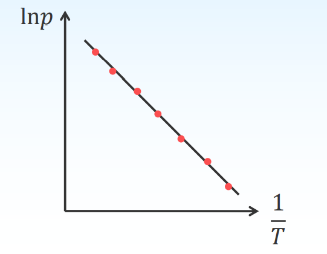
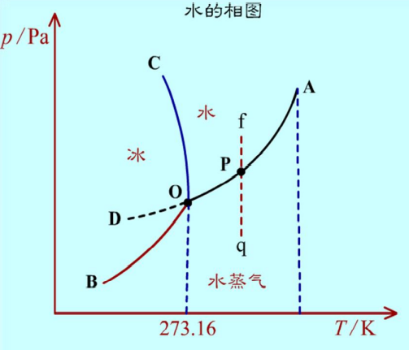
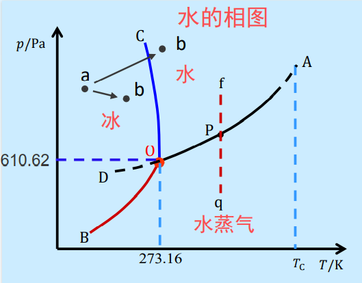
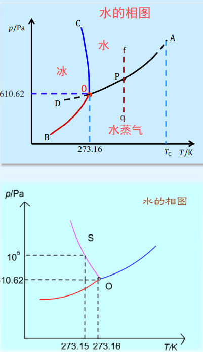

# 单组分体系

# 单组分体系的相数与自由度

单组分体系的相数与自由度
当 $P=1$ 单相 $\qquad~~~ f=2\quad$ 双变量体系
当 $P=2$ 两相平衡 $\quad f=1 \quad$ 单变量体系
当 $P=3$ 三相共存 $\quad f=0 \quad$ 无变量体系

单组分体系的自由度最多为 $2,$ 因此单组分体系的相图可用平面图表示.

## 克拉贝龙方程

定温、定压下, $\alpha$ 和 $\beta$ 两相平衡的单组分体系, 有
$$
\mu^{\alpha}(T, p)=\mu^{\beta}(T, p)
$$
当温度改变 $\mathrm{d} T$, 压力改变 $\mathrm{d} p$, 达到新的平衡, 则
$$
\begin{aligned}
\mu^{\alpha}(T, p)+\mathrm{d} \mu^{\alpha}(T, p) &=\mu^{\beta}(T, p)+\mathrm{d} \mu^{\beta}(T, p) \\
\therefore \quad \mathrm{d} \mu^{\alpha}(T, p) &=\mathrm{d} \mu^{\beta}(T, p)
\end{aligned}
$$
由于 $\mu=G_{m}$, 且 $\mathrm{d} G_{m}=-S_{m} \mathrm{~d} T+V_{m} \mathrm{~d} p$
$$
\begin{aligned}
-S_{m}^{\alpha} \mathrm{d} T+V_{m}^{\alpha} \mathrm{d} p &=-S_{m}^{\beta} \mathrm{d} T+V_{m}^{\beta} \mathrm{d} p \\
\left(S_{m}^{\beta}-S_{m}^{\alpha}\right) \mathrm{d} T &=\left(V_{m}^{\beta}-V_{m}^{\alpha}\right) \mathrm{d} p \\
\Delta S_{m} \mathrm{~d} T &=\Delta V_{m} \mathrm{~d} p
\end{aligned}
$$
$\Delta S_m$和 $\Delta V_m$ 为定温定压下可逆相变的摩尔熵变和体积变
$$
\Delta S_{m} \mathrm{~d} T=\Delta V_{m} \mathrm{~d} p \quad \Rightarrow \frac{\mathrm{d} p}{\mathrm{~d} T}=\frac{\Delta S_{m}}{\Delta V_{m}} \quad \Longrightarrow \quad \frac{\mathrm{d} p}{\mathrm{~d} T}=\frac{\Delta H_{m}}{T \Delta V_{m}}
$$
对有气相参与的平衡体系, 凝聚态体系的体积与其气相相比可 以忽略不计, 且可把气体视为理想气体。
$$
\begin{aligned}
\frac{\mathrm{d} p}{\mathrm{~d} T}&=\frac{\Delta H_{m}}{T\left(V_{m}^{g}-V_{m}^{l ~o r~s }\right)} \approx \frac{\Delta H_{m}}{T V_{m}^{g}} \quad\left(V_{m}^{g} \gg V_{m}^{l~ o r ~S}\right)  \\
\because \quad V_{m}^{g} &=\frac{R T}{p} \\
\therefore \quad \frac{\mathrm{dln} p}{\mathrm{~d} T} &=\frac{\Delta H_{m}}{R T^{2}}\qquad 克拉贝龙-克劳修斯方程
\end{aligned}
$$
在一定温度范围内可把 $\Delta H_{m}$ 视为常数, 定积分得:
$$
\frac{\mathrm{d} \ln p}{\mathrm{~d} T}=\frac{\Delta H_{m}}{R T^{2}} \quad \ln \frac{p_{2}}{p_{1}}=\frac{\Delta H_{m}}{R}\left(\frac{1}{T_{1}}-\frac{1}{T_{2}}\right)
$$
不定积分得:
$$
\ln p=-\frac{\Delta H_{m}}{R} \frac{1}{T}+C
$$

# 习题

正己烷正常沸点 $69$ ${ }^{\circ} \mathrm{C}, 69^{\circ} \mathrm{C}$ 时蒸发热为 $28.94 \mathrm{~kJ} \cdot \mathrm{mol}^{-1}$, 求正己烷 $30^{\circ} \mathrm{C}$ 时的蒸气压。实测值为 $25.14 \mathrm{kPa}$, 说明此差异产生 的原因。
解:
$$
\begin{gathered}
\ln \frac{p_{2}}{p_{1}}=\frac{\Delta H_{m}}{R}\left(\frac{1}{T_{1}}-\frac{1}{T_{2}}\right) \\
\ln \frac{p_{30}}{101.325 \mathrm{kPa}}=\frac{28.94 \mathrm{~kJ} \cdot \mathrm{mol}^{-1}}{8.314 \mathrm{~J} \cdot \mathrm{mol}^{-1} \cdot \mathrm{K}^{-1}}\left(\frac{1}{342 \mathrm{~K}}-\frac{1}{303 \mathrm{~K}}\right) \\
p_{30}=27.45 \mathrm{kPa}
\end{gathered}
$$
假设 $\Delta H_{m}$ 为常数, 忽略了 $V_{m}^{l}$, 并认为蒸气为理想气体

# 相图

依据相律, 将体系的状态与温度, 压力, 浓度等因素间的关系用图形表示. 即相图是利用几何语言(图形, 点, 线, 面等几何性质)来描述多相系统的状态随温度, 压力和组成等变量的改变而改变的图形.

## 水的相图

有三个单相区 气, 液, 固单相区内 $P=1,f=2,$ 温度和压力独立地, 有限度地变化不会引起相的改变.

三条实线是两个单相区的交界线 气-液, 气-固, 液-固 

两相区内 $P=2,f=1$

压力与温度只能改变一个, 指定了压力, 则温度由体系自定, 反之亦然.

$OA$ 是气 - 液两相平衡线, 即水的蒸气压曲线. 它不能任意延长, 终止于临界点 $A$
$$
T=647.4K\\
p=2.2\times 10^7 ~Pa
$$
临界温度时, 气体与液体的密度相等, 气 - 液界面消失. 高于临界温度, 不能用加压的方法使气体液化.

$OB$ 是气 - 固两相平衡线, 即冰的升华曲线或饱和蒸气压曲线, 理论上可延长至 $0~K$ 附近.

$OC$ 是液-固两相平衡线, 即冰的融化曲线, 不能任意延长. 当 $C$ 点延长至压力大于 $2×108~ Pa$ 时, 相图变得复杂, 有不同结构的冰生成.

$OD$ 是 $AO$ 的反向延长线, 是过冷水和水蒸气的介稳平衡线.

在相同温度下, 过冷水的蒸气压大于冰的蒸气压, 所以 $OD$ 线在 $OB$ 线之上

过冷水处于不稳定状态,一旦有凝聚中心出现,就立即全部变成冰.

---

三条两相平衡线的斜率均可由Clapeyron方程求得 

OA线 $\quad\left(\frac{\mathrm{d} p}{\mathrm{~d} T}\right)_{\text {vap }}=\frac{\Delta_{\text {vap }} H_{m}}{T\left(V_{m}^{g}-V_{m}^{l}\right)} \quad \Delta_{\text {vap }} H_{m}>0 \quad$ 斜率为正 

OB线 $\quad\left(\frac{\mathrm{d} p}{\mathrm{~d} T}\right)_{s u b}=\frac{\Delta_{s u b} H_{m}}{T\left(V_{m}^{g}-V_{m}^{S}\right)} \quad \Delta_{s u b} H_{m}>0 \quad$ 斜率为正 

OC线 $\quad\left(\frac{\mathrm{d} p}{\mathrm{~d} T}\right)_{f u s}=\frac{\Delta_{f u s} H_{m}}{T\left(V_{m}^{l}-V_{m}^{S}\right)} \quad \Delta_{f u s} H_{m}>0, \Delta_{f u s} V<0$ 斜率为负

增大压力, 冰的熔点降低。

---

两相平衡线上的任何一点都可能有三种情况.如0A线上的P点:

1.   $f$ 点的液体水, 保持温度不变, 逐步减压. 在无限接近于 $P$ 点之前, 气相尚未形成, 体系仍为液相. $f=2,P$ 点是液相区的一个边界点.
2.   到达 $P$ 点, 当有气相出现时, 气 - 液两相平衡. $f=1$
3.   当液体全变为单一气相, 液体消失. $f=2,P$ 点是气相区的一个边界点

0点是三相点, 气-液-固 三相共存, $P=3,f=0$. 

三相点的温度和压力皆由体系自定.
$$
T = 273.16 ~K,p = 610.62 ~Pa
$$
冰点是在大气压力下, 水与冰平衡时的温度. 大气压力为 $100~ KPa$ 时, 冰点温度为 $273.15~K$

冰点温度比三相点温度低约 $0.01 ~K$ 是由两种因素造成：

(1) 因外压增加, 凝固点下降 $0.00748 \mathrm{~K}$

$$
\left(\frac{\mathrm{d} p}{\mathrm{~d} T}\right)_{f u s}=\frac{\Delta_{f u s} H_{m}}{T\left(V_{m}^{l}-V_{m}^{S}\right)}
$$
(2) 因水中溶有空气, 凝固点下 降 $0.00241 \mathrm{~K}$ 。
$$
\Delta T_{f}=k_{f} b_{B}
$$
