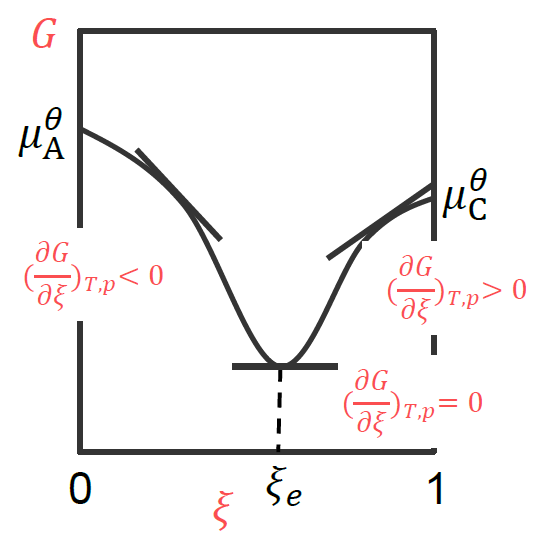

[toc]

# 化学反应的方向

对任一化学反应 
$$
a \mathrm{~A}+d \mathrm{D}=g \mathrm{G}+h \mathrm{H}
$$
当其发生微小变化, 不做非体积功
$$
\mathrm{d} G=-S \mathrm{~d} T+V \mathrm{~d} p+\sum_{\mathrm{B}} \mu_{\mathrm{B}} \mathrm{d} n_{\mathrm{B}}
$$
当温度、压力恒定时
$$
\mathrm{d} G=\sum_{\mathrm{B}} \mu_{\mathrm{B}} \mathrm{d} n_{\mathrm{B}}
$$
又因为 $\mathrm{d} n_{\mathrm{B}}=v_{B} \mathrm{d} \xi \quad$
$$
 \mathrm{d} G=\sum_{\mathrm{B}} v_{\mathrm{B}} \mu_{\mathrm{B}} \mathrm{d} \xi
$$

$$
\mathrm{d} G=\sum_{\mathrm{B}} v_{\mathrm{B}} \mu_{\mathrm{B}} \mathrm{d} \xi \quad \Longrightarrow \quad\left(\frac{\partial G}{\partial \xi}\right)_{T, p}=\sum_{\mathrm{B}} v_{\mathrm{B}} \mu_{\mathrm{B}}=\Delta_{r} G_{m}
$$
+   当 $\Delta_{r} G_{m}<0$, 反应自发地向右进行; 这时 $\sum v_{B} \mu_{B}<0$, 即 反应物的化学势之和大于产物的化学势之和。
+   当 $\Delta_{r} G_{m}>0$, 反应自发地向左进行; 这时 $\sum v_{B} \mu_{B}>0$, 即 反应物的化学势之和小于产物的化学势之和。
+   当 $\Delta_{r} G_{m}=0$, 反应达到平衡; 这时 $\sum v_{B} \mu_{B}=0$, 即反应物 的化学势之和等于产物的化学势之和。

## 化学反应的限度

对任一化学反应, 正向进行
$$
a \mathrm{~A}+d \mathrm{D} \rightarrow g \mathrm{G}+h \mathrm{H}
$$
既然产物的化学势较低, 为什么该反应不能进行到底?
$$
\begin{array}{cccc}
&\quad &A&\Longrightarrow\quad&C\\
&起始时&1~mol&& 0~mol\\
&t时刻时 &(1-\xi)mol && \xi~mol
\end{array}
$$
假设 $t$ 时刻 $\mathrm{A}$ 和 $\mathrm{C}$ 的化学势分别为 $\mu_{\mathrm{A}}$ 和 $\mu_{\mathrm{C}}$, 那此时体系的吉布斯自由能为
$$
G=\sum_{\mathrm{B}} n_{\mathrm{B}} \mu_{\mathrm{B}}=(1-\xi) \mu_{\mathrm{A}}+\xi \mu_{\mathrm{C}}
$$
假设 $\mathrm{A}$ 和 $\mathrm{C}$ 是理想气体 
$$
\quad \mu_{\mathrm{A}}=\mu_{\mathrm{A}}^{\theta}+R T \ln \frac{p_{\mathrm{A}}}{p^{\theta}} \qquad \mu_{\mathrm{C}}=\mu_{\mathrm{C}}^{\theta}+R T \ln \frac{p_{\mathrm{C}}}{p^{\theta}}
$$
 因此体系吉布斯自由能为
$$
G=(1-\xi)\left(\mu_{\mathrm{A}}^{\theta}+R T \ln \frac{p_{\mathrm{A}}}{p^{\theta}}\right)+\xi\left(\mu_{\mathrm{C}}^{\theta}+R T \ln \frac{p_{\mathrm{C}}}{p^{\theta}}\right)
$$
又因为 $p_{\mathrm{A}}=p x_{\mathrm{A}}, p_{\mathrm{C}}=p x_{\mathrm{C}}$
$$
G=\left\{(1-\xi) \mu_{\mathrm{A}}^{\theta}+\xi \mu_{\mathrm{C}}^{\theta}+R T \ln \frac{p}{p^{\theta}}\right\}+R T\left\{(1-\xi) \ln x_{\mathrm{A}}+\xi \ln x_{\mathrm{C}}\right\}
$$
另外考虑到
$$
x_{\mathrm{A}}=\frac{n_{\mathrm{A}}}{n_{\mathrm{A}}+n_{\mathrm{C}}}=1-\xi \qquad x_{\mathrm{C}}=1-x_{\mathrm{A}}=\xi
$$
最终吉布斯自由能为反应进度的函数
$$
\begin{aligned}
G&=\left\{(1-\xi)\mu_{A}^{\theta}+\xi \mu_{C}^{\theta}+RT\ln\frac{p}{p^\theta}\right\}+RT\{(1-\xi)+\xi\ln\xi\}\\
p=p^\theta\quad\to\quad&=\left\{(1-\xi)\mu_{A}^{\theta}+\xi \mu_{C}^{\theta}\right\}+RT\{(1-\xi)+\xi\ln\xi\}
\end{aligned}
$$
$G$ 对 $\xi$ 作图, 得一条曲线

+   在 $\xi_{e}$ 的左边, $\large\frac{\partial G}{\partial \xi}<0$, 反应正向进行
+   在 $\xi_{e}$ 的右边, $\large\frac{\partial G}{\partial \xi}>0$, 反应逆向进行
+   在 $\xi_{e}$ 处, $\large\frac{\partial G}{\partial \xi}=0$, 反应达到平衡。

化学反应平衡点 $\xi_e$
$$
G=\left\{(1-\xi) \mu_{\mathrm{A}}^{\theta}+\xi \mu_{\mathrm{C}}^{\theta}\right\}+R T\{(1-\xi) \ln (1-\xi)+\xi \ln \xi\}
$$
$G$ 对 $\xi$ 求一阶导数
$$
\frac{\partial G}{\partial \xi}=\left(\mu_{\mathrm{C}}^{\theta}-\mu_{\mathrm{A}}^{\theta}\right)-R T \ln (1-\xi)+R T \ln \xi
$$
反应达到平衡
$$
\frac{\partial G}{\partial \xi}=0 \Longrightarrow \xi_{e}=\frac{1}{1+e^{\left(\mu_{C}^{\theta}-\mu_{A}^{\theta}\right) / R T}}
$$
 由于 $0<\xi_{e}<1$, 进一步说明化学反应不能完全进行
