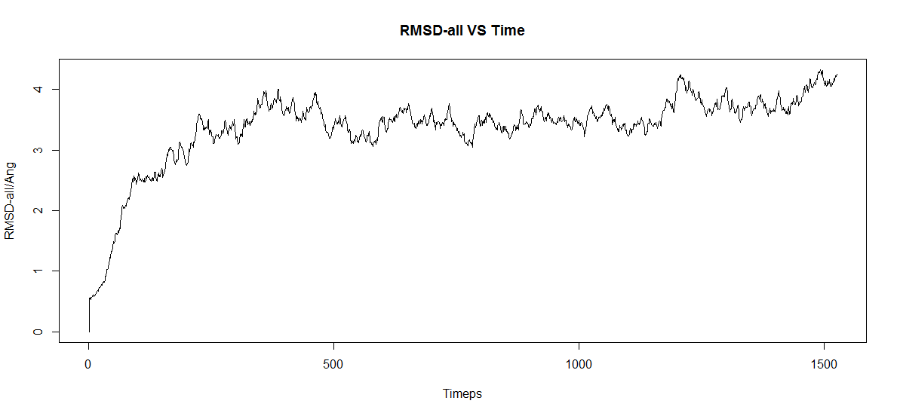
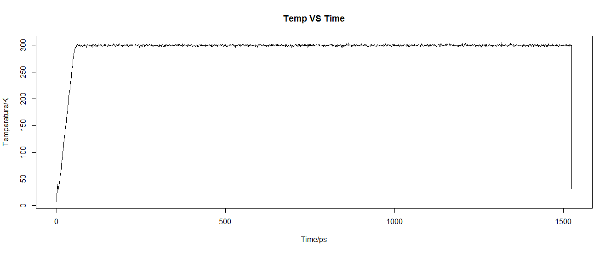
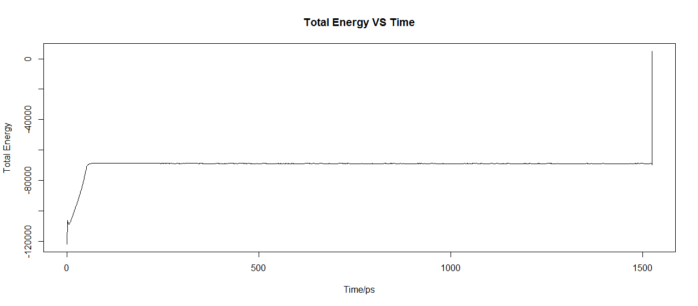
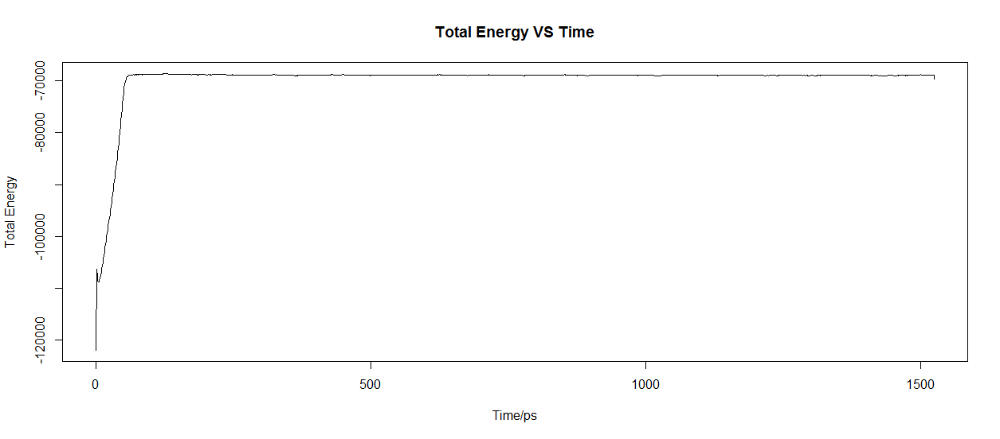
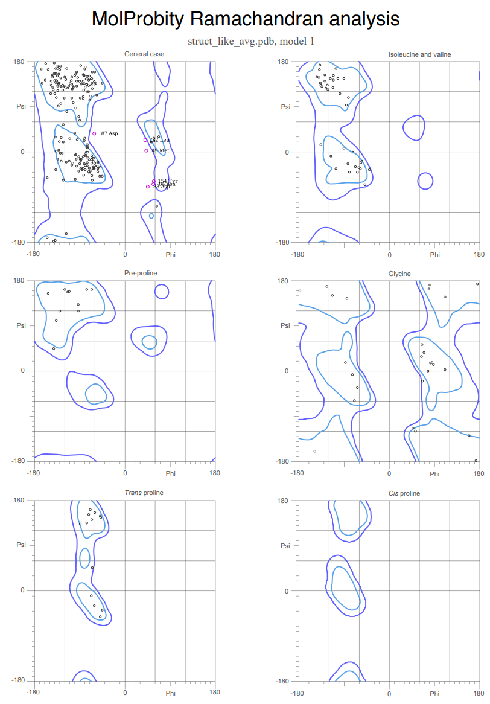

# COVID-19 主蛋白酶同源建模

> 生信 2001 张子栋 2020317210101

Table of Contents

[toc]

## 背景

当没有实验手段测定的结构存在时，同源建模时用于近似蛋白质 3D 结构的一种技术手段。该技术基于的原理是蛋白质的三级结构比氨基酸序列更保守，因此具有高序列同源性的蛋白质也应该具有高度的结构同源性。被建模的蛋白质称为目标蛋白，用于模拟目标的具有实验确定结构的蛋白质称为模版蛋白。模版蛋白和目标蛋白必须具有高度序列同源性，据此可以推测他们的 3D 结构非常相似。目标蛋白的氨基酸序列映射到模版蛋白的 3D 结构以产生近似模型，这就是同源模型。

## 实验步骤

### 获取目标蛋白质序列和参考 PDB 文件

1. 访问 [RCSB PDB: Homepage](https://www.rcsb.org/) 获取目标蛋白(#6LU7) FASTA 序列
2. 访问 [Protein BLAST](https://blast.ncbi.nlm.nih.gov/Blast.cgi?PROGRAM=blastp&PAGE_TYPE=BlastSearch&LINK_LOC=blasthome)

   + 粘贴 FASTA 序列到 BLAST 搜索框
   + 选择 PDB 作为搜索数据库，选择 blastp 作为搜索算法
   + 点击底部 BLAST 开始搜索

3. 选择模板
   + 这里选择符合度低的 `7VTC_A`
4. 下载 FASTA 序列和 PDB 文件
5. 将 `6UL7` 和 `7VTC_A` 的 FASTA, PDB 文件放入 `homology_modeling` 目录

### 在 MOE 中进行序列对比和构建模型

+ 删除除目标序列外的其他杂质
+ 删除水分子
+ 存为新的文件

### 使用 AMBER 进行动力学模拟

```bash
# 运行 tleap 程序
tleap

# 导入合适力场文件 这里使用 AMBER99 力场
source oldff/leaprc.ff99SB

# 导入有机力场
source leaprc.gaff

# 导入水的力场文件 因为会使用水对蛋白进行溶剂化处理
source leaprc.water.tip3p

# 导入模型的 PDB 文件
mol = loadpdb final.pdb

# 添加 8.0 埃水盒子
solvatebox mol TIP3PBOX 8

# 保存 *.crd 和 *.top 文件
saveamberparm mol final_HOH.prmtop final_HOH.inpcrd

# 使用 ambpdb 查看 PDB 文件
ambpdb -p final_HOH.prmtop -c final_HOH.inpcrd > final_HOH.pdb
```

> 如果残基数超过 $10000$ 会重新从 $0$ 开始计数
> protein: 1-306 water: 307-12039

### 准备输入文件

> 以下操作使用到了 Vim, 输入时要先按 `i` 进入插入模式, 否则会出现输入内容的丢失

#### `min_wat.in` 溶剂最小化

> `bellymask` 参数填入水分子范围

```bash
Constant Volume Minimization
# Control section
&cntrl
ntwe = 500, ntwx = 500, ntpr = 500,
nsnb = 25, dielc = 1, cut = 8.0,
ntb = 1,
maxcyc = 10000, ntmin = 1, ncyc = 5000, dx0 = 0.01, drms = 0.0001,
ntp = 0,
ibelly = 1, ntr = 0,
imin = 1,
bellymask = ':307-12039', iwrap = 1,
/
END
```

####  `md_water.in` 溶剂 MD - 模拟退火

> `bellymask` 参数填入水分子范围

```bash
Dynamic Simulation with Constant Pressure
# Control section
&cntrl
ntwx = 500, ntpr = 500,
ntt = 1, temp0 = 300.0, tempi = 5.0, tautp = 1.0,
dielc = 1, cut = 8.0,
ntb = 2, ntc = 2, ntf = 2,
nstlim = 250000, dt = 0.0020,
ntp = 1, taup = 0.1, comp = 44.6, pres0 = 1.0,
ibelly = 1, ntr = 0,
imin = 0, irest = 0, ntx = 1, nmropt = 1,
bellymask = ':307-12039', iwrap = 1,
/
&ewald
skinnb = 2.0,
nbflag = 1,
/
&wt
type = 'TEMP0', istep1 = 1, istep2 = 12500, value1 = 5.0, value2 = 300.0,
/
&wt
type = 'TEMP0', istep1 = 12501, istep2 = 237500, value1 = 300.0, value2 = 300.0,
/
&wt
type = 'TEMP0', istep1 = 237501, istep2 = 250000, value1 = 300.0, value2 = 5.0,
/
&wt
type='END'
/
END
```

#### `min_all.in` 体系最小化

```bash
Constant Volume Minimization
# Control section
&cntrl
ntwe = 500, ntwx = 500, ntpr = 500,
nsnb = 25, dielc = 1, cut = 8.0,
ntb = 1,
maxcyc = 10000, ntmin = 1, ncyc = 5000, dx0 = 0.01, drms = 0.0001,
ntp = 0,
ibelly = 0, ntr = 0,
imin = 1,
iwrap = 1,
/
END
```

#### `md_all.in` 体系 MD - MD 运行

```bash
Dynamic Simulation with Constant Pressure
# Control section
&cntrl
ntwx = 500, ntpr = 500,
ntt = 1, temp0 = 300.0, tempi = 5.0, tautp = 1.0,
dielc = 1, cut = 8.0,
ntb = 2, ntc = 2, ntf = 2,
nstlim = 762500, dt = 0.0020,
ntp = 1, taup = 0.1, comp = 44.6, pres0 = 1.0,
ibelly = 0, ntr = 0,
imin = 0, irest = 0, ntx = 1, nmropt = 1,
/
&ewald
skinnb = 2.0,
nbflag = 1,
/
&wt
type = 'TEMP0', istep1 = 1, istep2 = 25000, value1 = 5.0, value2 = 300.0,
/
&wt
type = 'TEMP0', istep1 = 25001, istep2 = 762500, value1 = 300.0, value2 = 300.0,
/
&wt
type='END'
/
END
```

#### `md_back.in` 侧链/溶剂MD - MD运行

```bash
Dynamic Simulation with Constant Pressure
# Control section
&cntrl
ntwx = 500, ntpr = 500,
ntt = 1, temp0 = 300.0, tempi = 5.0, tautp = 1.0,
dielc = 1, cut = 8.0,
ntb = 2, ntc = 2, ntf = 2,
nstlim = 400000, dt = 0.0020,
ntp = 1, taup = 0.1, comp = 44.6, pres0 = 1.0,
ibelly = 0, ntr = 1,
imin = 0, irest = 0, ntx = 1, nmropt = 1,
restraintmask = '@CA,C,O,N', restraint_wt=100,
iwrap = 1,
/
&ewald
skinnb = 2.0,
nbflag = 1,
/
&wt
type = 'TEMP0', istep1 = 1, istep2 = 25000, value1 = 5.0, value2 = 300.0,
/
&wt
type = 'TEMP0', istep1 = 25001, istep2 = 400000, value1 = 300.0, value2 = 300.0,
/
&wt
type = 'REST', istep1 = 1, istep2 = 40000, value1 = 0.1, value2 = 1.0,
/
&wt
type = 'REST', istep1 = 40001, istep2 = 400000, value1 = 1.0, value2 = 1.0,
/
&wt
type='END'
/
END
```

### 准备提交可执行文件

`run.com`

```bash
# 1. 溶剂能量最小化
sander -O -i min_wat.in -o min_wat.out -p nameSol.prmtop -c nameSol.inpcrd -r min_wat.rst

# 2. 模拟退火
sander -O -i md_wat.in -o md_wat.out -p nameSol.prmtop -c min_wat.rst -r md_wat.rst -x md_wat.crd

# 3. 整个体系能量最小化
sander -O -i min_all.in -o min_all.out -p nameSol.prmtop -c md_wat.rst -r min_all.rst

# 4. 整个体系升温并进行1500 ps动力学
sander -O -i md_all.in -o md_all.out -p nameSol.prmtop -c min_all.rst -r all_prod.rst -x all_prod.crd

# 5. 固定蛋白骨架后进行50ps升温然后进行750ps动力学
sander -O -i md_back.in -o md_back.out -p nameSol.prmtop -c min_all.rst -r back_prod.rst -ref min_all.rst -x back_prod.crd &
```

赋予文件执行权限 `chmod +x run.com`

### 提交并运行动力学

忽略输出运行文件

```bash
nohup ./run.com &
```

使用 `top` 查看进程是否在运行

> 在实验过程中, 这里出现了一点错误, 一个文件中的水分子的范围 错误地写成了 `307-12093`, 应为 `307-12039`
>
> 如果进程较多, 可以使用 `pa -aux | grep <userName>` 直接查看

### 轨迹分析

可能是因为在创建文件时出现了错误, 这里并没有跑出结果.

使用了助教的运行结果

#### 去除水

+ 在 `md_simulation` 目录下, 创建 `traj_strip_wat.in` 文件:

```bash
# Strip water of trajectory files
trajin all_prod.crd
strip :WAT
autoimage
trajout all_prod_nowat.crd
run
exit
```

+ 运行:

```bash
cpptraj -p final_HOH.prmtop -i traj_strip_wat.in > traj_strip_wat.out
```

+ 创建 `top_strip_wat.in` 文件:

```bash
# Strip water of top files
parmstrip :WAT
parmwrite out final_nowat.prmtop
run
exit
```

+ 运行:

```bash
cpptraj -p final_HOH.prmtop -i top_strip_wat.in > top_strip_wat.out
```

#### RMSD

在 `hm_analysis` 目录下: `mkdir md_analysis`

+ 创建 `rmsd.in`

```bash
# Caculate RMSD of protein
trajin ../../md_simulations/all_prod_nowat.crd
rms first mass @CA,C,N
rmsd protein-rmsd :1-303&!(@H=) out rmsd.dat
run
exit
```

+ 保存 `data` 

```bash
cpptraj -p ../../md_simulations/final_nowat.prmtop -i rmsd.in > rmsd.out
```

+ 使用 R 作图

```R
data <- read.table(file.choose())
plot(data, type = "l", xlab="Time/ps",ylab = "RMSD-all/Ang", main = "RMSD-all VS Time")
```



#### 温度

运行 `grep TIME ../../md_simulations/md_all.out > temp_time.txt` 并作图

```R
data <- read.table(file.choose())
time <- data$V6
temperature <- data$V9
plot(time, temperature, type = "l", main = "Temp VS Time", xlab = "Time/ps", ylab = "Temperature/K")
```



#### 总能量

运行 `grep Etot ../../md_simulations/md_all.out > Etot_time.txt` 并作图

```R
etot_time <- read.table(file.choose())
temp_time <- read.table(file.choose())
time <- temp_time$V6
temperature <- temp_time$V9
etot <- etot_time$V3
plot(time, etot, type = "l", main = "Total Energy VS Time", xlab = "Time/ps", ylab = "Total Energy")
```



+ 有一点明显错误, 去除后重新作图

```R
time <- time[-1528]
etot <- etot[-1528]
plot(time, etot, type = "l", main = "Total Energy VS Time", xlab = "Time/ps", ylab = "Total Energy")
```



### 模型优化

与仅有一个结构表示的最初的同源模型结构不同，优化模型结构是由动力学轨迹(一系列结构)来进行描述的，为了在轨迹中获取单个代表性的结构数据我们需要计算优化模型的平均结构.

#### 计算平均结构

`md_analysis` 目录下, 编辑 `get_avg_struct.in`:

```bash
# Get average structure 
trajin ../../md_simulations/all_prod_nowat.crd
average traj_avg_struct.pdb :1-303 start 50 stop 3050 offset 1 pdb
run
exit
```

+ 运行

```bash
cpptraj -p ../../md_simulations/final_nowat.prmtop -i get_avg_struct.in > get_avg_struct.out
```

#### 挑选代表结构

编辑 `rmsd_from_avg.in`:

```bash
# Calculate RMSD from average structure
trajin ../../md_simulations/all_prod_nowat.crd
reference ./traj_avg_struct.pdb
rms reference out rmsd_from_avg.txt :1-303
run
exit 
```

+ 运行

```bash
cpptraj -p ../../md_simulations/final_nowat.prmtop -i rmsd_from_avg.in > rmsd_from_avg.out
```

##### 导出代表结构

编辑 `get_refine_struct.in`:

```bash
#Get snapshot most like the average structure

trajin ../../md_simulations/all_prod_nowat.crd 1383 1383 1
trajout struct_like_avg.pdb pdb
run
exit
```

+ 运行

```bash
cpptraj -p ../../md_simulations/final_nowat.prmtop -i get_refine_struct.in > get_refine_struct.out
```

### 评估模型的合理性

在页面 [Main page - MolProbity (duke.edu)](http://molprobity.biochem.duke.edu/) 上获取拉氏构象图



+ 从拉氏构象图可以看到, 有部分氨基酸的二面角不在经验支持的范围内

## 总结

本次课程中, 通过过同源模建和分子动力学模拟这两种方法，我们完成了对 `6LU7` 蛋白的空间结构模拟和分析. 对这类实验的过程有了初步的了解. 因为背景知识的局限, 本次分析对蛋白结构的具体差异挖掘比较浅显, 后续还可以对导致空间结构差异的残基进行更加深入的分析.
