# 数据库实验报告

> 生信 2001 张子栋 2020317210101
>
> + GitHub: [MarkdownNotes/数据库实验报告.md at main · Bluuur/MarkdownNotes (github.com)](https://github.com/Bluuur/MarkdownNotes/blob/main/Data Base/数据库实验报告.md)
> + 同步至 Gitee: [Data Base/数据库实验报告.md · blur/MarkdownNotes (gitee.com)](https://gitee.com/bluur/MarkdownNotes/blob/main/Data Base/数据库实验报告.md)

## 实验1 数据查询和更新

1. 找出所有客户、代理商和商品都在同一城市的三元组（cid, aid, pid）。

  ```sql
  select cid, aid, pid
  from agents,
       customers,
       products
  where agents.city = customers.city
    and customers.city = products.city;
  ```

2. 找出所有客户、代理商和商品不都在同一城市（可能有两个在同一城市）的三元组（cid, aid, pid）。

  ```sql
  select cid, aid, pid
  from agents,
       customers,
       products
  where agents.city != customers.city
     or customers.city != products.city;
  ```

3. 找出所有在同一城市的代理商的aid对。

  ```sql
  select first.aid, second.aid
  from agents first,
       agents second
  where first.city = second.city
    and first.aid != second.aid;
  ```

4. 找出同时订购了商品p01和p07的客户的cid值。（若找出客户的cname呢？）

  ```sql
  select orders.cid, cname
  from orders,
       customers
  where orders.pid = 'p01'
      intersect
  select orders.cid, cname
  from orders,
       customers
  where orders.pid = 'p07';
  ```

5. 统计各个产品的销售总量。

  ```sql
  select pid, sum(qty)
  from orders
  group by pid;
  ```

6. 当某个代理商所订购的某样产品的总量超过1000时，打印出所有满足条件的产品和代理商的ID以及这个总量。

  ```sql
  select pid, aid, sum(qty)
  from orders
  group by pid, aid
  having sum(qty) > 1000;
  ```

7. 找出订购了产品p05的顾客的名字。

  ```sql
  select distinct cname
  from customers,
       orders
  where orders.pid = 'p05'
    and customers.cid = orders.cid;
  ```

8. 检索满足以下条件的顾客-代理商的姓名对（cname,aname）,其中的顾客cname通过代理商aname订了货。

  ```sql
  select cname, aname
  from orders,
       customers,
       agents
  where customers.cid = orders.cid
    and agents.aid = orders.aid;
  ```

9. 找出至少被两个顾客订购的产品的pid值。

  ```sql
  select distinct pid
  from orders
  where pid in (select pid from orders group by pid having count(pid) > 1)
  ```

10. 在customers表中插入一个新行。

  ```sql
  insert into customers(cid, cname, city)
  values (‘c007’, ’WinDix’, ’Dallas’);
  ```

11. 检索customers表中discnt值为空的行。

   ```sql
   select*
   from customers
   where discnt is null
   ```

12. 检索客户以及他们订购商品的详细信息。（用外联接）

   ```sql
   select customers.cid,
          cname,
          city,
          discnt,
          ordno,
          month,
          aid,
          pid,
          qty,
          dollars
   from customers
            left outer join orders on (customers.cid = orders.cid)
   ```

13. 检索有关住在Duluth或Dallas的代理商的所有信息。（要求使用IN谓词实现）

   ```sql
   select*
   from agents
   where city in ('Duluth', 'Dallas')
   ```

14. 找出通过住在Duluth或Dallas的代理商订货的所有顾客的姓名和折扣率。（要求使用IN谓词实现）

   ```sql
   select cname, discnt
   from customers,
        orders
   where customers.cid = orders.cid
     and orders.aid in (select aid
                        from agents
                        where city in ('Duluth', 'Dallas'))
   ```

15. 求所有满足以下条件的顾客的cid值：该顾客的discnt的值小于任一住在Duluth的顾客的discnt值。

   ```sql
   select cid
   from customers
   where discnt < any (select discnt
                       from customers
                       where city = 'Duluth')
   ```

16. 检索没有通过代理商a05订货的所有顾客的名字。
      提示：可以使用not in 或 <>all方式实现。

   ```sql
   select cname
   from customers,
        orders
   where customers.cid = orders.cid
     and aid <> 'a05'
   ```

17. 检索一个包含顾客所在的或者代理商所在的城市的名称。（使用UNION实现）

   ```sql
   select city
   from customers
   union
   select city
   from agents
   ```

18. 在orders表中插入一个新行。

   ```sql
   insert into orders(ordno, month, cid, aid, pid)
   values (1107, 'aug', 'c006', 'a04', 'p01');
   ```

19. 创建一个名为swcusts的表，它包含住在西南部的所有顾客，并向该表中插入所有来自Dallas或Austin的顾客。

   ```sql
   insert into swcusts
   select *
   from customers
   where city in (‘Dallas’, ’Austin’);
   ```

20. 将所有住在New York的代理商的佣金率提高10%。

   ```sql
   update agents
   set per=per * 1.1
   where city = 'New York'
   ```

21. 删除所有住在New York的代理商。

   ```sql
   delete
   from agents
   where city = 'New York'
   ```

22. 创建一个agentorders视图，它扩展了表orders的行，包括订货的代理商的详细信息。

   ```sql
   create view agentorders
   as
   select ordno,
          month,
          cid,
          orders.aid,
          pid,
          qty,
          dollars,
          aname,
          city,
          per
   from orders,
        agents
   where orders.aid = agents.aid;
   ```

23. 利用agentorders视图查询代理商Brown的所有订单信息

   ```sql
   select ordno, motn, cid, pid, qty, dollars
   from agentorders
   where aname = ’Brown’;
   ```

24. 创建cacities视图，该视图列出表customers和表agents中所有配对的城市，其中该顾客通过该代理商订购了商品。

   ```sql
   create view cacities(cid.cname, city, discnt, aid, aname, per)
   as
   select customers.cid,
          cname,
          customers.city,
          discnt,
          agents.aid,
          aname,
          per
   from agents,
        customers,
        orders
   where agent.aid = orders.aid
     and customers.cid = orders.cid
     and agents.city = customers.city
   ```

   

25. 创建custs视图

   ```sql
   create view custs as
   select *
   from customers
   where discnt <= 15.0
   with check option;
   ```

26. 对custs视图进行更新操作。

   ```sql
   update custs set discnt=discnt+4;
   ```

## 实验2 学生-课程-选修

### 实验目的

熟练掌握建立数据库和表，向数据库输入数据、修改数据、删除数据的操作。

### 实验内容

建立数据库并设计各表，输入多条实际数据，并实现数据的增、删、改操作。

### 实验步骤

创建用于学生管理数据库，数据库名为 `StudentCourse`，包含学生的基本信息，课程信息和选课信息。数据库 `StudentCourse` 包含下列3个表：

1. student：学生基本信息。
2. course：课程信息表。
3. sc：学生选课表。

各表的结构分别如表1、表2和表3所示。

表1 学生信息表：student

| 列名  | 数据类型 | 长度 | 是否允许为空值 |
| :---: | :------: | :--: | :------------: |
|  sno  |  字符型  |  10  |       否       |
| sname |  字符型  |  10  |       否       |
| ssex  |  字符型  |  2   |       否       |
| sage  |  整数型  |      |       是       |
| sdept |  字符型  |  4   |       否       |

表2 课程信息表：course

|  列名  | 数据类型 | 长度 | 是否允许为空值 |
| :----: | :------: | :--: | :------------: |
|  cno   |  字符型  |  3   |       否       |
| cname  |  字符型  |  30  |       否       |
| credit |  整数型  |      |       是       |
|  pcno  |  字符型  |  3   |       是       |

表3 学生选课表：sc

| 列名  | 数据类型 | 长度 | 是否允许为空值 |
| :---: | :------: | :--: | :------------: |
|  sno  |  字符型  |  10  |       否       |
|  cno  |  字符型  |  3   |       否       |
| grade |  整数型  |      |       是       |

### SQL 语句

#### 建表语句

```sql
create table student
(
    sno   char(10),
    sname char(10),
    ssex  char(2),
    sage  int,
    sdept char(4)
);

create table course
(
    cno    char(3),
    cname  char(30),
    credit int,
    pcno   char(3)
);

create table sc
(
    sno   char(10),
    cno   char(3),
    grade int
);

```

#### 写入数据

> 这里使用 MySQL 完成, 可以一次插入多条数据.

```SQL
insert into student (sno, sname, ssex, sage, sdept)
values ('95001', '李勇', '男', 18, 'CS'),
       ('95002', '刘晨', '女', 19, 'IS'),
       ('95003', '王敏', '女', 18, 'MA'),
       ('95004', '张立', '男', 19, 'IS'),
       ('95005', '刘云', '女', 18, 'CS');

insert into course (cno, cname, credit, pcno)
values ('1', '数据库', 4, '5'),
       ('2', '数学', 6, null),
       ('3', '信息系统', 3, '1'),
       ('4', '操作系统', 4, '6'),
       ('5', '数据结构', 4, '7'),
       ('6', '数据处理', 3, null),
       ('7', 'PASCAL语言', 4, '6');

insert into sc (sno, cno, grade)
values ('95001', '1', 92),
       ('95001', '2', 85),
       ('95001', '3', 88),
       ('95002', '2', 90),
       ('95002', '3', 80),
       ('95003', '2', 85),
       ('95004', '1', 58),
       ('95004', '2', 85);
```

1. 查询全体学生的学号和姓名

   ```sql
   select sno, sname
   from student;
   ```

   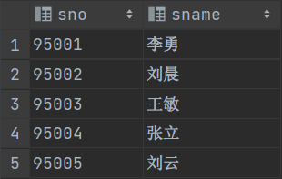

2. 查询选修了课程名为"数据库原理"的学生的学号和姓名

   ```sql
   select distinct student.sno, sname
   from student,
        sc,
        course
   where course.cno = sc.cno
     and student.sno = sc.sno
     and sc.cno = 1;
   ```

   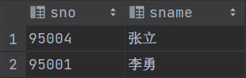

3. 查询全体学生的姓名, 出生年份,和所在系, 并用小写字母表示所有系名，并给各列指定列名。

   ```sql
   select sname name, 2022 - sage 'birth', lower(sdept) department
   from student;
   ```

   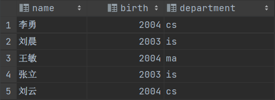

4. 查询有多少名学生的数据库课程成绩不及格

   ```sql
   select count(cno) 'num'
   from sc
   where grade < 60
     and cno = 1;
   ```

   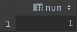

5. 查找所有姓"李"的学生的姓名, 学号和性别

   ```sql
   select sname, sno, ssex
   from student
   where sname like '李%';
   ```

   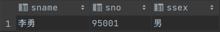

6. 求没有选修数学课程的学生学号

   ```sql
   select sno
   from student
   where sno not in (select sno from sc where cno = 2);
   ```

   

7. 查询选修了课程的学生的学号

   ```sql
   select distinct sno
   from student
   where sno in (select sno from sc);
   ```

   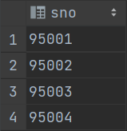

8. 计算1号课程的学生的平均成绩, 最高分和最低分

   ```sql
   select avg(grade), max(grade), min(grade)
   from sc
   where cno = 1
   ```

   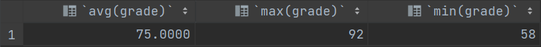

9. 查询数学系和信息系的学生的信息

   ```sql
   select*
   from student
   where sdept in ('MA', 'IS');
   ```

   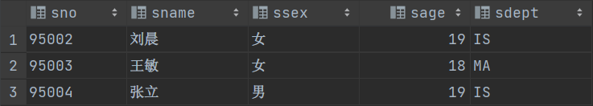

10. 将年龄为19岁的学生的成绩置零

    ```sql
    update sc
    set grade=0
    where sno in (select sno from student where sage = 19);
    ```

    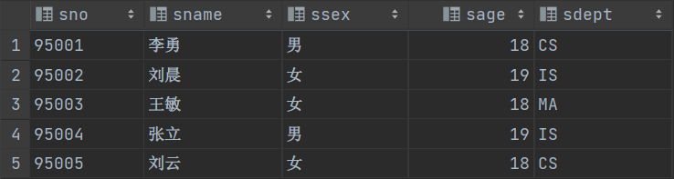
    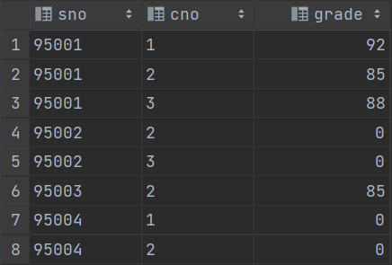

11. 查询所有选修了1号课程的学生姓名

    ```sql
    select sname
    from student,
         sc
    where student.sno = sc.sno
      and cno = 1;
    ```

    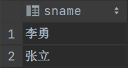

12. 对每一个性别，求学生的平均年龄，并把结果存入数据库

    ```sql
    create table sex_age
    (
        ssex    char(15),
        avg_age smallint
    );
    
    insert
    into sex_age(ssex, avg_age)
    select ssex, avg(sage)
    from student
    group by ssex;
    ```

    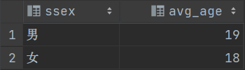

13. 查询每个学生已获得的学分

    ```sql
    select sno, sum(credit)
    from course,
         sc
    where sc.cno = course.cno
    group by sno;
    ```

    

14. 将所有女生的记录定义为一个视图

    ```sql
    create view female_student
    as
    select*
    from student
    where ssex = '女';
    ```

    

15. 查询没有选修了1号课程的学生姓名

    ```sql
    select distinct sname
    from student,
         sc
    where student.sno not in (select sno from sc where cno = 1);
    ```

    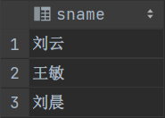

16. 将所有选修了数据库课程的学生的成绩加5分

    ```sql
    update sc
    set grade=grade + 5
    where cno = 1;
    ```

    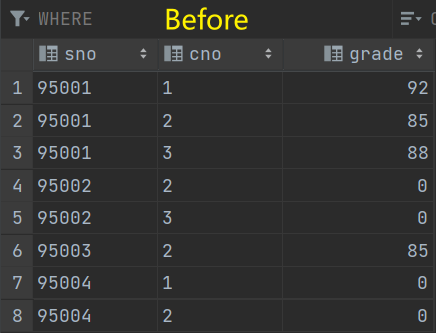
    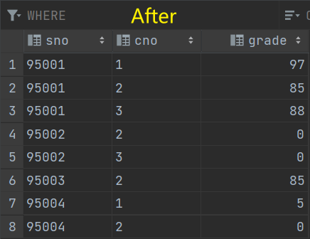

17. 查询各系的男女生学生总数, 并按系升序排列, 女生排在前

    ```sql
    select sdept, ssex, count(*) as num
    from student
    group by sdept, ssex
    order by sdept, ssex;
    ```

    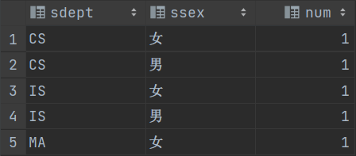

18. 查询"信息系"(IS)学生"数据结构"课程的平均成绩

    ```sql
    select avg(grade)
    from sc,
         student,
         course
    where student.sdept = 'IS'
      and student.sno = sc.sno
      and course.cname = '数据结构'
      and course.cno = sc.cno;
    ```

    > 原数据中没有给出此项成绩

    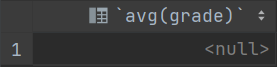

19. 创建一个反映学生出生年份的视图

    ```sql
    create view birth(sno, sname, sbirth)
    as
    select sno, sname, 2022 - sage
    from student;
    ```

    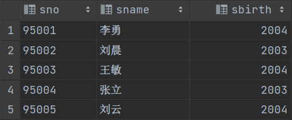

20. 查询与"王田"在同一个系学习的学生的信息

    ```sql
    select *
    from student
    where sdept in (select sdept from student where sname = '王田');
    ```

    > 原数据中没有给出此项数据

    

21. 查询年龄在20岁以下的学生的姓名及其年龄

    ```sql
    select sname, sage
    from student
    where sage < 20
    ```

    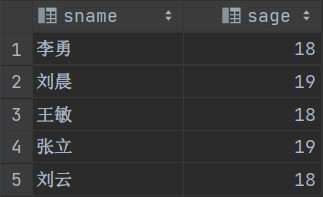

22. 查询当前至少选修数据库和信息系统其中一门课的学生的学号

    ```sql
    select sno
    from sc,
         course
    where course.cname = '数据库'
      and course.cno = sc.cno
    union
    select sno
    from sc,
         course
    where course.cname = '信息系统'
      and course.cno = sc.cno;
    ```

    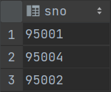

23. 查询每个学生的学号, 姓名, 选修的课程名和成绩

    ```sql
    select student.sno, sname, cname, grade
    from student,
         course,
         sc
    where student.sno = sc.sno
      and sc.cno = course.cno;
    ```

    

24. 查找名字中包括“俊”的学生的姓名, 学号，选课课程和成绩

    ```sql
    select sname, student.sno, cname, grade
    from student,
         sc,
         course
    where sname like '%俊%';
    ```

    > 没有相关姓名的学生

    

25. 查询学分大于8的学生，输出学生的学号和学分

    ```sql
    select sno, sum(credit)
    from sc,
         course
    where sc.cno = course.cno
    group by sno
    having sum(credit) > 8;
    ```

    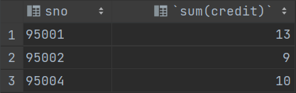

26. 查询IS,CS,MA系的所有学生的姓名和性别

    ```sql
    select sname, ssex
    from student
    where sdept in ('IS', 'MA', 'CS');
    ```

    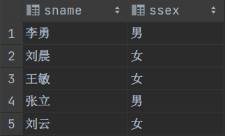

27. 查询至少选修了2门课程的学生的平均成绩

    ```sql
    select avg(grade)
    from sc
    group by sno
    having count(*) >= 2;
    ```

    

28. 查询每个学生所选课程的平均成绩, 最高分, 最低分,和选课门数

    ```sql
    select sno, avg(grade), max(grade), min(grade), count(*)
    from sc
    group by sno;
    ```

    

29. 删除年龄大于21岁所有学生的选课记录

    ```sql
    delete
    from sc
    where sno in (select sno from student where sage > 21);
    ```

    > 不存在大于21岁的学生

30. 查询没有先行课的课程的课程号cno和课程名cname

    ```sql
    select cno, cname
    from course
    where pcno is null;
    ```

    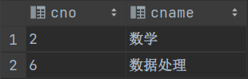

31. 创建信息系学生信息的视图

    ```sql
    create view is_info
    as
    select*
    from student
    where sdept = 'IS';
    ```

    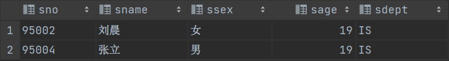

32. 在信息系的学生视图中查询年龄小于20岁的学生

    ```sql
    select sno, sage
    from is_info
    where sage < 20;
    ```

    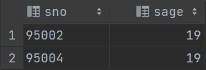

33. 删除马朝阳同学的所有选课记录

    ```sql
    delete
    from sc
    where sno like (select sno from student where sname = '马朝阳');
    ```

34. 查询选修了3号课程的学生的学号和成绩, 并按分数降序排列

    ```sql
    select sno, grade
    from sc
    where cno = 3
    order by grade desc;
    ```

    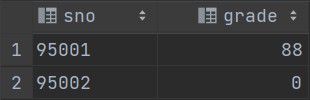

35. 查询数据库课程成绩不及格的学生，输入其学号，姓名和成绩

    ```sql
    select student.sno, sname, grade
    from sc,
         student,
         course
    where grade < 60
      and sc.cno = course.cno
      and cname = '数据库';
    ```

    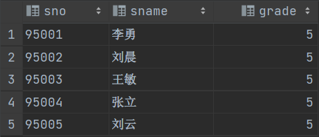

36. 查询全体学生的情况,查询结果按所在系号升序排列, 同一系中的学生按年龄降序排列

    ```sql
    select *
    from student
    order by sdept, sage desc;
    ```

    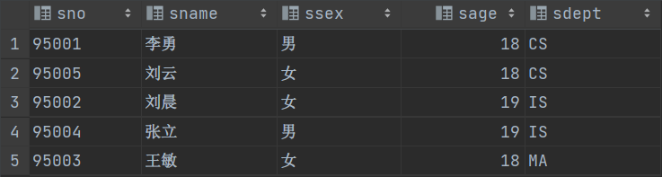

37. 查询每个学生及其选修课程的情况

    ```sql
    select student.sno, sname, sc.cno, cname
    from sc,
         student,
         course
    where sc.cno = course.cno
      and student.sno = sc.sno;
    ```

    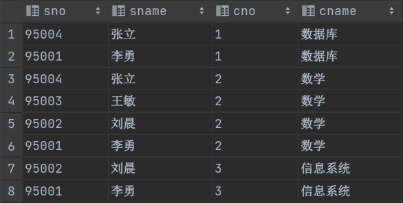

38. 查询每一门课程的间接先行课

    ```SQL
    select c1.cname, c1.cno, c2.cname, c2.cno
    from course c1,
         course c2
    where c1.pcno = c2.cno;
    ```

    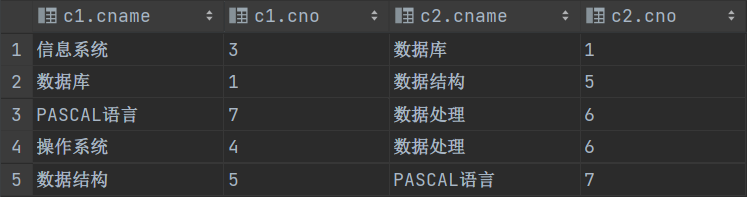

39. 查询选修1号课程且成绩在85分以上的所有学生的学号、姓名

    ```sql
    select sc.sno, sname
    from sc,
         student
    where sc.cno = 1
      and grade > 85
      and sc.sno = student.sno;
    ```

    

40. 查询全体学生的所有信息

    ```sql
    select sc.*, student.*, course.*
    from student,
         sc,
         course
    where student.sno=sc.sno
    and sc.cno=course.cno;
    ```

    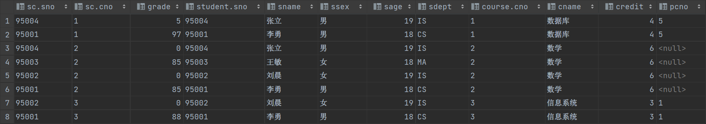

41. 查询选修了课程’1’和课程’2’的学生的学号

    ```sql
    select sno
    from sc
    where sno in
          (select distinct sno
           from sc
           where cno = 1)
      and cno = 2;
    ```

    

42. 创建信息系选修了1号课程的学生的视图

    ```sql
    create view course_one
    as
    select student.*
    from sc,
         student
    where cno = 1
      and sc.sno = student.sno;
    ```

    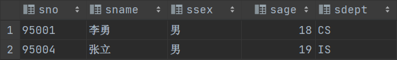

43. 建立信息系选修了1号课程且成绩在90分以上的学生的视图

    ```sql
    create view course_one_above_90
    as
    select student.*
    from student,
         sc
    where cno = 1
      and student.sno = sc.sno
      and grade > 90;
    ```

    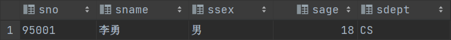

44. 查询修课总学分在10学分以下的学生姓名

    ```sql
    select sname
    from student
    where sno in (select sno
                  from sc,
                       course
                  where sc.cno = course.cno
                  group by sno
                  having sum(credit) < 10);
    ```

    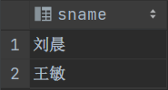

45. 查询比’刘晨’年龄小的所有学生的信息

    ```sql
    select*
    from student
    where sage < (select sage from student where sname = '刘晨');
    ```

    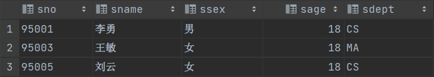

46. 查询所有选修了2号课程的学生的姓名

    ```sql
    select sname
    from student,
         sc
    where cno = 2
      and sc.sno = student.sno;
    ```

    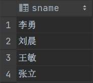

47. 查询其他系中比信息系(IS)某一学生年龄小的学生姓名和年龄

    ```sql
    select sname, sage
    from student
    where sdept <> 'IS'
      and sage < any (select sage from student where sdept = 'IS');
    ```

    

48. 查询学生2号课程的成绩，并按照成绩由高到低输出

    ```sql
    select grade
    from sc
    where cno = 2
    order by grade desc;
    ```

    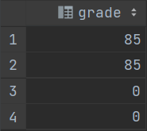

49. 查询考试成绩有不及格的学生的学号

    ```sql
    select distinct sno
    from sc
    where grade < 60;
    ```

    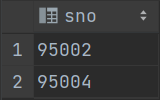

50. 查询其他系中比信息系(IS)学生年龄都小的学生姓名和年龄

    ```sql
    select sname, sage
    from student
    where sdept <> 'IS'
      and sage < all (select sage from student where sdept = 'IS');
    ```

    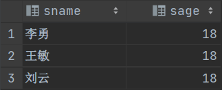
    
51.  将所有学生的学号和他的平均成绩定义为一个视图

    ```sql
    create view avg_grade(sno, avgGrade)
    as
    select sno, AVG(grade)
    from sc
    group by sno
    ```

    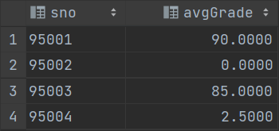

52. 在视图 S_G 中查询平均成绩在 90 分以上的学生的学号和平均成绩

    ```sql
    select *
    from avg_grade
    where avgGrade >= 90
    ```

    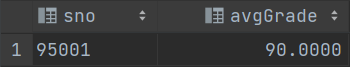

53. 查询与计算机系(CS)系所有学生的年龄均不同的学生学号, 姓名和年龄

    ```sql
    select distinct sno, sname, sage
    from student
    where sdept != 'CS'
      and sage NOT IN (select sage
                       from student
                       where sdept = 'CS');
    ```

    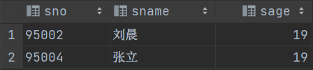

54.  查询信息系选修了1号课程的学生

    ```sql
    select sc.sno, sname
    from student,
         sc
    where sc.cno = 1
      and sdept = 'IS'
      and student.sno = sc.sno;
    ```

    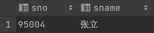

55. 查询与其他所有学生年龄均不同的学生学号, 姓名和年龄

    ```SQL
    # 没有这样的学生, 修改一个数据以符合要求
    update student
    set sage=20
    where sno = 95001;
    
    select a.sno, a.sname, a.sage
    from student a
    where sage not in (select sage
                       from student b
                       where a.sno != b.sno);
    ```

    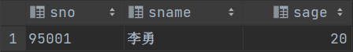

56. 查询选修了全部课程的学生姓名

    ```sql
    select sname
    from student,
         sc
    where student.sno = sc.sno
      and sc.cno = all (select cno
                        from course); 
    ```

57. 求没有人选修的课程号 cno 和 cname

    ```sql
    select cno, cname
    from course
    where cno not in (select cno
                      from sc);
    ```

    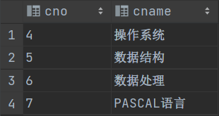

58. 查询满足条件的(sno,cno)对, 其中该学号的学生没有选修该课程号 cno 的课程

    ```sql
    select sno, course.cno
    from course,
         sc
    group by sc.sno, course.cno
    having course.cno not in (select sc.cno from sc); 
    ```

    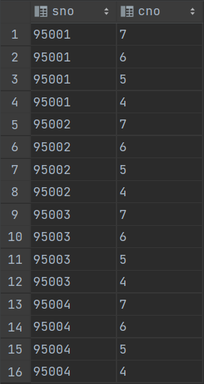

59. 查询每个学生的课程成绩最高的成绩信息(sno,cno,grade)

    ```sql
    select b.sno, b.cno, b.grade
    from (select sno, max(grade) maxg
          from sc
          group by sno) a,
         sc b
    where a.sno = b.sno
      and a.maxg = b.grade; 
    ```

    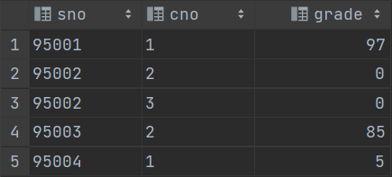

60. 查询学生总人数

    ```sql
    select COUNT(sno)
    from student;
    ```

    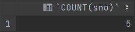

61. 查询年龄在20-30岁直接的学生的姓名, 姓名, 所在系

    ```sql
    select sname, ssex, sdept
    from student
    where sage >= 20
      and sage <= 30;
    ```

    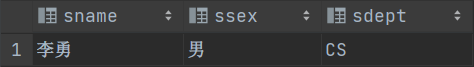

62. 查询所有课程的总学分数和平均学分数,以及最高学分和最低学分

    ```sql
    select SUM(credit) sum, avg(credit) avg, MAX(credit) max, min(credit) min
    from course;
    ```

    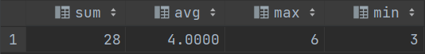

63. 求成绩低于该门课程平均成绩的学生的成绩信息(sno,cno,grade)

    ```sql
    select sno, cno, grade
    from sc
    where grade < (select avg(a.grade)
                   from sc a,
                        sc b
                   where a.cno = b.cno);
    ```

    

64. 查询各系的学生的人数并按人数从多到少排序 

    ```sql
    select sdept, count(sno) count
    from student
    group by sdept
    order by count desc;
    ```

    

65. 创建年龄大于23岁的学生的视图

    ```sql
    create view view66 as
    select sage
    from student
    where sage > 23;  
    ```

    

66. 查询选修了课程的学生总数

    ```sql
    select COUNT(sno)
    from student
    where sno in (select sno
                  from sc);
    ```

    

67. 查询选修了3门课程以上的学生的学号和姓名

    ```SQL
    select sno, sname
    from student
    where sno in
          (select sno
           from sc
           group by sno
           having count(*) >= 3);
    ```

    

68. 查询平均分超过80分的学生的学号和平均分

    ```sql
    select sno, avg(grade) avg
    from sc
    group by sno
    having avg(grade) > 80;
    ```

    

69. 比较: 求各学生的60分以上课程的平均分

    ```sql
    select sno, avg(grade) avg
    from sc
    where grade >= 60
    group by sno;
    ```

    

70. 查询”信息系”(IS)中选修了2门课程以上的学生的学号

    ```sql
    select sc.sno
    from student,
         sc
    where sdept = 'IS'
      and student.sno = sc.sno
    group by sc.sno
    having COUNT(sc.sno) >= 2;
    ```

    

71. 查询选修了1号课程或2号课程的学生的学号

    ```sql
    select distinct a.sno
    from sc a,
         sc b
    where a.cno = 1
       or b.cno = 2 and a.sno = b.sno;
    ```

    

72. 查询平均成绩少于70分的学生的学号

    ```sql
    select sno
    from sc
    group by sno
    having avg(grade) <= 70;
    ```

    

73. 将信息系学生视图IS_Student中学号为”95002”的学生姓名改为”刘辰”

    ```sql
    create view IS_Student
    as
    select *
    from student
    where sdept='IS';
    
    update student
    set sname='刘辰'
    where sno = '95002' and sdept='IS'; 
    ```

74. 向信息系学生视图IS_Student中插入一个新的学生记录, 学号为95029,姓名为”刘一梦”, 年龄为20岁

    ```sql
    insert
    into IS_Student
    values ('95029', '刘一梦', '女', '20', 'IS');
    ```

75. 删除信息系学生视图IS_Student中学号为95004的学生的记录

    ```sql
    delete
    from IS_Student
    where sno = 95001; 
    ```

## 课程感悟与建议

+ 关于命名规范

  + 字段命名规范, 建议采用 SnakeCase, 如 `user_name`

  + 表名以 `t_` 开头

  + 见名知意, 不使用缩写

+ 考虑使用 MySQL,或讲解中介绍 MySQL
