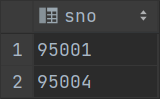

# 数据库实验报告

> 生信 2001 张子栋
>
> + GitHub: [MarkdownNotes/数据库实验报告.md at main · Bluuur/MarkdownNotes (github.com)](https://github.com/Bluuur/MarkdownNotes/blob/main/Data Base/数据库实验报告.md)
> + 同步至 Gitee: [Data Base/数据库实验报告.md · blur/MarkdownNotes (gitee.com)](https://gitee.com/bluur/MarkdownNotes/blob/main/Data Base/数据库实验报告.md)

## 实验三 学生-课程-选修

### 实验目的

熟练掌握建立数据库和表，向数据库输入数据、修改数据、删除数据的操作。

### 实验内容

建立数据库并设计各表，输入多条实际数据，并实现数据的增、删、改操作。

### 实验步骤

创建用于学生管理数据库，数据库名为 `StudentCourse`，包含学生的基本信息，课程信息和选课信息。数据库 `StudentCourse` 包含下列3个表：

1. student：学生基本信息。
2. course：课程信息表。
3. sc：学生选课表。

各表的结构分别如表1、表2和表3所示。

表1 学生信息表：student

| 列名  | 数据类型 | 长度 | 是否允许为空值 |
| :---: | :------: | :--: | :------------: |
|  sno  |  字符型  |  10  |       否       |
| sname |  字符型  |  10  |       否       |
| ssex  |  字符型  |  2   |       否       |
| sage  |  整数型  |      |       是       |
| sdept |  字符型  |  4   |       否       |

表2 课程信息表：course

|  列名  | 数据类型 | 长度 | 是否允许为空值 |
| :----: | :------: | :--: | :------------: |
|  cno   |  字符型  |  3   |       否       |
| cname  |  字符型  |  30  |       否       |
| credit |  整数型  |      |       是       |
|  pcno  |  字符型  |  3   |       是       |

表3 学生选课表：sc

| 列名  | 数据类型 | 长度 | 是否允许为空值 |
| :---: | :------: | :--: | :------------: |
|  sno  |  字符型  |  10  |       否       |
|  cno  |  字符型  |  3   |       否       |
| grade |  整数型  |      |       是       |

### SQL 语句

#### 建表语句

```sql
create table student
(
    sno   char(10),
    sname char(10),
    ssex  char(2),
    sage  int,
    sdept char(4)
);

create table course
(
    cno    char(3),
    cname  char(30),
    credit int,
    pcno   char(3)
);

create table sc
(
    sno   char(10),
    cno   char(3),
    grade int
);

```

#### 写入数据

> 这里使用 MySQL 完成, 可以一次插入多条数据.

```SQL
insert into student (sno, sname, ssex, sage, sdept)
values ('95001', '李勇', '男', 18, 'CS'),
       ('95002', '刘晨', '女', 19, 'IS'),
       ('95003', '王敏', '女', 18, 'MA'),
       ('95004', '张立', '男', 19, 'IS'),
       ('95005', '刘云', '女', 18, 'CS');

insert into course (cno, cname, credit, pcno)
values ('1', '数据库', 4, '5'),
       ('2', '数学', 6, null),
       ('3', '信息系统', 3, '1'),
       ('4', '操作系统', 4, '6'),
       ('5', '数据结构', 4, '7'),
       ('6', '数据处理', 3, null),
       ('7', 'PASCAL语言', 4, '6');

insert into sc (sno, cno, grade)
values ('95001', '1', 92),
       ('95001', '2', 85),
       ('95001', '3', 88),
       ('95002', '2', 90),
       ('95002', '3', 80),
       ('95003', '2', 85),
       ('95004', '1', 58),
       ('95004', '2', 85);
```

1. 查询全体学生的学号和姓名

   ```sql
   select sno, sname
   from student;
   ```

   

2. 查询选修了课程名为"数据库原理"的学生的学号和姓名

   ```sql
   select distinct student.sno, sname
   from student,
        sc,
        course
   where course.cno = sc.cno
     and student.sno = sc.sno
     and sc.cno = 1;
   ```

   

3. 查询全体学生的姓名, 出生年份,和所在系, 并用小写字母表示所有系名，并给各列指定列名。

   ```sql
   select sname name, 2022 - sage 'birth', lower(sdept) department
   from student;
   ```

   

4. 查询有多少名学生的数据库课程成绩不及格

   ```sql
   select count(cno) 'num'
   from sc
   where grade < 60
     and cno = 1;
   ```

   

5. 查找所有姓"李"的学生的姓名, 学号和性别

   ```sql
   select sname, sno, ssex
   from student
   where sname like '李%';
   ```

   

6. 求没有选修数学课程的学生学号

   ```sql
   select sno
   from student
   where sno not in (select sno from sc where cno = 2);
   ```

   

7. 查询选修了课程的学生的学号

   ```sql
   select distinct sno
   from student
   where sno in (select sno from sc);
   ```

   

8. 计算1号课程的学生的平均成绩, 最高分和最低分

   ```sql
   select avg(grade), max(grade), min(grade)
   from sc
   where cno = 1
   ```

   

9. 查询数学系和信息系的学生的信息

   ```sql
   select*
   from student
   where sdept in ('MA', 'IS');
   ```

   

10. 将年龄为19岁的学生的成绩置零

    ```sql
    update sc
    set grade=0
    where sno in (select sno from student where sage = 19);
    ```

    
    

11. 查询所有选修了1号课程的学生姓名

    ```sql
    select sname
    from student,
         sc
    where student.sno = sc.sno
      and cno = 1;
    ```

    

12. 对每一个性别，求学生的平均年龄，并把结果存入数据库

    ```sql
    create table sex_age
    (
        ssex    char(15),
        avg_age smallint
    );
    
    insert
    into sex_age(ssex, avg_age)
    select ssex, avg(sage)
    from student
    group by ssex;
    ```

    

13. 查询每个学生已获得的学分

    ```sql
    select sno, sum(credit)
    from course,
         sc
    where sc.cno = course.cno
    group by sno;
    ```

    

14. 将所有女生的记录定义为一个视图

    ```sql
    create view female_student
    as
    select*
    from student
    where ssex = '女';
    ```

    

15. 查询没有选修了1号课程的学生姓名

    ```sql
    select distinct sname
    from student,
         sc
    where student.sno not in (select sno from sc where cno = 1);
    ```

    

16. 将所有选修了数据库课程的学生的成绩加5分

    ```sql
    update sc
    set grade=grade + 5
    where cno = 1;
    ```

    
    

17. 查询各系的男女生学生总数, 并按系升序排列, 女生排在前

    ```sql
    select sdept, ssex, count(*) as num
    from student
    group by sdept, ssex
    order by sdept, ssex;
    ```

    

18. 查询"信息系"(IS)学生"数据结构"课程的平均成绩

    ```sql
    select avg(grade)
    from sc,
         student,
         course
    where student.sdept = 'IS'
      and student.sno = sc.sno
      and course.cname = '数据结构'
      and course.cno = sc.cno;
    ```

    > 原数据中没有给出此项成绩

    

19. 创建一个反映学生出生年份的视图

    ```sql
    create view birth(sno, sname, sbirth)
    as
    select sno, sname, 2022 - sage
    from student;
    ```

    

20. 查询与"王田"在同一个系学习的学生的信息

    ```sql
    select *
    from student
    where sdept in (select sdept from student where sname = '王田');
    ```

    > 原数据中没有给出此项数据

    

21. 查询年龄在20岁以下的学生的姓名及其年龄

    ```sql
    select sname, sage
    from student
    where sage < 20
    ```

    

22. 查询当前至少选修数据库和信息系统其中一门课的学生的学号

    ```sql
    select sno
    from sc,
         course
    where course.cname = '数据库'
      and course.cno = sc.cno
    union
    select sno
    from sc,
         course
    where course.cname = '信息系统'
      and course.cno = sc.cno;
    ```

    

23. 查询每个学生的学号, 姓名, 选修的课程名和成绩

    ```sql
    select student.sno, sname, cname, grade
    from student,
         course,
         sc
    where student.sno = sc.sno
      and sc.cno = course.cno;
    ```

    

24. 查找名字中包括“俊”的学生的姓名, 学号，选课课程和成绩

    ```sql
    select sname, student.sno, cname, grade
    from student,
         sc,
         course
    where sname like '%俊%';
    ```

    > 没有相关姓名的学生

    

25. 查询学分大于8的学生，输出学生的学号和学分

    ```sql
    select sno, sum(credit)
    from sc,
         course
    where sc.cno = course.cno
    group by sno
    having sum(credit) > 8;
    ```

    

26. 查询IS,CS,MA系的所有学生的姓名和性别

    ```sql
    select sname, ssex
    from student
    where sdept in ('IS', 'MA', 'CS');
    ```

    

27. 查询至少选修了2门课程的学生的平均成绩

    ```sql
    select avg(grade)
    from sc
    group by sno
    having count(*) >= 2;
    ```

    

28. 查询每个学生所选课程的平均成绩, 最高分, 最低分,和选课门数

    ```sql
    select sno, avg(grade), max(grade), min(grade), count(*)
    from sc
    group by sno;
    ```

    

29. 删除年龄大于21岁所有学生的选课记录

    ```sql
    delete
    from sc
    where sno in (select sno from student where sage > 21);
    ```

    > 不存在大于21岁的学生

30. 查询没有先行课的课程的课程号cno和课程名cname

    ```sql
    select cno, cname
    from course
    where pcno is null;
    ```

    

31. 创建信息系学生信息的视图

    ```sql
    create view is_info
    as
    select*
    from student
    where sdept = 'IS';
    ```

    

32. 在信息系的学生视图中查询年龄小于20岁的学生

    ```sql
    select sno, sage
    from is_info
    where sage < 20;
    ```

    

33. 删除马朝阳同学的所有选课记录

    ```sql
    delete
    from sc
    where sno like (select sno from student where sname = '马朝阳');
    ```

34. 查询选修了3号课程的学生的学号和成绩, 并按分数降序排列

    ```sql
    select sno, grade
    from sc
    where cno = 3
    order by grade desc;
    ```

    

35. 查询数据库课程成绩不及格的学生，输入其学号，姓名和成绩

    ```sql
    select student.sno, sname, grade
    from sc,
         student,
         course
    where grade < 60
      and sc.cno = course.cno
      and cname = '数据库';
    ```

    

36. 查询全体学生的情况,查询结果按所在系号升序排列, 同一系中的学生按年龄降序排列

    ```sql
    select *
    from student
    order by sdept, sage desc;
    ```

    

37. 查询每个学生及其选修课程的情况

    ```sql
    select student.sno, sname, sc.cno, cname
    from sc,
         student,
         course
    where sc.cno = course.cno
      and student.sno = sc.sno;
    ```

    

38. 查询每一门课程的间接先行课

    ```SQL
    select c1.cname, c1.cno, c2.cname, c2.cno
    from course c1,
         course c2
    where c1.pcno = c2.cno;
    ```

    

39. 查询选修1号课程且成绩在85分以上的所有学生的学号、姓名

    ```sql
    select sc.sno, sname
    from sc,
         student
    where sc.cno = 1
      and grade > 85
      and sc.sno = student.sno;
    ```

    

40. 查询全体学生的所有信息

    ```sql
    select sc.*, student.*, course.*
    from student,
         sc,
         course
    where student.sno=sc.sno
    and sc.cno=course.cno;
    ```

    

41. 查询选修了课程’1’和课程’2’的学生的学号

    ```sql
    select sno
    from sc
    where sno in
          (select distinct sno
           from sc
           where cno = 1)
      and cno = 2;
    ```

    

42. 创建信息系选修了1号课程的学生的视图

    ```sql
    create view course_one
    as
    select student.*
    from sc,
         student
    where cno = 1
      and sc.sno = student.sno;
    ```

    

43. 建立信息系选修了1号课程且成绩在90分以上的学生的视图

    ```sql
    create view course_one_above_90
    as
    select student.*
    from student,
         sc
    where cno = 1
      and student.sno = sc.sno
      and grade > 90;
    ```

    

44. 查询修课总学分在10学分以下的学生姓名

    ```sql
    select sname
    from student
    where sno in (select sno
                  from sc,
                       course
                  where sc.cno = course.cno
                  group by sno
                  having sum(credit) < 10);
    ```

    

45. 查询比’刘晨’年龄小的所有学生的信息

    ```sql
    select*
    from student
    where sage < (select sage from student where sname = '刘晨');
    ```

    

46. 查询所有选修了2号课程的学生的姓名

    ```sql
    select sname
    from student,
         sc
    where cno = 2
      and sc.sno = student.sno;
    ```

    

47. 查询其他系中比信息系(IS)某一学生年龄小的学生姓名和年龄

    ```sql
    select sname, sage
    from student
    where sdept <> 'IS'
      and sage < any (select sage from student where sdept = 'IS');
    ```

    

48. 查询学生2号课程的成绩，并按照成绩由高到低输出

    ```sql
    select grade
    from sc
    where cno = 2
    order by grade desc;
    ```

    

49. 查询考试成绩有不及格的学生的学号

    ```sql
    select distinct sno
    from sc
    where grade < 60;
    ```

    

50. 查询其他系中比信息系(IS)学生年龄都小的学生姓名和年龄

    ```sql
    select sname, sage
    from student
    where sdept <> 'IS'
      and sage < all (select sage from student where sdept = 'IS');
    ```

    
    
51.  将所有学生的学号和他的平均成绩定义为一个视图

    ```sql
    create view avg_grade(sno, avgGrade)
    as
    select sno, AVG(grade)
    from sc
    group by sno
    ```

    

52. 在视图 S_G 中查询平均成绩在 90 分以上的学生的学号和平均成绩

    ```sql
    select *
    from avg_grade
    where avgGrade >= 90
    ```

    

53. 查询与计算机系(CS)系所有学生的年龄均不同的学生学号, 姓名和年龄

    ```sql
    select distinct sno, sname, sage
    from student
    where sdept != 'CS'
      and sage NOT IN (select sage
                       from student
                       where sdept = 'CS');
    ```

    

54.  查询信息系选修了1号课程的学生

    ```sql
    select sc.sno, sname
    from student,
         sc
    where sc.cno = 1
      and sdept = 'IS'
      and student.sno = sc.sno;
    ```

    

55. 查询与其他所有学生年龄均不同的学生学号, 姓名和年龄

    ```SQL
    # 没有这样的学生, 修改一个数据以符合要求
    update student
    set sage=20
    where sno = 95001;
    
    select a.sno, a.sname, a.sage
    from student a
    where sage not in (select sage
                       from student b
                       where a.sno != b.sno);
    ```

    

56. 查询选修了全部课程的学生姓名

    ```sql
    select sname
    from student,
         sc
    where student.sno = sc.sno
      and sc.cno = all (select cno
                        from course); 
    ```

57. 求没有人选修的课程号 cno 和 cname

    ```sql
    select cno, cname
    from course
    where cno not in (select cno
                      from sc);
    ```

    

58. 查询满足条件的(sno,cno)对, 其中该学号的学生没有选修该课程号 cno 的课程

59. 查询每个学生的课程成绩最高的成绩信息(sno,cno,grade)

60. 查询学生总人数

61. 查询年龄在20-30岁直接的学生的姓名, 姓名, 所在系

62. 查询所有课程的总学分数和平均学分数,以及最高学分和最低学分

63. 求成绩低于该门课程平均成绩的学生的成绩信息(sno,cno,grade)

64. 查询各系的学生的人数并按人数从多到少排序 

65. 创建年龄大于23岁的学生的视图

66. 查询选修了课程的学生总数

67. 查询选修了3门课程以上的学生的学号和姓名

68. 查询平均分超过80分的学生的学号和平均分

69. 比较: 求各学生的60分以上课程的平均分

70. 查询”信息系”(IS)中选修了2门课程以上的学生的学号

71. 查询选修了1号课程或2号课程的学生的学号

72. 查询平均成绩少于70分的学生的学号

73. 将信息系学生视图IS_Student中学号为”95002”的学生姓名改为”刘辰”

74. 比较: update IS_Student set sname=’刘辰’ where sno=’95003’ 此语句不能实现数据的更新.

75. 向信息系学生视图IS_Student中插入一个新的学生记录, 学号为95029,姓名为”刘一梦”, 年龄为20岁

76. 删除信息系学生视图IS_Student中学号为95004的学生的记录
