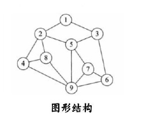

# 数据结构和算法概述 

## 1.1 数据结构

数据结构是一门研究非数值计算的程序设计问题中的操作对象，以及他们之间的关系和操作等相关问题的学科。 

数据结构就是把数据元素按照一定的关系组织起来的集合，用来组织和存储数据 

## 1.2 数据结构分类

传统上，我们可以把数据结构分为逻辑结构和物理结构两大类。 

+   逻辑结构分类
    	逻辑结构是从具体问题中抽象出来的模型，是抽象意义上的结构，按照对象中数据元素之间的相互关系分类，也是 我们后面课题中需要关注和讨论的问题。 
    +   集合结构：集合结构中数据元素除了属于同一个集合外，他们之间没有任何其他的关系。
        +    
    +   b.线性结构：线性结构中的数据元素之间存在一对一的关系
        +   
    +   c.树形结构：树形结构中的数据元素之间存在一对多的层次关系
        +   
    +   d.图形结构：图形结构的数据元素是多对多的关系
        +   

+   物理结构分类  
    逻辑结构在计算机中真正的表示方式（又称为映像）称为物理结构，也可以叫做存储结构。常见的物理结构有顺序存储结构、链式存储结构。
    +   顺序存储结构
        把数据元素放到地址连续的存储单元里面，其数据间的逻辑关系和物理关系是一致的 ，比如我们常用的数组就是顺序存储结构
        +   
        +   顺序存储结构存在一定的弊端，就像生活中排时也会有人插队也可能有人有特殊情况突然离开，这时候整个结构都处于变化中，此时就需要链式存储结构。
    +   链式存储结构
        是把数据元素存放在任意的存储单元里面，这组存储单元可以是连续的也可以是不连续的。此时，数据元素之间并不能反映元素间的逻辑关系，因此在链式存储结构中引进了一个指针存放数据元素的地址，这样通过地址就可以找到相关联数据元素的位置
        +   

## 1.3 算法

算法是指解题方案的准确而完整的描述，是一系列解决问题的清晰指令，算法代表着用系统的方法解决问题的策略机制。也就是说，能够对一定规范的输入，在有限时间内获得所要求的输出。

根据一定的条件，对一些数据进行计算，得到需要的结果。

## 1.4 算法实例

一个优秀的算法追求以下两个目标

+   花最少的时间完成需求
2.	占用最少的内存空间完成需求

### 需求1：

>    计算1到100的和。

第一种解法

```java
public static void main(String[] args) {
	int sum = 0;
	int n=100;
	for (int i = 1; i <= n; i++) {
		sum += i;
    }
	System.out.println("sum=" + sum);
}
```

第二种解法

```java
public static void main(String[] args) {
    int sum = 0;
    int n = 100;
    sum = (n + 1) * n / 2;
    System.out.println("sum=" + sum);
}
```

第一种解法要完成需求，要完成以下几个动作：

1.	定义两个整型变量；
2.	执行100次加法运算；
3.	打印结果到控制台；

第二种解法要完成需求，要完成以下几个动作：

1.	定义两个整型变量；
2.	执行1次加法运算，1次乘法运算，一次除法运算，总共3次运算；
3.	打印结果到控制台；

很明显，第二种算法完成需求，花费的时间更少一些

### 需求2

计算10的阶乘

第一种解法

```java
public class Test {
    public static void main(String[] args) {
        //测试，计算10的阶乘
        long result = fun1(10);
        System.out.println(result);
    }

    //计算n的阶乘
    public static long fun1(long n) {
        if (n == 1) {
            return 1;
        }
        return n * fun1(n - 1);
    }
}
```

第二种解法

```java
public class Test {
    public static void main(String[] args) {
        //测试，计算10的阶乘
        long result = fun2(10);
        System.out.println(result);
    }

    //计算n的阶乘
    public static long fun2(long n) {
        int result = 1;
        for (long i = 1; i <= n; i++) {
            result *= i;
        }
        return result;
    }
}
```

第一种解法，使用递归完成需求，`fun1`方法会执行10次，并且第一次执行未完毕，调用第二次执行，第二次执行未完毕，调用第三次执行...最终，最多的时候，需要在栈内存同时开辟10块内存分别执行10个`fun1`方法。

第二种解法，使用`for`循环完成需求，`fun2`方法只会执行一次，最终，只需要在栈内存开辟一块内存执行`fun2`方法即可。
很明显，第二种算法完成需求，占用的内存空间更小。

