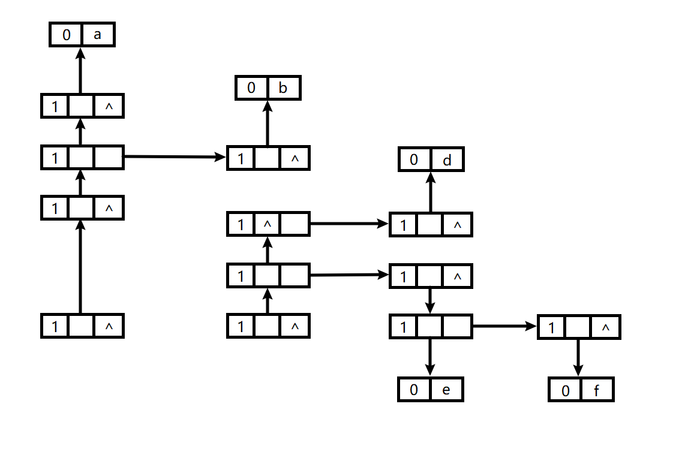
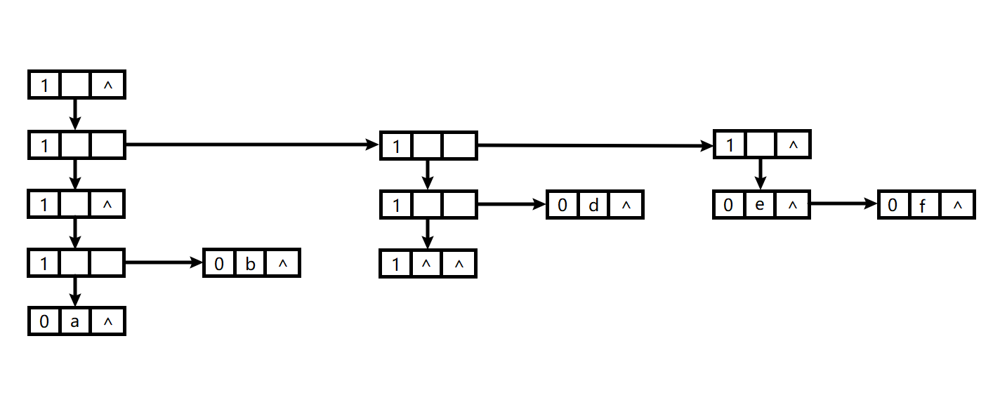
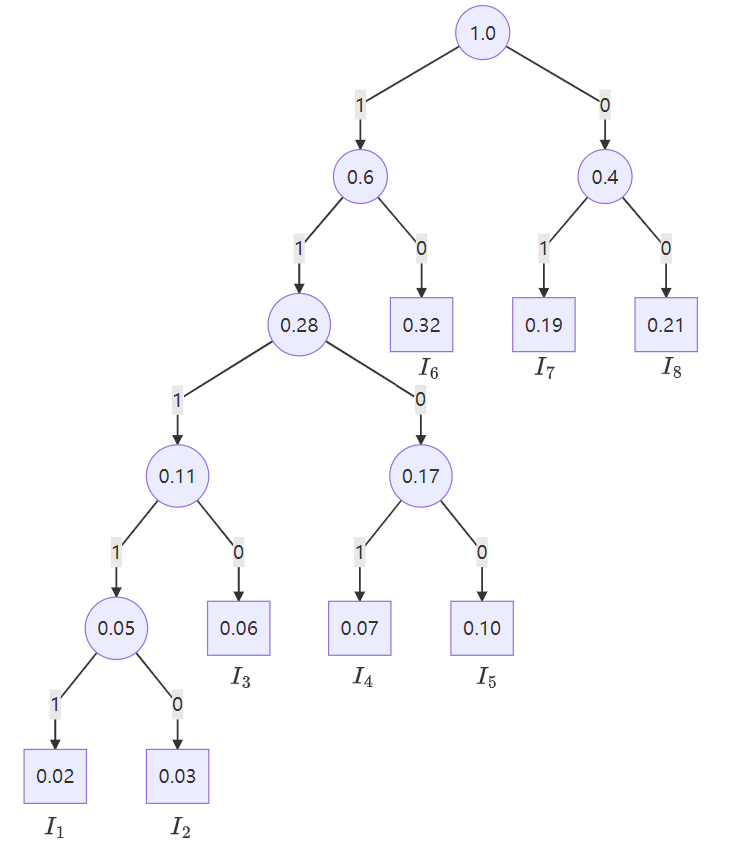

# 第四章

9.假设以顺序存储结构表示串，试设计一个算法，求串S和串T的一个最长公共子串，并分析算法的时间复杂度。

```c
//
// Created by 张子栋 on 2021/11/1.
//

#define MAXLEN 40

#include<stdio.h>
#include<stdlib.h>

typedef struct {
    char ch[MAXLEN];
    int len;
} myString;

int strMatch(myString S, myString T, int pos){
    int a = 0, b = 1, next[T.len];
    next[0] = -1;
    while (T.ch[b] != '\0') {
        if (T.ch[b] != T.ch[b]) {
            next[b] = a;
            a = 0;
            b++;
        } else {
            next[b] = -1;
            a++;
            b++;
        }
    }
    a = pos;
    b = 0;
    while (S.ch[a + b] != '\0' && T.ch[b] != '\0')
        if (S.ch[a + b] == T.ch[b])
            b++;
        else {
            if (next[b] != -1)
                b = next[b];
            else {
                a++;
                b = 0;
            }
        }
    if (b == T.len)
        return a;
    else
        return -1;
}

void getComStr(myString S, myString T, myString *a) {
    int b, c, d, e;
    if (S.len > T.len) {
        for (b = T.len; b > 0; b--) {
            a->len = b;
            for (c = 0; c <= T.len - b; c++) {
                for (d = 0; d < b; d++)
                    a->ch[d] = T.ch[d + c];
                a->ch[d] = '\0';
                e = strMatch(S, *a, 0);
                if (e != -1)
                    goto end1;
            }
        }
        a->len = 0;
        end1:;
    } else {
        for (b = S.len; b > 0; b--) {
            a->len = b;
            for (c = 0; c <= S.len - b; c++) {
                for (d = 0; d < b; d++)
                    a->ch[d] = S.ch[d + c];
                a->ch[d] = '\0';
                e = strMatch(T, *a, 0);
                if (e != -1)
                    goto end2;
            }
        }
        a->len = 0;
        end2:;
    }
}
```

# 第五章

1.假设有 $6$ 行 $8$ 列的二维数组 `A`，每个元素占用 $6$ 个字节，存储器按字节编址。已知 `A` 的基地址为 $1000$，计算：

(1) 数组 `A` 共占用多少字节； `288`

(2) 数组 `A` 的最后一个元素的地址； `1282`

(3) 按行存储时，元素 `A[3,6]` 的地址； `1126`

(4) 按列存储时，元素 `A[3,6]` 的地址； `1192`

---

10.画出广义表`((((a),b)),(((),d),(e,f)))`的两种存储结构图示.

+   第一种存储结构：



---


+   第二种存储结构：



---

# 第六章

4,假设一棵二叉树的先序序列为 `EBADCFHGIKJ`, 中序序列为`ABCDEFGHIJK`, 请画出该二叉树.


---

画出哈夫曼树：



```mermaid

```


哈夫曼编码为：

$I_1$ `11111`

$I_2$ `11110`

$I_3$ `1110`

$I_4$ `1101`

$I_5$ `1100`

$I_6$ `10`

$I_7$ `01`

$I_8$ `00`


```mermaid
graph TB
A((1.0))
A --1--- B((0.6))
A --0--- C((0.4))

B --1--- D((0.28))
B --0--- E[0.32]

C --1--- F[0.19]
C --0--- G[0.21]

D --1--- H((0.11))
D --0--- I((0.17))

I --1--- il[0.07]
I --0--- ir[0.10]

H --1--- K((0.05))
H --0--- hr[0.06]

K --1--- kl[0.02]
K --0--- kr[0.03]

```

