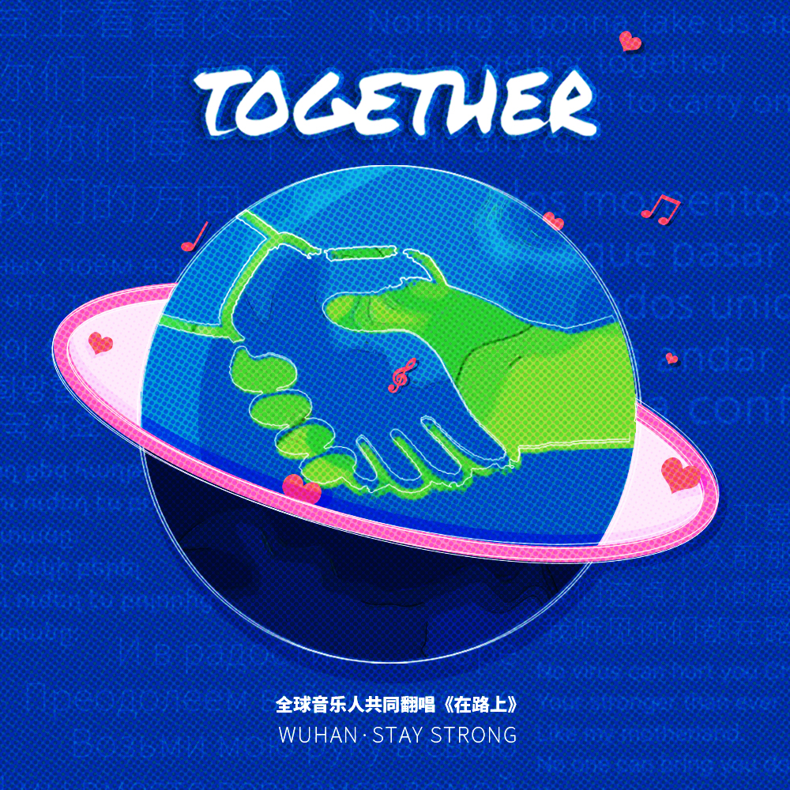
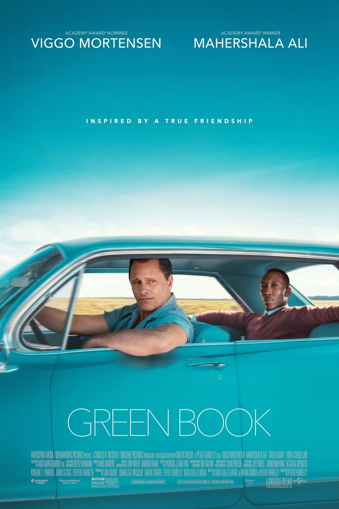
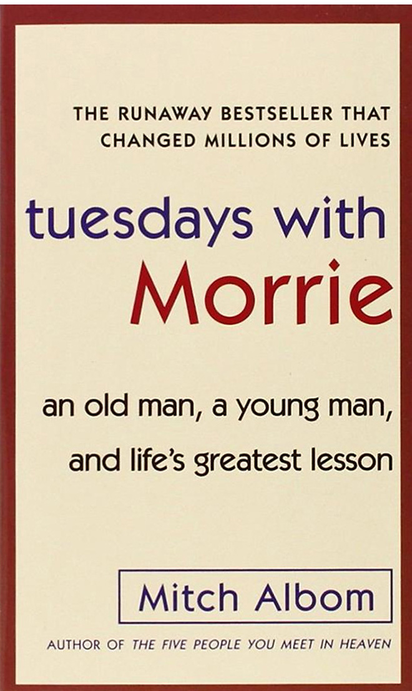

> At the beginning of 2020, the outbreak of the COVID-19 epidemic touched the hearts of people around the world. In the face of this common challenge of human society, 50 global cooperative musicians of the "Chinese Music Revival Plan", including many Grammy Award winners, quickly took action and jointly covered/played a Chinese song, using music to cheer for Wuhan and China.

> Green Book is a 2018 American biographical comedy-drama film directed by Peter Farrelly. Set in 1962, the film is inspired by the true story of a tour of the Deep South by African American classical and jazz pianist Don Shirley and Italian American bouncer Frank "Tony Lip" Vallelonga, who served as Shirley's driver and bodyguard. The film was written by Farrelly, Brian Hayes Currie and Vallelonga's son, Nick Vallelonga, based on interviews with his father and Shirley, as well as letters his father wrote to his mother. The film is named after The Negro Motorist Green Book, a mid-20th century guide book for African-American travelers written by Victor Hugo Green.

[Green Book (2018) - Quotes - IMDb](https://www.imdb.com/title/tt6966692/quotes/?ref_=tt_trv_qu)

Tony Lip: The world's full of lonely people afraid to make the first move.

> Tuesdays with Morrie is a memoir by American author Mitch Albom about a series of visits Albom made to his former sociology professor Morrie Schwartz, as Schwartz gradually dies of ALS. The book topped the New York Times Non-Fiction Best-Sellers List for 23 combined weeks in 2000, and remained on the New York Times best-selling list for more than four years after. In 2006, Tuesdays with Morrie was the bestselling memoir of all time.

[Tuesdays with Morrie《相约星期二》读书笔记 - 知乎 (zhihu.com)](https://zhuanlan.zhihu.com/p/382881729)

All of us all walk around as if we are sleepwalking. We don’t really experience the world fully, because we arehalf-asleep, doing things we automatically think we have to do. You strip away all that stuff and you focus on the essentials. （我们有如在梦游一般，无法真正全面地体验这个世界是因为我们在半梦游的状态下，行我们自动地认为的“应行之事”，你应该摆脱这些困扰着力在珍重重要的事情上。）

Aging is not just decay, it’s growth. If you’ve found meaning in your life, you’d want to go forward, to see more and do more. （老去并不是逝去，而是成长。如果你找到了生命的意义，你会想继续向前，去见证更多，经历更多）