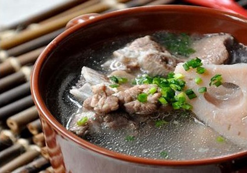

# Pork rib and lotus root soup

Hubei lotus root, which is white and pink in color, is a famous culinary ingredient throughout China. The pork rib and lotus root soup is a special dish once introduced on the popular documentary television program A Bite of China, Season I.

The old Hubei saying "no soup, no banquet" shows just how much Hubei natives love their soup. Pork rib and lotus root soup is commonly served to guests. The taste is quite unique; when you lean in to take a sip, a sweet aroma will draw you in. When you taste the ribs and lotus roots, you will discover just how perfectly the flavors combine. This sweet, delicious and nutritious soup is also high in calcium. For Hubei natives, pork rib and lotus root soup embodies the taste of hometown. Though this soup is available all over China, the taste is less delicious if the cook uses lotus roots grown outside of Hubei Province. It is the locally grown lotus roots that give it that delicious, rich flavor.

At the beginning of this year, one particular story about pork rib and lotus root soup became popular on the Internet. Mr. Wang, a 47-year-old man from Ji'nan, often heard his 85-year-old father complain about the fact that he was no longer able to taste the pork rib and lotus root soup for which Hubei is famous. Mr. Wang's father moved from Hubei to Ji'nan in 1952. Mr. Wang tried many times to make the soup for his father in Ji'nan, but it never tasted quite like the soup made here in Hubei. He decided to source lotus roots from Hubei. On February 11, Mr. Wang flew to Wuhan and bought some lotus roots. He also went to a restaurant famous for its pork rib and lotus root soup and acquired the recipe. Early on February 13, Mr. Wang returned to Ji'nan. That morning, when his father arrived at the table, there was a pot of stewed Hubei pork rib and lotus root soup waiting for him. After tasting it, Mr. Wang's father said, "I love it. It tastes as though it was made by your grandma."

Lotus root is always on the menu at the restaurants in Hubei. Known as "the treasure which grows in the water," the lotus roots in Honghu, Hubei are rich in starch, proteins, and vitamins. The variety of lotus root grown in Honghu, along with their great taste, makes Honghu the lotus root capital of China. It is said that the Honghu lotus roots are the most appetizing. The best time to enjoy the local lotus roots is just after the Mid-Autumn Festival.

Here in Wuhan, people often prepare pork rib and lotus root soup at home.

**Recipe**

1. Cut 500g of pork ribs into small pieces, and soak in water for half an hour, then rinse off any residual blood. Dice 750g of de-skinned lotus root and place in a pot. Crush some ginger.

2. Place the ginger and ribs into a preheated dry frying pan and stir fry the ribs until they turn white. Pour a little Shaoxing cooking wine into the mix and add water until the ribs are covered. Bring the entire mixture to the boil and remove any froth. Simmer for 15 minutes.

3. Transfer the fried rib mixture to a clay pot, add lotus root pieces and more water. Let the mixture simmer until the meat becomes soft and falls off the bones. Add some salt and pepper for seasoning.

**Tips**

1. Stew the lotus root in a Chinese clay pot, not an iron pot. The best stove for stewing is a honeycomb briquette stove. To ensure a glutinous lotus root, sufficient time is needed for stewing, about four to five hours.

2. Remove any froth that appears during the stewing of the soup; if you fail to do so, the soup will turn grey.