# 2.1 染色体 Chromosome
DNA 位于染色体上，亲代能够将自己的遗传物质以染色体的形式传给子代，保持了物种的稳定性和连续性

## 2.1.1 染色体概述
+ 存在于细胞核中，在显微镜下呈丝状或棒状，在细胞发生有丝分裂时期容易被践行染料着色，因此而得名
+ 包括 DNA 和蛋白两大部分。同一物种内每条染色体所带 DNA 的量是一定的，但不同染色体或不同物种之间变化很大
## 2.1.2 真核细胞染色体的组成
+ 染色体特征
	+ 分子结构相对稳定
	+ 能够自我复制，使亲、子代之间保持连续性
	+ 指导蛋白质的合成，控制整个生命过程
	+ 产生可遗传的变异
+ 真核细胞 DNA 的转录和翻译在不同的空间和时间上进行，其基因表达的调控不仅与 DNA 序列有关，也与染色体的结构有关
+ 组成
	+ DNA
	+ 组蛋白
	+ 非组蛋白
	+ RNA
### (1)组蛋白和非组蛋白
+ 组蛋白
	+ 染色体的结构蛋白，因富含碱性氨基酸 Arg（精氨酸）和 Lys（赖氨酸）而呈碱性，可与酸性的 DNA 紧密结合
	+ 组蛋白包含五个部分，按照分子量由大到小分别升为 H1，H3，H2A，H2B 和 H4，它与 DNA 组成核小体
+ 组蛋白的特性
	+ 进化上的极端保守性，不同种生物组蛋白的氨基酸组成十分相似
	+ 无组织特异性，仅发现少数例外（鸟鱼两栖红细胞 H1-H5，精细胞鱼精蛋白）
	+ 肽链上氨基酸分布的不对称性，N 端碱性氨基酸，C 端疏水氨基酸
	+ 组蛋白的修饰作用，甲基化，乙酰化，磷酸化，多聚 ADP 糖基化等，修饰作用只发生在细胞周期的特定时间和组蛋白的特定位点上
	+ 符号赖氨酸的组蛋白 H5，只存在于鸟类， 两栖类含有细胞核的红细胞中，取代 H1，而与 H1 并无明显的亲缘关系
+ 组蛋白修饰与表观遗传
	+ 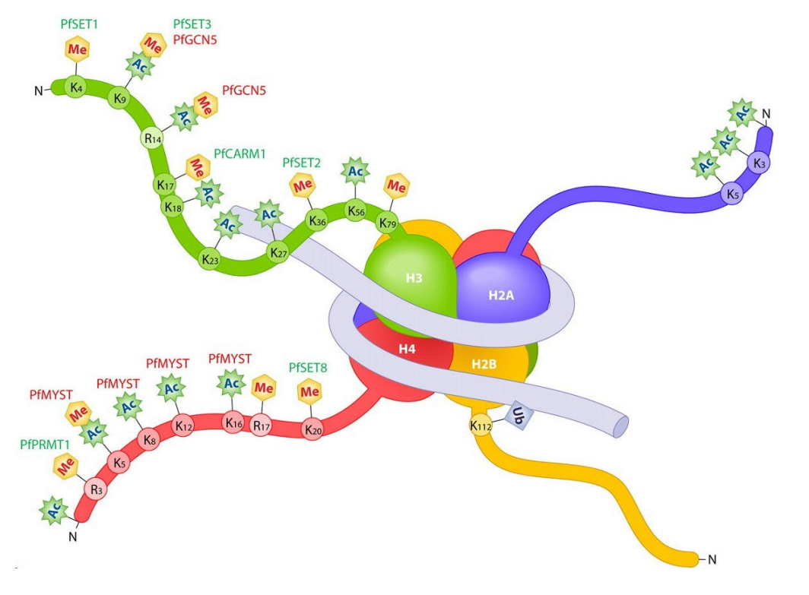
+ 非组蛋白
	+ 非组蛋白约为 组蛋白总量的 $60\%-70\%$ ，可能有 20-100 种，常见的有 15-20 种
	+ 以 DNA 为底物的酶以及作用于组蛋白的一些酶，DNA 结合蛋白，组蛋白结合蛋白和调控蛋白等
	+ 非组蛋白具有多样性和异质性，不同组织细胞中其种类和数目都不同
### (2)DNA
+ 含有大量的重复序列；功能 DNA 序列大多被非功能 DNA 隔开
+ C 值（C Value）：一种生物单倍体基因组 DNA 的总量
+ C 值反常现象（C-value Paradox）：C 值往往与种系进化的复杂程度不一致
---
+ 真核细胞的核苷酸序列大致可被分为 3 类
	+ 不重复序列
		+ 一个或几个拷贝，占 DNA 总量的 $20\%-80\%$，序列长约 750-2000 bp. 结构基因基本上属于不重复序列。
	+ 中度重复序列
		+ 重复次数 $10-10^4$ 占 DNA 总量的 $10\%-40\%$，编码  rRNA, tRNA 和某些结构蛋白。中度重复序列往往分在在不重复序列之间。
	+ 高度重复序列
		+ 卫星 DNA，只在真核生物中发现，占基因组的 $10\%-60\%$，由 6-100 个碱基组成。高度浓缩，异染色质的组成部分。大多位于染色体着丝粒。
+ 人类基因组概况
	+ 人的核基因组由 3.2 G 个碱基组成
	+ 共 22 对染色体 +1 对性染色体
	+ 最短的染色体 50 M，最长的染色体 260 M
### (3)核小体和染色质
+ 核小体（Nucleosome）
	+ 染色体 DNA 的一级包装
+ 染色质纤维（30 nm fiber）
	+ 二级包装
+ 染色质纤维环
	+ 三级包装

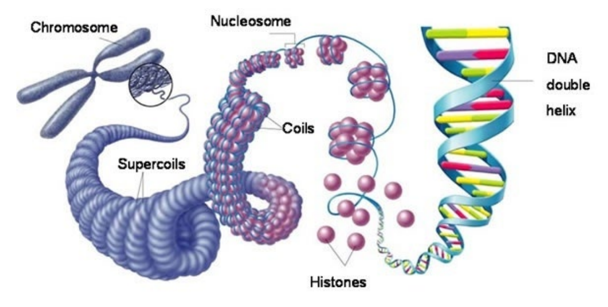

微球菌核酸酶（Micrococcal nuclease）处理染色质后电泳，被保留的 DNA 片段均为 200 bp 基本单位的倍数。

核小体单体被微球菌核酸酶处理后，随着时间延长，其降解产物（DNA 片段）会逐渐缩短，从 200 bp 降至 146 bp，至此很难再进一步降解。这种稳定结构为核心颗粒。

+ 核小体，直径 10 nm，染色体中 DNA 压缩的第一步，收缩至原尺寸的 1/7
+ 核小体由核心颗粒和连结线 DNA 两部分组成
	1. 每个核小体单位包括 200 bp 的 DNA、一个组蛋白核心和一个 H1
	2. 由 H2A、H2B、H3、H4 各两份子形成八聚体，构成核心颗粒
	3. DNA 分子以左手螺旋缠绕在核心颗粒表面，每圈 80 bp，共 1.75 圈，约 146 bp，两端被 H1 锁合
	4. 相邻核心颗粒之间为一段 20-60 bp 的连接线 DNA
+ 染色质纤维
	+ 染色质进一步折叠转成 30 nm 纤维，这就是染色体 DNA 的二级包装 - 螺线管纤维（solenodial fiber）
	+ 每个螺线管包含 6 个核小体
	+ 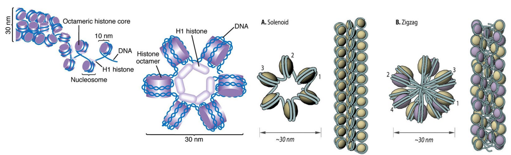
	

螺线管纤维相隔一距离的某些区段被「拉拢」固定在蛋白轴上，从而产生的许多从股价上伸出的纤维环（loops）。
+ 螺线管纤维缠绕在非组蛋白构成的中心轴（cenreal axis）骨架（支架蛋白）上形成染色质纤维环。
+ 染色质纤维环是在螺线管纤维基础上更高一级包装。
+ 从螺线管纤维到包装形成染色体是 DNA 压缩程度最高的阶段，估计在 200-400 倍。
+ 纤维环的形成是基表达较理想的结构，这些环状区是基因表达的活性单位所在。因为纤维环 DNA 比其他区域有更伸展的结构。

#### 染色体的组成

|过程|成分|名称|宽度增加|长度压缩|
|:---:|:---:|:---:|:---:|:---:|
|第一级|DNA+组蛋白|核小体|5 倍|7 倍
|第二级|核小体|螺线管|3倍|6倍|
|第三级|螺线管|超螺旋|13 倍|40倍|
|第四级|超螺旋|染色体|2.5-5 倍|5 倍|
|合计|||500-1000 倍|8400 倍 (8000-10000)|

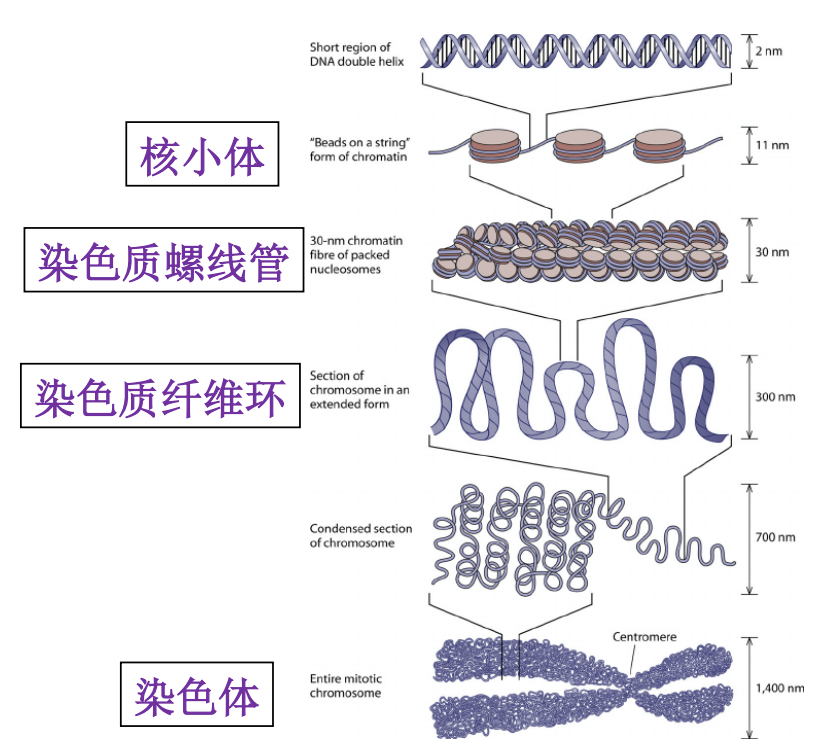

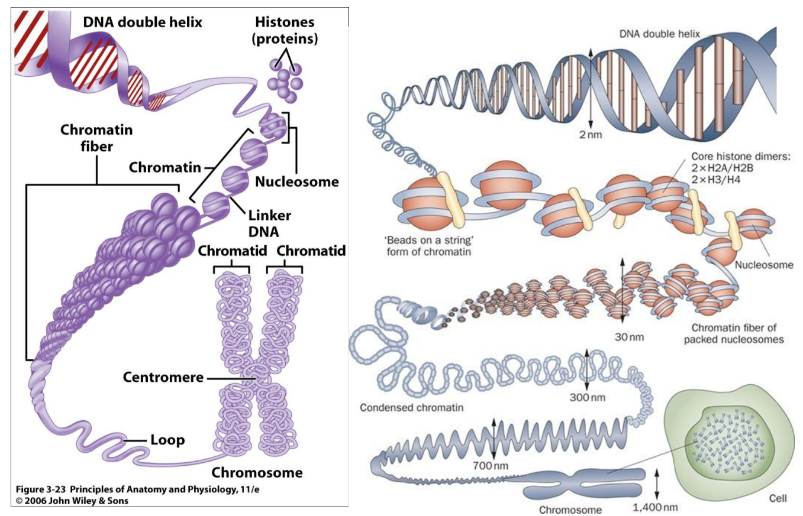

#### 真核生物基因组的结构特点

+ 基因组庞大
+ 存在大量重复序列
+ 大部分为非编码序列（$>90\%$）
+ 转录产物为单顺反子
+ 真核基因是断裂基因，有内含子
+ 存在大量顺式作用原件（启动子、增强子、沉默子）
+ 准在大量的 DNA 多态性
+ 有端粒结构

## 2.1.3 原核生物基因组

+ 基因组都比较小，DNA 与少量蛋白质（非组蛋白）结合构成染色体，染色质中无组蛋白。
+ 环状的染色体（现已发现了有些原核细胞含有多条染色体，或线性染色体，或而这皆有）；质粒（plasmid）DNA

#### 原核细胞基因组 DNA 的特点
1. 结构简练，绝大部分编码蛋白质。
	> E.coli 的基因组几乎全部由基因构成。
	> E.coli 的单条染色体上大多数 DNA 都编码蛋白质或 RNA，非编码序列也都参与调控基因转录。
2. 存在转录单元
	> 功能相关的基因往往集中在一起，他们可被一起转录成多顺反子 mRNA
3. 有重叠基因
	>同一段 DNA 能携带两种不同蛋白质的信息。
	>一个基因完全在另一个基因里。 B-A, E-D
	>部分重叠 K-C
	>两个基因只有一个碱基对重叠
	>
	>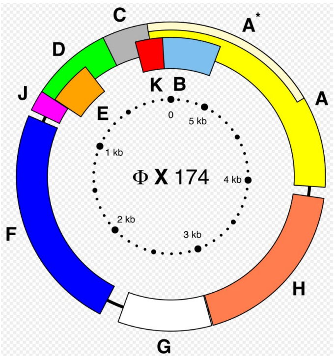

# 2.2 DNA 的结构

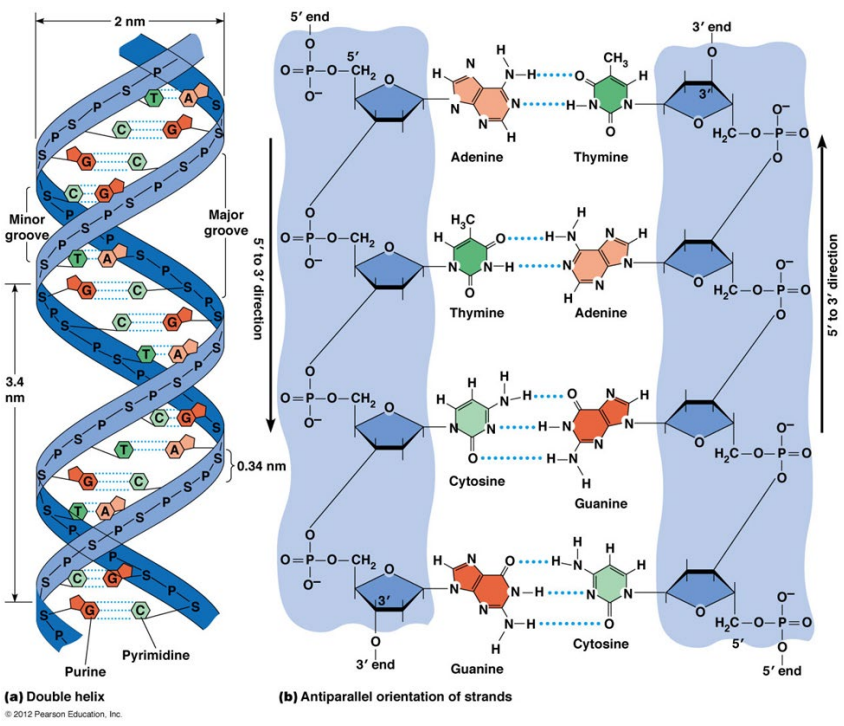

## 2.2.1 DNA 一级结构 Primary Structure

+ DNA分子的脱氧核苷酸的连接方式和排列顺序
+ DNA是由很多个脱氧核苷酸（dAMP、dGMP、dCMP和dTMP）通过 $3’,5’ - $磷酸二酯键连成的无分支双链线状或环状多核苷酸
+ 由于核苷酸之间的差异仅仅是碱基的不同，故可称为碱基顺序

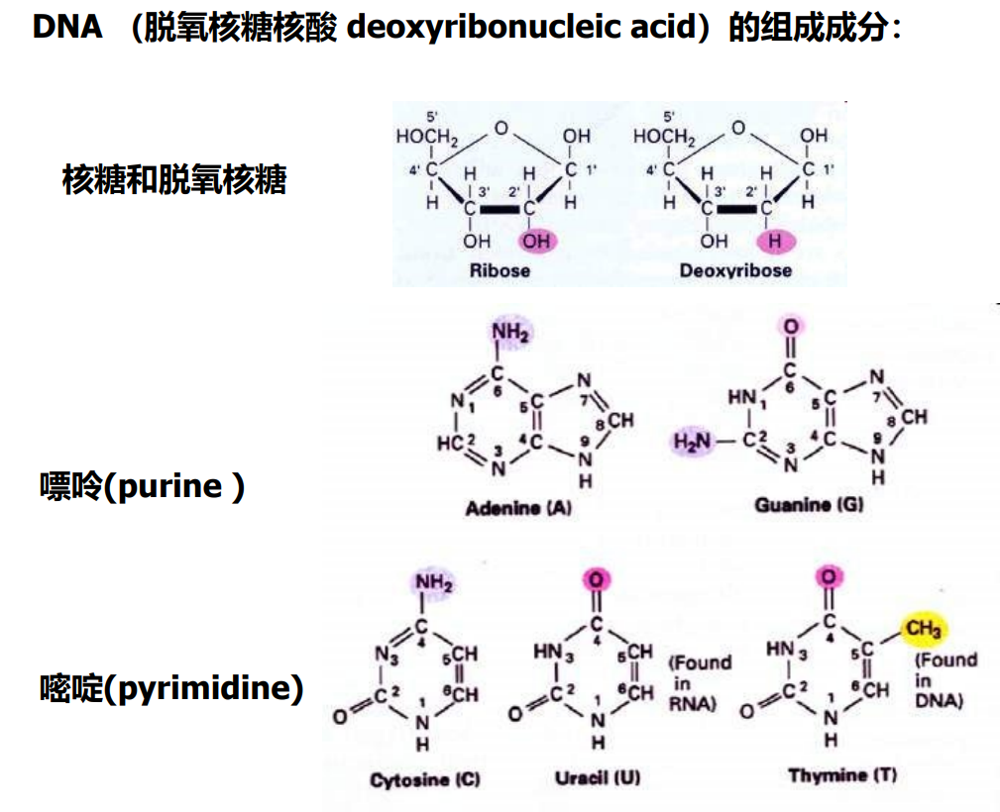

+ DNA 的一级结构表示了该 DNA 分子的化学构成。
+ 核苷酸序列对 DNA 高级结构的形成有很大影响。
+ DNA 是巨大的生物高分子，如人的DNA就包含了 $3\times 10^9$ 碱基对，如此数目的碱基可容纳巨大的信息量。
+ 生物界里的遗传信息都包含在组成 DNA 的 A、G、C、T 这四种核苷酸的排列顺序之中。
+ DNA 的方向是 $5’-3’$（蛋白质是 N-C）。
+ DNA通常以线性或环状形式存在。
+ DNA通常是双链的(dsDNA)，少数是单链的(ssDNA)。

核酸一级结构可用简写式表示；核酸分子简写式表示的中心含义即是核酸分子中的核苷酸（或碱基）排列顺序。

线条式: 在碱基符号书写基础上，以垂线（位于碱基之下）和斜线（位于垂线与 P 之间）分别表示糖基和磷酸酯键。

字符式：用 A、T、G、C、U 代表碱基，用 P 代表磷酸残基。核酸分子中的糖基、 糖苷键和酯键等均省略不写，将碱基和磷酸相间排列即可。不再注解「脱氧」与否，简写式中出现 T 的为 DNA 链，出现 U 则为 RNA 链。以 $5'$ 和 $3'$ 表示链的末端及方向，分别置于简写式的左右二端。

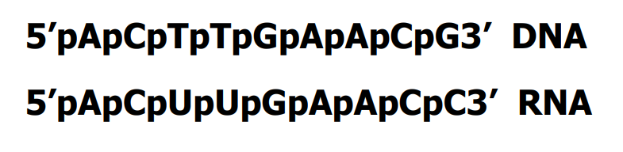

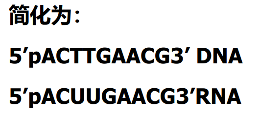

简写式的 $5'-$ 末端均含有一个磷酸残基（与糖基的 $C-5'$ 位上的羟基相连），$3'-$ 末端含有一个自由羟基（与糖基的 $C-3'$ 位相连）；若 $5'$ 端不写 P，则表示 $5’-$ 末端为自由羟基。

双链DNA分子的简写式多采用省略了磷酸残基的写法，在上述简式的基础上再增加一条互补链（complementary strand）即可。

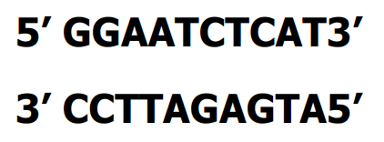

## 2.2.2 DNA 的二级结构

DNA不仅具有严格的化学组成，还具有特殊的空间结构，主要以有规则的双螺旋形式存在。

+ DNA 双螺旋的基本特点
  + 由两条互相平行的脱氧核苷酸长链盘绕而成
  + 脱氧核糖和磷酸交替连接，排在外侧，构成基本骨架，碱基排列在内侧
  + 两条链上的碱基通过氢键结合，按一定规律形成碱基对 - 碱基互补配对原则

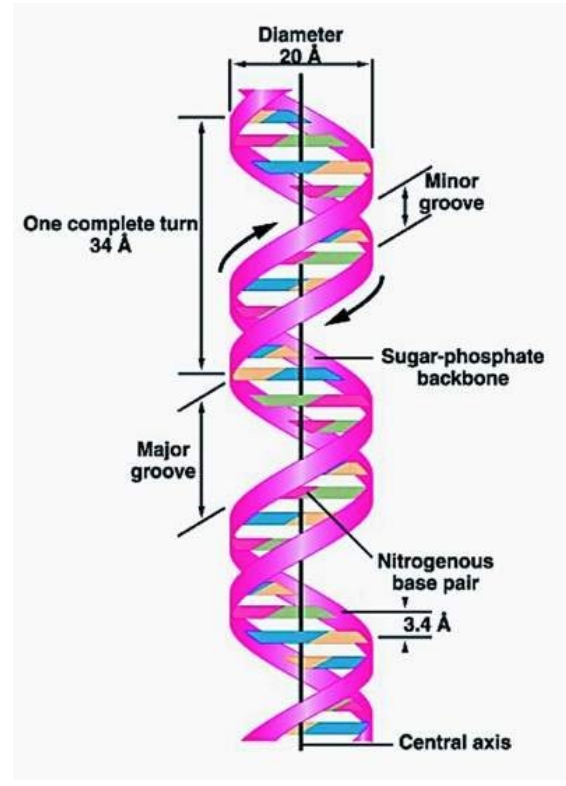

+ 结构参数
  + 螺旋直径 $2\ nm$
  + 螺旋周期包含 $10 \ bp$
  + 螺距 $3.4\ nm$
  + 相邻碱基对平面的间距 $0.34\ nm$

由于 A-T/C-G 配对时，两个核糖磷酸 连接的碱基的主轴并不成 180°，因此 DNA 在磷酸骨架距离较近的一侧形成小沟，而对侧形成大沟。