# 分波振面干涉

## 双缝干涉（double-slit interference）

### 试验现象

#### 条纹特点

+   明暗相间
+   等间距
+   等光强

### 条纹明暗条件

$$
\begin{aligned}
&\boldsymbol{S}_{1}, \boldsymbol{S}_{2} \text { 光线在 } P \text { 点光程差 }\\
&\Delta=r_{1}-r_{2}=\left\{\begin{array}{ll}
\pm k \lambda \quad(k=0,1,2, \ldots) & \text { 加强 } \\
\pm(2 k+1) \frac{\lambda}{2} \quad(k=0,1,2, \ldots) & \text { 减弱 }
\end{array}\right.
\end{aligned}
$$
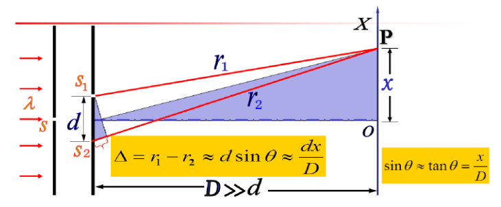
$$
\begin{aligned}
&\frac{d x}{D}=\left\{\begin{array}{ccc}
\pm k \lambda & (k=0,1,2, \ldots) & \text { 加强 } \\
\pm(2 k+1) \frac{\lambda}{2} & (k=0,1,2, \ldots) & \text { 减弱 }
\end{array}\right. \\
&x =\left\{\begin{array}{l}
\pm k \frac{D \lambda}{d} &(k=0,1,2, \ldots) & \text { 明纹 } \\
\pm(2 k+1) \frac{D \lambda}{2 d} &(k=0,1,2, \ldots)  &\text { 暗纹 }
\end{array}\right.
\end{aligned}
$$
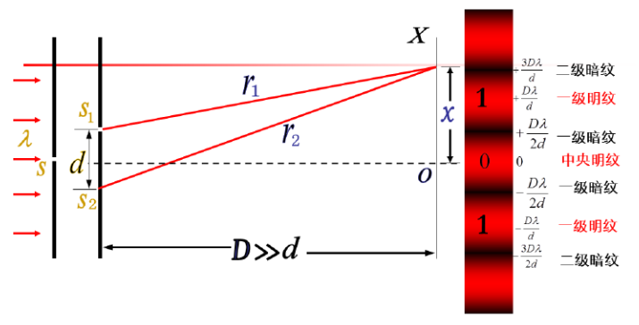
$$
x=\left\{\begin{array}{l}
\pm k \frac{D \lambda}{d} \quad&(k=0,1,2, \ldots) \quad &\text { 明纹 } \\
\pm(2 k+1) \frac{D \lambda}{2 d} \quad&(k=0,1,2, \ldots) &\text { 暗纹 }
\end{array}\right. \rightarrow 明暗相间\\
k=0, x=\left\{\begin{array}{l}
0 \quad &\text { 中央明纹 } \\
\pm \frac{D \lambda}{2 d} &\text { 一级暗纹 }
\end{array} \qquad k=1, x=\left\{\begin{array}{l}
\pm \frac{D \lambda}{d} &\text { 一级明纹 } \\
\pm \frac{3 D \lambda}{2 d} &\text { 二级暗纹 }
\end{array}\right.\right.
$$
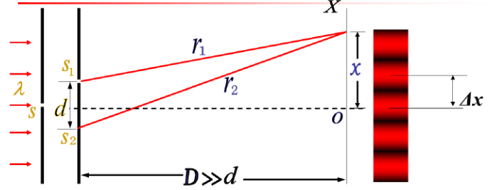

条纹间距、条纹宽度
$$
\large\Delta \boldsymbol{x}=\boldsymbol{x}_{\boldsymbol{k}+1}-\boldsymbol{x}_{\boldsymbol{k}}=\frac{D \lambda}{d}
$$

>   明暗条纹等间距

### 总结

+   相干条件
    +   振动方向相同
    +   振动频率相同
    +   恒定的相位差

+   干涉加强和减弱条件

    +   $$
        \begin{aligned}
        \Delta \varphi &=\left\{\begin{array}{ll}
        \pm 2 k \pi & (k=0,1,2, \ldots) & \text { 加强 } \\
        \pm(2 k+1) \pi & (k=0,1,2, \ldots)& \text { 减弱 }
        \end{array}\right. \\
        \Delta &=\left\{\begin{array}{l}
        \pm 2 k \frac{\lambda}{2} \quad&(k=0,1,2, \ldots) & \text { 加强 } \\
        \pm(2 k+1) \frac{\lambda}{2} \quad&(k=0,1,2, \ldots)& \text { 减弱 }
        \end{array}\right.\\
        
        \end{aligned}
        $$

+   杨氏干涉图样的特点

    +   条纹明暗相间，条纹等间距，条纹的动态变化

    +   $$
        x=\left\{\begin{array}{l}
        \pm k \frac{D \lambda}{d} \quad &\text { 明纹 } \\
        \pm(2 k+1) \frac{D \lambda}{2 d} &\text { 暗纹 }
        \end{array} \qquad\Delta \boldsymbol{x}=\frac{D \lambda}{d}\right.
        $$

        

## 干涉条纹特点

1.  $\Delta x=D \lambda / d, \quad \Delta x \propto \lambda \quad \Delta x \propto D \quad \Delta x \propto 1 / d$
2.  $\begin{array}{l}
    \Delta x={D} \lambda / {d}, \lambda \text { 很小， } \triangle {x} \text { 大到用眼睛分辨，才会}
    \text {观测到干涉条纹，因此要求 } d \text { 很小。 }
    \end{array}$

+   采用白光照射呈彩色条纹

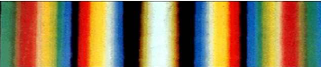

+   $D，d$一定时，由条纹间距可算出单色光的波长。

$$
\lambda=\frac{\Delta xd}{D}
$$

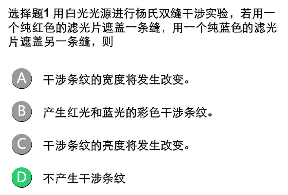

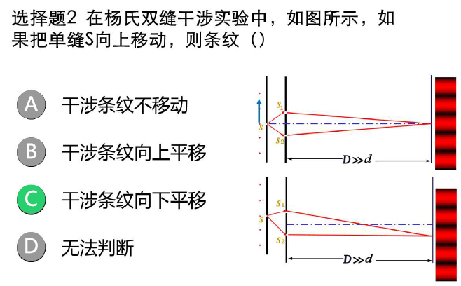

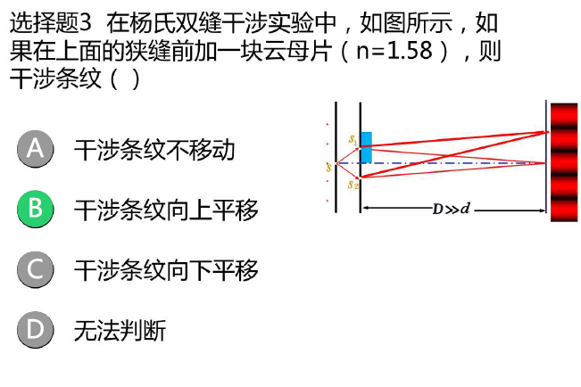

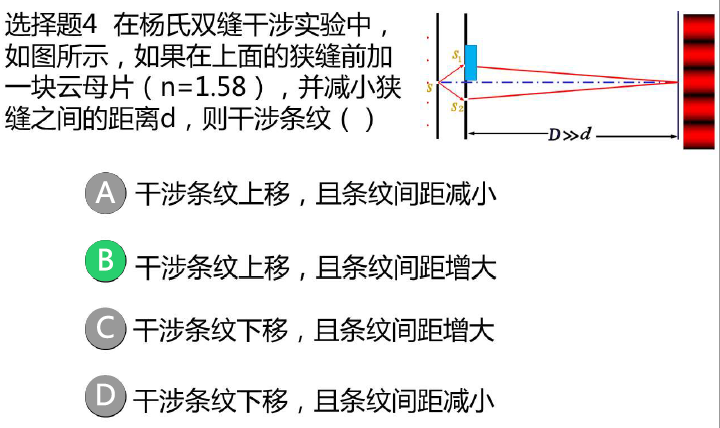

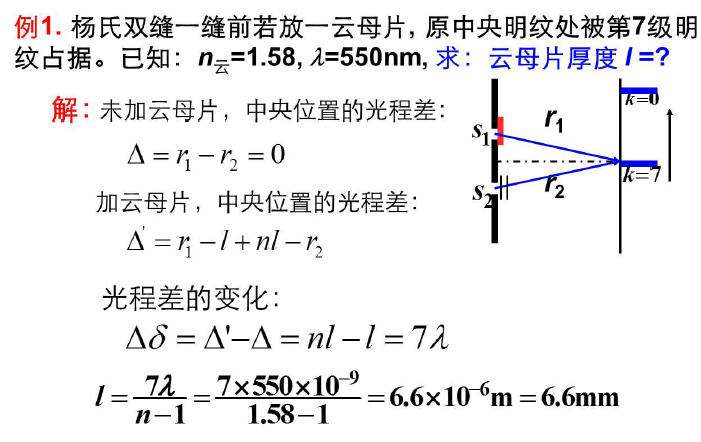

## 洛埃镜

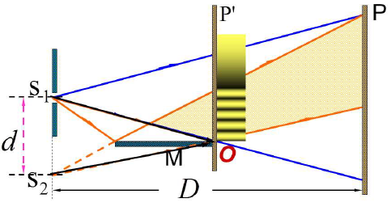

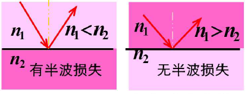

### 半波损失

光从光疏介质射向光密介质时，在掠入射或正入射情况下，反射光的相位较之入射光的相位跃变了$\pi$，相当于反射光与入射光之间附加了半个波长的波程差，称为半波损失.

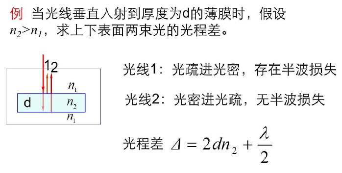

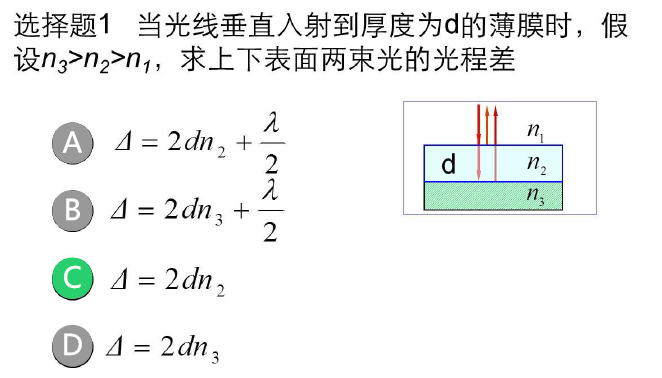

## 薄透镜的等光程性

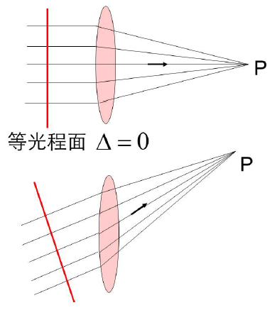

>   注意：在计算薄透镜的光程差时，只需要计算等光程面之前的光程差

