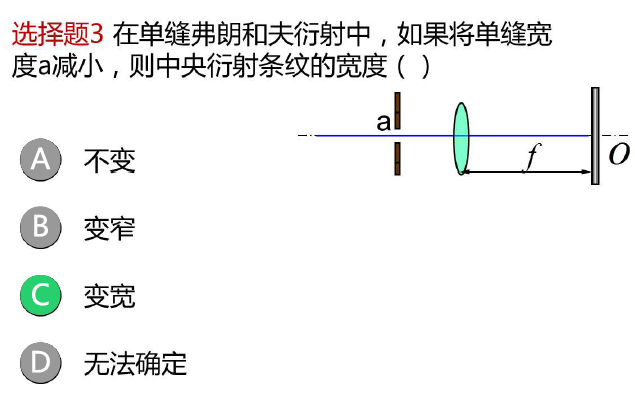

# 光的衍射

光在传播过程中遇到大小与光波长相比拟的障碍物时
能绕过障碍物而偏离直线传播的现象称为光的衍射

衍射现象是一切波动的共有特性

行射系统由光源、衍射屏、接收屏组成.

## 单缝夫琅禾费行射

### 惠更斯-菲涅尔原理

一个波阵面的每个点（面源）可各看做是一个产生球面子波的次级球面波的中心波源，次级波源的波速与频率等于初级波的波速与频率；而且，以后任何时刻波阵面的位置是所有这种子波的包络面。这个结果实质上是“光学平行”面的一个作图法则，所以有时叫做惠更斯作图法。

### 单缝夫琅禾费衍射条纹明暗条件及分布

#### 条纹明暗条件(菲涅耳半波带法)

+   任意衍射角$\varphi$

    

---

最大光程差$\large AC=a \sin \varphi=2 \cdot \frac{\lambda}{2}$

$$
a \sin \varphi=\pm 2 k \frac{\lambda}{2} \quad k=1,2, \cdots
$$
上下两个半波带对应的各光线振动方向相反,光程差为$\frac{\lambda}{2}$,全部相消,此衍射角的光线干涉后出现**暗条纹**

---

最大光程差$A C=a \sin \varphi=3 \cdot \frac{\lambda}{2}$

$$
a \sin \varphi=\pm(2 k+1) \frac{\lambda}{2} \quad k=1,2, \cdots
$$
剩余一个半波带振动没有抵消,此衍射角的光线干涉后出现**明条纹(次级大明纹)**.

##### 结论

+   单缝分成偶数半波带为暗纹
+   单缝分成奇数半波带为明纹

---

---

$$
a \sin \varphi=\left\{\begin{array}{lll}
0 & & \text { 中央明纹 } \\
\pm k \lambda & (k=1,2, \cdots) & \text { 暗纹 } \\
\pm(2 k+1) \lambda / 2 & (k=1,2, \cdots) & \text { 明纹 }
\end{array}\right.
$$

注意:

+   与双光束干涉条件形式相反.
+   对于一衍射角,单缝不能分成整数个半波带,在屏幕上光强介于最明与最暗之间.

---

$A C=a \sin \varphi \neq \text { 整数倍 } \frac{\lambda}{2}$

不能分成整数个半波带,则此衍射角的光线干涉介于最明与最暗之间.

##### 条纹明暗位置

$$
\begin{aligned}
&a \sin \varphi \approx \operatorname{atg} \varphi=a \frac{x}{f} \\
&a \sin \varphi=\left\{\begin{array}{ll}
\pm k \lambda & (k=1,2, \cdots) \quad \text { 暗纹 } \\
\pm(2 k+1) \lambda / 2 & (k=1,2, \cdots)
\end{array}\right. \text { 明纹 } \\
&x=\left\{\begin{array}{rlr}
\pm k \lambda \cdot f / a & k=1,2 \cdots & \text { k级暗纹坐标 } \\
\pm(2 k+1) \lambda \cdot f / a & k=1,2 \cdots & k \text { 级明纹坐标 }
\end{array}\right.
\end{aligned}\\
x=\left\{\begin{array}{ccc}
\pm k \lambda \cdot f / a & k=1,2 \cdots & & \text { k级暗纹坐标 } \\
\pm(2 k+1) \lambda \cdot f / a & k=1,2 \cdots & & k \text { 级明纹坐标 }
\end{array}\right.
$$

##### 条纹特征

### 总结

1.行射现象

2.惠更斯菲尼耳原理

3·弗朗禾夫衍射条件(菲涅尔半波带法)
$$
a \sin \varphi=\left\{\begin{array}{lll}
0 & & \text { 中央明纹 } \\
\pm k \lambda & (k=1,2, \cdots) & \text { 暗纹 } \\
\pm(2 k+1) \lambda / 2 & (k=1,2, \cdots) & \text { 明纹 }
\end{array}\right.
$$

4.弗朗禾夫衍射条纹的特点
$$
\Delta x_{0}=2 \frac{\lambda f}{a} \quad \Delta x=x_{k+1}-x_{k}=\frac{\lambda f}{a}
$$

---

---

---

---

##### 条纹动态变化

单缝上下移动

根据透镜成像原理衍射图不变

