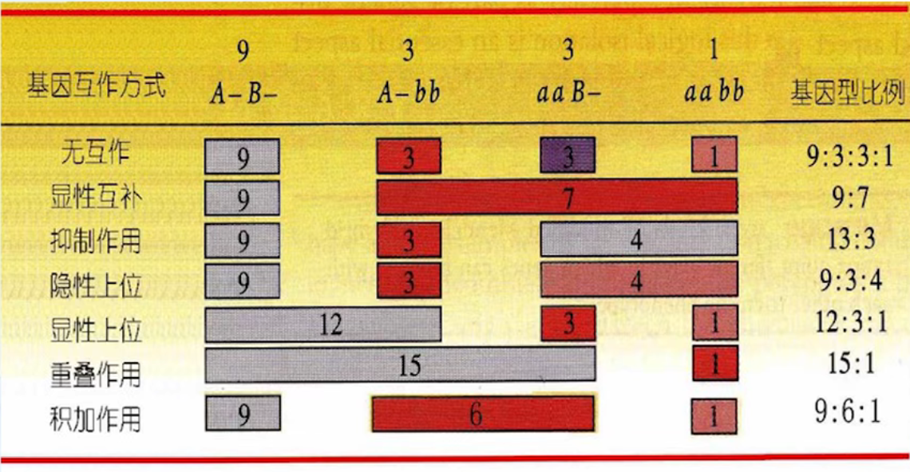
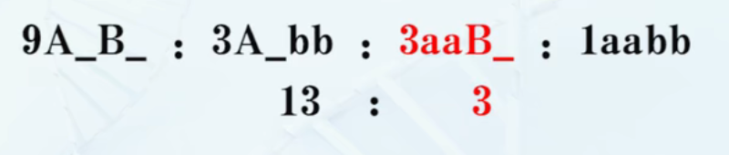
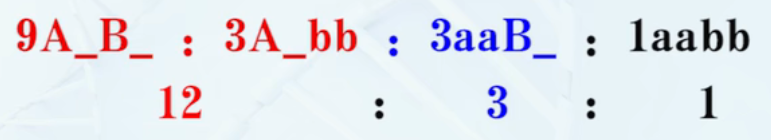
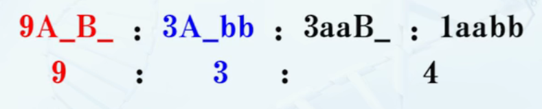

# 孟德尔遗传的扩展

## 等位基因的相互作用 :star:

### 显隐性关系的相对性:star:

#### 完全显性和不完全显性 :star:

+ 完全显性 Complete Dominance, 指 $F_1 $ 所表现的性状都和亲本之一完全一样
+ 不完全显性 Incomplete Dominance, $F_1$ 表现的性状可能是双亲的中间型

#### 共(并)显性:star:

Codominance, 一对等危机因都是显性基因, 共同表现各自控制的性状. 即双亲的性状同时在 $F_1$ 个体上出现, 而不表现单一的中间型

#### 人的 MN 血型的遗传

+ 抗原和抗体: 外来物质抗原(Antigen) 进入动物的血液中, 有时会引起叫做抗体(Antibody) 的物质的产生. 抗体能跟抗原专一性地起反应, 从而减低抗原的有害作用
+ 抗血清: 人的红血细胞有各种不同的抗原, 如果把某型血红细胞洗涤后注入兔子的血液中, 使兔子产生相应的抗体, 然后用特殊方式提取含有相应抗体的血清(抗血清), 这种抗血清可跟这一型红血细胞发生凝聚反应(Agglutination), 从而把个性红血细胞区分开来

#### ABH 血型

+ 血液
  + 血浆 (水分, 纤维蛋白原, 抗体)
  + 红细胞
  + 白细胞
  + 血小板
+ 血液凝固时, 血浆中可溶性纤维蛋白原, 成为不溶性的网状纤维蛋白缠绕出血细胞后, 被析出的清澈液体就是血清(其内含有抗体等)

#### ABO 血型与 MN 血型的区别

+ MN 血型在红血细胞上有抗原, 但人体内没有天然的抗体
+ ABO 血型则在红血细胞上有抗原, 体内还有天然抗体

### Rh 血型与新生儿溶血症

### 致死基因

#### 致死基因在动植物界普遍存在

+ 人的镰型细胞贫血属隐性致死, 植物的白化基因也属隐形致死
+ 显性致死是指致死作用在杂合中表现, 如人的神经胶症基因只要可以引起皮肤的畸形, 导致智力缺陷, 多发性肿瘤从而早起死亡

#### 致死基因可以发生不同的发育阶段

+ 配子致死: 在配子期死亡
+ 合子致死: 在胚胎期或成体阶段致死

### 复等位基因:star:

Multiple Alleles, 复等位现象指在群体中占据某同源染色体同一座位的两个以上的, 决定同一性状的基因, 也是一个基因存在的多种等位形式

### 镶嵌显性

Mosaic Dominance, 双亲的性状在后代的同一个体不同部位表现出来, 形成镶嵌图式 

#### 自交不亲和

## 非等位基因的相互作用:star:

### 基因互作

由于不同对基因间相互作用共同决定同一单位性状表现的现象

### 互补作用:star:

两对独立遗传基因分别处于纯和显性或杂合状态时, 共同决定一种性状的发育. 当只有一对基因是显性, 或两对基因都是隐性是, 则表现为另一种性状

> 在香豌豆中有两个白花品种, 二者杂交($CCpp\times ccPP$)的 $F_1$ 开紫花, $F_1$ 植株自交, 其 $F_2$ 群体分离为 9/16 紫花 : 7/16 白花.

#### 互补基因

Complementary Gene, 若干非等位基因只有在同时存在时才表现某一性状, 其中任何一个基因发生突变都会导致同一突变型性状, 这些基因称为互补基因

互补分析决定同一突变的表型是否是同一基因

### 累加作用:star:

两种显性基因同时存在时产生一种性状, 单独存在时能分别表现相似的性状, 两种显性基因均不存在时又表现第三种性状

> 杜洛克猪毛色遗传: 棕色1($AAaa$)与棕色2($aaBB$)杂交, $F_1$ 为红色($AaBb$), $F_2$ 出现 红($A\_B\_$) : 棕($A\_bb$ 或 $aa\_B$) : 白($aabb$) = $9:6:1$ 的分离比.

### 抑制作用:star:

在两对独立基因中, 其中一对显性基因, 本身并不控制性状的表现, 但对另对基因的表现有抑制作用, 称为抑制基因

A 抑制 B

#### 抑制基因

Inhibitor

### 上位效应:star:

一对等位基因的表现, 收到另一对非等位基因的影响, 这种非等位基因间的相互作用方式称为上位性 Epistasis

#### 显性上位 Dominance Effects:star:

两对独立遗传基因共同对一对性状发生作用,而且其中一对基因对另一对基因的表现有遮盖作用

上位作用与显性相似, 因为这两者都是一个基因掩盖了另一个基因的表达, 区别是显性是一对基因中的一个掩盖了另一个的作用, 而上位效应是非等位基因间的掩盖作用. 起遮盖作用的基因称上位基因, 被遮盖的基因称下位基因. 一对基因中, 只要有一个显性基因, 就能掩盖其他对基因的作用, 这种上位作用称显性上位作用(只有在上位基因不存在时, 被掩盖的基因(下位基因)才得以表现).

A 对 B 上位:

> 狗的毛色遗传(12 : 3 : 1)

#### 隐性上位:star:

在两对互作的基因中, 其中一对隐性基因对另一对基因起上位作用

a 对 b 上位:

#### 共上位  Coepistasis

#### 镶嵌上位 Mosaic Epistasis

#### 半上位 Semiepistasis

### 叠加效应 Duplicate Effect (等上位 Isoepistasis):star:

不同对基因互作时, 显性基因对表现型产生相同的影响, 即只要有一个显性基因存在时, 就表现相同的表现型.

> 杂交涉及两对重叠基因, $F_2$ 产生 15 : 1 的分离比例.

## 环境的影响和基因的表型效应

### 环境与基因作用的关系 :star:

基因的作用与性状的关系:

+ 生物体的基因型是发育的内因
+ 环境是发育的外因
+ 表型是发育的结果, 是基因型与环境相互作用的结果

#### 内部环境条件的影响

#### 外部环境条件的影响

### 性状是由多基因决定的

#### 多因一效 :star:

指多个基因影响一个性状, 如两个基因的互补作用, 修饰基因等都是多因一效

#### 一因多效:star:

一个基因影响多个性状

#### 基因具有累加性

多个基因对同一性状的影响(对生物逆境和非生物逆境), 这些性状是由多基因作用的结果

#### 修饰基因

+ 修饰基因表型影响比较小, 能够影响主效基因的作用, 是的主效基因在程度和大小上有些改变
+ 如果主效基因不存在, 则修饰基因不发生作用

### 基因的多效性

指单一基因的多发面表型效应, 又叫基因的多效性

### 外显率 :star:

Penetrance, 一定基因型个体在特定的环境中形成预期表型的比例, 一般用百分率表示

### 表现度 :star:

Expressivity, 杂合体在不同的遗传背景和环境因素的影响下, 个体间的基因表达的变化程度, 如人的短食指的短小程度的差别

#### 外显度和外显率的区别

+ 外显率是指一个基因的表达与否
+ 表现度指基因表达的程度, 其表现等级形成一个从极端的表现过渡到无外显的连续系列

### 拟表型

Phenocopy, 环境因素所诱导的表型类似于基因突变所产生的表型

环境因素所诱导的表型类似于基因突变所产生的表型bJIYNHRJYYNSU 

