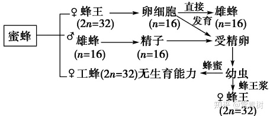

# 性别决定与伴性遗传

## 性别决定 :star2:

性别的发育必须经过两个步骤:

+ 性别决定, 受精卵的组成是决定性别的物质基础, 在受精的瞬间就决定了
+ 性别分化, 指在性别决定的基础上, 经过一定的内部和外部环境的相互作用, 才发育成不同的性别

### 性染色体和性别决定

#### 早期研究

1. H. Henking 1891 年在昆虫精子细胞核中发现了一种结构, 他称之为 X-body
2. Clarance McLung 在一些蝗虫镜子中发现一种异样的结构, 他称之为 Heterochromosome, 但他错误地把它与雄性联系起来
3. Edmund B. Wilson 1906 年总结了 Henking 和 McLung 的发现, 详细地说明了昆虫两种性染色体模式

## 性染色体决定性别的几种类型 :star2:

+ XX 型: 雄性 XY, 雌性 XX
  + 人类, 全部哺乳动物, 某些两栖类和鱼类以及很多昆虫和雌雄异株植物的性别类型
+ ZW 型: 雄性 ZZ, 雌性 ZW
  + 蛾, 蝴蝶, 大多数鸟类, 某些鱼类, 爬行类, 两栖类, 甚至一种植物
+ XO 型: 雄性 XO, 雌性 XX
  + 直翅目昆虫(蝗虫, 蟋蟀和蟑螂)
+ 植物的性别决定
  + 少数雌雄同株植物也具有与动物类似的性别决定机制

## 其他类型的性别决定 :star2:

### 蜜蜂 :star:

蜜蜂的性别由基因组决定，双倍体是雌蜂，单倍体是雄蜂
一个蜂巢只有一个蜂王，也是只有一个母蜂，它是双倍体，而雄蜂是单倍体，
交配时，雄蜂把精囊留下而死亡，这些精囊供蜂王一生使用
单倍体的雄蜂产生配子：减数分裂时候形成一个空的配子，全部进入另一个配子
工蜂是双倍体

+ 如果群体中雄性个体多,蜂皇就容易发现配偶而正常交配受精, 产生的 2n 受精卵都将发育成雌蜂(工蜂)
+ 如果群体中雄性个体过少, 蜂皇就很难发现配偶而不能正常交配受精, 转而进行孤雌生殖, 单倍体(n)的卵都将发育成雄蜂

### 后螠的性别决定:star:

+ 后螠的性别由幼虫所处环境决定
  + 落在海底成雌虫
  + 落在雌虫的口吻上成雄虫
  + 自由游泳的幼虫属中性

### 玉米的性别决定:star:

+ 由基因决定性别
  + 玉米是雌雄同株作物, 雌花位于叶腋, 雄花位于顶端
  + 基因 Ba 和基因 Ts 共同控制

|     基因型     | 性别 |         表现型         |
| :------------: | :--: | :--------------------: |
|   $BaBaTsTs$   |  ♂♀  | 顶端长雄花, 叶腋长雌花 |
| $Ba\_\ \_tsts$ |  ♀   |   顶端和叶腋都长雄花   |
| $babaTs\_\ \_$ |  ♂   | 顶端长雄花, 叶腋不长花 |
|   $babatsts$   |  ♀   | 顶端长雌花, 叶腋不长花 |

$Ba$: 叶腋长花
$ba$: 叶腋不长花

$Ts$: 顶端长雄花 叶腋长雌花
$ts$: 顶端长雌花 叶腋长雌花

### 果蝇的性别决定:star:

+ XY 型
+ X 染色体决定雌蝇, Y 染色体上几乎没有决定性别的基因, Y 对性别决定几乎不起作用
  + XX 正常 ♀, XY 正常 ♂
  + XXX, XXY, XXXY, XXXX 异常 ♀
  + XO 异常 ♂

#### 性指数

X 染色体数与常染色体组数的比值

+ 受精后合子内部性指数(X/A)支配后代性别分化方向, 与 Y 染色体无关
  + 1.0 雌性可育
  + 0.5 雄性可育
  + 0.5 - 1.0 间性, 不育
  + \> 1.0 超雌, 高度不育
  + < 0.5 超雄, 高度不育

## 人的染色体组成和性别决定

### 人的性别决定

#### 常染色体

性染色体以外的所有染色体

#### 性染色体 :star2:

明显与性别决定有直接关系的染色体

#### 性染色体异数

指有些生物的雌雄在性染色体上是不同的

## 性别是由 Y 染色体所决定

SRY: Sex-determining Region Y

TDF: the Testis Determining Factor

## Y 染色体与雄性发育

### Y 染色体的结构

+ 两端 PARs 
  + 与 X 染色体同源, 并能形成联会复合体
+ 中间 NRY
  + NRY 的中间部分区域也与 X 染色体同源

### Y 染色体上的基因

#### SRY 基因 (Sex-determining Region Y)

+ 编码产物: 睾丸决定因子 TDF, Testis Determining Factor
+ 位置: Y 染色体短臂的一个区域上

### NRY 区基因

约有 20 个基因
部分与 X 染色体同源, 管家基因; 部分不同源

## 伴性遗传 :star2:

### 交叉遗传

 指性染色体所携带的基因在遗传时与性别相联系的遗传方式, 即母亲把形状呈传给儿子, 父亲把性状传给女儿的现象

### 伴性遗传的规律

+ 当统配性别传递春和显性基因时, $F_1$ 雌雄个体都为显性性状. $F_2$ 性状分离呈 3 显 : 1 隐, 性别分离呈 1:1
+ 当同配性别传递纯和隐性基因时, $F_1$ 表现为交叉遗传, 即母亲的性状传给儿子, 父亲的性状传给女儿.
  $F_2$ 性状与性别的比例均为 1:1

### 人类的伴性遗传 :star2:

#### 伴 X 显性遗传

指决定一些遗传性状或遗传病的显性基因在 X 染色体上的遗传方式

+ 色盲

#### Y 连锁遗传 限雄遗传

+ 毛耳

## 从性遗传 :star2:

从性遗传指基因位于常染色体上受性别的影响, 在一个性别中表现显性, 而在另一性别表现隐性

### 性限制

+ 位于常染色体的基因只限制在同一性别中表达
  + 鸡的产蛋量和牛的产奶量基因在公母中均有, 这些基因指传递到他们的的女儿中才能表达
  + 选育品种不但选择雌亲, 根据女儿的表达选的雄亲
+ 雌性激素的存在时产蛋基因和产奶基因表达的必要条件

## 伴性遗传和从性遗传的区别

+ 从性性状包括受性别影响的性状和性别限制的性状
  从性遗传和伴性遗传的表现都同性别有密切关系, 但他们是两种截然不同的遗传方式
+ 伴性遗传的基因位于性染色体上, 基因是随染色体遗传, 而从性遗传是指常染色体基因所控制的性状, 在表型厂受个体性别影响

### 果蝇的伴性遗传 :star2:

果蝇白眼: 伴 X 隐

### 鸡的伴性遗传 :star2:

芦花 伴 W 显性

### 高等植物的伴性遗传:star2:

女娄菜属植物叶子性状有阔叶(B)和细叶(b)

$X^b$: 带有基因 b 的 X 染色体, 基因 b 花粉致死

## 遗传的染色体学说 :star2:

1. 染色体有一定的形态结构. 基因是遗传学单位, 每队基因在杂交种保持他们的完整性和独立性
2. 染色体成对存在, 基因也是成对的. 在配子中, 每对同源染色体只有一个
3. 两个同源染色体也是分别来母本和父本
4. 不同对染色体在减数分裂后期的分离是独立分配, 不同对的基因在形成配子时也是如此

## 性别分化的影响

+ 性激素
+ 营养条件
+ 温度
+ 日照氮肥等

