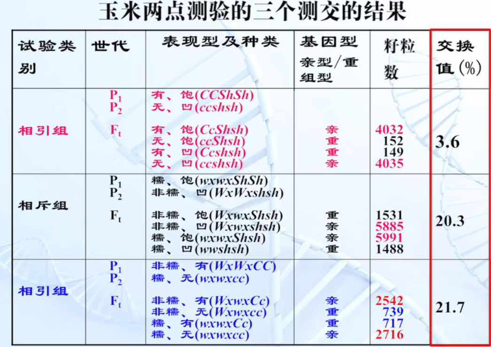

# 连锁基因的交换与重组

## 连锁与交换

### 发现

Bateson, Punnett 1906 年, 香豌豆杂交实验

#### 连锁遗传 :star:

同一个亲本所具有的两个性状, 在 $F_2$ 中常常又联系在一起遗传的倾向, 这种现象称为连锁遗传

#### 相引组

两个显性性状联系在一起遗传, 两个隐性性状联系在一起遗传的杂交组合

#### 相斥组

一个显性性状与另一个隐性性状联系在一起遗传的杂交组合

### 解释

1. $F_1$ 虽然形成 4 中配子, 但其比例不符合 $1:1:1:1$
2. 两种亲型配子多, 两种重组型配子少
3. 两种亲型配子数大致相等, 两种重组型配子数也大致相等

Morgan 解释: 控制眼色和翅长的两对基因位于同一同源染色体上. 简述分裂时部分细胞中同源染色体的两条非姐妹染色单体之间发生交换, 形成重组型配子

#### 完全连锁和不完全连锁

连锁遗传: 在同一同源染色体上的非等位基因连在一起而遗传的现象

完全连锁: 同一同源染色体的两个非等位基因之间不发生非姊妹染色单体之间的交换, 则二者总是联系在一起而遗传的现象

不完全连锁: 同一同源染色体上的两个非等位基因之间或多或少地发生非姊妹染色单体之间的交换, 测交后代中大部分为亲本型, 少部分为重组型的现象

#### 交换率

重组型配子占所有配子比例

#### 重组率

重组型个体占所有个体比例

#### 遗传距离

交换值具有相对的稳定性, 所以通常以这个数值表示两个基因在同一染色体上的相对距离

#### 遗传单位

将 $1\%$ 的交换值定为度量交换的基本单位, 称为 1 个遗传单位, 转换成图距单位后相当于 1 厘摩(cM)

### 两点测验

$Aa,Bb,Cc$ 

+ 通过一次杂交和一次测交求 $Aa$ 和 $Bb$ 的交换值
+ 通过一次杂交和一次测交求 $Bb$ 和 $Cc$ 的交换值
+ 通过一次杂交和一次测交求 $Aa$ 和 $Cc$ 的交换值

确定三对基因都是连锁遗传的

根据三个交换值的大小, 确定这三对基因在染色体上的位置

#### 缺点

+ 工作繁琐
+ 当交换值 $>5\%$ 时, 准确性不高

### 三点测验 :star2:

通过一次杂交和一次用隐性纯合个体测交, 同时确定三对基因在染色体上的位置

#### 判断中间基因

#### 求遗传距离

计算单交换值

### 干扰和符合 :star2:

一个单交换的发生是否会影响到另一个单交换的发生

如果两个单交换的发生是彼此独立的, 根据概率定律
$$
\begin{aligned}
双交换值&=单交换1\times 单交换2\\
&=0.184\times0.035\\
&=0.64\%
\end{aligned}
$$

$$
实际双交换值=0.09\%
$$

可见一个单交换发生后，在它邻近再发生第二个单交换的机会就会减少，这种现象称为干扰

对于受到干扰的程度，通常用符合系数 $f$ 或称并发系数 $C$ 来表示
$$
C=\frac{实际双交换值}{理论双交换值}
$$
干扰值 $I=1-C$

### 连锁遗传图

将一对同源染色体上的各个基因的位置确定下来,绘制成图

#### 连锁群

存在于同一染色体上的基因群种生物连锁群的数目与染色体的对数是一致的, 即有 $n$ 对染色体就有 $n$ 个连锁群

## 真菌类的遗传分析

#### 粗糙链孢霉(Neurospora crassa)用于遗传分析材料的特点 :star:

1. 单倍体, 没有显性的复杂问题 
2. 一次只分析一个减数分裂产物, 而二倍体不是那样
3. 个体小, 长得快, 易于培养, 一次杂交可以产生大量后代 
4. 它进行有性生殖, 染色体的结构和功能类似于高等动植物
