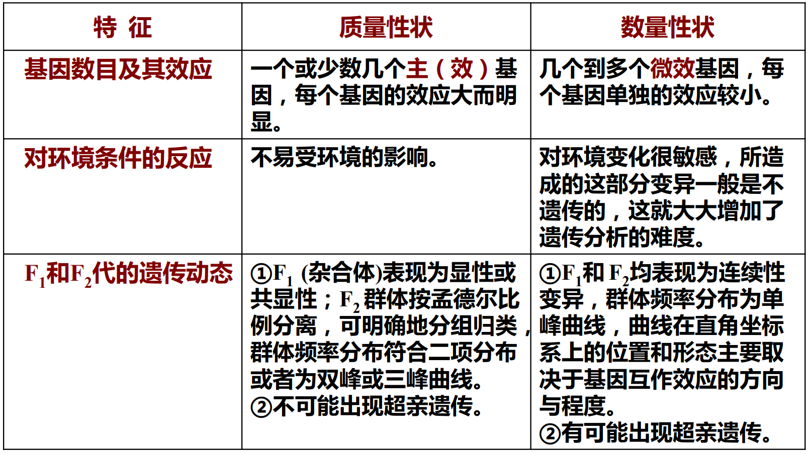

# 数量性状遗传分析

## 质量性状

是指不易受环境条件的影响, 在一个群体内表现为不连续性变异的性状

## 数量性状

是指表现为连续变异, 彼此间不存在明显的质的差异, 只有数量上的轻微差异, 可用数字描述, 不容易分组归类, 易受环境的影响, 性状表现不稳定的一类性状

### 特点 :star:

1. 变异表现为连续性
2. 易受环境条件的影响
3. 控制数量性状基因在特定时空条件下表达, 在不同环境下基因表达的程度可能不同

### 质量性状和数量性状的区别

## 多基因假说 :star:

+ 数量性状受一系列微效多基因的支配, 它们的遗传仍符合基本的遗传规律
+ 多基因之间无显隐性关系, 因此 $F_1$ 代大多表现为两个亲本类型的中间类型
+ 多基因的效应相等, 且彼此间的作用可以累加, 后代的分离表现为连续变异
+ 多基因对外界环境的变化比较敏感, 数量性状易受环境条件的影响

## 遗传力

是指某一性状由亲代传递给子代的能力, 即指遗传变异占总变异(表型变异)的比率, 用以度量遗传因素与环境因素对性状形成的影响程度, 由可称为遗传率, 遗传度, 常用百分率表示. 遗传力分为广义遗传力和侠义遗传力两类

### 广义遗传力

是指某性状的遗传方差占表型方差中的比率, 广义遗传力表示的是表型值受基因型值决定的程度, 是用来衡量基音值在表型中的相对重要性, 即在性状的表现上, 遗传作用与环境作用的相对大小
$$
H_b^2 =\frac{V_G}{V_P} \times 100 \% 
$$

### 狭义遗传力

是指某性状的加性方差占表型方差的比率, 由于显性效应可由亲代通过配以传给子代, 所以狭义遗传力揭示的是可由亲代传给子代的那部分效应的方差占表型方差的分量
$$
h_{N2}=\frac{V_A}{V_P} \times 100\%
$$

#### 利用回交群体估算狭义遗传力

根据 $F_2$ 代和回交后代基因型方差组成的差异, 通过一定的数学运算求出加性方差 $V_A$, 从而估计出狭义遗传力.

## 近亲繁殖和杂种优势

### 近亲繁殖

近亲繁殖(inbreeding) 也称近亲交配, 在人类中则称近亲婚配, 指血统或亲缘关系较近的两个个体之间的交配.

+ 同父母后代的全同胞交配(full-sib)
+ 同父异母或同母异父后代的半同胞交配(half-sib)
+ 亲表兄妹交配(first-cousin).

#### 自交

是指植物的雌雄配子来源于同植株或同一花朵, 动物同一个体内的精卵结合的交配, 它是近亲繁殖的极端类型.

#### 回交

也是近亲繁殖的一种方式, 它是指杂种后代与其亲本之一的再次交配. 被用来连续回交的亲本称为轮回亲本(recurrent parent); 相对地, 未被用于连续回交亲本为非轮回亲本(non-recurrent parent).

### 近亲繁殖的遗传学效应

#### 自交的遗传学效应

+ 杂合体自交可导致后代基因发生分离,也可使后代群体中的遗传组成趋于纯合化.
+ 杂合体自交可导致等位基因纯合,使隐性性状表现出来,从而淘汰有害的隐性性状,改良群体的遗传组成.

#### 回交的遗传学效应

+ 基因替代, 后代基因被轮回亲本基因替代
  回交后代基因型纯合严格受轮回亲本的基因控制.一个杂种与其轮回亲本回交一次,可使后代细胞核增加轮回亲本的1/2基因组成;多次连续回交,其后代基因基本上被轮回亲本的基因所替代.
+ 定向纯合. 在基因型纯合的进度上,回交显然大于自交.一般回交5~6代后,杂种基因型已基本被轮回亲本的基因组成所置换.

## 杂种优势

指两个遗传组成不同的亲本杂交产生的杂种一代, 在**生长势, 生活力, 繁殖力,  抗逆性, 产量和品质**上比其双亲优越的现象

### 杂种优势的表现

+ 营养体发育较旺
+ 生殖器官发育旺盛
+ 对不良环境适应能力较强的适应型

### F1杂种表现的几个优点

+ 杂种优势不是某一, 两个性状单独地表现突出, 而是许多性状综合表现突出
+ 杂种优势的大小, 大多数取决于双亲性状间的相对差异和相互补充
+ 杂种优势的大小与双亲的基因型的高度纯合具有密切关系
+ 杂种优势的大小与环境条件的作用也有密切的关系

### F2自交衰退

发生分离重组

### 杂种优势的遗传理论

显性基因互补假说: 认为双亲对很多座位上的不同等位基因的纯合体形成杂种后, 由于显性有利基因的积聚, 遮盖了隐性有害基因, 从而表现出明显的优势
