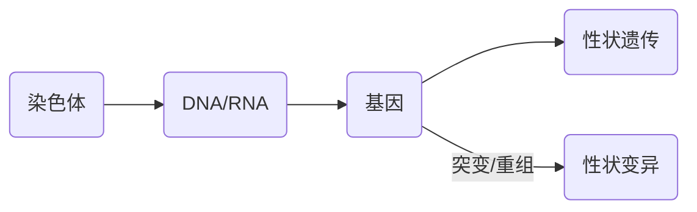

# 绪论

## 遗传学研究的对象和任务

遗传: 亲代与子代之间相似的现象
变异: 亲代与子代之间, 子代个体之间存在的差异

### 物种进化和新品种选育的三大因素 :star2:

+ 遗传: 物种和性状的相对稳定性
+ 变异: 物种进化和新品种选育
+ 选择:
  + 物种形成(自然选择)
  + 新品种(人工选育)

### 遗传学的主要内容

遗传信息的传递:
$$
\begin{aligned}
细胞&\to 细胞\\
亲代&\to 子代\\
世代&\to 世代
\end{aligned}
$$

$$
染色体\to DNA/RNA\to 基因\to 性状遗传
$$

### 遗传学研究的任务 :star2:

遗传学是研究生物遗传与变异的规律及其机制的一门学科

+ 研究生物遗传和变异
+ 研究生物体遗传信息和表达规律
+ 研究和了解基因本质

## 遗传学的发展简史 :star:

+ 18 世纪下半叶和 19 世纪上半叶
  + 拉马克认为环境条件的改变是生物变异的根本原因, 提出器官的用进废退和获得性遗传等学说
+ 1859 年
  + 达尔文发表《物种起源》, 提出自然选择和人工选择的进化学说
+ 1866 年
  + 孟德尔 1856 - 1864 年从事豌豆杂交实验
  + 1866 年发表「植物杂交实验」论文
    + 提出分离和独立分配两个遗传学基本规律
+ 1900 年
  + 弗里斯, 柯伦斯, 差马克同时重新发现孟德尔遗传规律
  + **遗传学建立和开始发展**
+ 现代遗传学
+ 1900 - 1939 年 细胞遗传学时期
  + 摩尔根的染色体 - 基因遗传理论
  + 1905 贝特生 
    + 提出 Genetics (to generate)
  + 1901 - 1903 弗里斯 
    + 发表「突变学说」
  + 1903 萨顿 
    + 提出 **染色体遗传理论**
  + 1905 哈迪 温伯格 
    + 提出 **随机交配群体中基因频率和基因型频率的计算公式和遗传平衡定律**
  + 1906 贝特生 
    + 在香豌豆杂交实验中发现性状连锁
  + 1909 约翰生 
    + 发表「纯系学说」
    + 提出 "gene" 一词代替「遗传因子」
  + 1910 摩尔根等 用果蝇为材料 
    + 发现性状连锁现象, 创立了基因理论, 连锁遗传规律, 细胞遗传学
  + 1927 穆勒 斯特德勒
    + 采用 X 射线, 分别诱发果蝇和玉米突变成功
+ 1940 - 1952 年 从细胞向分子水平过渡时期
  + 1941 比德尔 泰特姆
    + 红色面包霉
    + 「一个基因一个酶」假说
    + 发展微生物遗传学和生化遗传学
  + 1944 艾弗里 等
    + 肺炎双球菌转化实验
    + 证明 遗传物质是 DNA 而不是蛋白质
  + 1952 赫尔歇 蔡斯 等
    + 同位素标记法
    + DNA 是 T2 噬菌体的遗传物质
+ 1953 - Now 分子遗传学时期
  + 1953 沃森 克里克
    + 对 DNA 的化学分析和 X 射线衍射结果
    + 提出 DNA 分子双螺旋结构模型
  + 1955 本泽尔
    + 提出 T4 噬菌体的 $rII$ 座位精细结构图
    + 证明基因是可以分割的
  + 1957 扶南科尔 柯拉特 等
    + 发现烟草花叶病毒的遗传物质是 RNA
  + 1958 
    + DNA 半保留复制
    + 大肠杆菌分离得到 DNA 聚合酶 I
  + 1959 奥乔
    + 分离得到第一种 RNA 聚合酶
  + 1961 雅克布 莫诺根
    + 乳糖操纵子
  + 1961 布伦勒 雅克布 梅西尔逊
    + 发现 mRNA
  + ......

## 遗传学的应用 :star:

+ 基因治疗
  + 是指将外源正常基因导入靶细胞,以纠正或补偿因基因缺陷和异常引起的疾病,以达到治疗目的.也就是将外源基因通过基因转移技术将其插入病人的适当的受体细胞中,使外源基因制造的产物能治疗某种疾病.
+ 遗传学与农业
  +  对农业科学起直接指导作用，是动植物和微生物育种的理论基础
  + 大量发掘有利基因，研究基因功能，理论上和实践上仍有许多需要解决的问题（矮杆基因、植物细胞质雄性不育基因、抗性基因等），应用于动植物育种
+ 优生学
  + 根据达尔文的自然选择进化理论， 通过人工选择改良人类的遗传组成
  + 优点
    + 人工选育
    + 优生优育
    + 预期检查
  + 存在问题
    + 纳粹
    + 生化武器, 克隆人