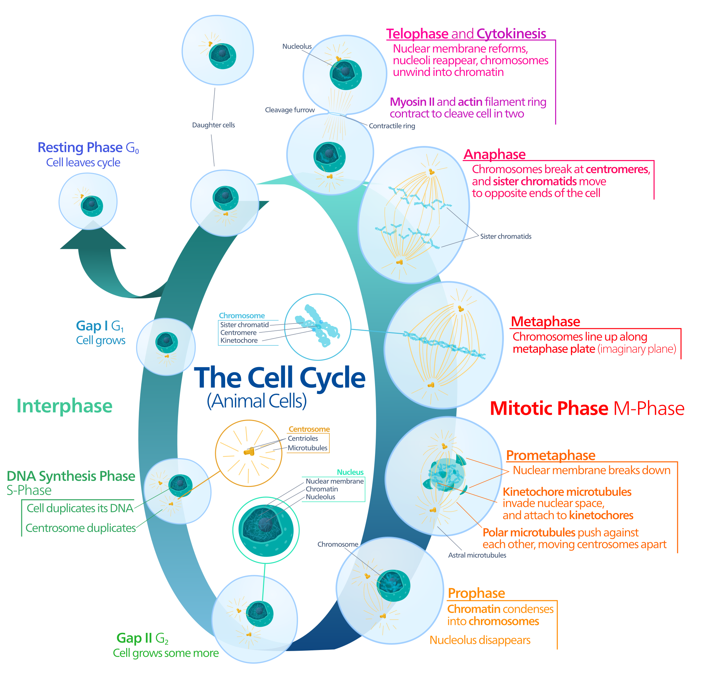

# 遗传的染色体学说 :star2:

萨顿和贝弗利提出了遗传的染色体学说, 认为基因在染色体上

+ 染色体有一定的形态结构. 基因是遗传学的单位, 每对基因在杂交中保持他们的完整性和独立性
+ 染色体是成对存在, 基因也是成对的. 在配子中每对基因只有一个, 而每对同源染色体只有一个
+ 两个同源染色体也是分别来自母本和父本. 个体中成对的基因一个来自母本, 一个来自父本
+ 不同对染色体在减数分裂后期的分离, 是独立分配. 不同对的基因在形成配子时的分离也是如此

## 染色体 :star2:

在细胞尚未分裂的核中(间期核中), 可看到许多用碱性染料染色较深的纤细网状物, 主要由 DNA, 组蛋白, 非组蛋白核少量 RNA 组成

### 染色体

细胞分裂时, 由染色质聚缩而呈现为一定数目和形态的复合结构, 可被碱性染料染色较深的结构, 是遗传物质的主要载体.

### 染色质

#### 常染色质

染色较浅的区段, 转录活跃

#### 异染色质

染色深的区段

核酸的紧缩程度及含量不同, 异染色质的复制时间总是迟于常染色质 异固缩

## 有丝分裂 Mitosis

### 染色体在有丝分裂中的行为

### 有丝分裂的遗传学意义

1. 核内每个染色体一分为二, 为形成的两个子细胞在遗传组成上与母细胞完全一样提供了基础
2. 复制的各队染色体有规则而均匀地分配到两个子细胞中去, 从而使两个子细胞与母细胞具有同样质量和数量的染色体
3. 促进了个体细胞数目和体积增加, 维持了个体正常生长发育, 分化, 保证了物种的连续性和稳定性

## 减数分裂 Meiosis

### 联会复合体

功能: 稳定同源染色体, 配对的必要条件

适当条件下激活交换

### 交叉结

非姐妹染色单体发生交换的结果

### 前期 I

前期I分为细线期、偶线期、粗线期、双线期、终变期五个阶段。除有丝分裂前期中发生事件外，前期I中还包括同源染色体配对、重组。前期I的速度根据物种和性别而不同。许多物种的卵细胞在排卵前阻滞于双线期。人类卵细胞可在前期I停留数十年并在排卵前迅速完成减数分裂I。

#### 细线期

前期I的第一阶段是细线期，染色体在此期间缩聚。每个染色体是单倍体，带有两个姊妹染色单体；姊妹染色单体的染色质缩聚程度不足以在光学显微镜下观察。同源染色体对上的同源区域在此期间开始配对。

#### 偶线期

前期I的第二阶段是偶线期，所有父源及母源染色体在此已与同源伙伴配对。同源染色体对随后进行联会，该过程中联会复合体将来自双亲的非姊妹染色单体对齐。由联会复合体配对的染色体对是二价体或四分体。性染色体由于仅有小部分同源区域不能完全联会。

核小体从细胞核中心移至其边缘。

#### 粗线期

前期I的第三阶段是粗线期，在联会完成后开始。染色质此时足够缩聚，在显微镜下可见染色体。联会复合体上形成了重组节。重组节促使二价体上的非姊妹染色单体交换遗传信息，该过程为染色体互换或遗传重组。每个二价体可发生多次重组，人类每个染色体平均发生二到三次重组。

#### 双线期

前期I的第四阶段是双线期，此时染色体互换完成。同源染色体此时有参杂父母来源的整套遗传信息。染色体互换发生位置形成了交叉，将同源染色体固定在一起，联会复合体此时降解。众多物种在此时阻滞减数分裂。

#### 终变期

前期I的第五阶段是终变期，染色质缩聚完成，显微镜下可见四个姊妹染色单体构成的二重体。终变期其余阶段类似于有丝分裂前中期，纺锤体开始形成，核膜开始解体。

### 减数分裂的遗传学意义

+ 保证了亲代与子代间染色体数目的恒定性
+ 保证了物种相对的稳定性
+ 子细胞之间在染色体的组合多样性
+ 有利于生物的适应及进化, 并未人工选择提供了丰富的材料

### 根据遗传的染色体学说理解遗传学三大定律

+ 分离定律
  + 性状分离
    + 等位基因分离
      + 同源染色体分离
+ 自由组合定律
  + 性状自由组合
    + 非同源染色体上的非等位基因自由组合
      + 非同源染色体的自由组合
+ 连锁遗传定律
  + 性状交换组合
    + 同源染色体上的非等位基因交换
      + 同源染色体的交换

### 总结

+ 减数分裂染色体行为是遗传学三大规律的直接体现: 减数分裂过程中同源染色体联会配对交换, 非同源染色体自由组合形成单倍体配子的过程符合遗传学规律
+ 减数分裂是有性生殖的重要基础: 有性繁殖由亲本产生的雌雄配子, 经过精卵细胞的结合, 形成受精卵, 再由受精卵发育成为新的个体
+ 减数分裂是物种进化和新品种培育的基础: 通过减数分裂染色体的配对交换, 重组和分离, 真正形成双亲遗传物质组合的多样性配子, 为生物进化和新品种的选择奠定了遗传物质基础
+ 减数分裂形成的配子是生物世代交替的桥梁: 减数分裂形成的雌雄配子结合成受精卵是下一代个体发育的起点, 受精卵通过细胞有丝分裂和分化形成一个成熟的个体, 再行成配子进入下一个世代循环, 所以配子事世代与世代连接的桥梁