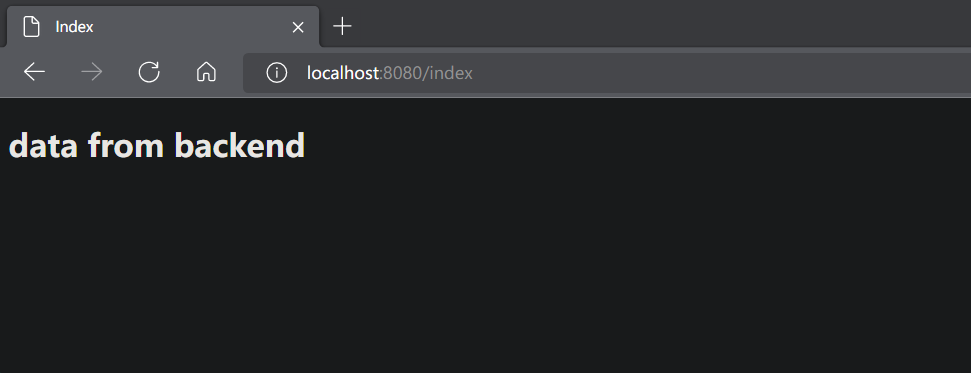
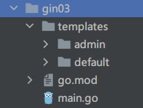

# Go Gin

> Go Gin 文档 https://gin-gonic.com/zh-cn/docs

1. 下载并安装 gin：

```sh
$ go get -u github.com/gin-gonic/gin
```

`example.main`:

```go
package main

import "github.com/gin-gonic/gin"

func main() {
	r := gin.Default()
    
    // 配置路由
    // 返回 JSON 的方法 1
	r.GET("/ping", func(c *gin.Context) {
        c.JSON(200, map[string]interface{}{
			"message": "pong",
		})
	})
    
    // 返回 JSON 的方法 2
    r.GET("/json", func(c *gin.Context) {
        c.JSON(200, gin.H{
            "success": true,
            "msg":     "hello gin",
        })
    })
	r.Run() // 监听并在 0.0.0.0:8080 上启动服务
    // 更改端口
	r.Run(":9999")
}
```

+ 返回 JSONP

  ```go
  User := User{
      Uid:      10001,
      UserName: "Zhang San",
      UserAge:  20,
      Gender:   true,
      Address:  "ShiZiShanJieYiHao",
  }
  
  // 将 struct 以 JSON 格式返回
  r.GET("/struct", func(c *gin.Context) {
  
      c.JSON(http.StatusOK, &User)
  })
  
  // 响应 JSONP 请求
  r.GET("/jsonp", func(c *gin.Context) {
  
      c.JSONP(http.StatusOK, &User)
  })
  ```

+ 响应 xml 数据

  ```go
  // 响应 xml 数据
  r.GET("/xml", func(c *gin.Context) {
  
      c.XML(http.StatusOK, &User)
  })
  ```

## Gin HTML 模板渲染

+ 类似 Java 中的模板引擎 Thymeleaf

```go
// 调用 HTML 需要 LoadHTMLGlob
// 配置静态资源的路径, f
r.LoadHTMLGlob("templates/*")

// html 模板
r.GET("index", func(c *gin.Context) {
    c.HTML(http.StatusOK, "index.html", gin.H{
        "title": "data from backend",
    })
})
```

```html
<!DOCTYPE html>
<html lang="en">
<head>
    <meta charset="UTF-8">
    <title>Index</title>
</head>
<body>
    <h2>{{.title}}</h2>
</body>
</html>
```



+ 拿到结构体参数

```go
r.GET("/news", func(c *gin.Context) {
    // & 传入指针, 节省资源
    news := &Article{
        Title:   "News title",
        Content: "News content",
    }
    c.HTML(http.StatusOK, "news.html", gin.H{
        "title": "News page",
        "news":  news,
    })
})
```

```html
<!DOCTYPE html>
<html lang="en">
    <head>
        <meta charset="UTF-8">
        <title>Title</title>
    </head>
    <body>
        <h2>{{.title}}</h2>

        <p>{{.news.Title}}</p>
        <p>{{.news.Content}}</p>
    </body>
</html>
```

### `templates` 下有多个目录

+ 

1. 改 `r.LoadHTMLGlob`

   ```go
   r.LoadHTMLGlob("templates/**/*")
   ```

2. html 文件加上 `define/end`

   ````
   {{ define "default/news.html" }} // 这里填具体路径
   	html
   {{ end }}
   ````

3. 路由写对应的路径

   ```go
   r.GET("/admin", func(c *gin.Context) {
       c.HTML(http.StatusOK, "admin/index.html", gin.H{
           "title": "back end front page",
       })
   })
   ```

### 变量

+ 可以在模板中声明变量, 用来保存传入模板的数据或其他语句生成的结果

```html
<h4>{{$obj := .title}}<h4>

<h4>{{$obj}}<h4>
```

### 比较函数

+ 布尔函数会将任何类型的零值视为假, 其余是为真

```
eq	//	==
ne	//	!=
lt	//	<
le	//	<=
gt	//	>
ge	//	>=
```

### 条件判断

```
{{if pipeline}} T1 {{end}}

{{if pipeline}} T1 {{else}} T0 {{end}}

{{if pipeline}} T! {{else if pipeline}} T0 {{end}}


{{if ge .score 60}}
pass
{{else}}
fail
{{end}}
```

### `range`

+ Go 的模板语法中使用 `range` 关键字进行遍历, 有两种写法, 其中 `pipeline` 的值必须是数组, 切片, 字典或者通道.

```
{{range $key, $value := .hobby}}
	<li>{{$key}} -> {{$value}}</li>
{{end}}
```

+ `$obj` 长度为 0 时不会有任何输出

```
{{range $key, $value := .hobby}}
	<li>{{$key}} -> {{$value}}</li>
{{else}}
	$obj 值长度为 0
{{end}}
```

### `with`

+ 使用 `with` 简化结构体数据的输出

```
{{with .user}}
	<h4>姓名: {{.Name}}</h4>
	<h4>年龄: {{.Age}}</h4>
	<h4>性别: {{.Gender}}</h4>
{{end}}
```

