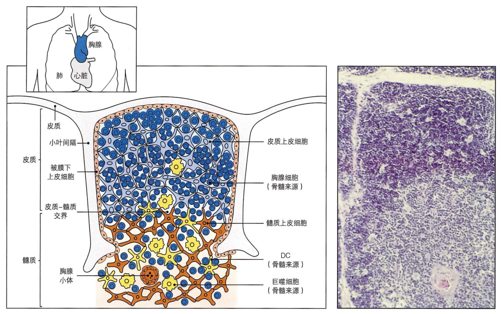

# 第二章 免疫系统

## 概述

免疫系统（Immune system）是生物体，特别是哺乳类动物以至人体机体种系进化和个体发育所生成的免疫防护结构，广泛分布于机体各部位，由多种免疫器官、免疫细胞、免疫分子以及独立鱼血管体系之外的各级免疫器官、免疫细胞、免疫分子以及独立于血管体系之外的各级淋巴管道组成，其特点是能辨别「自我」和「非我」的异物，并对外来抗原产生免疫应答。

## 免疫系统的功能

+ 免疫防御
  + 正常免疫：中和毒素，防御病原微生物的侵害
  + 异常免疫：过高引起变态反应；过低引起免疫缺陷病
+ 自我稳定
  + 正常免疫：清除衰老或损伤的细胞
  + 异常免疫：自身免疫疾病
    + 小儿溶血症
    + 风湿性关节炎
    + 全身性红斑狼疮
+ 免疫监视
  + 正常免疫：清除复制错误或突变细胞
  + 异常免疫：细胞癌变或持续性感染

## 免疫器官

+ 中枢免疫器官
  + 胸腺 Thymus
  + 骨髓 Bone marrow
  + 法氏囊（鸟类）bursa of fabricius
  + 囊类似器官（扁桃体、阑尾）
+ 外周免疫系统
  + 淋巴结 Lymph node
  + 脾脏 Spleen
  + 皮肤淋巴细胞
  + 粘膜相关淋巴组织

### 胸腺

#### 胸腺结构

胸腺（Thymus）为 T 细胞发育提供了独特的微环境。胸腺分为左右两叶，表面有薄层结缔组织**被膜** (capsule)。被膜组织呈片状伸入胸腺内部形成**小叶间隔** (interlobular septum)，将实质分隔为许多不完全分离的**胸腺小叶** (thymus lobule)。每个小叶都有**皮质**和**髓质**两部分，所有小叶的髓质都相互连续。

> 胸腺位于身体中线的心脏上方，由几个小叶组成，每个小叶包含离散的皮质（外部）和髓质（中央）区域如左图所示，皮质包含未成熟的胸腺细胞（深蓝色），而分支的皮质上皮细胞（淡蓝色）与未成熟的皮质胸腺细胞紧密相连，散在分布的巨噬细胞（黄色）负责清除凋亡的胸腺细胞 。髓质 由成 熟的胸腺细胞（深蓝色 ）和 髓质上皮细胞（橙色）以及骨髓来源的巨噬细胞（黄色）和 DC 黄色）组成胸腺小体（Hassall's corpuscle）可能也是细胞降解的部位。外部皮质细胞层中的胸腺细胞是增殖的未成熟细胞，而更深的皮质区胸腺细胞主要是进行胸腺选择的未成熟 T 细胞。照片显示苏木精-伊红染色的人胸腺的相同区域的切片。皮质被深染，髓质被浅染。髓质中大的结构体是胸腺小体。

+ 一般结构
  + 被膜（结缔组织）
  + 小叶间隔：被膜组织呈片状伸入胸腺内部形成小叶间隔
  + 实质：周围为皮质，染色深；中央为髓质，染色浅。
+ 主要结构
  + 皮质
    + 胸腺上皮细胞（哺育细胞）：支架胸腺细胞，分化发育的早期 T 细胞，形成 $\mathrm{CD4^+}$ 或 $\mathrm{CD8^+}$ T 细胞。
    + 少量巨噬细胞：维持胸腺微环境。
  + 髓质
    + 胸腺上皮细胞：量多，部分是胸腺小体上皮细胞。
    + 胸腺小体：在小体外周细胞幼稚中心处成熟，中心完全角质化、嗜酸性。功能未明。

#### 胸腺功能

+ T 细胞分化成熟的场所
+ 免疫调节作用
+ 建立与维持自身耐受

T 细胞发生过程：干细胞 → 血流 → 胸腺（皮质 → 髓质，95% 以上 T 前体淋巴细胞死亡，不足 5% 的成为成熟的 T 细胞）→ 血流 → 周围免疫器官

#### 胸腺特点

+ 青春期后衰退
+ 产生的淋巴细胞多，成熟的淋巴细胞少

### 骨髓

分布：胸骨、脊骨、肋骨等长骨、扁骨、不规则骨的骨腔隙内。由红骨髓和黄骨髓组成。

功能：B 细胞的发源地，B 细胞分化发育的场所，再次体液免疫应答的场所。

> 多能造血干细胞可分化为两种类型的干细胞——淋巴系干细胞和髓系干细胞。淋巴系干细胞可继续分化为淋巴样谱系（蓝色背景），包括固有淋巴样细胞（ILC）、自然杀伤（NK）细胞、T 细胞和 B 细胞。髓系干细胞继续分化为髓系细胞（粉红色和黄色背景），包括其他白细胞、红细胞和巨核细胞。巨核细胞产生血小板，在血液凝固过程中起重要作用。T 细胞和 B 细胞与其他白细胞不同，它们表达抗原受体，而且在不同器官分化成熟（胸腺和骨髓）。B 细胞接触抗原后分化为分泌抗体的浆细胞，而 T 细胞则分化为具有多种功能的效应 T 细胞。与 T 细胞和 B 细胞不同， ILC 和 NK 细胞不识别特异的抗原。其他的白细胞包括单核细胞、树突状细胞（DC) 、中性粒细胞、嗜酸性粒细胞和嗜碱性粒细胞。后三者参与血液循环，在血涂片中，因它们的胞质染色呈特殊的颗粒状，而被称为粒细胞；其中，中性粒细胞拥有不规则形状的细胞核，也被称为多形核白细胞。未成熟 DC（黄色背景）是组织内的吞噬细胞，在接触病原体后成熟。大部分 DC 源于髓系干细胞，但也有一部分源于淋巴系干细胞。单核细胞进入组织后分化成吞噬性巨噬细胞或 DC。肥大细胞也在进入组织后成熟。

### 法氏囊

在泄殖腔的上方，来源于卵黄囊、骨髓多能干细胞，为鸟类的周围免疫器官提供成熟的 B 淋巴细胞。

### 脾脏

> 左上方的示意图显示脾脏由红髓（粉红色区域）构成，其间散在分布着白髓。红髓是处理红细胞的部位。人类脾脏的放大图（右上）显示了中央小动脉周围分散的白色髓样区域（黄色和蓝色）的排列。在脾脏横切面上可以看到大多数白髓 下图是白髓横截面（下中心）和纵截面（右下角）的放大图。围绕中央小动脉的是由 细胞组成的围动脉淋巴鞘（PALS）。淋巴细胞和携带抗原的 DC 聚集在这里。滤泡主要由 B 细胞组成；在 次级滤泡中，生发中心被 B 细胞冠包围。在白髓，携带淋巴细胞和抗原的血液从血窦流入中央小动脉，以中 夹小动脉为中心，较小的血管呈扇形散，最终在脾脏一个称为滤泡周区（PFZ）的特殊区域终止，滤泡周区包有边缘区。此后细胞和抗原通过滤泡周围充满血液的开放空间进入白髓。左下角的光镜图显示人脾脏白髓 的横切面，其中成熟 B 细胞免疫染色。滤泡和 PALS 都被滤泡周围区包围。滤泡小动脉（底部箭头）在PALS 处穿过滤泡，穿过边缘区并进入滤泡周围区（顶部箭头）。Co，滤泡 B 细胞冠；GC，生发中心；MZ，边缘区；RP，红髓；箭头，中央小动脉。

+ 部位：腹腔左边肋部
+ 结构：被膜、小梁、白髓、红髓
  + 白髓：中央动脉周围淋巴鞘（T-C 所在地）、淋巴小结（脾小结）
  + 红髓：脾索、血窦、动脉、静脉、树突状细胞（DC）、吞噬细胞
+ 脾脏淋巴细胞循环：脾动脉 → 被膜 → 白髓（中央动脉周围淋巴鞘、脾小结）→ 红髓（脾索 → 血窦）→ 小静脉 → 静脉 → 门部 → 血循环
+ 功能
  + 造血、储血和滤血
  + 产生和留居淋巴细胞的场所
  + 产生免疫的基地

### 淋巴结

#### 淋巴结的结构

+ 分布：腘、腹股沟、肠系膜、肘、腋下、颈部等。
+ 形态、大小、数量：豆形、直径 1 - 25 mm、500 多个。
+ 结构：被膜、小梁、皮质、髓质、动静脉管。

> 左图为淋巴结纵切面示意图，淋巴结由外侧皮质和内部的髓质构成。皮质主要包括 B 细胞构成的外层淋巴滤泡以及由 T 细胞和 DC 构成的副皮质区。免疫应答发生时，部分刺激淋巴滤泡中心区域的 B 细胞大量增殖形成发生中心。这种反应非常剧烈，但最终会随着发生中心的衰老而消失。来自机体胞外空间的淋巴液，通过输入淋巴管流出。淋巴结髓质由巨噬细胞和分泌抗体的浆细胞组成，又称髓索。初始淋巴细胞通过毛细血管后微静脉自血液循环进入淋巴结，之后通过输出淋巴管随淋巴液溜开淋巴结。右图为淋巴结横切面的光镜显微照片，可见含有发生中心的淋巴滤泡。放大倍数：7 倍。

+ 皮质浅区（B - C）
  + 一级滤泡（初级淋巴小结）（初级淋巴滤泡）
  + 二级滤泡（次级淋巴小结）（次级淋巴滤泡）

淋巴母细胞位于淋巴小结的中央，随着反复分裂而逐渐变小，成为淋巴细胞被推向淋巴小结的周边，这样在活泼的不断产生淋巴细胞的淋巴小结内，由于有处于分裂的淋巴母细胞占据中央部位，所以称此部位为生发中心。

**淋巴小结**（Lymphoid nodule）又称滤泡细胞，是由 B 细胞秘籍而成的淋巴组织，边界清楚，呈椭圆形小体。小结中央染色浅，细胞分裂相多，称生发中心（Germinal center）。次级淋巴小结的形成需 Th 细胞的参与，新生去胸腺动物或艾滋病患者均不能形成次级淋巴小结。在抗原刺激下，淋巴小结增大增多，是体液免疫应答的重要标志，抗原被清除后淋巴小结又逐渐消失。

+ 皮质深区（T - C）
+ 髓质区：髓索、髓窦（淋巴窦）动、静脉

#### 淋巴结的功能

+ 细胞免疫和体液免疫的基地
+ 淋巴细胞居留的场所
+ 滤过淋巴液
  + 参与淋巴细胞的归巢与再循环

#### 淋巴细胞的循环

##### 体内循环

##### 淋巴结内的淋巴细胞循环

##### 脾脏内的淋巴细胞循环

### 粘膜淋巴组织

+ 分布：呼吸道、消化道及泌尿、生殖道等粘膜下。
+ 功能：引起特异性和非特异性免疫（T 细胞、巨噬细胞、B 细胞 - 浆-C 分泌 IgA、IgE 等）。

## 免疫细胞

+ T/B 淋巴细胞
  + T 淋巴细胞，T lymphocyte，thymus dependent lymphocyte
  + B 淋巴细胞，B lymphocyte，bone dependent lymphocyte
+ 固有免疫细胞
  + 单核/巨噬细胞，Macrophage，$\mathrm{M\Phi}$
  + NK 细胞，Natural killer Cell，NK
  + 树突状细胞，Dendritic Cell，DC
  + 兼职抗原提呈细胞，Antigen-Presenting Cell，APC
  + 其他免疫相关细胞

### 淋巴细胞

种类包括 B 淋巴细胞，T 淋巴细胞和第三类群体淋巴细胞，为特异性免疫的主要功能细胞。

分布在血液、淋巴液、免疫器官、疏松结缔组织等。

免疫活性细胞：能与 Ag 起特异性反应的淋巴细胞（包括 B 淋巴细胞、T 淋巴细胞）。

#### T 淋巴细胞

寿命：记忆 T 细胞寿命校长，数月~数年。

+ T 淋巴细胞的个体发育
  + T 淋巴细胞发育的阳性选择
    + $\mathrm{CD4^{-}CD8^{-}}$（双阴性细胞，浅皮质区）
    + $\mathrm{CD4^{+}CD8^{+}}$（双阳性细胞，深皮质区）
  + $\mathrm{CD4^{+}CD8^{+}}$ 细胞与 MHC 分子以中等亲和力结合
    + 与 $\ce{MHC-I}$ 分子以中等亲和力结合转变为 $\mathrm{CD4^{-}CD8^{+}}$（识别外来 Ag - 自身 $\mathrm{MHC-I}$ 复合物）
    + 与 $\ce{MHC-II}$ 分子以中等亲和力结合转变为 $\mathrm{CD4^{+}CD8^{-}}$（识别外来 Ag - 自身 $\mathrm{MHC-II}$ 复合物）
  + T 淋巴细胞发育的阴性选择
    + 胸腺中通过阳性选择的细胞，如果与自身 Ag - MHC 分子复合物高亲和力结合，被激活而发生程序性死亡，称为克隆排除（clonal deletion）或克隆存在但受抑制不能活化，称之为克隆不应答（clonal anergy）。
    + 不能识别该复合物的胸腺细胞则能继续发育成成熟的能识别外来抗原的单阳性 T 细胞（$\mathrm{CD4^{-}CD8^{+}}$ 细胞和 $\mathrm{CD4^{+}CD8^{-}}$）。

## 免疫分子

