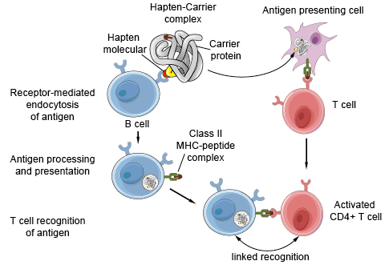
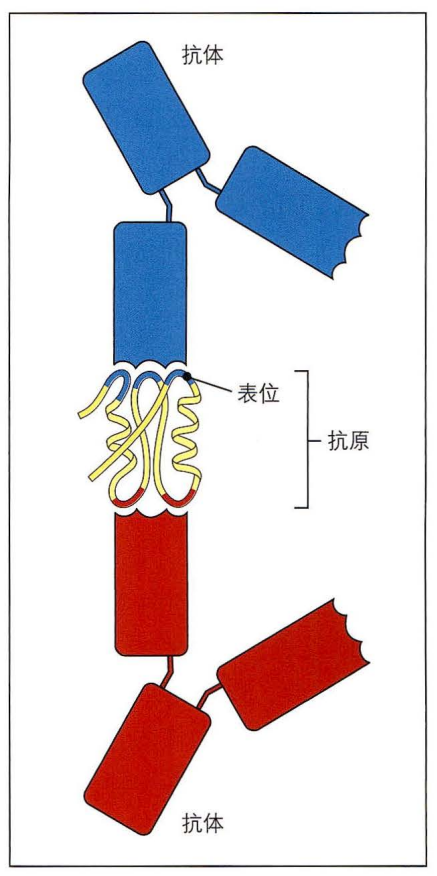
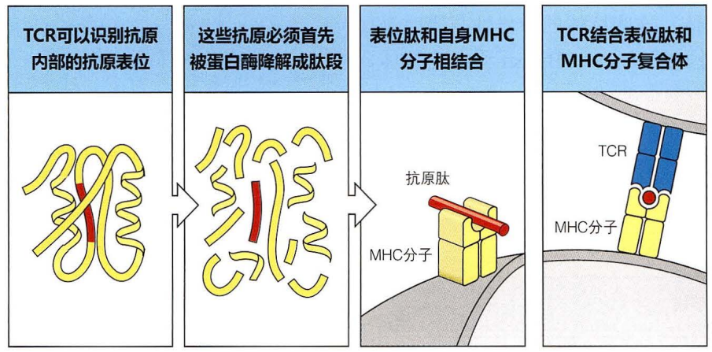
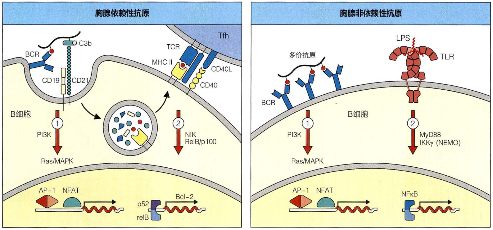
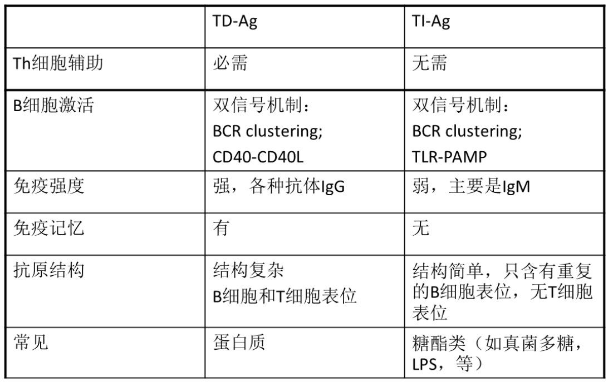
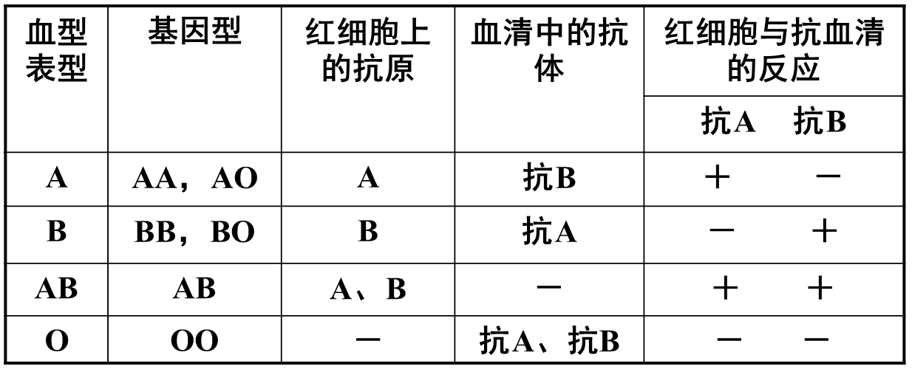

# 第三章 抗原

## 抗原的概念

抗原（antigen），也称免疫原（immunogen），是能与 TCR 或者 BCR 结合，促使 T/B 淋巴细胞分化、增殖、产生抗体或致敏淋巴细胞的物质。

### 抗原分类

#### 完全抗原 Complete Antigen

同时具有免疫原性和反应原性的物质。完全抗原能单独刺激机体产生抗体或致敏淋巴细胞，又能与之发生特异性结合。常见的完全抗原有蛋白质、动物疫苗、细菌细胞、病毒颗粒等。

#### 半抗原 Hapten

没有免疫原性，但是可以和特定抗体或致敏淋巴细胞结合的物质。半抗原需要与载体蛋白结合才能刺激机体产生抗体或致敏淋巴细胞。常见的半抗原有寡糖、脂类、一些简单的化学物质等，如青霉素、头孢霉素等抗生素，某些真菌毒素（如玉米赤霉烯酮，伏马菌素，脱氧雪腐镰刀菌烯醇（呕吐霉素），瓜萎镰菌醇）。

**半抗原载体效应（hapten carrier effect）**：指某些小化学基团（半抗原）需与蛋白质载体结合后才能诱导免疫应答，产生抗半抗原的抗体。

B 细胞识别半抗原表位，T 细胞和记忆 T 细胞识别载体蛋白的抗原决定簇。

半抗原是一种小的化学基团，不能单独引起抗体应答。但与载体蛋白偶联的半抗原会产生免疫原性，即半抗原载体效应，出现这种现象的原因在于载体蛋白可携带多个半抗原组，使其能够交联 BCR。另外，受载体蛋白多肽活的 T 细胞可分化成为 Tfh，增强对半抗原的抗体应答。半抗原与蛋白质的偶联是个体对青霉素过敏的诱因，青霉素与宿主载体蛋白偶联，刺激机体产生抗体。

### 抗原的特异性

抗原的特异性指某一特定抗原刺激机体产生只针对该抗原的特异性抗体或致敏淋巴细胞，并且只能与该类抗体和致敏淋巴细胞特异性结合。决定抗原特异性的物质基础是抗原分子中的抗原决定族。

### 抗原表位

抗原表位，也称抗原决定簇 (antigenic determinant)，是抗原分子中决定抗原特异性的特殊化学基团，是抗原中与抗体或者 BCR、TCR 特异性识别的结构部位。

> **抗原是免疫应答识别的分子，而表位是抗原内部与抗原受体结合的部位**	抗原可以是复杂的大分子如蛋白质，黄色所示。大多数抗原比抗体或抗原受体结 合的部位大，实际的结合部位称为抗原决定簇或表位。大型抗原蛋白可以包含多个抗原决定基（ 红色和蓝色），因此可 被不同的抗体结合（抗体与相结合的表位显示相同的颜色）一般来说，抗体识别抗原表面的抗原表位。

> **细胞受体结合由抗原片段和自身分子组成的复合体** 与大多数抗体不同，TCR 可以识别抗原内部的抗原表位（图一）。这些抗原必须首先被蛋白酶降解（图 二），然后抗原肽与自身分子 MHC 分子相结合（图三），最后抗原肽与 MHC 分子形成复合体后被 TCR 识别（图四）。

> > 原则上， 几乎所有形式的化学结构分子都能作为抗原被适应性免疫系统所识别，通常情况下，机体感染病原体后，免疫细胞识别的抗原多是病原体的蛋白质、糖蛋白和多糖成分。抗原受体或抗体识别抗原分子结构的那小部分结构称为抗原决定簇或表位。通常，蛋白质和糖蛋白有多种不同的抗原表位，可被不同的抗原受体识别。
> >
> > 抗体和 BCR 直接识别血清或细胞中天然抗原表位。不同的抗体可以同时识别同一抗原的不同抗原表位，这样有利于提高抗体对抗原的结合和清除效率。虽然抗体可以识别几乎任何类型的化学结构形式的抗原分子，但 TCR 仅识别蛋白质抗原，而且识别模式与抗体不同。TCR 别部分降解的蛋白质肤表位，而且必须是与特定的细胞表面的 糖蛋白（即 MHC 分子）相结合的抗原肽，该糖蛋白家族成员主要由组称为「主要组织相容性复合体（major histocompatibility complex，MHC）」的基因调控。细胞识别胞内病原体，如病毒的抗原蛋白或胞外病原体的蛋白抗原。 与抗体不同的是，TCR 没有分泌形式，TCR 的功能仅仅是将抗原信号传递给 T 细胞，活化 T 细胞发挥免疫效应。

#### 线性表位 linear epitope

1. 化学基团呈线状连续排列，无特定空间构象，如蛋白质中一段连续的氨基酸序列。
2. 多存在于抗原分子的内部或者 N - 末端与 C - 末端。
3. 数可被 T 细胞识别，分子表面的线性表位也可以被 B 细胞识别。

#### 构象性表位 conformational epitope

1. 序列上不连续的氨基酸残基或多糖，形成特定的空间构象。
2. 一般位于抗原分子的表面
3. 一般只能被 BCR 识别

#### 影响抗原表位特异性的因素

抗原表位的化学组成、化学基团之间的空间分布决定着抗原表位的特异性。

#### 共同抗原及交叉反应

共同抗原：两种抗原之间存在相同或相似的抗原表位，能次级机体产生同一类抗体。

交叉反应：一种抗体既可以和 A 抗原结合，也可以与 B 抗原结合。

## 构成抗原的条件

1. 异己性
   + 抗原必须与自身的组成成分在物理结构上有足够的差异，可以被机体自身的 BCR、TCR 识别与结合。
     1. 外源性的物质（异种物质、同种异型物质）
     2. 隔绝的自身成分意外地暴露给免疫系统，或者自身成分的异常修饰，例如自身成分在胚胎期未与免疫细胞充分接触过的物质（如脑组织、眼睛晶状体蛋白等）由于损伤导致由隔绝的状态暴露给免疫细胞。
2. 具有一定的理化性质
   1. 一般为蛋白质或者大分子的有机物，多糖及多肽也具有一定的免疫原性。
   2. 分子量大小，一般在 5.0 kD 以上（50 aa）。
3. 化学结构的复杂性
   + 必须有较复杂的化学组成和特殊的化学基团（要含有大量的芳香族氨基酸）。
4. 物理状态
   + 聚合状态的蛋白质较其单体免疫原性强，颗粒性抗原强于可溶性抗原。
5. 分子结构和易接近性
   + 抗原表面的特殊化学基团与淋巴细胞表面相应受体相互接触的难易程度。常与这些化学基团在抗原分子中分布的部位有关。
6. 原进入机体的方式和途径能确保其完整
   + 通常是经过伤口、皮下、皮内、静脉、肌肉或腹腔进入体内。口服疫苗需要可保证其完整性（口服灰质炎疫苗）。

## 抗原的种类

### 根据抗原与机体的亲缘关系

+ 异种抗原 (xenogenic antigen)
  + 微生物、昆虫（组织成分）、植物、动物、同种异型人工合成有机物对人或高等动物（除本物种外）。
+ 同种异型抗原（allogenic antigen）
  + 人类血型抗原、主要组织相容性（MHC）抗原。
+ 自身抗原（autoantigen）
  + 体内隔离组织成分（如脑组织、眼晶状体等）的暴露、组织细胞的基因突变、免疫细胞的活性改变，都能产生针对自体成分的免疫识别。

### 根据免疫原性的有无

+ 完全抗原 complete antigen
+ 不完全抗原 incomplete antigen，半抗原 hapten

### 根据抗原的化学性质

+ 蛋白质：变性后特异性改变。如细菌外毒素经甲醛处理为类毒素，抗原性减弱。
+ 多糖：分子量大时有抗原性。糖+蛋白质=复合抗原，有抗原性。
+ 类脂物：抗原性弱或无抗原性。
+ 核酸：具有较弱的抗原性；在全身性红斑狼疮病人体内抗 DNA 抗体。
+ 元素：碘、Hg、铍等与蛋白质结合，改变后者的性质，形成与该元素有关的抗原决定簇，如碘化蛋白。

### 根据抗原对 Th 细胞的依赖性

> **胸腺依赖性抗原或胸腺非依赖性杭原活化 B 细胞需要第二信号的参与**	B 细胞活化的第一信号（箭头 1）由抗原受体（BCR）传递。共受体 CD21 和  CD19 通过抗原表面 C3b 互作用增强 B 细胞活化信号，对于胸腺依赖性抗原（图一），第二信号（箭头 2）由 Tfh 传递，Tfh 识别 B 细胞表面 MHC II  类分子提呈的抗原肽。Tfh 表面的 CD40L 与 B 细胞表面的 CD40 结合，通过$\mathrm{NF\kappa13}$ 激酶（NIK）活化非经典的 $\mathrm{NF\kappa13}$ 信号通路，诱导 Bcl-2 等抗凋亡基因的表达。对千胸腺非依赖性抗原（图二），第二信号可以通过 TLR 传递， 这些受体识别抗原相关的 TLR 配体 ，如细 LPS 或细菌 DNA，第三章中已有相关叙述。

#### 胸腺依赖性抗原（thymus dependent antigen，TD-Ag）

1. 需要抗原特异性 Th 细胞的辅助作用
2. 应答过程中，BCR 识别抗原表位，启动受体介导的抗原内吞，双信号机制活化 B 细胞。
2. 免疫反应强，可以产生各种类型的抗体。多由结构复杂的蛋白质组成

#### 非胸腺依赖性抗原（thymus independent antigen，TI-Ag）

1. 抗原直接刺激 B 细胞产生应答反应，不需要 Th 细胞和细胞因子的帮助，也不需要 APC 的递呈，不受 MHC 的限制。
2. 免疫反应弱，只产生少量低亲合力的 Ab，主要为 lgM，没有有免疫记忆细胞形成。
3. 多由结构简单、有多个表位重复组成的分子，如多糖抗原。
4. 有些 TI 抗原作为丝裂原（mitogen），直接激活多克隆的 B 细胞，如高浓度的 LPS。

### 根据抗原的获得方式

#### 天然抗原

自然存在动物、植物、微生物组织成分及个体。

#### 人工抗原

+ 合成抗原：多肽、胰岛素等。
+ 结合抗原：半抗原 + 载体
+ 基因工程抗原：利用基因工程技术表达的重组蛋白抗原。

### 依据抗原的处理与递呈方式

#### 外源性抗原 - 溶酶体途径

细胞外抗原，细菌、真菌、灭活的病毒等。

#### 内源性抗原 - 蛋白酶体途径

在自身细胞内从头合成的抗原，如病毒抗原、肿瘤抗原和自身分子突变的抗原等。

### 根据抗原的物理状态

1. 可溶性抗原：如牛血清、牛血清白蛋白。
2. 颗粒性抗原：如红细胞、菌体。

## 非特异性免疫刺激剂

### 佐剂 adjuvant

与抗原同时或者预先注入体内，可增强机体对该抗原的免疫应答或改变免疫应答类型的非特异性免疫增强物质。

> 免疫佐剂能够增强疫苗的免疫原性，但是批准应用于人类治疗的佐剂很少
>
> 多肽类或蛋白类疫苗需要结合其他成分来模拟感染以激活免疫应答。这种能够提高抗原免疫原性的物质叫免疫佐剂。例如，破伤风类毒素在没有免疫佐剂的情况下不具有免疫原性，而破伤风类毒素疫苗中含有非晶凝胶形式的无机铝盐（明矾）能促进其免疫原性。百日咳毒素具有自身佐剂性质，当其与破伤风和白喉类毒素混合注射时，不仅能够预防百日咳，还能增强其他两种类毒素的免疫原性。这三种种类毒素组成的 DTP 三联疫苗已被批准应用于出生一年内的新生儿。
>
> 疫苗中的抗原成分和佐剂不能单独使用，只能在特定配方的疫苗中联合使用。目前，尽管一些佐剂 - 疫苗组合正在临床试验阶段，但仅明矾是美国 FDA 批准的应用于人类疫苗制作的唯一免疫佐剂。明矾是无机铝盐的统称，其中氢氧化铝和磷酸铝是佐剂中常用的无机铝盐（**铝佐剂**）。在欧洲，除了明矶佐剂外，还有 MF-59 的水乳剂（角鲨烯，**脂质体佐剂**）这是一种用于流感疫苗的免疫佐剂，目前正在临床试验评估阶段。明矾作为免疫佐剂，可能是由于其能够激活固有免疫应答中识别细菌感染的 NLRP3 炎症小体来进一步增强适应性免疫应答。

+ 常见佐剂
  + 铝佐剂
  + 脂质体佐剂
  + 新冠 mRNA 疫苗佐剂

### 超抗原 Superantigen, SAg

+ 1989 年由 White 等提出，他们发现，某些细菌外毒素或逆转录病毒蛋白，可直接结合在 TCR 上，只需极低浓度即可激活 2%～20%的 T 细胞或 B 细胞克隆，并诱导强烈免疫应答的物质。
+ 超抗原是指一类只需极低浓度（1-10 ng/mL）即可激活大量的 Th 细胞克隆，产生极强的免疫应答的抗原。
+ 超抗原对 T 细胞的激活不需要抗原提呈细胞的加工处理，而是以完整的蛋白质形式提呈给 T 细胞。其一端直接与 APC 上 MHCII 的非多态区外侧结合，形成超抗原 MHC 复合物；另一端直接与 TCR 的 vβ 片段外侧结合，以诱导免疫应答反应。因此 T 细胞对超抗原的识别不受 MHC 限制，可选择性结合、活化具有同一 vβ 簇的多克隆 T 细胞，故其作用亦无严格的抗原特异性。

#### 超抗原的种类

##### 外源性超抗原（革兰氏阳性菌产生的外毒素）

+ 金葡菌肠毒素 A、B、C、D、E（staphylocccus enterotoxin，SE）
+ 葡萄球菌毒素休克综合征毒素 1，TSST-1
+ 链球菌致热外毒素 A~C 和 M 蛋白
+ 关节炎支原体丝裂原（MAM）

##### 内源性超抗原（逆转录病毒蛋白）

+ 小鼠内源性超抗原：小鼠乳腺肿瘤病毒蛋白，又叫小鼠次要淋巴细胞刺激抗原（minor lymphocyte stimulating antigen, MLSA）。
+ 人内源性超抗原：人类免疫缺陷病毒蛋白 gp120。

### 丝裂原 mitogen

丝裂原，也称有丝分裂原，是一类可以促进细胞有丝分裂和增殖的物质。某些丝裂原可以与淋巴细胞表面的相应受体结合，刺激静止淋巴细胞转化为淋巴母细胞和有丝分裂，激活某一类淋巴细胞的全部克隆，所以被认为是一种非特异性的淋巴细胞多克隆激活剂。

### 其他抗原

#### 细菌抗原

##### 菌体抗原（O - Ag）

又称 O 抗原（O - Ag），成分：多糖（特异糖成分），类脂 A，类脂 B，蛋白质（载体）。菌体抗原与毒性有关，有些成分为某种或某型细菌所特有，可用于细菌分类。

##### 鞭毛抗原（H - Ag）

又称 H 抗原（H - Ag），成分：由鞭毛蛋白、少量多糖、少量脂类组成。长 2.5 - 20 $\mathrm{\mu m}$，分子量为 15000 - 40000，成空螺旋结构，不耐热，易被乙醇破坏；可用 0.1 - 0.2% 甲醛生理盐水保存。可根据其鞭毛抗原的特异性进行菌种鉴定。

##### 荚膜抗原

部位：菌体最外层，盖满菌体表面。

命名因菌而异：

+ 荚膜 Ag：肺炎球菌、圆褐固氮菌表面抗原。
+ ViAg：伤寒杆菌表面抗原
+ KAg（包膜 Ag）：E. coli 表面抗原

##### 芽孢抗原

##### 内外毒素抗原

##### 细菌保护性抗原

炭疽杆菌、结核杆菌保护性抗原，可保护动物抵抗毒菌攻击的能力，这类成分为保护性抗原。成分：炭疽杆菌、结核杆菌分泌的胞外可溶性蛋白，具有很好的免疫原性。

#### 真菌抗原

真菌的组分抗原包括菌丝体抗原、分省孢子抗原等。血清学研究起步较晚，可用于鉴定有毒株或无毒株。

研究对象：

1. 虫生真菌

   白僵菌属、绿僵菌属、拟青霉属、虫霉。

2. 植物、人和动物致病真菌

   皮肤真菌致皮肤癣，一般无显著免疫性。用真菌制备菌苗，可用来治疗皮肤癣症。系统性真菌导致深层感染，可产生一定程度的免疫性，产生抗体，抗体可用于血清学诊断。

#### 病毒抗原

1. 颗粒抗原：病毒本身
2. 组分抗原：衣壳、衣粒、套膜、核酸、基板、尾丝等。
3. 可溶性抗原（在宿主细胞内）：病毒组装的过剩成分；病毒核酸指导合成的蛋白质。

##### 艾滋病毒抗原制备疫苗

1. HIV 灭活疫苗
2. HIV 减毒疫苗
3. HIV 亚单位疫苗（gp120）
4. 活载体病毒蛋白疫苗（gag 结构蛋白 + 活病毒，如痘苗病毒、杆状病毒和腺病毒）。
5. DNA 疫苗：将插入并表达目的抗原基因之质粒 DNA 经各种转移途径转入机体细胞，借用宿主细胞的表达加工合成抗原分子。

#### 动植物、昆虫的组织成分

1. 动物血清，各种 Ig、白蛋白等。
2. 植物花粉、种子浸出汁
3. 昆虫浸出液

#### 人类血型抗原

1988 年已识别的血型抗原约有 600 多种，各种可能的血型表型数在 10 亿亿 种以上，可以说除了同卵双胞胎意外，每个人的血型都是独一无二的。

五大类血型：

1. 红细胞血型（20 多个血型系统，400 种以上，如 ABO 血型系统，Rh 血型系统）
2. 白细胞血型（中性粒细胞抗原和 HLA（人类白细胞抗原）两类）
3. 血小板血型

##### ABO 血型

决定 A 抗原的是 N - 乙酰半乳糖胺（N - acetylgalactosamine），决定 B 抗原的是半乳糖（galactose）。

##### Rh 血型系统

Landsteiner 和 Wiener（1940）发现将恒河猴（Macacus rhesus）红细胞免疫家兔后所得的免疫血清可与多数人的红细胞反应，说明这些人的红细胞与恒河猴的红细胞有共同的抗原，故称此抗原为 Rh 抗原，根据红细胞表面有无 Rh 抗原，而区分为 Rh 阳性和 Rh 阴性。

Rh 抗原种类：到目前位置已发现 40 多种 Rh 抗原，但与临床关系最为密切的只有 5 种，按其抗原性强弱依次为 D、E、C、c、e。5 种抗原中 D 的抗原性最强对临床更为重要。临床上习惯将含 D 抗原的红细胞称 Rh 阳性；不含 D 抗原的红细胞称 Rh 阴性。

###### 新生儿溶血症

#### 主要组织相容性（MHC）抗原

MHC：是脊椎动物有核细胞表面的具有高度多态性的抗原，含有多基因座位，并紧密连锁的基因群。

+ 人类白细胞抗原系统 - HLA
+ 小鼠 - H2
+ 兔 - RLA

组织相容性抗原，决定器官、皮肤移植中排斥与否。

## 研究抗原的意义

1. 分子诊断、分析的试剂和工具（胶体金检测卡）

   鉴定人、畜各种病原菌，如：艾滋病毒（1987 年，我国发现的第一例）、埃博拉病毒、E. Coli $\mathrm{O_{157}}$ 等。

2. 动、植物、微生物分类鉴定（检疫）的工具（血清型）

   昆虫病毒、杀虫细菌（鞭毛抗原）、根瘤菌、植物病原菌（白叶枯病菌、各种植物病毒）、棉蚜提取物等。

3. 作为防止传染病的疫苗

   乙肝疫苗（1987）；甲肝疫苗（1988）；艾滋病的疫苗、灰质炎疫苗；卡介苗；狂犬疫苗；疫苗食物等

4. 作为机体免疫功能及免疫细胞表面标志的研究

---

一、基本概念：

Ag；免疫原性；反应原性；抗原决定簇；载体效应；半抗原，超抗原；共同抗原；交叉反应

二、思考题：

1、构成免疫原的条件有哪些？

2、「O 型血者是万能供血者，AB 血型者是万能受血者」，这句话对吗？为什么？

3、抗原按来源分为哪几类？按化学性质分为哪几类？

4、新生儿溶血症的发病机理？

5、抗原研究有何意义？

6、胶体金检测卡的原理与制备方法

7、免疫佐剂的种类，组成，作用机制

8.请总结常见的真菌毒素（结构式、危害机制）：黄曲霉素，呕吐霉素，玉米赤霉烯酮，脱氧雪腐镰刀菌烯醇，瓜萎镰菌醇，镰刀菌酮 X，麦角碱
