# 第四章 抗体

## 概述

### 抗体的发现

+ 1890 年，德国学者贝林（Emil Adof VonBehring）和日本学者北里柴三郎（Kitasato）用白喉杆菌外毒素免疫动物在血清中发现第一种抗体-抗毒素。
+ 贝林因抗毒素的发现获 1901 年第一届诺贝尔生理学和医学奖。
+ 随后，发现一大类可与病原体结合并引起凝集、沉淀或中和反应的体液因子，统称为抗体（antibody）

**抗体**：机体在抗原物质刺激下所产生的一类能与该抗原发生特异性反应的球蛋白。

**免疫球蛋白**（immunoglobulin，Ig）：具有抗体活性或在化学结构上与抗体相似的球蛋白。

抗体是免疫球蛋白，但免疫球蛋白不一定是抗体。

免疫球蛋白可分为膜型和分泌型。一些细胞的某些表面受体 - B 细胞膜表面受体（BCR），T 细胞受体（TCR）。MHC 分子不是抗体。

### 免疫球蛋白的发现

1938 年，AWTiselius 和 EAKabat 用抗肺炎球菌荚膜多糖抗血清进行电泳图谱研究，认为免疫球蛋白在电泳图谱的 $\mathrm{\gamma}$ 区，称免疫球蛋白为 $\mathrm{\gamma}$ 球蛋白。

接着发现，抗体活性在 $\mathrm{\alpha_2}$ 区、$\mathrm{\beta}$ 区也有，且 $\mathrm{\gamma}$ 区球蛋白不一定都有抗体活性。

1968 年和 1972 年，WHO 和国际免疫球蛋白命名委员会的两次会议将具抗体活性或化学结构上与抗体相似的球蛋白统称为免疫球蛋白，以「Ig」表示。

## 抗体的结构

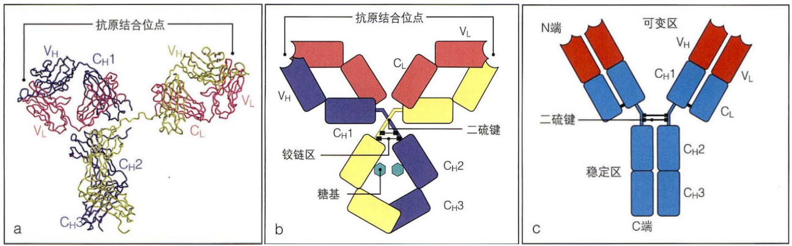

> **抗体分子的结构**	IgG 抗体的 X 射线晶体结构如图 a 所示，显示多肽链骨干 的带状图。多肤链中的两条重链用黄色和紫色表示，两条轻链均以红色显示。三个球状区域形成 一个近似的 Y 形。两个抗原结合位点位于臂尖，它们的另一端通过一个灵活的较链区域与 Y 的主干相连。轻链可变区（$\mathrm{V_L}$），和恒定 区（$\mathrm{C_L}$）已标示。重链可变区（$\mathrm{V_H}$）和 $\mathrm{V_L}$ 共同组成抗体的抗原结合部位。每个免疫球蛋白的结构域用一个矩形表示。将每条重链的第一恒定区结构域（$\mathrm{C_H1}$）到第二恒定区结构域（$\mathrm{C_H2}$）连接起来的较链用紫色或黄色细线表示。抗体结合位点在 $\mathrm{V_L}$ 和 $\mathrm{V_H}$ 的凹面。糖基修饰和二硫键的位置已标出。图 c 展示了一个更简单的示意图，使用红色标示可变区域，蓝色标示恒定区域。C 端，羧基端；N 端，氨基端。

IgG 抗体是由两种不同的多肽链组成的大分子，分子晕约为 150 kDa，其中重链（或称 H  链）约为 50 kDa，轻链（或称 L 链）约为 25 kDa。每个 IgG 分子由两条重链和两条轻链组成。两条重链之间由二硫键连接，每条重链和轻链之间亦通过二硫键链接。已知的免疫球蛋白分子都有两条相同的重链和两条相同的轻链，因此有两个相同的抗原结合位点，这使抗体能够同时结合两个相同抗原，从而增加相互作用的总强度，这种总的结合力称为亲**合**力。单个抗原结合位点与其抗原之间的相互作用称为亲**和**力。

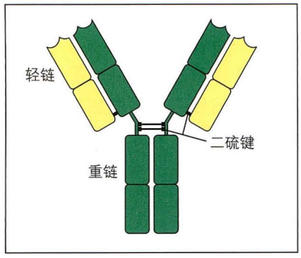

> **免疫球蛋白分子由两种类型的蛋白链组成：重链和轻链**	

### 轻链

+ 220 aa，25 kDa
+ 按血清学类型，可分为  $\mathrm{\kappa}$ 型和 $\mathrm{\lambda}$ 型。
  + 同一免疫球蛋白分子轻链一般只能为一种型。

在抗体中发现两种型别的轻链 - $\mathrm{\kappa}$ 链和 $\mathrm{\lambda}$ 链。某一特定的免疫球蛋白分子只含有 $\mathrm{\kappa}$ 链或 $\mathrm{\lambda}$ 链。具有不同轻链的抗体之间没有功能差异，且任何类型的轻链都可以存在于五类免疫球蛋白中。两型不同的轻链比例因物种而异。在小鼠中，抗体型别 $\mathrm{\kappa}$ 链和 $\mathrm{\lambda}$ 链的比例为 20 : 1，而在人类中则为 2 : 1，牛是 1 : 20，这种差别的原因尚不清楚。这种比例的扭曲可作为 B 细胞克隆异常增殖的检测依据，因为特定 B 细胞的所有后代都将表达相同的轻链。例如，$\mathrm{\lambda}$ 链的异常升高可能表明体内存在着产生 $\mathrm{\lambda}$ 链的细胞肿瘤

### 重链

+ 450 - 550 aa，55 - 75 kDa
+ 按血清型分类，可分为 $\mathrm{\gamma(gamma),~\mu(mu),~\alpha(alpha),~\delta(delta), \varepsilon(epsilon)}$ 链五类，即 IgG, IgM, IgA, IgD, IgE。

抗体的类别和效应功能是由重链结构决定的。有五类主要的重链类别，或称同种型，其中一些具有亚类，这些类别决定了抗体分子的功能。免疫球蛋白的五大类分别为 IgG, IgM, IgA, IgD, IgE，重链亦用小写希腊字母表示，分别为 $\mathrm{\gamma,~\mu,~\alpha,~\delta,~\varepsilon}$。例如，IgM 的恒定区表示为 $\mathrm{C_{\mu}}$。IgG 是血清中含量最高的免疫球蛋白，并有几个亚类（在人类为 IgG1，IgG2，IgG3 和 IgG4）。不同种类和亚类抗体的功能特性由重链的羧基末端赋予，而与轻链无关。所有同种型的结构特征是相似的，尤其是在和抗原结合方面。

BCR 的结构与相应抗体的结构基本相同，除了重链的羧基末端 C 区有一小部分不同。在 BCR 中，羧基末端的疏水性氨基酸序列可帮助分子描定在细胞膜上，而抗体分子羧基末端的亲水性氨基酸序列则有助于抗体分泌。

### V 区 Variable Region

+ 位于 N 端
+ 占 L 链 1/2，108 - 111 aa
+ 占 H 链 1/5 或 1/4，118 aa
+ 用以识别抗原和决定抗体特异性的部位
+ CDR 是由 $\mathrm{V_H}$ 和 $\mathrm{V_L}$ 结构域共同构成的抗原结合位点。
+ 高变区也是免疫球蛋白独特型决定簇主要存在的部位。

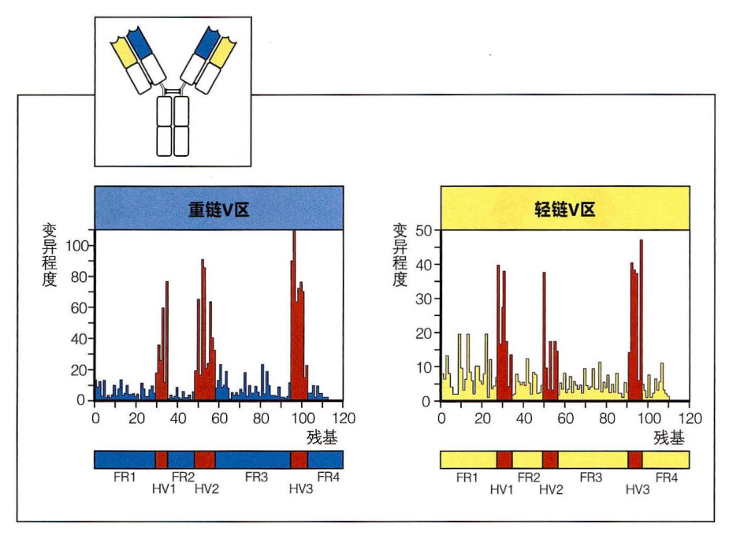

> **在 V 区结构域中存在高变率的离散区域**	重链和轻链的高变区影响抗体分子和抗原的结合。通过比较几十个重链和轻链 V 区结构域的氨基酸序列，得出以上的变异图。在每个氨基酸位置，变异程度是所有序列中不同氨基酸的数量与最常见氨基酸的频率之比。三个高变区（HV1、HV2 和 HV3）用红色表示。它们两侧的框架区域变化较小（FR1、FR2、FR3 和 FR4）以蓝色或黄色显示。

不同已知抗体分子间的 V 区都不同，然而**序列可变性并非均匀分布在整个 V 区，而是集中在某些片段内**，不同抗体 V 区的氨基酸序列在 $\mathrm{V_H}$ 和 $\mathrm{V_L}$ 结构域中都有氨基酸序列变化特别大的三个片段，被**称为高变区**（Hyper - Variable Region，HVR），以 HV1、HV2 和 HV3 表示。在重链中，它们分别位于氨基酸残基 30 到 36、49 到 65 和 95 到 103；而在轻链中，它们分别位于氨基酸残基 28 到 35、49 到 59 和 92 到 103。结构域的最大变化部分在 HV3。高变区之间的区域构成 V 区的其余部分，它们具有较少的变异性，被称为框架区。每个 V 区结构域有四个这样的框架区，分别是 FR1、FR2、FR3 和 FR4。

框架区形成 $\mathrm{\beta}$ 片层，构成免疫球蛋白结构域的结构框架。高变序列对应于三个环，并在 $\mathrm{\beta}$ 三明治的夹层外缘的折叠域中彼此靠近。因此，多样性不仅集中在 V 结构域序列的特定部分，而且它也在分子表面的一个特定区域。**当抗体分子中的 $\mathrm{V_H}$ 和 $\mathrm{V_L}$ 结构域配对时，来自每个结构域的三个高变环结合在一起，在抗体分子的手臂的末端形成一个高变区，这就是抗原结合位点（或称抗体结合位点），它决定抗体与抗原结合的特异性。**这六个（$\mathrm{3\times 2}$）高变环通常被称为**互补决定区 (complementarity-determining region, CDR)** ，因为它们形成的表面与它们结合的抗原是互补的。重链和轻链各有三个 CDR，即 CDR1、CDR2 和 CDR3。在大多数情况下，来 $\mathrm{V_H}$ 和 $\mathrm{V_L}$ 结构域的 CDR 共同参与构成抗原结合位点，因此通常是重链和轻链的结合决定了最终结合抗原的特异性。然而，Fab 晶体结构显示抗原仅与重链相互作用。例如，在抗流感抗体 Fab 中，抗原主要涉及与 $\mathrm{V_H}$ 的 CDR3 结合，而与其他 CDR 仅轻微接触。因此，免疫系统产生不同特异性抗体的一种方法是产生重链和轻链 V 区的不同组合，这就是所谓的组合多样性。在第五章（詹韦免疫生物学中文第 9 版）中，我们还将介绍另一种形式的组合多样性， 在骨髓 B 细胞发育过程中较小的 DNA 片段如何编码重链和轻链 V 区域基因。

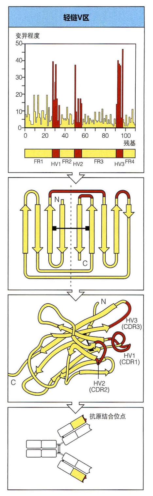

> **高变区位于链接折叠结构的环中**	第一幅图：高变区（红色）位于 V 区结构域编码区上。 第二幅图：当显示为扁平的带状图时，可以看到高变区位于连 接特定 $\mathrm{\beta}$ 链的环 （红色）。第三幅图：在 V 区的折叠结构中，这些环（红色）结合在一起形成抗原结合区。第四幅图：在一个完整的抗体分子中．重链和轻链的配对将每条链上的高变环结合在一起，形成一个高变区表面，在每只手臂的末端形成抗原结合位点。由于它们与抗原表面互补，高变区也通常被称为互补决定区（CDR）。C，羧基端；N，氨基端。

### C 区 Constant Region

+ 位于 C 端
+ 占 L 链 1/2，105 aa
+ 占 H 链 4/5 或 3/4，119 aa - C 端
+ 氨基酸的组成和排列都比较恒定
+ 决定着 Ig 分子的各种生物功能

### 铰链区 Hinge Region

+ 位于 H 链 $\mathrm{C_H1}$ 与 $\mathrm{C_H2}$，30 aa
+ 伸展曲折
+ 含有较多 Pro（脯氨酸）
+ 易被蛋白酶水解

### 降解片段

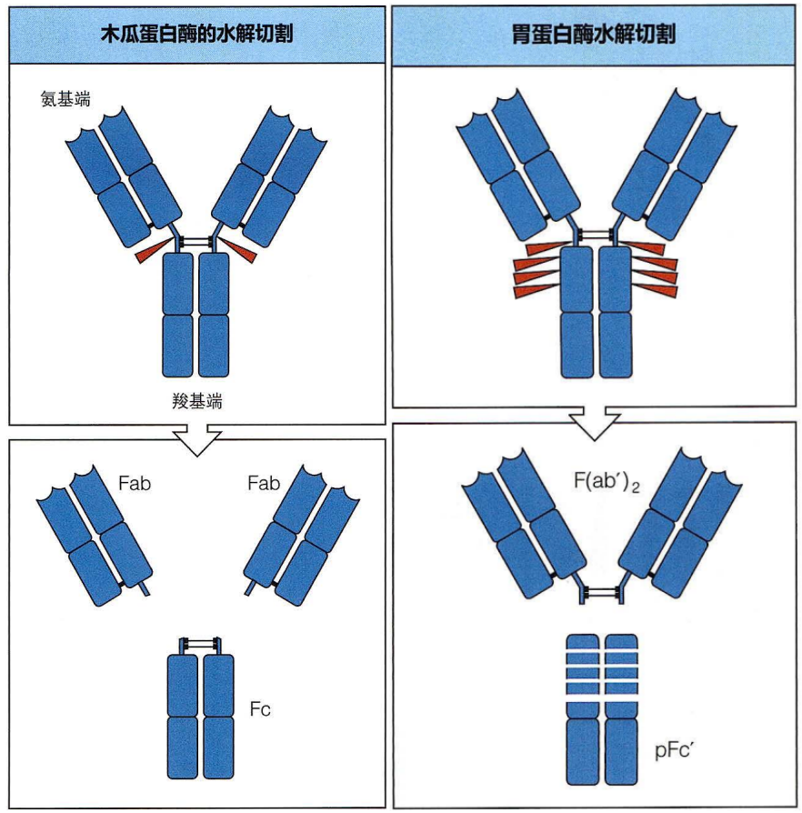

#### 抗体分子易被裂解为功能不同的片段

抗体分子完成组装后，由三个大小相等的球状部分组成，两个臂通过称为较链区的柔性多肤链连接到主干上（这种 Y 形结构的臂都是轻链与重链靠近氨基端的部分结合而成；$\mathrm{V_H}$ 与 $\mathrm{V_L}$ 域配对，$\mathrm{C_H1}$ 与 $\mathrm{C_L}$ 结构域配对。两个抗原结合位点由 Y 形抗体的两臂末端的 $\mathrm{V_H}$ 和 $\mathrm{V_L}$ 结构域结对构成 Y 形抗体的主干是由两条重链的羧基端的一半部分配对形成的。$\mathrm{C_H1}$ 结构域相互配对，但 $\mathrm{C_H2}$ 结构域不相互作用。连接到 $\mathrm{C_H2}$ 结构域的糖基侧链位于两条重链之间。

蛋白酶 （protease) 是早期研究抗体结构的重要工具，回顾基于水解产物生成的 Ab 片段术语是很有价值的。木瓜蛋白酶将抗体分子消化分解成三个片段，它切断了连接两条重链的二硫键氨基端侧的抗体分子，将抗体分子的两个臂释放为两个相同的含有与抗原结合活性的片段。这些片段被称为 **Fab 段，可与抗原结合**。另一个片段不包含与抗原结合的活性，但由于它容易结晶，所以被命名为 Fc 片段（c 代表 crystal，可结晶片段），它对应成对的 $\mathrm{C_H2}$ 和  $\mathrm{C_H3}$ 结构域。**Fc 片段是抗体分子的一部分，可与效应分子和细胞相互作用。**Fc 片段在重链同种型之间存在差异。另一种蛋白酶 —— 胃蛋白酶在二硫键的羧基末端切割抗体，产生一个 $\mathrm{F(ab')_2}$ 片段，此片段中抗体分子的两个抗原结合臂保持连接。胃蛋白酶把重链的剩余部分切成几个小碎片。**$\mathrm{F(ab')_2}$ 片段具有与原抗体完全相同的抗原结合特性**，但不能与任何效应分子（如 C1q 或 Fc 受体）相互作用。裂解后形成的抗原结合功能片段与抗体其他效应功能片段可以通过实验分离。

+ Fab 能与相应抗原特异性结合
+ Fc 具有固定补体、与效应分子和效应细胞结合的作用。
+ $\mathrm{F(ab')_2}$ 由两个 Fab 及铰链区组成，能够同时结合两个抗原表位。

### 功能区

+ VH 和 VL 为抗原结合部位
+ CH1 为遗传标志所在
+ CH2 为补体结合部位
+ CH3 与细胞表面的 Fc 受体结合

### Ig 分子多聚化

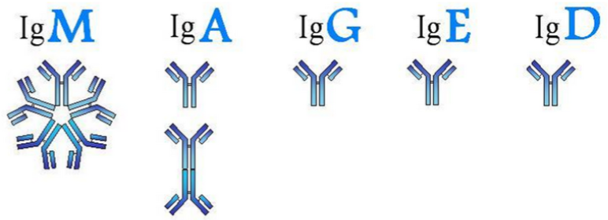

| 多聚形式 | 抗体                       | 抗原结合价 |
| -------- | -------------------------- | ---------- |
| 单体     | IgG、IgD、IgE 和血清型 IgA | 2          |
| 二聚体   | 分泌型 IgA                 | 4          |
| 五聚体   | IgM                        | 5          |

抗原结合价（Valency）指每个 Ig 分子上能与抗原决定簇相结合部位的数目。

五聚体 IgM 理论上应为 10 个与抗原结合的位点，但实际上由于**立体构型的空间位阻**，一般只有 5 个结合点可结合。

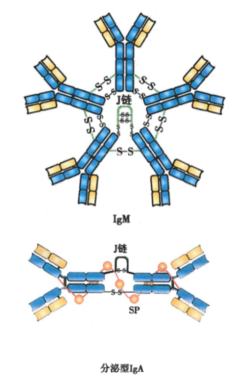

+ IgM 和 IgA 通常以多聚体的形式合成并与一个多肽链-J 链相连。
+ 单体与 J 链之间以及单体之间以二硫键相连。
+ IgM 分泌型 IgA 上含有一个辅助成 J 链分一分泌片 (secretory piece，SP)

### Ig 分子构象

与抗原结合时发生了构象改变，分子形状从 T 型改变为 Y 型。

## 抗体的分类

+ 根据作用对象
  + 溶解素、调理素、凝集素、沉淀素、抗毒素、反应素
+ 根据来源
  + 天然 Ab
  + 免疫 Ab
+ 根据是否出现可见反应
  + 完全 Ab
  + 不完全 Ab
+ 根据血清学特异性
  + 同种型
  + 同种异型
  + 独特型
+ 根据 Ab 产生的方式分类
  + 多克隆 Ab
  + 单克隆 Ab
  + 基因工程 Ab

### IgM

+ 出现顺序：1
+ 含量：占血清中 Ig 总量的 6-10%，为 0.6 - 2 mg/mL
+ 半衰期：5 天
+ 存在形式
  + 膜表面为单体（mIgM）
  + 分泌型为五聚体（为免疫耐受性受体）
+ 功能
  + 含 10 个 Fab 段，具有比 IgG 更强的抗原结合能力，促吞噬及凝集作用比 IgG 高 500 - 1000 倍。
  + 含 5 个 Fc 段，比 IgG 更易激活补体，参与 II、III 型变态反应。

### IgG

+ 出现顺序：2
+ 含量占血清中 Ig 总量的 75 - 80%，含量达 6-16 mg/mL
+ 亚类：IgG1、IgG2、IgG3、IgG4
+ 半衰期：23 天
+ 存在形式：单体
+ 功能
  + **唯一可通过胎盘的 Ab**
  + 参与调理作用、ADCC 作用、中和毒素和通过经典途径激活补体系统等

### IgA

+ 含量：占血清中 Ig 总量的 10 - 20%，为 2 - 5 mg/mL
+ 半衰期：5.8 天
+ 存在形式：单体、双体
+ 分型血清型
  + IgA：存在于血清中，主要为单体
  + 分泌型 sIgA：在分泌液中，多为双体
+ 功能：黏膜局部免疫作用，抗菌、抗病毒，中和毒素。

### IgD

+ 含量：占血清中 Ig 总量的 0.2 - 1%，为 3 mg/100mL
+ 半衰期：2.8 天
+ 存在形式：单体
+ 功能：尚不明确，可能与某些超敏反应有关。
+ 性质
  + 不稳定，容易被酶类降解
  + 与 B 细胞活化有关，膜 IgD 为 B 细胞成熟的重要标志，IgM 被认为是耐受性受体，IgD 为激活性受体。

### IgE

+ 含量： 占血清中 Ig 总量的 0.008%，为 0.03 mg/100mL
+ 半衰期：2.5 天
+ 存在形式：单体
+ 功能
  + 介导 I 型变态反应：花粉过敏者在花粉季节血清 IgE 会升高；某些真菌（白色念珠菌、曲霉菌等）、金黄色葡萄球菌等感染后血清 IgE 也会升高。
  + 抗寄生虫：通过 ADCC 作用，杀死寄生虫。

## 抗体的生物学活性

抗体是机体内一类重要的免疫效应分子。在生物个体发生发育过程中，抗体发挥着重要的作用。抗体分子中不同功能区的**结构特点**决定了抗体的功能。

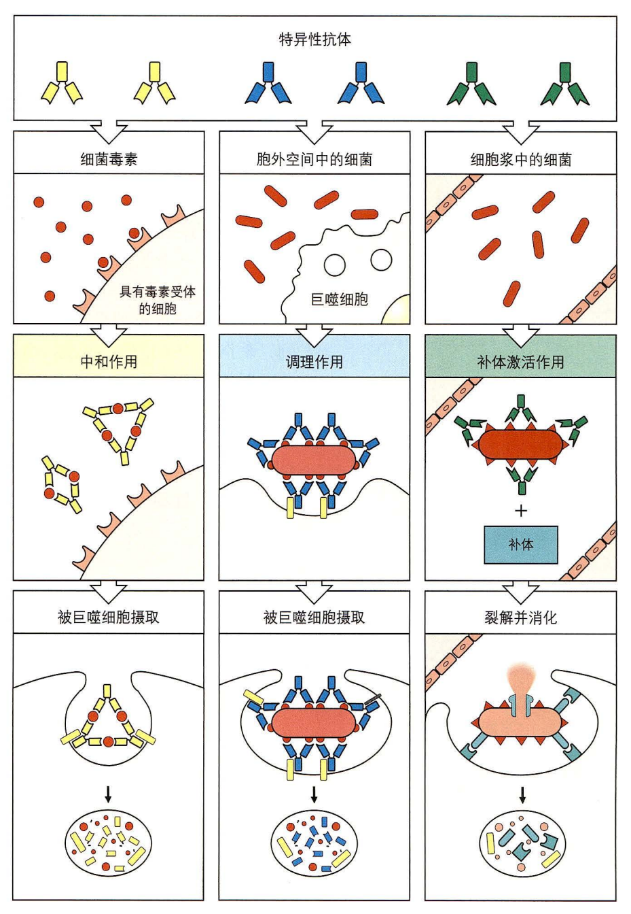

> **抗体通过三种主要途径参与宿主的免疫防御**	上图显示抗体通过结合和中和细菌毒素，阻止毒素接触宿主细胞、导致疾病。游离毒素可以与宿主细胞表面的受体结合，而毒素一抗体复合物却不能。抗体也能中和完整的病毒颗粒和细菌并对其灭活。抗原一抗体复合物最终被巨噬细胞清除并降解。抗体包被抗原后，使其可以被吞噬细胞（巨噬细胞和中性粒细胞）所识别、吞噬、破坏，该过程称为调理作用。中图显示了对细菌胞体的调理作用和吞噬作用。抗体首先通过可变区识别细菌表面的抗原（红色），以其 Fc 段与巨噬细胞和其他吞噬细胞的 Fc 受体（黄色）结合，促进吞噬过程。右图显示覆盖菌体的抗体对补体系统的激活效应。该抗体提供了一个平台，可激活补体系统中第一个蛋白质，从而使得补体蛋白（蓝色）在细菌表面沉积，这会直接导致细菌细胞壁上形成小孔，使细菌裂解。多数情况下，细菌表面的补体蛋白被吞噬细胞的补体受体识别后，吞噬细胞吞噬并破坏细菌。因此，抗体主要通过吞噬细胞实现其对所靶向的病原及其毒性物质的清除作用。

### V 区介导的中和作用

V 区能够特异性识别并结合抗原，其特异性由 CDR 共同构成的环状凹槽决定。

抗体抵御病原及其有害产物的首要的、也是最直接的方式是与其结合，从而阻止病原入侵并感染靶细胞，这称为中和作用。中和作用在抗病毒感染中发挥重要作用，可阻止病毒侵人细胞和在细胞内复制，也可清除细菌毒素，同时也是疫苗接种后的免疫保护效应的主要机制。

1. 中和细菌外毒素

   抗毒素与相应外毒素结合，抑制或减弱外毒素毒性

2. 中和病毒

   细胞产生的抗体与入侵的病毒结合，封闭细胞受体，达到阻止病毒吸附或穿入细胞内的目的，使病毒不能完成复制周期。

### C 区功能

+ 激活补体

  + 细菌（Ag ）+ 相应 Ab + C → 溶菌
  + 红细胞+ 相应 Ab + C → 溶血

  > 虽然微生物表面成分可以不经抗体而直接激活补体，从而导致某些补体成分在细菌表面以共价结合的方式沉积。但如果抗体先与细菌表面结合，抗体的恒定区可以介导比抗体与细菌单独作用要更强、更高效的补体激活。因此，一旦有抗体产生，针对病原的补体激活效应就大大增强。

+ 结合 Fc 受体

  + 调理作用
  + 抗体依赖性细胞介导的细胞毒作用（ADCC）
  + 介导型超敏反应

+ 穿过胎盘和黏膜

#### 调理作用

与相应菌体抗原、IgG、巨噬细胞（$\mathrm{M\Phi}$）Fc 受体结合，加强吞噬作用。

抗体与细菌结合并不足以阻止细菌繁殖。但抗体可作用于吞噬细胞（如巨噬细胞或中性粒细胞），促进其对细菌的吞噬和清除。很多细菌表面有荚膜包被，不能被吞噬细胞表面的 PRR 识别，从而逃避固有免疫系统的监视。然而抗体可识别衣壳中的抗原成分，抗体的恒定区则与吞噬细胞表面的 Fc 受体结合，促进对细菌的吞噬。这种抗体与病原和外来异物进行表面结合，继而增强其与吞噬细胞表面受体亲和力的效应，称为调理作用。

#### 抗体依赖的细胞介导的细胞毒作用

Antibody dependent cell mediated cytotoxicity，ADCC。

NK 细胞可以通过抗体依赖的细胞介导的细胞毒作用（ADCC）识别和破坏抗体包被的靶细胞。当抗体结合 NK 细胞表面的 Fc 受体时，ADCC 作用被触发。NK 细胞表达 $\mathrm{Fc\gamma R~III}$（CD16）受体，该受体识别 IgG1 和 gG3 抗体。NK 细胞杀伤机制与 CTL 类似，包括释放含有穿孔素和颗粒酶的胞质颗粒（见詹韦免疫生物学中文第九版第 9-31 节）。ADCC 已被证明在防御病毒感染方面发挥作用，它提供了另一种杀伤机制，即抗体通过效应细胞发挥抗原特异性的杀伤效应，尽管该效应细胞本身并没有抗原特异性。

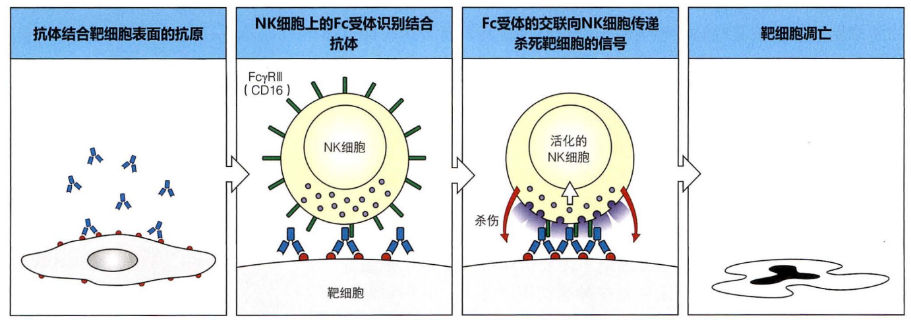

> **抗体包被的靶细胞通过抗体依赖的细胞介导的细胞毒作用（ADCC）被 NK 细胞杀伤**	NK 细胞是含大颗粒的非 T 细胞、非 B 细胞，其表面有$\mathrm{Fc\gamma R~III}$（CD16）。当 NK 细胞遇到包被 IgG 抗体的细胞时，它们会迅速杀死靶细胞。ADCC 只是 NK 细胞参与宿主防御的一种方式。

#### 介导 I 型超敏反应

IgE 的 Fc 段可与肥大细胞和嗜碱性粒细胞表面的高亲和力的 IgEFc 受体（FcεR）结合并诱导这些细胞合成和释放多种生物活性物质，诱导 I 型超敏反应。

速发型超敏反应（immediatehypersensitivity reaction）是由于多价抗原交联肥大细胞和嗜碱性粒细胞表面结合的 IgE 抗体，导致肥大细胞和嗜碱性粒细胞活化而引起的过敏反应。与其他类别抗体不同，IgE 主要存在于局部组织中，通过高亲和力的 IgE 受体 FcεRI 与肥大细胞和其他类型细胞紧密结合（见第 10-24 节）。多价抗原同时结合致敏细胞表面多个相邻的 IgE，使 FcεRI 发生交联，引起肥大细胞释放化学介质，从而导致过敏性疾病的发生。科学家们依然在探索为什么环境抗原引起的抗体应答会导致特应性个体主要产生 IgE。

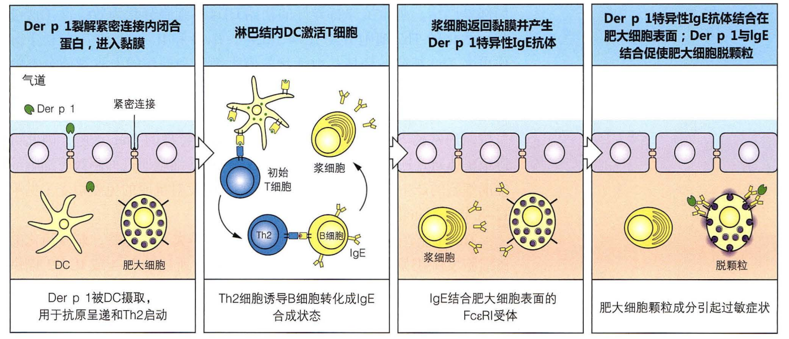

> **吸入性变应原的过敏反应**	Der p 1 是一种常见的呼吸道抗原，存在于屋尘螨的粪便颗粒中。当特应性个体初次接触 Der p 1，上皮下层的 DC 摄取变应原蛋白后迁移到引流淋巴结，诱导 Der p 1 特异性 Th2 细胞产生（图一和图二）。这些 T 细胞和 Der p 1 特异性 B 细胞相互作用，诱导 B 细胞分化为浆细胞并发生类别转换，而后在黏膜组织中产生 Der p 1 特异性 IgE（图三），后者与定居在黏膜下的肥大细胞表面 Fc 受体结合。当该个体再次接触 Der p 1 时，抗原直接结合肥大细胞上的 IgE，导致肥大细胞活化脱颗粒，释放多种生物活性介质，从而引起过敏反应症状（图四）。Der p 1 是一种可裂解闭合蛋白的蛋白酶，闭合蛋白参与维持上皮的紧密连接；Der p 1 的这种酶活性可能有助于它穿过上皮进入黏膜。

#### 通过胎盘和粘膜

IgG 可以通过胎盘，进入胎儿血循环内，在胎儿和新生儿体内发挥抗感染免疫作用。sIgA 可通过呼吸道和消化道黏膜，在黏膜局部发挥重要的免疫作用。

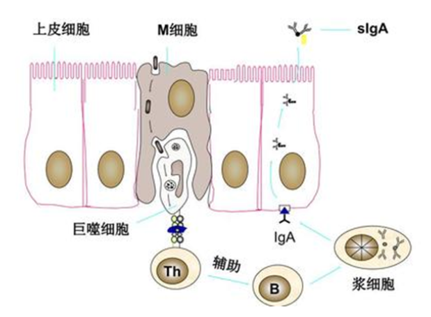

## 抗体基因和多样性遗传基础

Ab 属于蛋白质，故其生物合成符合蛋白质合成的一般规律。对大多数蛋白质而言，一个基因只能编码一种蛋白质。免疫系统要利用有限的基因产生几乎无限种类的抗体，特异性地识别并结合无限多样的抗原分子。

### 抗体产生多样性的分子生物学基础

#### 一级水平的免疫球蛋白基因重排

人类有三个免疫球蛋白基因库：H（重链）、$\mathrm{\kappa}$ 和 $\mathrm{\lambda}$（轻链）基因库。编码一条 Ig 多肽链的基因是由各个分隔开的 DNA 片段经剪接重排而成。

+ **重链的四个基因编码片段**
  + **V、D、J、 C**
+ **轻链的三个基因编码片段**
  + **V、 J、 C**

三种免疫球蛋白链 —— 重链和两种相应型的轻链，即 $\mathrm{\kappa}$ 链和 $\mathrm{\lambda}$ 链。编码这些链的免疫球蛋白基因片段被划分成三个簇或遗传基因座 —— H（重链）、$\mathrm{\kappa}$ 和 $\mathrm{\lambda}$（轻链）基因座，每个基因座可以组装完整的 V 区序列。

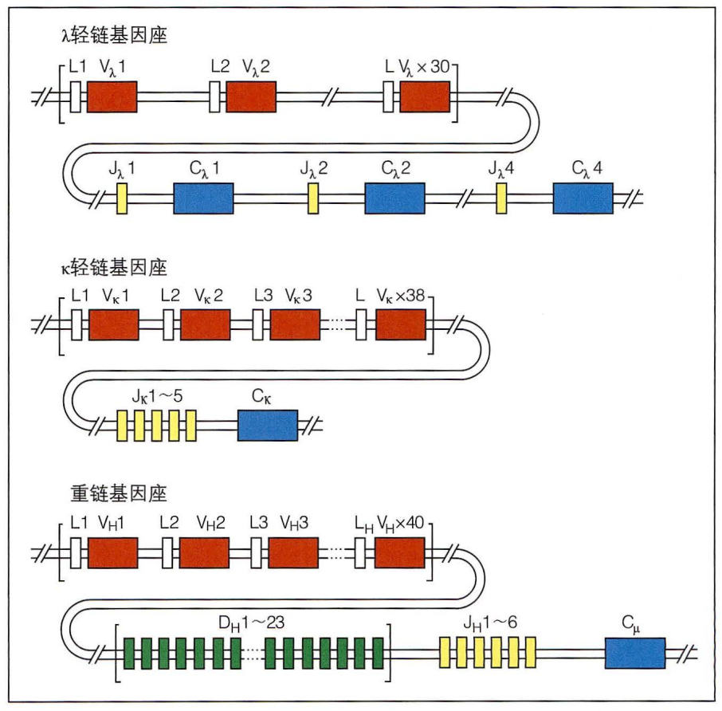

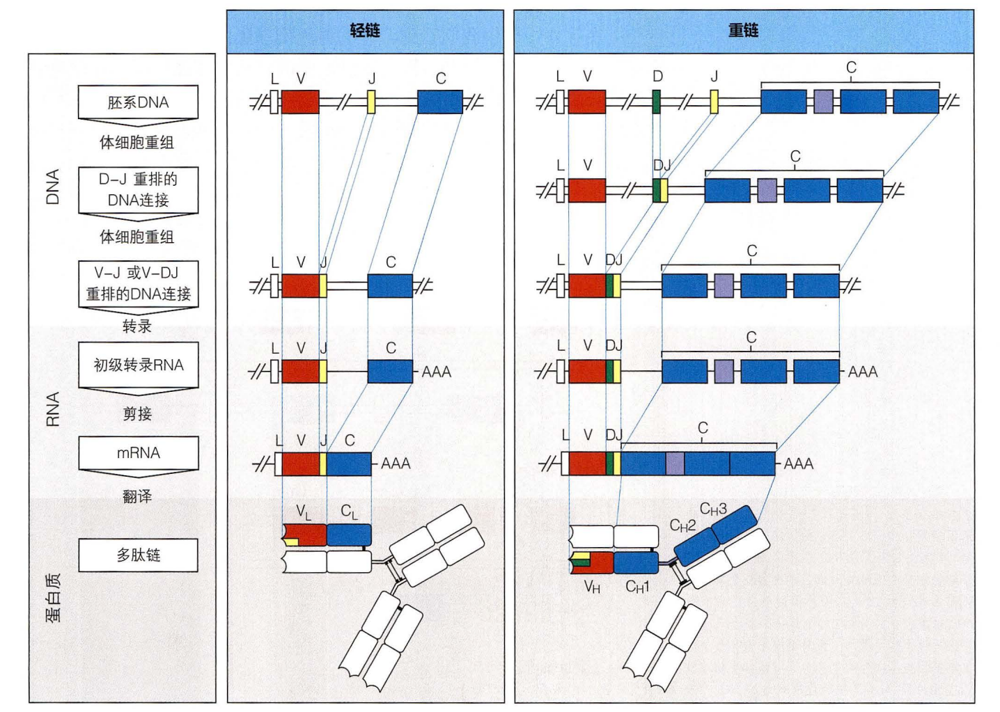

> **V 基因是由基因片段拼接而成的**	轻链 V 基因由两个片段拼接而成（中间部分）。在基因组中可变区（V）和连接区（J）基因片段结合形成完整的轻链 V 区外显子。免疫球蛋白链是细胞外蛋白质，V 基因片段之前是编码前导肽（L）的外显子以引导蛋白质进入细胞的分泌途径，然后被剪切。轻链 C 区由单独的外显子编码，轻链 RNA 通过剪接除去 L-V 和 J-C 内含子与 V 区外显子连接。重链 V 区由三种基因片段组成（右侧部分）。首先，多样性（D）和 J 基因片段连接，然后 V 基因片段连接到组合的 DJ 序列形成完整的 V 外显子。重链 C 基因由几个外显子编码。在剪接重链 RNA 转录物期间，C 区外显子与前导序列一起被剪接至 V 区结构域序列。翻译后除去前导序列，形成连接多肽链的二硫键。铰链区域显示为紫色。

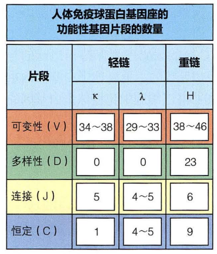

> **人重链和轻链 V 区的功能性基因片段的数量**	图中显示的数字来源于一个个体 DNA 的详细克隆和测序，并排除了所有假基因（基因序列的突变和非功能基因）。由于遗传多态性，所有人的数字会不一样。

##### 重排机制

+ 重组信号序列（recombination signal sequences , RSSs ）
  + 重组位点附近的保守型非编码 DNA 序列
+ 重组酶（recombinase, RAG）
  + V、D、J 基因片段的重排是一个多步的酶促反应
  + 重组酶在重排期间切断和再连接 DNA，是形成多样性的关键
+ DNA 修饰酶
+ **RSS 序列**由 3 个部分组成，一段紧邻编码区后的 7 聚体核苷酸 5’CACAGTG3’段 12 或 23 个碱基对的非保守间隔区 space 和其后的另一个 9 聚体核苷酸 5’ACAAAAACC3’
+ 在重组酶识别和作用下，带有 12 bp 间隔序列 RSS 的基因片段只能和带有 23 bp 间隔序列的片段相结合而发生重排，被称为** 12-23 规则**，它保证了基因片段连接的正确性。

对于完整免疫球蛋白或 TCR 链的表达，DNA 重排必须发生在相对于 V、D 或 J 基因片段编码区的正确位置。另外，这些 DNA 重排必须控制为 V 基因片段与 D 或 J 基因片段连接，而不是与另一个 V 基因片段连接。**DNA 重排由保守的非编码 DNA 序列引导，它被称为重组信号序列（recombination signal sequence，RSS）**，位于发生重组的点附近。轻链入和 k 基因座和重链基因座中 RSS 的排列和结构如图所示。RSS 由七个核苷酸的保守区组成七聚体 5’CACAGTG3’，且其总是与编码序列相接；其后跟着一个称为间隔区的非保守区域，长度为 12 或 23 个碱基对（bp）；然后是 9 个核苷酸的第二个保守区段，即九聚体 5’ACAAAAACC3’这里给出的序列是共有序列，但是它们在基因片段之间，甚至在同一个体中都可能有很大差异，这是因为进行重组的酶识别这些序列存在一定灵活性。间隔区序列也不同，但它们的保守长度与 DNA 双螺旋的一个转角（12bp）或两个转角（23bp）相对应。通常认为这是将七聚体和九聚体序列带到 DNA 螺旋的同一侧以便于与催化重组的蛋白质相互作用，但是这个概念仍然缺乏结构证据。七聚体－间隔物－九聚体基序（motif）-RSS－总是直接与 V、D 或 J 基因片段的编码序列相邻。重组通常发生于同一染色体上的不同基因片段之间。**具有 12 bp 间隔区的 RSS 侧翼的基因片段通常仅可以连接带有 23 bp 间隔区 RSS 侧翼的基因片段，这称为 12/23 规则（12/13 rule）**。

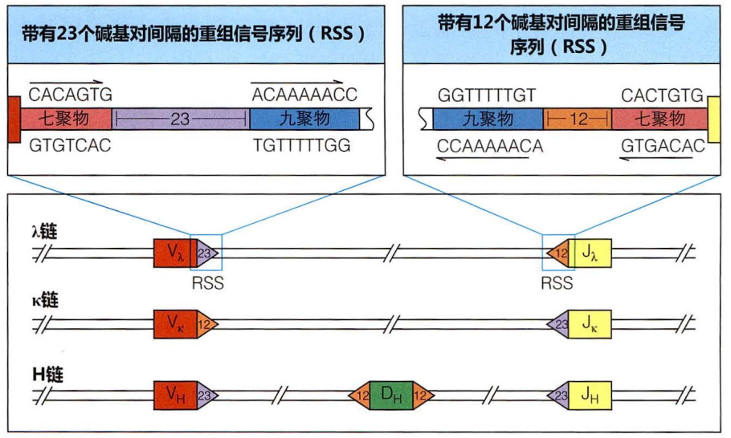

> **重组信号序列是保守的七聚体和九聚体序列，位于编码免疫球蛋白的 V 区、D 区和 J 区基因片段的侧翼**	重组信号序列（RSS）由七聚体（CACAGTG）和九聚体（ACAAAAACC）序列组成，被 12 bp 或约 23 bp 的核苷酸分隔开。七聚体-12 bp 间隔物-九聚体基序在此描绘为橙色箭头；包含 23 bp 间隔区的序列被描绘为紫色箭头。基因片段的连接几乎总是涉及 12 bp 和 23 bp RSS - 12/23 规则。这里显示了免疫球蛋白的重链（H）和轻链（入和 K）的 V（红色）、D（绿色）和 J（黄色）基因片段中 RSS 的排列。RAG-1 重组酶（见第 5-5 节）在 V 基因片段的最后一个核苷酸和七聚体的第一个 C 区之间，或者在七聚体的最后一个 G 和 D 或 J 基因片段的第一个核苷酸之间精确切割 DNA。注意，根据 12/23 规则，免疫球蛋白重链基因片段中 RSS 的排列阻止了直接 V-J 连接。

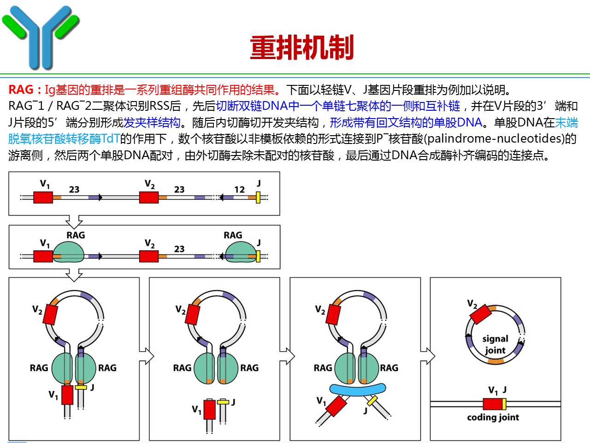

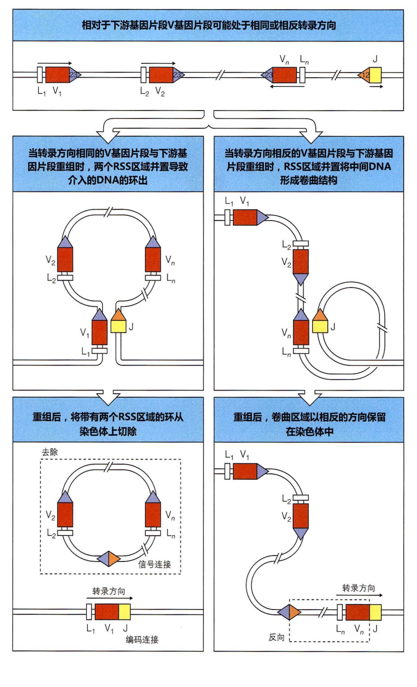

> **V 基因片段通过重组连接**	上图：在每个 V 区重组事件中，将基因片段侧翼的 RSS 聚集在一起以发生重组。12 bp 间隔的 RSS 以橙色显示，23 bp 间隔的 RSS 以紫色显示。为简单起见，描述了轻链基因的重组；对于重链基因，需要两个单独的重组事件来产生功能性 V 区。	左图：在大多数情况下，经历重排的两个片段（在该实例中为 V 和 J 基因片段）在染色体中以相同的转录方向排列，RSS 的并置导致介入的 DNA 的环出。重组发生在 RSS 中的七聚体序列的末端，产生所谓的信号连接并以闭合环的形式释放介入的 DNA。	右图：在另一种情况下，V 和 J 基因片段最初以相反的转录方向排列。在这种情况下，RSS 的对准需要所示的卷曲构型，而不是简单的环，从而连接两个七聚体序列的末端导致介入的 DNA 反转并整合到染色体上的新位置。V 和 J 片段的连接产生一个功能性 V 区外显子。

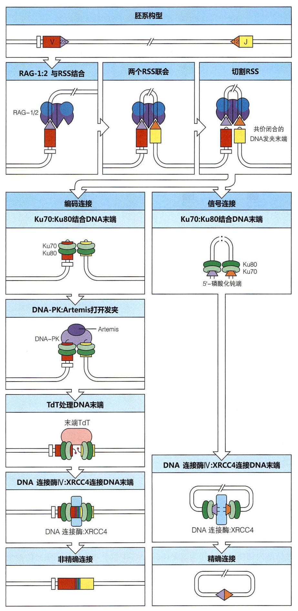

> **RAG 依赖性 V（D）J 重排中的酶促步骤**	含有重组信号序列（RSS，三角形）的基因片段重组始于以 RAG-1（紫色）、RAG-2（蓝色）和高迁移率组（HMG）蛋白质（未显示）复合物与位于要连接的编码序列侧翼的 RSS 之一（第二排）结合。然后 RAG 复合体招募另一个 RSS。在切割步骤中，RAG 的核酸内切酶活性在 DNA 骨架中在每个编码片段和其 RSS 之间进行精确地单链切割。在每个切割点处，产生 3'—OH 基团，然后该基团与相对的 DNA 链上的磷酸二酯键反应以产生“发夹”，在 RSS 末端留下齐端的双链断裂。这两种类型的 DNA 末端以不同方式处理。在编码末端（左图），必需的修复蛋白如 Ku70:Ku80（绿色）与发夹结合。Ku70：80 的异源二聚体形成环状结构，但单体不包绕 DNA。然后 DNA-PK：Artemis 复合物（紫色）加入复合物，其核酸内切酶活性在随机位点打开 DNA 发夹，产生两条平端的 DNA 链或单链延伸。然后切割的末端分别通过末端脱氧核苷酸转移酶（TdT，粉红色）和随机添加或去除核苷酸的外切核酸酶修饰。最后通过 DNA 连接酶 IV 与 XRCC4（绿松石色）结合将两个编码末端连接。在信号端（右图），Ku70：Ku80 与 RSS 结合，但末端没有进一步修饰。相反，DNA 连接酶 IV：XRCC4 的复合物精确连接两端以形成信号连接。

#### 二级水平的抗体库多样化机制

形成抗体多样性的第二个阶段发生在**激活的 B 细胞**内，而且主要由**抗原驱动**。**三种途径**修饰重排 Ig 基因，增加初级抗体库的多样性。

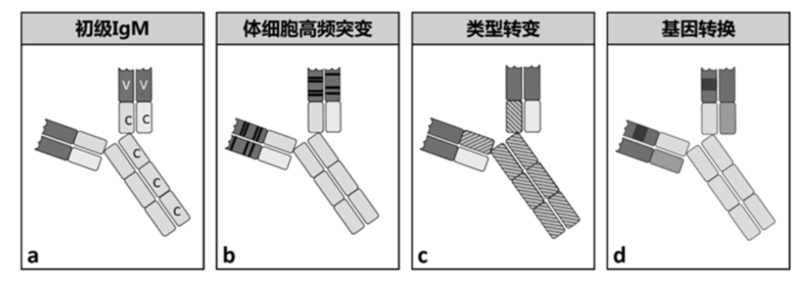

##### 体细胞高频突变 somatic hypermutation

重链和轻链的 V 区基因可发生高频率的点突变，细胞高频突变发生于基因重排后成 UNG 熟 B 细胞受抗原刺激后的分化发育阶段，其突变频率较细胞中正常基因突变频率高 100000 倍，这样即能产生最大序列的多样性。

活化的诱导型胞嘧啶核苷脱氨酶（ Activation-induced AID）在体细胞高频突变过程中起着决定性作用。

##### Ig 的类别转换 class switching

一个 B 细胞克隆在分化过程中 V-D-J 功能性基因片段保持不变，而发生 C 基因重排，使其表达的抗体分子发生 H 链类的改变，称为类别转换。

B 细胞最初表达 IgM/IgD，然后 DNA 进一步重组。

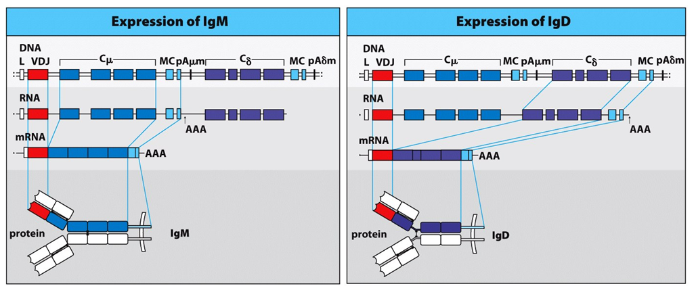

**基因转换（gene conversion）：主要是 IgV 区 5’端的假基因取代初始抗体的 V 或 VD 序列。**

**在蛋白质水平上：由轻链和重链的随机选择和配对引起。**

## 原抗体反应原理及抗体分子的抗原性

+ 抗原抗体反应的实质
  + 抗体 V 区的互补决定区（$\mathrm{V_H}$ 和 $\mathrm{V_L}$  的 CDR1、CDR2 和 CDR3 ）**所形成的三维构象与抗原高级结构表面的**抗原决定簇之间的反应。
+ 抗原抗体复合物相互作用的非共价作用力

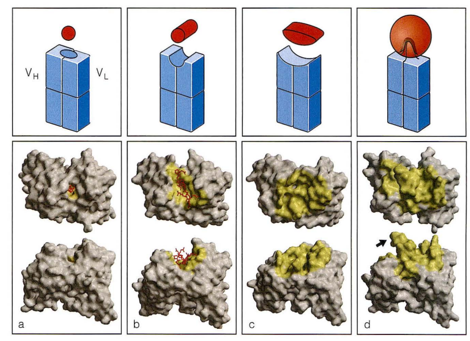

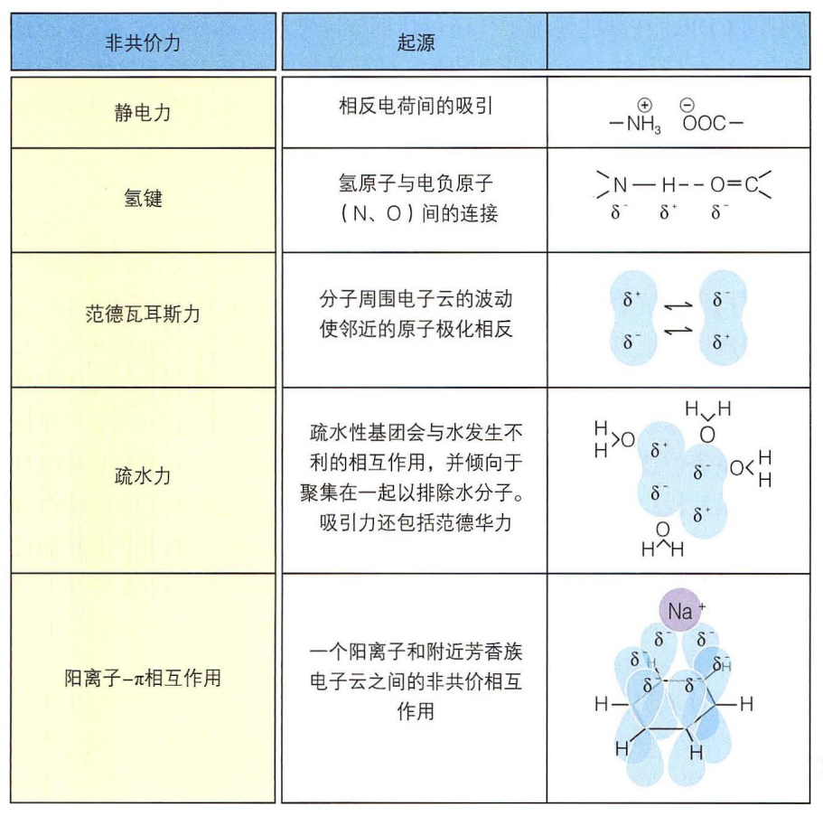

> **抗原-抗体复合物的非共价力结合**	电偶极子中的部分电荷显示为 $\mathrm{\delta^+}$ 或 $\mathrm{\delta^-}$。静电力随着分离电荷距离的平方倒数减少，而范德瓦耳斯力在大多数抗原-抗体接触中数量更多，但分离时减低为第六个力，因此仅在很短的范围内起作用。抗原和自然产生的抗体之间不会形成共价键。

+ 抗原抗体反应的特点
  + 高度特异性
  + 可逆性
  + 亲和力（affinity）与亲合力（avidity）
    + 亲和力（affinity）
      + 抗原抗体结合强度为亲和力
      + 结合常数 K 为亲和力
    + 亲合力（avidity）
      + 抗原抗体结合力的总和为亲合力
  + 最适比例
  + 交叉反应

### 抗体分子的抗原性

#### 同种型

同种型指同一种系内所有个体的抗体具有共同的抗原特异性标志，为种属型标志，其表位主要存在于 C 区。

可将重链和轻链分成类，亚类、型、亚型等各种不同的分子变异体，类、亚类、型、亚型都具有共同的抗原。

如：兔抗甲人 IgG 抗血清，能与乙人、丙人或其他人的 IgG 反应。

#### 同种异型

同种异型指同一种属不同个体间抗体的抗原特异性，也称个体的遗传标志。

主要表现在抗体分子上的重链恒定区和轻链恒定区上一个或数个氨基酸的差异。

#### 独特型

独特型是指不同 B 细胞克隆所产生的抗体分子的可变区和 T、B 细胞表面抗原受体的可变区所具有的抗原特异性标志。与抗体结合抗原的特异性密切相关。

每个抗体分子所特有的抗原特异性表位又称为独特位（idiotype）。

独特型表位在异种、同种异体甚至同一个体内均可刺激产生相应抗体，即抗独特型抗体（anti-idiotype antibody，AId）。

---

+ 本章重难点
  + 抗体与免疫球蛋白的概念
  + 抗体的基本结构
  + 五种免疫球蛋白 IgM, IgD, IgG, IgA, and IgE
  + 抗体的生物学功能
  + 抗体多样性的分子基础

---

思考题

一。名词解释

抗体	免疫球蛋白

二。填空

1. 抗体根据作用对象分为：6 类。
   1. 溶解素、凝集素、沉淀素、抗毒素、反应素、调理素

2. 根据血清学特异性（抗原性）抗体分为：3 类。
3. 根据产生的方式将抗体分为：3 类。

三。简答题

1. 简述免疫球蛋白的基本结构

2. 简述免疫球蛋白的生物学活性

3. 简述抗体多样性的分子基础